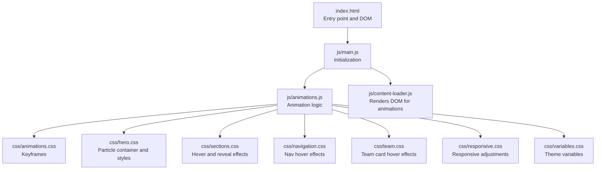
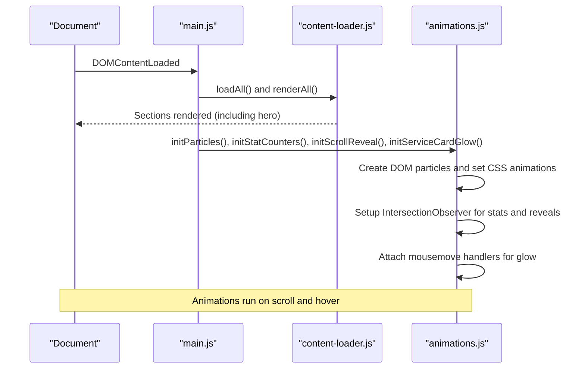
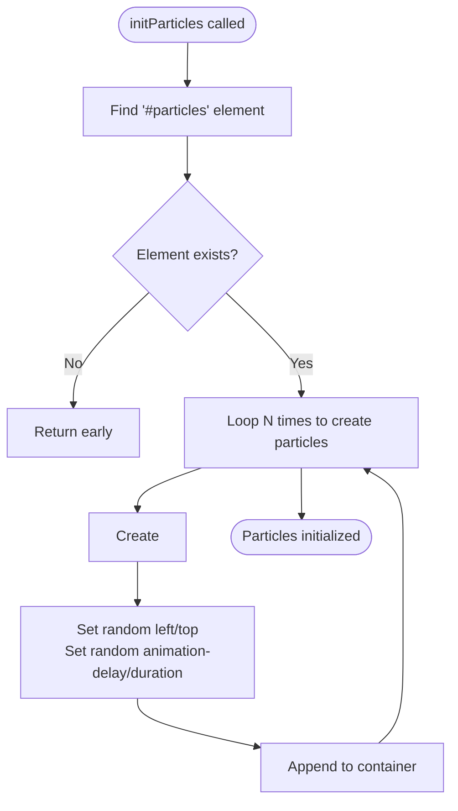
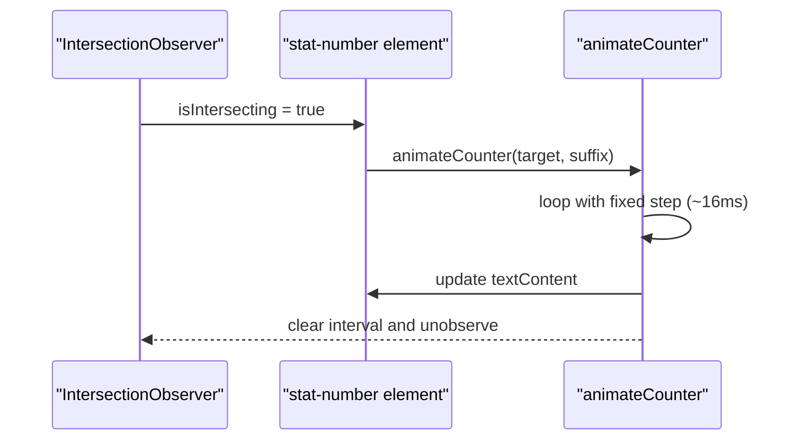
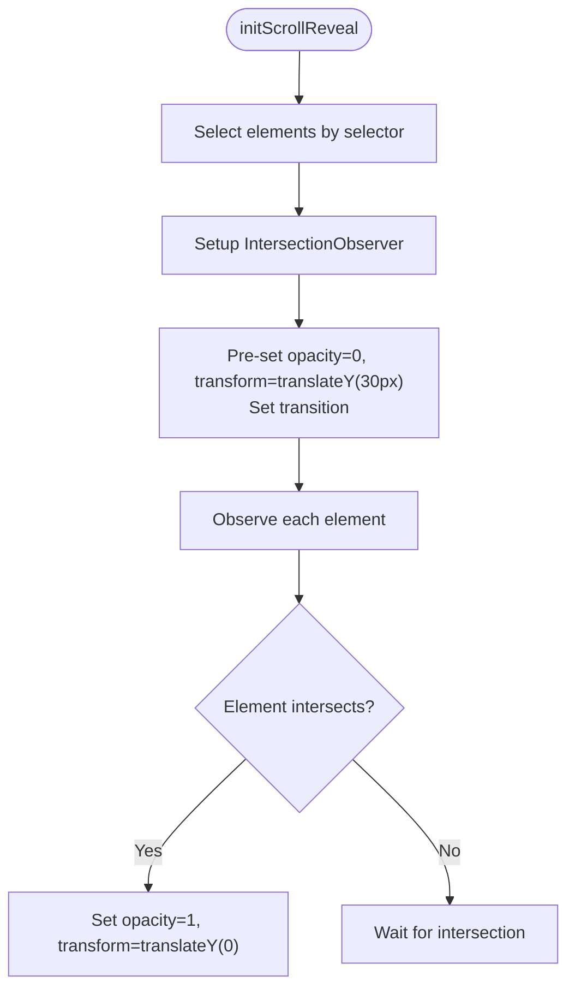
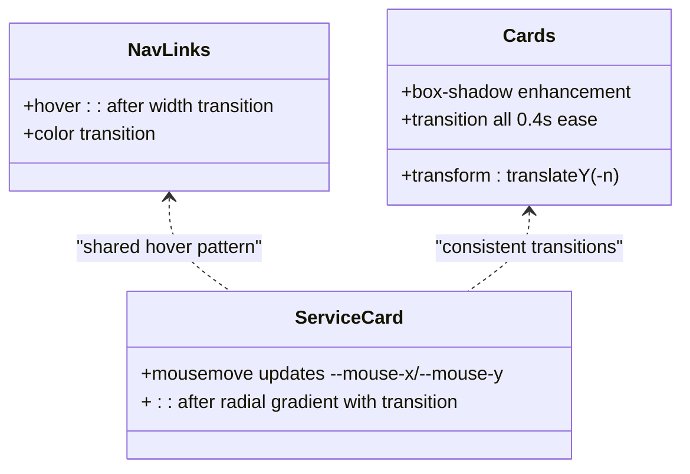
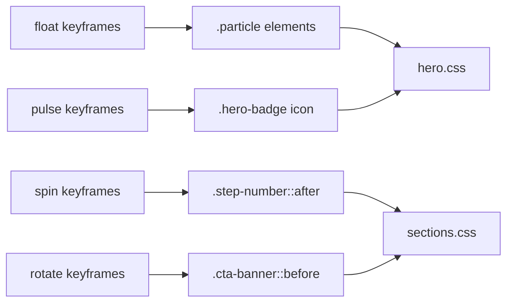
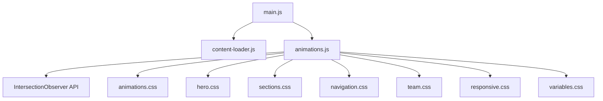

# Animation System

<cite>
**Referenced Files in This Document**
- [index.html](file://index.html)
- [main.js](file://js/main.js)
- [animations.js](file://js/animations.js)
- [content-loader.js](file://js/content-loader.js)
- [animations.css](file://css/animations.css)
- [hero.css](file://css/hero.css)
- [sections.css](file://css/sections.css)
- [navigation.css](file://css/navigation.css)
- [team.css](file://css/team.css)
- [responsive.css](file://css/responsive.css)
- [variables.css](file://css/variables.css)
</cite>

## Table of Contents
1. [Introduction](#introduction)
2. [Project Structure](#project-structure)
3. [Core Components](#core-components)
4. [Architecture Overview](#architecture-overview)
5. [Detailed Component Analysis](#detailed-component-analysis)
6. [Dependency Analysis](#dependency-analysis)
7. [Performance Considerations](#performance-considerations)
8. [Troubleshooting Guide](#troubleshooting-guide)
9. [Conclusion](#conclusion)
10. [Appendices](#appendices)

## Introduction
This document explains the animation system powering visual effects across the Victory Marketing website. It covers:
- Canvas-free particle generation and floating animations in the hero section
- Scroll-triggered animations using the Intersection Observer API
- Interactive hover and mouse-tracking effects for cards and navigation
- CSS keyframe animations and transitions
- Configuration options for timing, easing, and visual effects
- Customization examples and performance considerations

## Project Structure
The animation system spans three primary areas:
- Initialization and orchestration in the main module
- Animation logic in a dedicated module
- Visual effects via CSS keyframes and transitions

**Diagram sources**
- [index.html:1-106](file://index.html#L1-L106)
- [main.js:1-41](file://js/main.js#L1-L41)
- [animations.js:1-98](file://js/animations.js#L1-L98)
- [content-loader.js:1-443](file://js/content-loader.js#L1-L443)
- [animations.css:1-62](file://css/animations.css#L1-L62)
- [hero.css:1-128](file://css/hero.css#L1-L128)
- [sections.css:1-438](file://css/sections.css#L1-L438)
- [navigation.css:1-113](file://css/navigation.css#L1-L113)
- [team.css:1-109](file://css/team.css#L1-L109)
- [responsive.css:1-104](file://css/responsive.css#L1-L104)
- [variables.css:1-12](file://css/variables.css#L1-L12)

**Section sources**
- [index.html:1-106](file://index.html#L1-L106)
- [main.js:1-41](file://js/main.js#L1-L41)
- [animations.js:1-98](file://js/animations.js#L1-L98)
- [content-loader.js:1-443](file://js/content-loader.js#L1-L443)
- [animations.css:1-62](file://css/animations.css#L1-L62)
- [hero.css:1-128](file://css/hero.css#L1-L128)
- [sections.css:1-438](file://css/sections.css#L1-L438)
- [navigation.css:1-113](file://css/navigation.css#L1-L113)
- [team.css:1-109](file://css/team.css#L1-L109)
- [responsive.css:1-104](file://css/responsive.css#L1-L104)
- [variables.css:1-12](file://css/variables.css#L1-L12)

## Core Components
- Particle system: Generates floating particles inside the hero section using DOM elements with CSS keyframe animations.
- Stat counter: Counts up when elements enter the viewport using Intersection Observer.
- Scroll reveal: Fades and lifts cards and process steps into view on scroll.
- Hover and mouse-tracking effects: Adds dynamic glow on service cards and hover states across interactive elements.

**Section sources**
- [animations.js:6-20](file://js/animations.js#L6-L20)
- [animations.js:22-58](file://js/animations.js#L22-L58)
- [animations.js:60-84](file://js/animations.js#L60-L84)
- [animations.js:86-97](file://js/animations.js#L86-L97)
- [hero.css:32-47](file://css/hero.css#L32-L47)
- [animations.css:3-20](file://css/animations.css#L3-L20)

## Architecture Overview
The initialization flow ensures content rendering precedes animation activation. Particles are generated after the hero section is inserted into the DOM. Scroll-triggered animations rely on Intersection Observer to detect visibility thresholds. CSS keyframes and transitions provide smooth, hardware-accelerated motion.

**Diagram sources**
- [main.js:11-37](file://js/main.js#L11-L37)
- [content-loader.js:39-53](file://js/content-loader.js#L39-L53)
- [animations.js:7-20](file://js/animations.js#L7-L20)
- [animations.js:23-58](file://js/animations.js#L23-L58)
- [animations.js:61-84](file://js/animations.js#L61-L84)
- [animations.js:87-97](file://js/animations.js#L87-L97)

## Detailed Component Analysis

### Particle Animation System
- Generation: Creates a fixed number of DOM elements inside the hero’s particle container and applies randomized animation delays and durations.
- Movement: Uses a continuous floating keyframe to produce subtle, organic motion.
- Performance: Uses CSS animations for GPU acceleration; avoids heavy JavaScript loops.

**Diagram sources**
- [animations.js:7-20](file://js/animations.js#L7-L20)
- [hero.css:32-47](file://css/hero.css#L32-L47)
- [animations.css:3-20](file://css/animations.css#L3-L20)

**Section sources**
- [animations.js:7-20](file://js/animations.js#L7-L20)
- [hero.css:32-47](file://css/hero.css#L32-L47)
- [animations.css:3-20](file://css/animations.css#L3-L20)

### Stat Counter Animation
- Trigger: Intersection Observer watches elements with a visibility threshold.
- Behavior: On intersection, animates numeric values toward a target using a fixed timestep.
- Unobserve: Stops observing the element after animation completes.

**Diagram sources**
- [animations.js:23-58](file://js/animations.js#L23-L58)

**Section sources**
- [animations.js:23-58](file://js/animations.js#L23-L58)

### Scroll Reveal Animation
- Trigger: Intersection Observer with a low threshold and negative root margin to initiate animation as elements near the viewport.
- Behavior: Sets opacity and transform to bring elements into view.
- Transition: CSS transition defines easing and duration for opacity and transform.

**Diagram sources**
- [animations.js:61-84](file://js/animations.js#L61-L84)

**Section sources**
- [animations.js:61-84](file://js/animations.js#L61-L84)

### Hover Effects and Interactive States
- Navigation links: Animated underline effect using pseudo-elements and transitions.
- Service cards: Radial glow centered on mouse position using CSS custom properties and transitions.
- General cards: Consistent hover lift and shadow enhancements across mvo, why-us, team, and process sections.

**Diagram sources**
- [navigation.css:57-83](file://css/navigation.css#L57-L83)
- [sections.css:185-217](file://css/sections.css#L185-L217)
- [sections.css:275-287](file://css/sections.css#L275-L287)
- [sections.css:14-170](file://css/sections.css#L14-L170)
- [sections.css:343-393](file://css/sections.css#L343-L393)

**Section sources**
- [navigation.css:57-83](file://css/navigation.css#L57-L83)
- [sections.css:185-217](file://css/sections.css#L185-L217)
- [sections.css:275-287](file://css/sections.css#L275-L287)
- [sections.css:14-170](file://css/sections.css#L14-L170)
- [sections.css:343-393](file://css/sections.css#L343-L393)

### CSS Keyframes and Transitions
- Floating particles: Smooth vertical and horizontal drift with opacity modulation.
- Pulse badges: Subtle pulsing for visual emphasis.
- Continuous rotations: Used for decorative elements like step-number borders and banner backgrounds.
- Transitions: Standardized easing and duration across interactive components.

**Diagram sources**
- [animations.css:3-61](file://css/animations.css#L3-L61)
- [hero.css:39-47](file://css/hero.css#L39-L47)
- [sections.css:376-383](file://css/sections.css#L376-L383)
- [sections.css:408-417](file://css/sections.css#L408-L417)

**Section sources**
- [animations.css:3-61](file://css/animations.css#L3-L61)
- [hero.css:39-47](file://css/hero.css#L39-L47)
- [sections.css:376-383](file://css/sections.css#L376-L383)
- [sections.css:408-417](file://css/sections.css#L408-L417)

## Dependency Analysis
- Initialization order: Content must be rendered before animations can target DOM nodes.
- Observer dependencies: Scroll animations depend on Intersection Observer availability.
- CSS dependencies: Animations rely on keyframes and transitions defined in shared stylesheets.
- Responsive impact: Breakpoints adjust layout and may affect trigger thresholds.

**Diagram sources**
- [main.js:8-27](file://js/main.js#L8-L27)
- [animations.js:45-83](file://js/animations.js#L45-L83)
- [animations.css:1-62](file://css/animations.css#L1-L62)
- [hero.css:1-128](file://css/hero.css#L1-L128)
- [sections.css:1-438](file://css/sections.css#L1-L438)
- [navigation.css:1-113](file://css/navigation.css#L1-L113)
- [team.css:1-109](file://css/team.css#L1-L109)
- [responsive.css:1-104](file://css/responsive.css#L1-L104)
- [variables.css:1-12](file://css/variables.css#L1-L12)

**Section sources**
- [main.js:8-27](file://js/main.js#L8-L27)
- [animations.js:45-83](file://js/animations.js#L45-L83)
- [animations.css:1-62](file://css/animations.css#L1-L62)
- [hero.css:1-128](file://css/hero.css#L1-L128)
- [sections.css:1-438](file://css/sections.css#L1-L438)
- [navigation.css:1-113](file://css/navigation.css#L1-L113)
- [team.css:1-109](file://css/team.css#L1-L109)
- [responsive.css:1-104](file://css/responsive.css#L1-L104)
- [variables.css:1-12](file://css/variables.css#L1-L12)

## Performance Considerations
- Prefer CSS animations and transforms for GPU acceleration.
- Use Intersection Observer for efficient scroll triggers; unobserve after use to reduce overhead.
- Keep animation durations and easing consistent to avoid jank.
- Minimize DOM reads/writes during animation loops; batch updates when necessary.
- Consider reduced-motion user preferences by checking prefers-reduced-motion and adjusting or disabling motion accordingly.

[No sources needed since this section provides general guidance]

## Troubleshooting Guide
- Particles not appearing:
  - Verify the hero section is rendered and contains the particle container element.
  - Confirm CSS keyframes and class names match expectations.
- Stats not counting:
  - Ensure elements have the expected data attributes and are intersecting within the threshold.
  - Check that observers are attached after DOM readiness.
- Scroll reveals not triggering:
  - Validate selectors and that elements are styled with pre-transition opacity and transform.
  - Adjust threshold or rootMargin if content is positioned off-screen.
- Hover effects not working:
  - Confirm event listeners are attached after DOM rendering.
  - Ensure CSS custom properties are applied and transitions are defined.

**Section sources**
- [content-loader.js:69-107](file://js/content-loader.js#L69-L107)
- [animations.js:23-58](file://js/animations.js#L23-L58)
- [animations.js:61-84](file://js/animations.js#L61-L84)
- [animations.js:87-97](file://js/animations.js#L87-L97)

## Conclusion
The animation system combines lightweight DOM manipulation with robust CSS animations and Intersection Observer to deliver smooth, performant motion. By centralizing logic in a dedicated module and leveraging reusable keyframes, the system remains maintainable and extensible. Adhering to best practices around initialization order, observer lifecycle, and responsive behavior ensures consistent experiences across devices.

[No sources needed since this section summarizes without analyzing specific files]

## Appendices

### Configuration Options and Customization
- Timing and easing:
  - Modify transition durations and easing in component-specific CSS files.
  - Adjust animation durations and delays for particles.
- Visual effects:
  - Change accent colors and gradients via theme variables.
  - Extend keyframes for new motion patterns.
- Adding new scroll-triggered animations:
  - Define selectors and thresholds similar to existing scroll reveal logic.
  - Apply matching CSS transitions for opacity and transform.
- New interactive states:
  - Add CSS hover states and transitions for new components.
  - Implement mousemove handlers for dynamic effects when needed.

**Section sources**
- [sections.css:185-217](file://css/sections.css#L185-L217)
- [hero.css:39-47](file://css/hero.css#L39-L47)
- [variables.css:1-12](file://css/variables.css#L1-L12)
- [animations.css:3-61](file://css/animations.css#L3-L61)
- [animations.js:61-84](file://js/animations.js#L61-L84)
- [animations.js:87-97](file://js/animations.js#L87-L97)