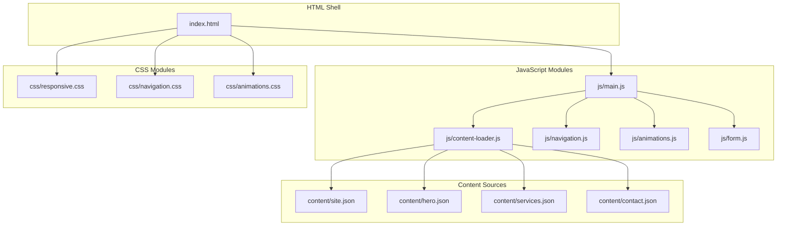
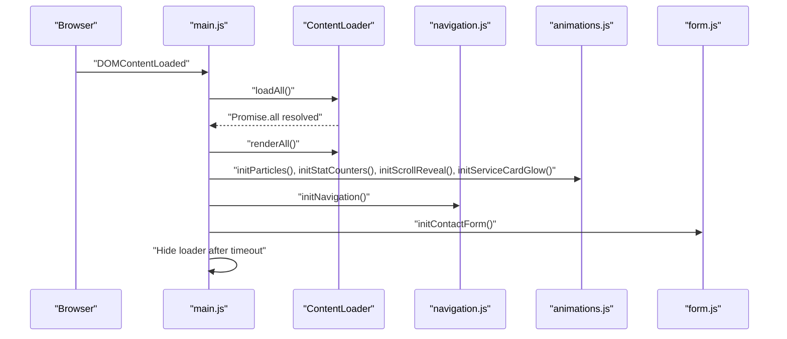
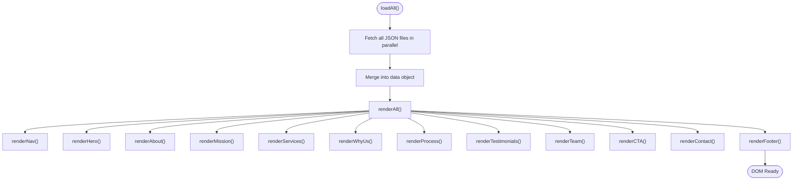
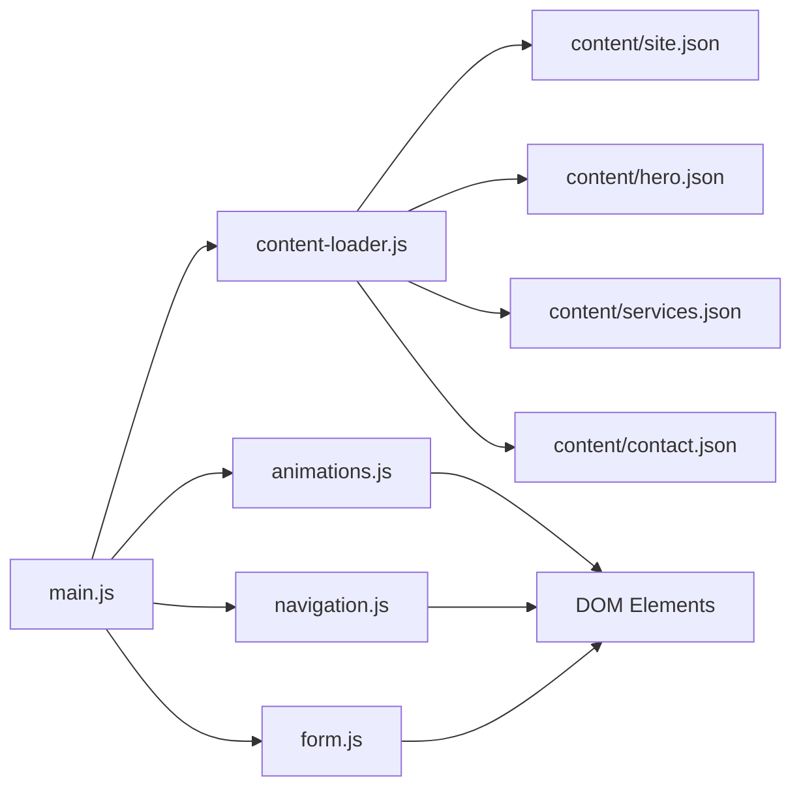

# Architecture Overview

<cite>
**Referenced Files in This Document**
- [index.html](file://index.html)
- [main.js](file://js/main.js)
- [content-loader.js](file://js/content-loader.js)
- [navigation.js](file://js/navigation.js)
- [animations.js](file://js/animations.js)
- [form.js](file://js/form.js)
- [responsive.css](file://css/responsive.css)
- [navigation.css](file://css/navigation.css)
- [animations.css](file://css/animations.css)
- [site.json](file://content/site.json)
- [hero.json](file://content/hero.json)
- [services.json](file://content/services.json)
- [contact.json](file://content/contact.json)
</cite>

## Table of Contents
1. [Introduction](#introduction)
2. [Project Structure](#project-structure)
3. [Core Components](#core-components)
4. [Architecture Overview](#architecture-overview)
5. [Detailed Component Analysis](#detailed-component-analysis)
6. [Dependency Analysis](#dependency-analysis)
7. [Performance Considerations](#performance-considerations)
8. [Troubleshooting Guide](#troubleshooting-guide)
9. [Conclusion](#conclusion)

## Introduction
This document presents the architecture of the Victory Marketing system, a modular JavaScript application that separates concerns across content management, rendering, navigation, animations, and form handling. The system uses JSON files as the primary content source and leverages modern web APIs to deliver a responsive, animated, and interactive user experience. The application is structured around ES6 modules with explicit imports/exports, enabling clear boundaries between components and maintainable development practices.

## Project Structure
The project follows a feature-based organization:
- HTML entry points define static shell markup and load the main module.
- JavaScript modules encapsulate distinct responsibilities: content loading, navigation, animations, and form handling.
- CSS files provide styling and responsive behavior, integrating with JavaScript-driven DOM updates.
- JSON content files supply dynamic content for each page section.

**Diagram sources**
- [index.html](file://index.html)
- [main.js](file://js/main.js)
- [content-loader.js](file://js/content-loader.js)
- [navigation.js](file://js/navigation.js)
- [animations.js](file://js/animations.js)
- [form.js](file://js/form.js)
- [responsive.css](file://css/responsive.css)
- [navigation.css](file://css/navigation.css)
- [animations.css](file://css/animations.css)
- [site.json](file://content/site.json)
- [hero.json](file://content/hero.json)
- [services.json](file://content/services.json)
- [contact.json](file://content/contact.json)

**Section sources**
- [index.html](file://index.html)
- [main.js](file://js/main.js)

## Core Components
- ContentLoader: Central orchestrator for fetching JSON content and rendering sections into the DOM via data-section attributes.
- Navigation: Manages scroll effects, mobile menu toggling, smooth scrolling, and scroll-to-top behavior.
- Animations: Implements particle generation, stat counters, scroll-reveal effects, and interactive hover glows using modern web APIs.
- Form: Handles contact form submission with client-side feedback.
- Responsive Styles: Media queries adapt layouts for tablets, phones, and smaller screens.

Key module responsibilities:
- ES6 exports/imports define clear interfaces between modules.
- Each module focuses on a single concern, promoting testability and maintainability.
- The main entry point coordinates initialization and ensures proper sequencing.

**Section sources**
- [content-loader.js](file://js/content-loader.js)
- [navigation.js](file://js/navigation.js)
- [animations.js](file://js/animations.js)
- [form.js](file://js/form.js)

## Architecture Overview
The system architecture centers on a main orchestrator that initializes all subsystems after content is loaded. Content is fetched in parallel, then rendered into pre-defined DOM containers. Interactive features are initialized afterward to ensure DOM readiness.

**Diagram sources**
- [main.js](file://js/main.js)
- [content-loader.js](file://js/content-loader.js)
- [navigation.js](file://js/navigation.js)
- [animations.js](file://js/animations.js)
- [form.js](file://js/form.js)

## Detailed Component Analysis

### Content Management and Rendering Pipeline
The ContentLoader module is responsible for:
- Parallel fetching of all JSON content files.
- Storing merged data for reuse across render methods.
- Rendering each section into a DOM container identified by a data-section attribute.

Rendering patterns:
- Each section method builds innerHTML using template literals and iterates over arrays in the JSON payload.
- Dynamic content includes buttons, stats, testimonials, team members, and form fields.
- The loader also updates branding assets (logo, tagline) during navigation rendering.

**Diagram sources**
- [content-loader.js](file://js/content-loader.js)

**Section sources**
- [content-loader.js](file://js/content-loader.js)
- [site.json](file://content/site.json)
- [hero.json](file://content/hero.json)
- [services.json](file://content/services.json)
- [contact.json](file://content/contact.json)

### Navigation Module
Responsibilities:
- Toggle navbar styles on scroll.
- Open/close mobile menu and close on link click.
- Provide scroll-to-top button visibility and smooth scroll behavior.
- Enable smooth scrolling for anchor links.

Integration points:
- Reads and updates DOM elements defined in the HTML shell.
- Uses CSS classes to drive visual transitions.

**Section sources**
- [navigation.js](file://js/navigation.js)
- [navigation.css](file://css/navigation.css)

### Animations Module
Capabilities:
- Particle system generation for hero background.
- Stat counters with IntersectionObserver-based triggering.
- Scroll-reveal animations for cards and steps.
- Mouse-tracking glow effect on service cards using CSS custom properties.

Modern web API usage:
- IntersectionObserver for performance-aware animations.
- CSS custom properties for dynamic mouse tracking.

**Section sources**
- [animations.js](file://js/animations.js)
- [animations.css](file://css/animations.css)

### Form Module
Responsibilities:
- Intercept form submission.
- Display success message from dataset.
- Reset form fields after submission.

**Section sources**
- [form.js](file://js/form.js)
- [contact.json](file://content/contact.json)

### Responsive Design Integration
Responsive behavior is implemented via media queries that:
- Reconfigure grid layouts for various screen sizes.
- Adjust navigation to a mobile-friendly stacked layout.
- Optimize spacing and typography for smaller screens.
- Control footer and testimonial card widths.

**Section sources**
- [responsive.css](file://css/responsive.css)

## Dependency Analysis
Module-level dependencies:
- main.js depends on ContentLoader, navigation, animations, and form modules.
- ContentLoader depends on content JSON files.
- Animations module relies on DOM elements with specific IDs/classes.
- Navigation module manipulates DOM elements defined in the HTML shell.
- Form module targets a specific form ID.

**Diagram sources**
- [main.js](file://js/main.js)
- [content-loader.js](file://js/content-loader.js)
- [navigation.js](file://js/navigation.js)
- [animations.js](file://js/animations.js)
- [form.js](file://js/form.js)
- [site.json](file://content/site.json)
- [hero.json](file://content/hero.json)
- [services.json](file://content/services.json)
- [contact.json](file://content/contact.json)

**Section sources**
- [main.js](file://js/main.js)
- [content-loader.js](file://js/content-loader.js)

## Performance Considerations
- Parallel content loading reduces initialization time by fetching all JSON files concurrently.
- IntersectionObserver minimizes layout thrashing by deferring animations until elements are near the viewport.
- CSS transitions and transforms are hardware-accelerated, improving animation performance.
- Static loader hides after a short delay to avoid blocking the UI while ensuring perceived performance.

## Troubleshooting Guide
Common issues and resolutions:
- Content not rendering: Verify data-section attributes match the loader’s expectations and that JSON files are valid.
- Animations not triggering: Confirm IntersectionObserver thresholds and rootMargin are appropriate for viewport size.
- Navigation not responding: Ensure DOM elements (navbar, mobile menu button, scroll-to-top) exist and event listeners are attached.
- Form submission not working: Check for the presence of the contact form element and that the submit handler is registered.

**Section sources**
- [content-loader.js](file://js/content-loader.js)
- [animations.js](file://js/animations.js)
- [navigation.js](file://js/navigation.js)
- [form.js](file://js/form.js)

## Conclusion
The Victory Marketing system demonstrates a clean, modular architecture where content is decoupled from presentation and interactivity. The main orchestrator coordinates content loading and feature initialization, while each module maintains a focused responsibility. JSON-based content enables easy maintenance and localization, and modern web APIs power smooth animations and responsive behavior. This design supports scalability, readability, and efficient development practices.