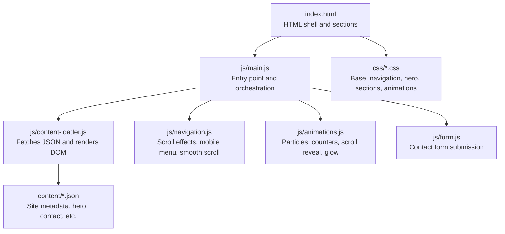
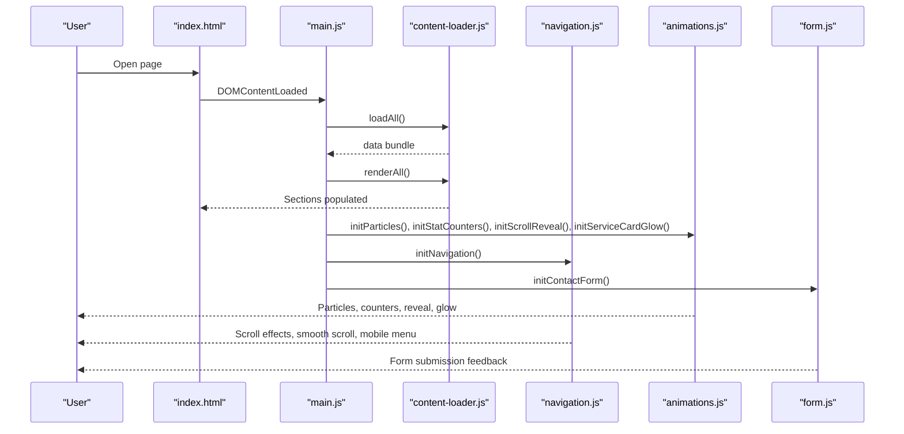
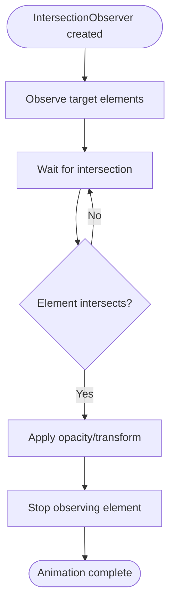
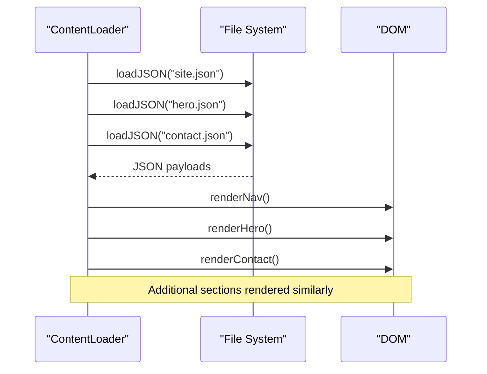
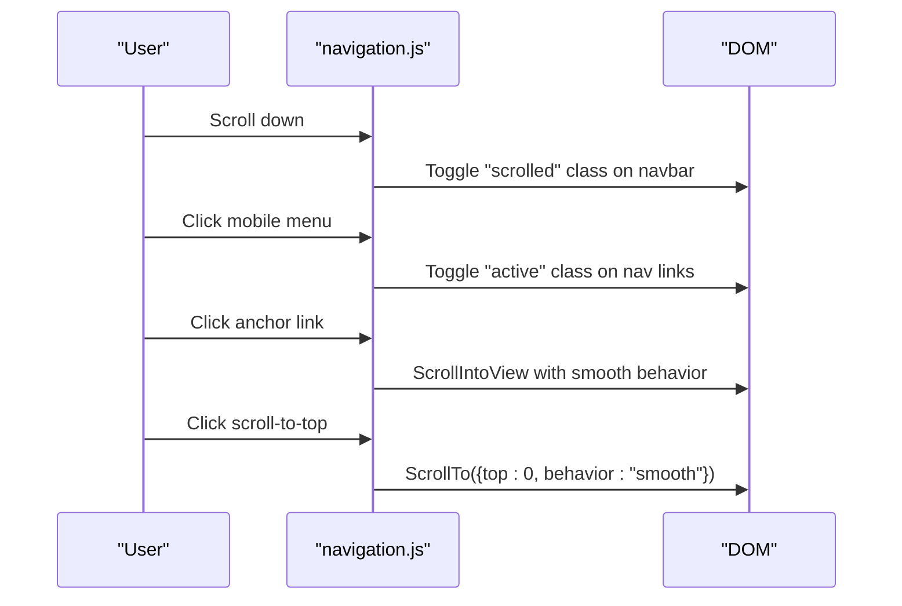
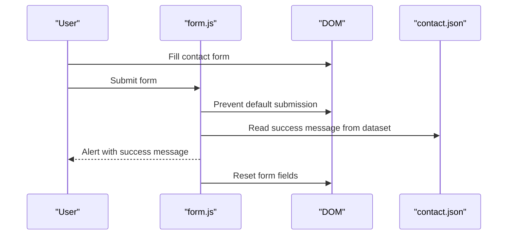
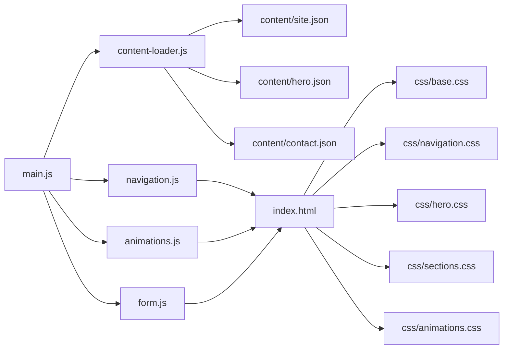

# Component Interactions

<cite>
**Referenced Files in This Document**
- [index.html](file://index.html)
- [main.js](file://js/main.js)
- [content-loader.js](file://js/content-loader.js)
- [navigation.js](file://js/navigation.js)
- [animations.js](file://js/animations.js)
- [form.js](file://js/form.js)
- [site.json](file://content/site.json)
- [hero.json](file://content/hero.json)
- [contact.json](file://content/contact.json)
- [base.css](file://css/base.css)
- [navigation.css](file://css/navigation.css)
- [hero.css](file://css/hero.css)
- [sections.css](file://css/sections.css)
- [animations.css](file://css/animations.css)
</cite>

## Table of Contents
1. [Introduction](#introduction)
2. [Project Structure](#project-structure)
3. [Core Components](#core-components)
4. [Architecture Overview](#architecture-overview)
5. [Detailed Component Analysis](#detailed-component-analysis)
6. [Dependency Analysis](#dependency-analysis)
7. [Performance Considerations](#performance-considerations)
8. [Troubleshooting Guide](#troubleshooting-guide)
9. [Conclusion](#conclusion)

## Introduction
This document explains how the Victory Marketing system orchestrates its modules to deliver a dynamic, content-driven website. It focuses on the main application module’s role in initializing content, coordinating animations and navigation, and wiring forms to content-managed fields. It also documents the observer pattern used for scroll-triggered animations, the data flow from JSON content to DOM rendering, and the event coordination across modules. Sequence diagrams illustrate typical user workflows for page load, navigation, and form submission.

## Project Structure
The system is organized around a modular JavaScript architecture with a single entry point that coordinates multiple specialized modules. Content is managed via JSON files located under the content directory, while styles are split across modular CSS files for maintainability.

**Diagram sources**
- [index.html:1-106](file://index.html#L1-L106)
- [main.js:1-41](file://js/main.js#L1-L41)
- [content-loader.js:1-443](file://js/content-loader.js#L1-L443)
- [navigation.js:1-55](file://js/navigation.js#L1-L55)
- [animations.js:1-98](file://js/animations.js#L1-L98)
- [form.js:1-17](file://js/form.js#L1-L17)

**Section sources**
- [index.html:1-106](file://index.html#L1-L106)
- [main.js:1-41](file://js/main.js#L1-L41)

## Core Components
- Main entry point: Initializes the application lifecycle, loads content, renders sections, and starts interactive features.
- Content loader: Centralized module that fetches all JSON content in parallel, stores it, and renders each section into the DOM.
- Navigation: Handles scroll effects, mobile menu toggling, smooth scrolling to anchors, and scroll-to-top behavior.
- Animations: Implements floating particles, animated statistics, scroll-reveal effects, and mouse-follow glow on cards.
- Form handler: Listens for contact form submissions and displays a success message derived from content.

Key integration points:
- The main module imports and invokes each module in a deterministic order after content is loaded.
- Content loader writes HTML into sections defined by data attributes in the HTML shell.
- Animations rely on IntersectionObserver to trigger on scroll.
- Navigation enhances UX by coordinating scroll events and DOM interactions.

**Section sources**
- [main.js:11-41](file://js/main.js#L11-L41)
- [content-loader.js:18-53](file://js/content-loader.js#L18-L53)
- [navigation.js:6-55](file://js/navigation.js#L6-L55)
- [animations.js:6-98](file://js/animations.js#L6-L98)
- [form.js:5-17](file://js/form.js#L5-L17)

## Architecture Overview
The system follows a modular, event-driven architecture:
- Initialization sequence ensures content availability before enabling interactive features.
- Content-driven rendering decouples data from presentation.
- Observer-based animations minimize polling and improve performance.
- Shared state is minimal and event-driven (DOM nodes, IntersectionObserver instances).

**Diagram sources**
- [main.js:11-41](file://js/main.js#L11-L41)
- [content-loader.js:18-53](file://js/content-loader.js#L18-L53)
- [navigation.js:6-55](file://js/navigation.js#L6-L55)
- [animations.js:6-98](file://js/animations.js#L6-L98)
- [form.js:5-17](file://js/form.js#L5-L17)

## Detailed Component Analysis

### Main Orchestration Module
Responsibilities:
- Coordinates initialization order.
- Loads all JSON content concurrently.
- Renders sections into the DOM.
- Initializes interactive features after content is ready.
- Hides the loader after initialization completes.

Initialization sequence:
1. Instantiate ContentLoader.
2. Await loadAll() to fetch all JSON content.
3. Call renderAll() to populate sections.
4. Initialize animations, navigation, and form handler.
5. Hide loader after a short delay.

Error handling:
- Catches initialization errors and logs them.
- Ensures loader hiding occurs regardless of outcome.

**Section sources**
- [main.js:11-41](file://js/main.js#L11-L41)

### Content Loader Module
Responsibilities:
- Fetch JSON files from the content directory.
- Store merged data for rendering.
- Render each section into the DOM using dedicated render methods.

Data flow:
- loadAll() performs parallel fetches for all content files.
- renderAll() calls individual render methods for each section.
- Each render method targets containers identified by data attributes in the HTML.

Rendering pipeline:
- Each render method builds HTML from the loaded data and injects it into the appropriate section element.
- Example: Hero headline highlights, buttons, stats; Contact form fields built from content-managed definitions.

Integration with content:
- site.json supplies branding and social links used in navigation and footer.
- hero.json defines headline segments, badges, buttons, and stat targets.
- contact.json defines form field sets, select options, and success message.

**Section sources**
- [content-loader.js:11-37](file://js/content-loader.js#L11-L37)
- [content-loader.js:39-53](file://js/content-loader.js#L39-L53)
- [content-loader.js:69-107](file://js/content-loader.js#L69-L107)
- [content-loader.js:337-405](file://js/content-loader.js#L337-L405)
- [site.json:1-18](file://content/site.json#L1-L18)
- [hero.json:1-34](file://content/hero.json#L1-L34)
- [contact.json:1-48](file://content/contact.json#L1-L48)

### Navigation Module
Responsibilities:
- Adds a scrolled class to the navbar on scroll.
- Toggles mobile menu visibility and closes it on link click.
- Provides scroll-to-top button behavior.
- Enables smooth scrolling to anchor targets.

Event coordination:
- Uses window scroll events for navbar and scroll-to-top.
- Uses click events for mobile menu and scroll-to-top.
- Uses click events on anchor links to smoothly scroll to targets.

**Section sources**
- [navigation.js:6-55](file://js/navigation.js#L6-L55)

### Animations Module
Responsibilities:
- Floating particles in the hero section.
- Animated counters for stat elements.
- Scroll-reveal for cards and steps.
- Mouse-tracking glow effect on service cards.

Observer pattern:
- IntersectionObserver is used to detect when elements enter the viewport.
- Stat counters animate only when observed.
- Scroll-reveal applies opacity/transform transitions when elements become visible.

Mouse tracking:
- Mousemove events compute normalized coordinates on service cards.
- CSS custom properties are set to drive a radial gradient glow.

**Section sources**
- [animations.js:6-20](file://js/animations.js#L6-L20)
- [animations.js:22-58](file://js/animations.js#L22-L58)
- [animations.js:60-84](file://js/animations.js#L60-L84)
- [animations.js:86-98](file://js/animations.js#L86-L98)

### Form Handler Module
Responsibilities:
- Attaches a submit listener to the contact form.
- Prevents default submission.
- Reads a success message from dataset on the submit button.
- Resets the form after displaying the message.

Content integration:
- The success message is sourced from contact.json under the form section.

**Section sources**
- [form.js:5-17](file://js/form.js#L5-L17)
- [contact.json:41-46](file://content/contact.json#L41-L46)

### Observer Pattern Implementation
The animations module demonstrates the observer pattern for scroll-triggered effects:
- Elements are pre-styled with opacity/transform and transition properties.
- An IntersectionObserver watches these elements with a threshold and root margin.
- On intersection, the observer applies final styles and stops observing the element.

**Diagram sources**
- [animations.js:45-83](file://js/animations.js#L45-L83)

**Section sources**
- [animations.js:45-83](file://js/animations.js#L45-L83)

### Data Flow: From JSON to DOM Rendering
The content loader orchestrates the transformation of JSON content into DOM elements:
- Parallel loading ensures efficient startup.
- Each render method transforms structured data into HTML fragments.
- The HTML is injected into sections identified by data attributes.

**Diagram sources**
- [content-loader.js:18-53](file://js/content-loader.js#L18-L53)
- [content-loader.js:55-107](file://js/content-loader.js#L55-L107)
- [content-loader.js:337-405](file://js/content-loader.js#L337-L405)

**Section sources**
- [content-loader.js:18-53](file://js/content-loader.js#L18-L53)
- [content-loader.js:55-107](file://js/content-loader.js#L55-L107)
- [content-loader.js:337-405](file://js/content-loader.js#L337-L405)

### Navigation Integration and Smooth Transitions
Navigation integrates with the page layout to provide smooth user experiences:
- Navbar scroll effect enhances readability and aesthetics.
- Mobile menu toggle improves responsiveness.
- Smooth scrolling to anchors creates seamless page navigation.
- Scroll-to-top button aids quick repositioning.

**Diagram sources**
- [navigation.js:12-53](file://js/navigation.js#L12-L53)

**Section sources**
- [navigation.js:12-53](file://js/navigation.js#L12-L53)

### Form Handler and Content Management Integration
The form handler reads its configuration from content-managed JSON:
- Field definitions, select options, and message text are sourced from contact.json.
- The success message is attached to the submit button via dataset and read at runtime.

**Diagram sources**
- [form.js:9-15](file://js/form.js#L9-L15)
- [contact.json:41-46](file://content/contact.json#L41-L46)

**Section sources**
- [form.js:9-15](file://js/form.js#L9-L15)
- [contact.json:17-46](file://content/contact.json#L17-L46)

## Dependency Analysis
Module dependencies and coupling:
- main.js depends on content-loader.js, navigation.js, animations.js, and form.js.
- content-loader.js depends on content/*.json files and the DOM.
- navigation.js depends on DOM elements and window events.
- animations.js depends on DOM elements and IntersectionObserver.
- form.js depends on the contact form DOM and content-managed messages.

External integrations:
- CSS files define styles for navigation, hero, sections, and animations.
- HTML shell provides containers and data attributes for content loader.

**Diagram sources**
- [main.js:6-9](file://js/main.js#L6-L9)
- [content-loader.js:12-32](file://js/content-loader.js#L12-L32)
- [index.html:34-103](file://index.html#L34-L103)
- [base.css:1-165](file://css/base.css#L1-L165)
- [navigation.css:1-113](file://css/navigation.css#L1-L113)
- [hero.css:1-128](file://css/hero.css#L1-L128)
- [sections.css:1-438](file://css/sections.css#L1-L438)
- [animations.css:1-62](file://css/animations.css#L1-L62)

**Section sources**
- [main.js:6-9](file://js/main.js#L6-L9)
- [content-loader.js:12-32](file://js/content-loader.js#L12-L32)
- [index.html:34-103](file://index.html#L34-L103)

## Performance Considerations
- Parallel content loading reduces initialization time.
- IntersectionObserver minimizes continuous scroll event overhead.
- CSS transitions and transforms are hardware-accelerated for smoother animations.
- Preloading fonts and icons improves perceived performance.

## Troubleshooting Guide
Common issues and resolutions:
- Content not rendering: Verify data attributes on sections and that loadAll() resolves successfully.
- Animations not triggering: Ensure target elements exist and are within viewport; check thresholds and margins.
- Navigation not responding: Confirm DOM elements exist and event listeners are attached after DOMContentLoaded.
- Form not submitting: Check that the form exists and the submit button has the success message dataset attribute.

**Section sources**
- [main.js:28-36](file://js/main.js#L28-L36)
- [animations.js:45-58](file://js/animations.js#L45-L58)
- [navigation.js:6-55](file://js/navigation.js#L6-L55)
- [form.js:5-17](file://js/form.js#L5-L17)

## Conclusion
The Victory Marketing system achieves clean separation of concerns through a modular architecture. The main module orchestrates content loading and feature initialization, while specialized modules handle navigation, animations, and form interactions. The observer pattern enables efficient, scroll-triggered animations, and content-driven rendering keeps data and presentation loosely coupled. Together, these patterns support a responsive, dynamic user experience with predictable component interactions.