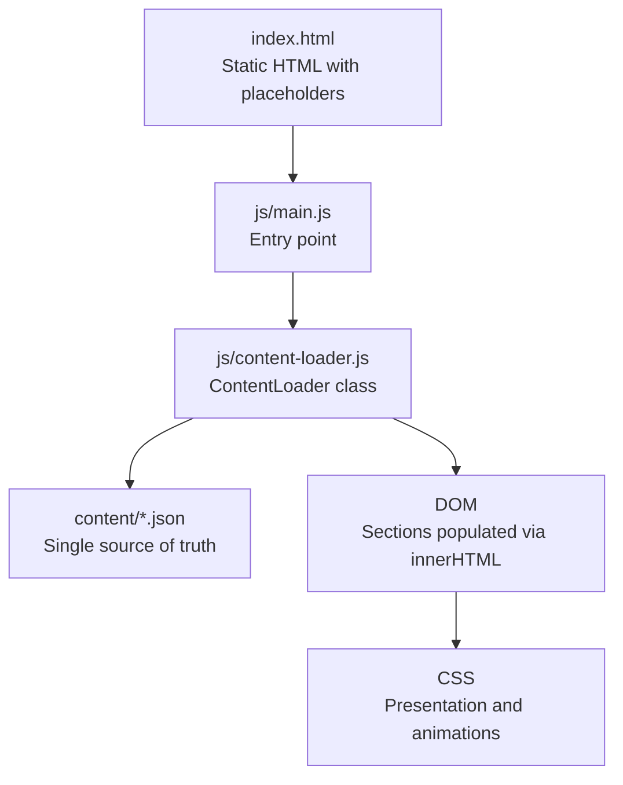
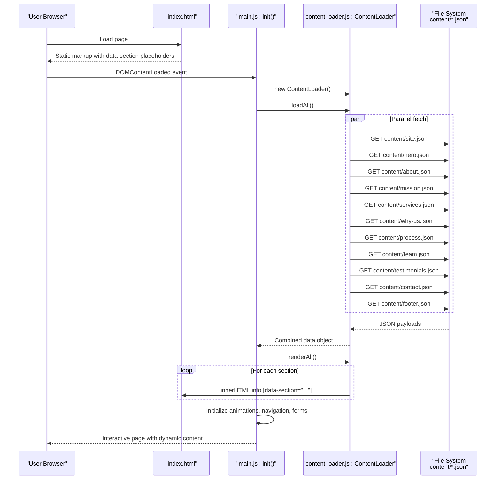
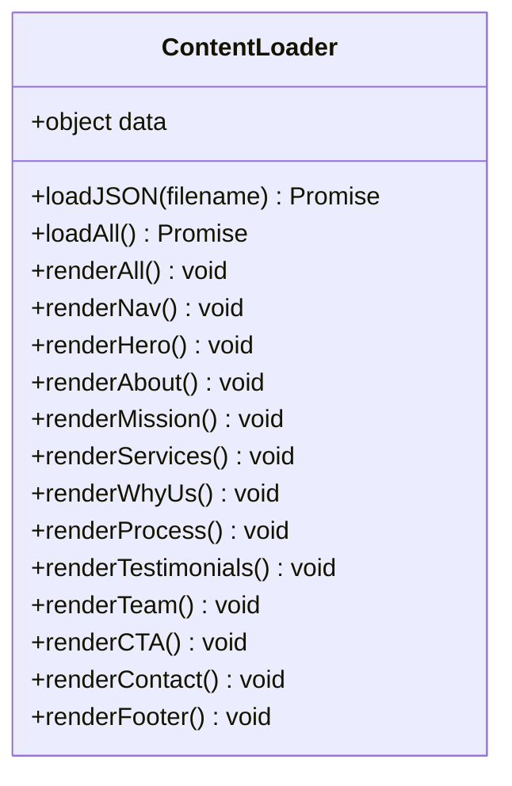
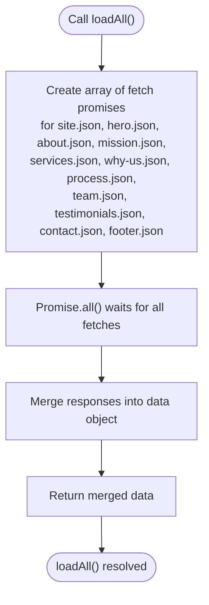
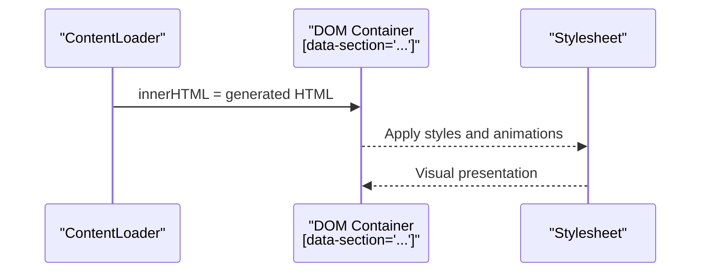
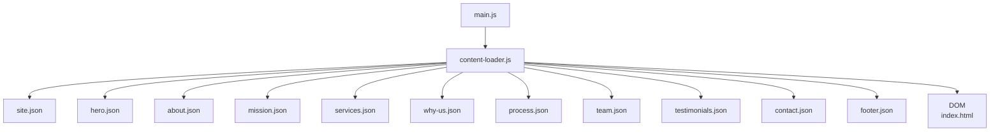

# Data Flow Architecture

<cite>
**Referenced Files in This Document**
- [index.html](file://index.html)
- [main.js](file://js/main.js)
- [content-loader.js](file://js/content-loader.js)
- [site.json](file://content/site.json)
- [hero.json](file://content/hero.json)
- [about.json](file://content/about.json)
- [mission.json](file://content/mission.json)
- [services.json](file://content/services.json)
- [why-us.json](file://content/why-us.json)
- [process.json](file://content/process.json)
- [team.json](file://content/team.json)
- [testimonials.json](file://content/testimonials.json)
- [contact.json](file://content/contact.json)
- [footer.json](file://content/footer.json)
</cite>

## Table of Contents
1. [Introduction](#introduction)
2. [Project Structure](#project-structure)
3. [Core Components](#core-components)
4. [Architecture Overview](#architecture-overview)
5. [Detailed Component Analysis](#detailed-component-analysis)
6. [Dependency Analysis](#dependency-analysis)
7. [Performance Considerations](#performance-considerations)
8. [Troubleshooting Guide](#troubleshooting-guide)
9. [Conclusion](#conclusion)

## Introduction
This document explains the complete data flow architecture of the Victory Marketing system. It details how JSON files act as the single source of truth for all dynamic content, how the content loader fetches and renders sections in parallel, and how the template rendering pipeline transforms JSON data into DOM nodes. It also covers error handling, fallback mechanisms, data transformations, caching strategies, and propagation of content updates without page reloads.

## Project Structure
The system follows a modular front-end architecture:
- Static HTML defines placeholders for each content section via data attributes.
- A JavaScript module orchestrates loading and rendering.
- A dedicated content directory stores JSON files representing each section’s data.
- Stylesheets define presentation and animations.

**Diagram sources**
- [index.html:64-95](file://index.html#L64-L95)
- [main.js:11-40](file://js/main.js#L11-L40)
- [content-loader.js:6-53](file://js/content-loader.js#L6-L53)

**Section sources**
- [index.html:1-106](file://index.html#L1-L106)
- [main.js:1-41](file://js/main.js#L1-L41)

## Core Components
- ContentLoader: Central orchestrator that fetches JSON files in parallel, stores merged data, and renders each section into the DOM.
- JSON content files: Define site-wide metadata, navigation, hero, about, mission/vision/objective, services, why-us, process, team, testimonials, contact, and footer content.
- Template rendering: Each section has a dedicated render method that builds HTML via template literals and inserts it into the DOM using innerHTML.
- Initialization pipeline: The main entry point coordinates loading, rendering, and post-render initialization of interactive features.

Key responsibilities:
- Parallel fetching: loadAll uses Promise.all to fetch all JSON files concurrently.
- Single source of truth: All dynamic content originates from content/*.json.
- DOM insertion: render methods populate sections identified by data-section attributes.
- Error handling: Try/catch around initialization hides loader gracefully on failure.
- Post-render effects: Animations, counters, navigation, and form initialization occur after content is inserted.

**Section sources**
- [content-loader.js:18-37](file://js/content-loader.js#L18-L37)
- [content-loader.js:39-53](file://js/content-loader.js#L39-L53)
- [main.js:11-37](file://js/main.js#L11-L37)

## Architecture Overview
The data flow moves from static HTML placeholders to dynamic content via JSON, then to DOM rendering and interactive enhancements.

**Diagram sources**
- [index.html:64-95](file://index.html#L64-L95)
- [main.js:11-37](file://js/main.js#L11-L37)
- [content-loader.js:18-53](file://js/content-loader.js#L18-L53)

## Detailed Component Analysis

### ContentLoader Class
The ContentLoader encapsulates:
- loadJSON: Fetches a single JSON file and validates response status.
- loadAll: Concurrently fetches all content files using Promise.all and merges them into a single data object.
- renderAll: Invokes individual render methods for navigation, hero, about, mission, services, why-us, process, testimonials, team, CTA banner, contact, and footer.
- Per-section renderers: Each renderer selects the appropriate container by data-section and constructs HTML via template literals, inserting images, links, icons, and repeated blocks.

**Diagram sources**
- [content-loader.js:6-442](file://js/content-loader.js#L6-L442)

**Section sources**
- [content-loader.js:6-442](file://js/content-loader.js#L6-L442)

### Parallel JSON Fetching Strategy
The loader uses Promise.all to fetch all content files simultaneously. This reduces total latency compared to sequential fetching and ensures all sections render together after a single combined operation.

**Diagram sources**
- [content-loader.js:18-37](file://js/content-loader.js#L18-L37)

**Section sources**
- [content-loader.js:18-37](file://js/content-loader.js#L18-L37)

### Template Rendering Pipeline
Each render method:
- Selects the target container using the data-section attribute.
- Reads data from the merged data object.
- Builds HTML via template literals, including nested arrays mapped to repeated blocks.
- Inserts the generated HTML into the container via innerHTML.

**Diagram sources**
- [content-loader.js:55-441](file://js/content-loader.js#L55-L441)
- [index.html:64-95](file://index.html#L64-L95)

**Section sources**
- [content-loader.js:55-441](file://js/content-loader.js#L55-L441)

### Data Transformation Processes
- JSON parsing: Automatic via fetch().json().
- Data shaping: Minimal; render methods directly consume fields and arrays from JSON.
- Dynamic content generation:
  - Repeated lists (e.g., services, testimonials, team members) are mapped into HTML blocks.
  - Conditional rendering (e.g., optional social links) is handled inside templates.
  - Stat counters rely on data attributes for animation targets.

**Section sources**
- [content-loader.js:12-16](file://js/content-loader.js#L12-L16)
- [content-loader.js:172-198](file://js/content-loader.js#L172-L198)
- [content-loader.js:248-286](file://js/content-loader.js#L248-L286)
- [content-loader.js:288-316](file://js/content-loader.js#L288-L316)

### Caching Strategies
- No explicit client-side cache invalidation is implemented in the current code.
- Recommendations:
  - Add Cache-Control headers on the server to enable browser caching of static assets.
  - Introduce a cache-busting strategy (e.g., versioned filenames or ETags) for JSON content when frequently updated.
  - Consider a service worker for advanced caching and offline readiness.

[No sources needed since this section provides general guidance]

### Content Validation, Sanitization, and Updates
- Validation:
  - Response status checked during fetch; errors thrown on non-OK responses.
  - Optional: Add JSON schema validation for each content file to enforce structure.
- Sanitization:
  - Current templates use innerHTML; consider a templating library with built-in escaping or sanitize before insertion.
- Dynamic updates without reloads:
  - The loader does not expose a refresh mechanism; to update content dynamically, add a method to refetch and re-render specific sections or the entire set.

**Section sources**
- [content-loader.js:12-16](file://js/content-loader.js#L12-L16)

### Error Handling and Fallback Mechanisms
- Initialization error handling: try/catch around loader.loadAll() and renderAll(); logs failures and hides the loader after a short delay.
- Fallback behavior:
  - Missing containers (no element matching data-section) are safely ignored by render methods.
  - Optional: Add default content blocks or empty-state placeholders for missing sections.

**Section sources**
- [main.js:28-36](file://js/main.js#L28-L36)
- [content-loader.js:55-67](file://js/content-loader.js#L55-L67)

## Dependency Analysis
The runtime dependency graph is straightforward and cohesive.

**Diagram sources**
- [main.js:6](file://js/main.js#L6)
- [content-loader.js:20-36](file://js/content-loader.js#L20-L36)
- [index.html:64-95](file://index.html#L64-L95)

**Section sources**
- [main.js:6](file://js/main.js#L6)
- [content-loader.js:20-36](file://js/content-loader.js#L20-L36)

## Performance Considerations
- Parallelism: Promise.all minimizes total load time by overlapping network requests.
- DOM writes: Batched via renderAll; consider deferring non-critical post-render effects until after initial paint.
- Asset delivery: Ensure static assets (images, fonts) are optimized and served with compression.
- Memory: Large JSON payloads or extensive DOM can impact performance; paginate or lazy-load heavy sections if needed.

[No sources needed since this section provides general guidance]

## Troubleshooting Guide
Common issues and resolutions:
- Network failures:
  - Symptom: Loader remains visible or errors logged.
  - Action: Verify content/*.json accessibility and CORS headers; check response.ok condition.
- Missing containers:
  - Symptom: Some sections appear blank.
  - Action: Confirm data-section attributes match expected values in index.html.
- Empty or malformed JSON:
  - Symptom: Render errors or undefined properties.
  - Action: Validate JSON syntax and required fields; add schema checks.
- Styling anomalies:
  - Symptom: Layout shifts or missing styles.
  - Action: Ensure CSS files are loaded and styles apply after innerHTML insertion.

**Section sources**
- [content-loader.js:12-16](file://js/content-loader.js#L12-L16)
- [index.html:64-95](file://index.html#L64-L95)

## Conclusion
The Victory Marketing system employs a clean, JSON-driven architecture where content files are the single source of truth. The ContentLoader class orchestrates parallel fetching and deterministic rendering into the DOM, enabling fast, structured updates. While the current implementation focuses on simplicity and performance, adding schema validation, sanitization, and a cache-busting strategy would further enhance robustness and maintainability.