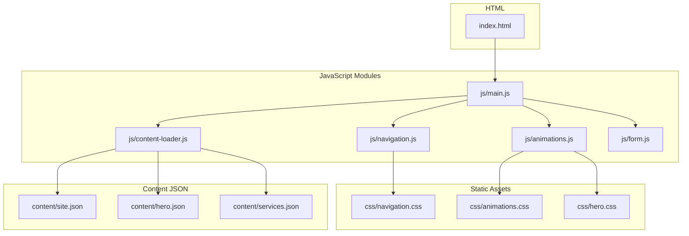
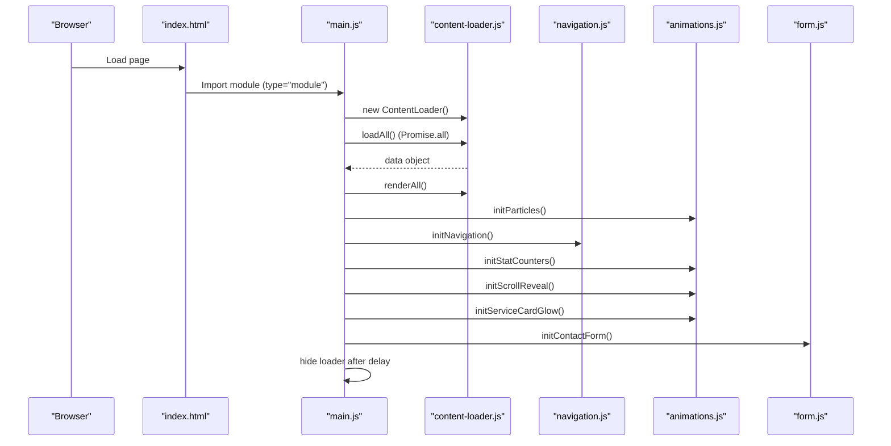
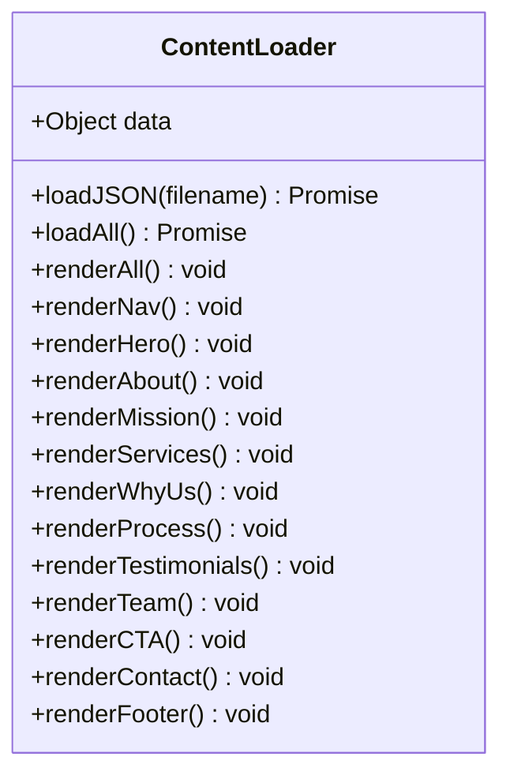
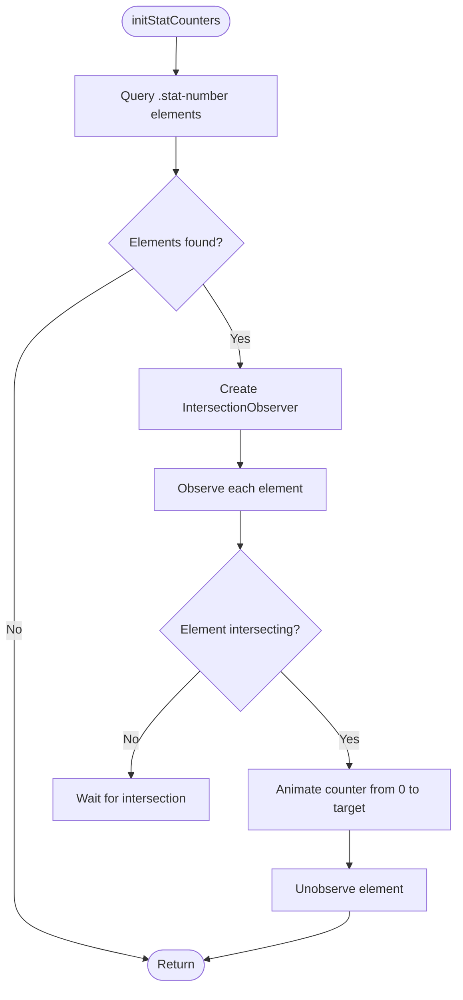
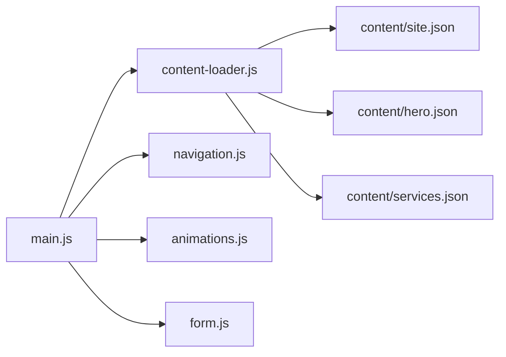

# Module Pattern Implementation

<cite>
**Referenced Files in This Document**
- [index.html](file://index.html)
- [main.js](file://js/main.js)
- [content-loader.js](file://js/content-loader.js)
- [animations.js](file://js/animations.js)
- [navigation.js](file://js/navigation.js)
- [form.js](file://js/form.js)
- [site.json](file://content/site.json)
- [hero.json](file://content/hero.json)
- [services.json](file://content/services.json)
- [animations.css](file://css/animations.css)
- [navigation.css](file://css/navigation.css)
- [hero.css](file://css/hero.css)
</cite>

## Table of Contents
1. [Introduction](#introduction)
2. [Project Structure](#project-structure)
3. [Core Components](#core-components)
4. [Architecture Overview](#architecture-overview)
5. [Detailed Component Analysis](#detailed-component-analysis)
6. [Dependency Analysis](#dependency-analysis)
7. [Performance Considerations](#performance-considerations)
8. [Troubleshooting Guide](#troubleshooting-guide)
9. [Conclusion](#conclusion)

## Introduction
This document explains how the ES6 module pattern is implemented across the Victory Marketing system. It details how each JavaScript file exports specific functionality, how the main application orchestrates module loading and initialization, and how modules maintain loose coupling while enabling necessary communication. It also covers the animation system's factory-like initialization functions, the observer pattern for scroll events, and how modules handle their own state management. Finally, it outlines module dependencies, circular dependency resolution strategies, and the benefits of this modular approach for maintainability, testing, and future extensibility.

## Project Structure
The system follows a clear separation of concerns:
- HTML pages define containers and data-section attributes for dynamic rendering.
- A main module coordinates initialization and delegates to specialized modules.
- Content is loaded from JSON files and rendered via a dedicated loader.
- Feature-specific modules initialize animations, navigation, forms, and scroll behaviors.

**Diagram sources**
- [index.html:103](file://index.html#L103)
- [main.js:6-8](file://js/main.js#L6-L8)
- [content-loader.js:6-37](file://js/content-loader.js#L6-L37)
- [navigation.js:6](file://js/navigation.js#L6)
- [animations.js:7,23,61,87](file://js/animations.js#L7,L23,L61,L87)
- [form.js:5](file://js/form.js#L5)
- [animations.css:1](file://css/animations.css#L1)
- [navigation.css:1](file://css/navigation.css#L1)
- [hero.css:1](file://css/hero.css#L1)
- [site.json:1](file://content/site.json#L1)
- [hero.json:1](file://content/hero.json#L1)
- [services.json:1](file://content/services.json#L1)

**Section sources**
- [index.html:103](file://index.html#L103)
- [main.js:11-37](file://js/main.js#L11-L37)
- [content-loader.js:6-53](file://js/content-loader.js#L6-L53)

## Core Components
- Main orchestrator: Initializes content loading, renders sections, and starts interactive features.
- Content loader: Fetches JSON content and renders all sections into the DOM.
- Navigation module: Handles scroll effects, mobile menu, smooth scrolling, and scroll-to-top.
- Animations module: Particles, stat counters, scroll reveal, and service card glow.
- Form module: Handles contact form submission.

Key export/import strategies:
- Named exports for individual initialization functions (animations, navigation, form).
- Default class export for the content loader.
- Single entry point with ES modules for clean dependency management.

**Section sources**
- [main.js:6-8](file://js/main.js#L6-L8)
- [content-loader.js:6](file://js/content-loader.js#L6)
- [animations.js:7,23,61,87](file://js/animations.js#L7,L23,L61,L87)
- [navigation.js:6](file://js/navigation.js#L6)
- [form.js:5](file://js/form.js#L5)

## Architecture Overview
The main application initializes the ContentLoader, waits for all JSON content to load, renders all sections, and then invokes feature-specific initialization functions. Each module encapsulates its own DOM queries, event listeners, and state updates, minimizing cross-module coupling.

**Diagram sources**
- [index.html:103](file://index.html#L103)
- [main.js:11-37](file://js/main.js#L11-L37)
- [content-loader.js:18-37](file://js/content-loader.js#L18-L37)
- [animations.js:7,23,61,87](file://js/animations.js#L7,L23,L61,L87)
- [navigation.js:6](file://js/navigation.js#L6)
- [form.js:5](file://js/form.js#L5)

## Detailed Component Analysis

### Content Loader Module
Responsibilities:
- Parallel loading of multiple JSON content files.
- Rendering of sections into containers identified by data-section attributes.
- Maintaining internal state (data object) and exposing render methods per section.

Implementation highlights:
- Uses Promise.all to fetch all content concurrently.
- Renders each section by invoking dedicated render methods.
- Returns early if a container is missing, avoiding errors.

**Diagram sources**
- [content-loader.js:6-442](file://js/content-loader.js#L6-L442)

**Section sources**
- [content-loader.js:18-37](file://js/content-loader.js#L18-L37)
- [content-loader.js:40-53](file://js/content-loader.js#L40-L53)

### Animations Module
Responsibilities:
- Floating particles in the hero section.
- Stat counter animation triggered on scroll.
- Scroll reveal for cards and steps.
- Mouse-tracking glow effect on service cards.

Design patterns:
- Factory-like initialization functions (initParticles, initStatCounters, initScrollReveal, initServiceCardGlow).
- Observer pattern for scroll-triggered animations (IntersectionObserver).
- Localized state via closure and DOM attributes (e.g., data-target).

**Diagram sources**
- [animations.js:23-58](file://js/animations.js#L23-L58)

**Section sources**
- [animations.js:7,23,61,87](file://js/animations.js#L7,L23,L61,L87)

### Navigation Module
Responsibilities:
- Navbar scroll effect.
- Mobile menu toggle and closing behavior.
- Scroll-to-top button visibility and click handler.
- Smooth scrolling for anchor links.

State management:
- Uses DOM classes and scroll position to manage state.
- Event listeners are attached once during initialization.

**Section sources**
- [navigation.js:6](file://js/navigation.js#L6)

### Form Module
Responsibilities:
- Handles contact form submission.
- Prevents default submission, shows success message, resets form.

State management:
- Local state within the event handler lifecycle.
- Uses dataset for localized configuration.

**Section sources**
- [form.js:5](file://js/form.js#L5)

### Main Orchestrator
Responsibilities:
- Coordinates initialization sequence.
- Loads content, renders sections, initializes features.
- Hides loader after content is ready.

Error handling:
- Try/catch around initialization.
- Finalizer hides loader with timeout.

**Section sources**
- [main.js:11-37](file://js/main.js#L11-L37)

## Dependency Analysis
Module dependencies and coupling:
- main.js depends on content-loader.js, navigation.js, animations.js, and form.js.
- content-loader.js depends on content JSON files (site.json, hero.json, services.json, etc.).
- animations.js depends on DOM elements matching specific selectors and CSS animations.
- navigation.js depends on DOM elements for navbar, mobile menu, scroll-to-top, and anchor links.
- form.js depends on the contact form element.

Loose coupling mechanisms:
- Each module encapsulates its own DOM queries and event handlers.
- Initialization functions are independent and invoked sequentially.
- No shared mutable global state; state is kept local to each module.

Circular dependency resolution:
- No circular dependencies detected among modules.
- Each module exports functions/classes independently; imports occur at the top level without mutual reliance.

**Diagram sources**
- [main.js:6-8](file://js/main.js#L6-L8)
- [content-loader.js:12-35](file://js/content-loader.js#L12-L35)
- [site.json:1](file://content/site.json#L1)
- [hero.json:1](file://content/hero.json#L1)
- [services.json:1](file://content/services.json#L1)

**Section sources**
- [main.js:6-8](file://js/main.js#L6-L8)
- [content-loader.js:12-35](file://js/content-loader.js#L12-L35)

## Performance Considerations
- Parallel content loading: Promise.all reduces total load time for multiple JSON files.
- IntersectionObserver usage: Efficient scroll-triggered animations with minimal overhead.
- CSS animations: Hardware-accelerated transforms and opacity changes for smooth performance.
- Event listener scope: Limited to necessary DOM nodes per module to avoid unnecessary reflows.

## Troubleshooting Guide
Common issues and resolutions:
- Loader not hiding: Ensure the loader element exists and the timeout completes after initialization finishes.
- Animations not triggering: Verify selector strings match rendered DOM and that IntersectionObserver thresholds are appropriate.
- Navigation not responding: Confirm DOM IDs for navbar, mobile menu, and scroll-to-top buttons exist.
- Form not resetting: Check that the form element ID matches and event listener is attached.

**Section sources**
- [main.js:28-36](file://js/main.js#L28-L36)
- [animations.js:45-57](file://js/animations.js#L45-L57)
- [navigation.js:12-53](file://js/navigation.js#L12-L53)
- [form.js:9-15](file://js/form.js#L9-L15)

## Conclusion
The ES6 module pattern in the Victory Marketing system provides a clean, maintainable, and extensible architecture. Each module encapsulates its responsibilities, enabling independent testing and future enhancements. The main orchestrator coordinates initialization without tight coupling, while the observer pattern and factory-like initialization functions keep feature logic cohesive and efficient. This approach supports easy maintenance, reliable testing, and straightforward extensibility for new features.