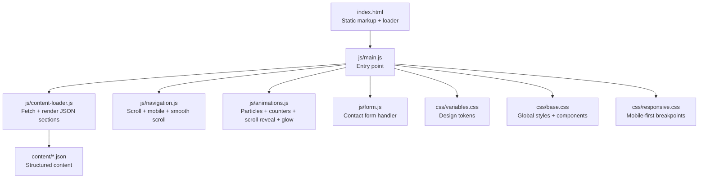
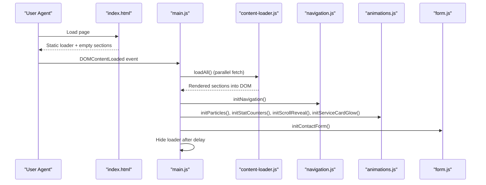
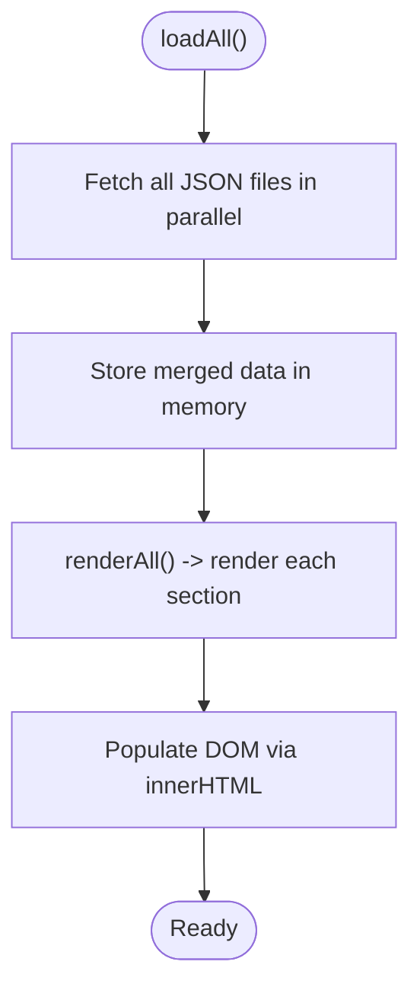
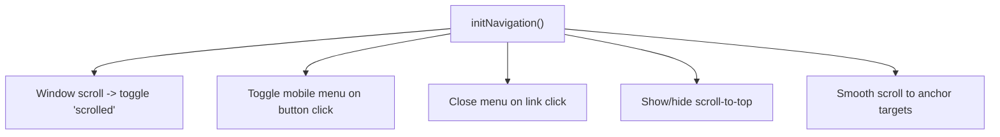
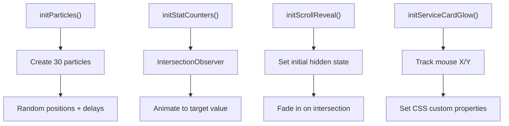
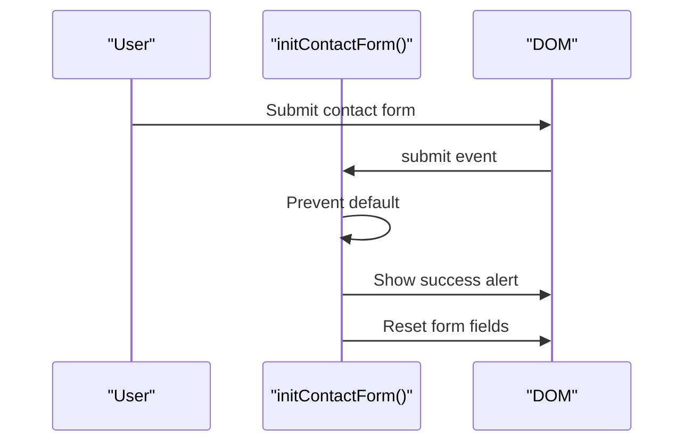
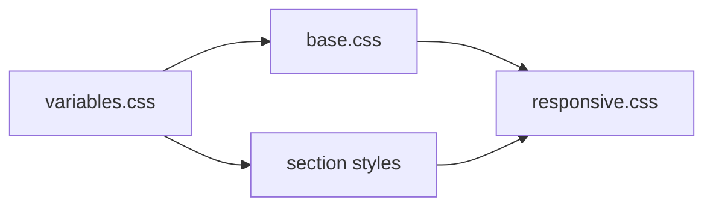
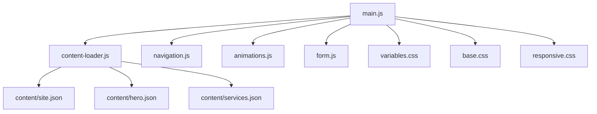

# System Design Principles

<cite>
**Referenced Files in This Document**
- [index.html](file://index.html)
- [victory_marketing.html](file://victory_marketing.html)
- [main.js](file://js/main.js)
- [content-loader.js](file://js/content-loader.js)
- [navigation.js](file://js/navigation.js)
- [animations.js](file://js/animations.js)
- [form.js](file://js/form.js)
- [responsive.css](file://css/responsive.css)
- [base.css](file://css/base.css)
- [variables.css](file://css/variables.css)
- [site.json](file://content/site.json)
- [hero.json](file://content/hero.json)
- [services.json](file://content/services.json)
</cite>

## Table of Contents
1. [Introduction](#introduction)
2. [Project Structure](#project-structure)
3. [Core Components](#core-components)
4. [Architecture Overview](#architecture-overview)
5. [Detailed Component Analysis](#detailed-component-analysis)
6. [Dependency Analysis](#dependency-analysis)
7. [Performance Considerations](#performance-considerations)
8. [Troubleshooting Guide](#troubleshooting-guide)
9. [Conclusion](#conclusion)
10. [Appendices](#appendices)

## Introduction
This document explains the system design principles underpinning the Victory Marketing architecture. It focuses on a modular JavaScript approach using ES6 modules, separation of concerns, and a component-based rendering model powered by JSON content. The design emphasizes vanilla JavaScript over frameworks, a mobile-first responsive strategy, and a performance-oriented stack with minimal external dependencies. Integration patterns between JavaScript modules and CSS are highlighted, along with the use of modern web APIs to maintain scalability while keeping the solution lightweight.

## Project Structure
The project is organized around a clear separation of concerns:
- HTML defines structural sections and a static loader, delegating dynamic rendering to JavaScript.
- A single ES6 module entry point orchestrates initialization and feature activation.
- A dedicated content loader module fetches and renders JSON-driven sections.
- Feature-specific modules encapsulate navigation, animations, and forms.
- CSS is split into modular stylesheets (variables, base, sections, responsive) enabling component-based styling.
- JSON content files supply all textual and structural data for each page component.

**Diagram sources**
- [index.html:1-106](file://index.html#L1-L106)
- [main.js:1-41](file://js/main.js#L1-L41)
- [content-loader.js:1-443](file://js/content-loader.js#L1-L443)
- [navigation.js:1-55](file://js/navigation.js#L1-L55)
- [animations.js:1-98](file://js/animations.js#L1-L98)
- [form.js:1-17](file://js/form.js#L1-L17)
- [variables.css:1-12](file://css/variables.css#L1-L12)
- [base.css:1-165](file://css/base.css#L1-L165)
- [responsive.css:1-104](file://css/responsive.css#L1-L104)

**Section sources**
- [index.html:1-106](file://index.html#L1-L106)
- [main.js:1-41](file://js/main.js#L1-L41)
- [content-loader.js:1-443](file://js/content-loader.js#L1-L443)
- [navigation.js:1-55](file://js/navigation.js#L1-L55)
- [animations.js:1-98](file://js/animations.js#L1-L98)
- [form.js:1-17](file://js/form.js#L1-L17)
- [variables.css:1-12](file://css/variables.css#L1-L12)
- [base.css:1-165](file://css/base.css#L1-L165)
- [responsive.css:1-104](file://css/responsive.css#L1-L104)

## Core Components
- Modular JavaScript with ES6 modules: Each feature is isolated in its own module, imported by the main entry point. This improves testability, maintainability, and reduces global namespace pollution.
- JSON-based content management: Content is externalized into JSON files per section, enabling non-developers to update copy and structure without touching code.
- Component-based rendering: The content loader renders each section by ID via a data attribute, treating each section as a reusable component.
- Minimal framework reliance: Vanilla JavaScript and native browser APIs are used to keep bundle sizes small and build processes simple.
- Mobile-first responsive design: CSS breakpoints progressively enhance layout for larger screens, ensuring fast loading and good UX on mobile devices.

**Section sources**
- [main.js:1-41](file://js/main.js#L1-L41)
- [content-loader.js:1-443](file://js/content-loader.js#L1-L443)
- [index.html:64-95](file://index.html#L64-L95)
- [responsive.css:1-104](file://css/responsive.css#L1-L104)

## Architecture Overview
The runtime lifecycle is orchestrated by the main module, which:
- Instantiates the content loader and fetches all JSON content in parallel.
- Renders sections into the DOM using dedicated render methods.
- Initializes interactive features after content is ready.
- Hides the static loader after a short delay.

**Diagram sources**
- [index.html:35-106](file://index.html#L35-L106)
- [main.js:11-37](file://js/main.js#L11-L37)
- [content-loader.js:18-53](file://js/content-loader.js#L18-L53)
- [navigation.js:6-54](file://js/navigation.js#L6-L54)
- [animations.js:6-97](file://js/animations.js#L6-L97)
- [form.js:5-16](file://js/form.js#L5-L16)

## Detailed Component Analysis

### Content Management with JSON
- Centralized content in JSON files allows independent updates and reuse across templates.
- The content loader aggregates all JSON resources and stores them in memory for rendering.
- Sections are identified by a data attribute on the HTML side, enabling a clean mapping between content and DOM.

**Diagram sources**
- [content-loader.js:18-53](file://js/content-loader.js#L18-L53)
- [index.html:64-95](file://index.html#L64-L95)

**Section sources**
- [content-loader.js:11-37](file://js/content-loader.js#L11-L37)
- [site.json:1-18](file://content/site.json#L1-L18)
- [hero.json:1-34](file://content/hero.json#L1-L34)
- [services.json:1-82](file://content/services.json#L1-L82)

### Navigation and Interaction
- Scroll-aware navbar, mobile menu toggle, smooth scrolling anchors, and scroll-to-top button are implemented with vanilla JavaScript.
- Event listeners are scoped to elements present in the DOM, avoiding unnecessary overhead.

**Diagram sources**
- [navigation.js:6-54](file://js/navigation.js#L6-L54)
- [index.html:45-62](file://index.html#L45-L62)

**Section sources**
- [navigation.js:6-54](file://js/navigation.js#L6-L54)
- [index.html:45-62](file://index.html#L45-L62)

### Animations and Interactions
- Particles: Dynamically generated DOM nodes for animated background effects.
- Stat counters: IntersectionObserver triggers numeric counters when elements are in view.
- Scroll reveal: Fade-in and slide-up effects for cards and steps.
- Mouse glow: CSS custom properties drive a subtle radial glow on service cards.

**Diagram sources**
- [animations.js:6-97](file://js/animations.js#L6-L97)

**Section sources**
- [animations.js:6-97](file://js/animations.js#L6-L97)

### Form Handling
- A minimal contact form handler prevents default submission, displays a configurable success message, and resets the form.

**Diagram sources**
- [form.js:5-16](file://js/form.js#L5-L16)
- [content-loader.js:337-405](file://js/content-loader.js#L337-L405)

**Section sources**
- [form.js:5-16](file://js/form.js#L5-L16)
- [content-loader.js:337-405](file://js/content-loader.js#L337-L405)

### CSS Integration Patterns
- Variables define design tokens consumed across components.
- Base styles establish global typography, spacing, and reusable components.
- Section-specific styles encapsulate component visuals.
- Responsive overrides adapt layouts for tablets and phones.

**Diagram sources**
- [variables.css:1-12](file://css/variables.css#L1-L12)
- [base.css:1-165](file://css/base.css#L1-L165)
- [responsive.css:1-104](file://css/responsive.css#L1-L104)

**Section sources**
- [variables.css:1-12](file://css/variables.css#L1-L12)
- [base.css:1-165](file://css/base.css#L1-L165)
- [responsive.css:1-104](file://css/responsive.css#L1-L104)

## Dependency Analysis
The system exhibits low coupling and high cohesion:
- Entry point depends on feature modules but not on content.
- Content loader depends on JSON files and DOM containers.
- Feature modules depend on DOM elements and modern APIs (IntersectionObserver).
- CSS is decoupled from JavaScript, styled via class names and attributes.

**Diagram sources**
- [main.js:6-9](file://js/main.js#L6-L9)
- [content-loader.js:1-443](file://js/content-loader.js#L1-L443)
- [navigation.js:1-55](file://js/navigation.js#L1-L55)
- [animations.js:1-98](file://js/animations.js#L1-L98)
- [form.js:1-17](file://js/form.js#L1-L17)
- [variables.css:1-12](file://css/variables.css#L1-L12)
- [base.css:1-165](file://css/base.css#L1-L165)
- [responsive.css:1-104](file://css/responsive.css#L1-L104)

**Section sources**
- [main.js:6-9](file://js/main.js#L6-L9)
- [content-loader.js:1-443](file://js/content-loader.js#L1-L443)

## Performance Considerations
- Parallel content fetching: JSON resources are loaded concurrently to minimize initialization time.
- Efficient DOM manipulation: Rendering uses innerHTML with pre-built templates; minimal DOM queries occur during interactions.
- Lazy initialization: Animations and observers are attached after content is rendered, reducing initial work.
- Modern APIs: IntersectionObserver replaces scroll handlers for smoother animations.
- Minimal dependencies: No bundler or framework increases portability and reduces payload.
- Mobile-first strategy: Optimized CSS ensures fast rendering on constrained devices.

[No sources needed since this section provides general guidance]

## Troubleshooting Guide
- Content not appearing: Verify the data-section attribute matches the section ID and that the content loader’s render method exists for that section.
- JSON fetch failures: Check network tab for 404s or CORS errors; confirm filenames match those referenced in loadAll().
- Animations not triggering: Ensure elements are present in the DOM and IntersectionObserver thresholds are appropriate.
- Navigation not working: Confirm element IDs exist and event listeners are attached after DOMContentLoaded.
- Loader not hiding: Inspect the loader element and the timeout logic in the main module.

**Section sources**
- [content-loader.js:18-53](file://js/content-loader.js#L18-L53)
- [main.js:11-37](file://js/main.js#L11-L37)
- [animations.js:45-58](file://js/animations.js#L45-L58)
- [navigation.js:6-54](file://js/navigation.js#L6-L54)

## Conclusion
Victory Marketing’s architecture embraces modularity, content-driven rendering, and vanilla JavaScript to deliver a scalable, maintainable, and performant web experience. By separating concerns across ES6 modules, externalizing content into JSON, and applying a mobile-first CSS strategy, the system remains lightweight yet extensible. The use of modern web APIs and minimal dependencies ensures long-term viability and easy onboarding for contributors.

[No sources needed since this section summarizes without analyzing specific files]

## Appendices
- Example JSON structure references:
  - Site metadata and branding: [site.json:1-18](file://content/site.json#L1-L18)
  - Hero headline and stats: [hero.json:1-34](file://content/hero.json#L1-L34)
  - Services catalog: [services.json:1-82](file://content/services.json#L1-L82)

**Section sources**
- [site.json:1-18](file://content/site.json#L1-L18)
- [hero.json:1-34](file://content/hero.json#L1-L34)
- [services.json:1-82](file://content/services.json#L1-L82)