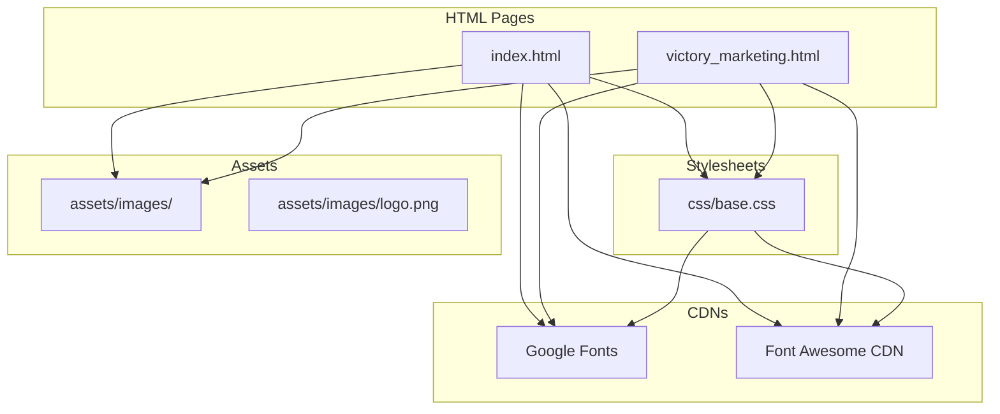
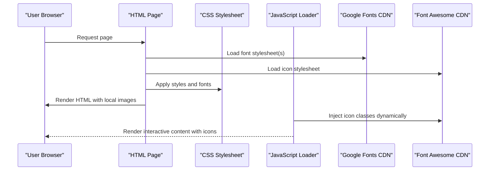
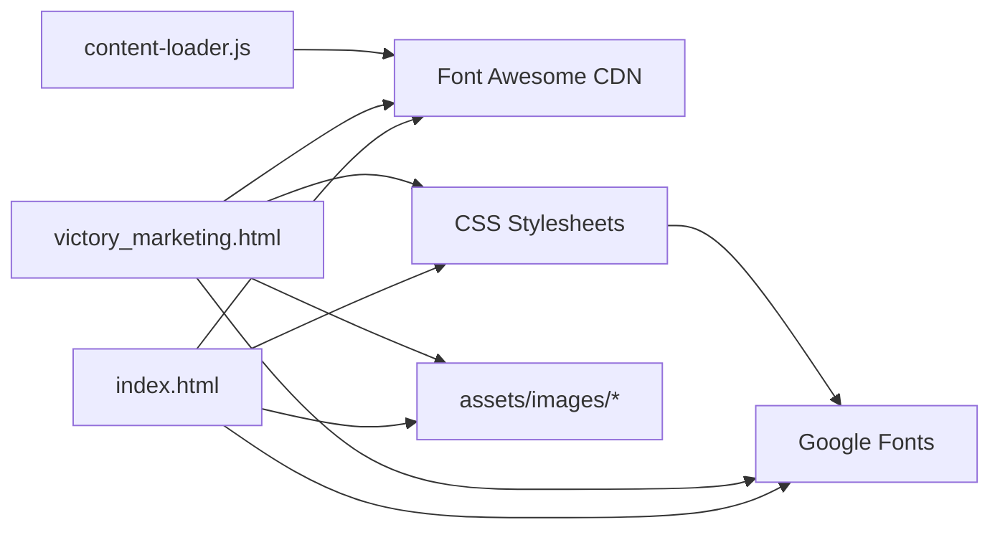

# Asset Management

<cite>
**Referenced Files in This Document**
- [index.html](file://index.html)
- [victory_marketing.html](file://victory_marketing.html)
- [base.css](file://css/base.css)
- [content-loader.js](file://js/content-loader.js)
- [logo.png](file://assets/images/logo.png)
</cite>

## Table of Contents
1. [Introduction](#introduction)
2. [Project Structure](#project-structure)
3. [Core Components](#core-components)
4. [Architecture Overview](#architecture-overview)
5. [Detailed Component Analysis](#detailed-component-analysis)
6. [Dependency Analysis](#dependency-analysis)
7. [Performance Considerations](#performance-considerations)
8. [Troubleshooting Guide](#troubleshooting-guide)
9. [Conclusion](#conclusion)
10. [Appendices](#appendices)

## Introduction
This document describes the asset management strategy for the website, focusing on image optimization, file organization, CDN integration, versioning and caching, accessibility, and performance alignment. It consolidates the current implementation visible in the repository and provides practical guidelines for maintaining and extending assets consistently.

## Project Structure
The asset system centers around:
- A dedicated images directory for static image assets
- Inline and external CDN integrations for fonts and icon libraries
- CSS that defines typography and layout using those assets
- JavaScript that dynamically renders icons via CDN-provided classes

**Diagram sources**
- [index.html](file://index.html)
- [victory_marketing.html](file://victory_marketing.html)
- [base.css](file://css/base.css)
- [logo.png](file://assets/images/logo.png)

**Section sources**
- [index.html](file://index.html)
- [victory_marketing.html](file://victory_marketing.html)
- [base.css](file://css/base.css)

## Core Components
- Image assets: Stored under assets/images/, with logo.png currently present
- Typography assets: Loaded from Google Fonts via preconnected origins and stylesheet link
- Icon assets: Loaded from Font Awesome via CDN stylesheet
- Dynamic icon rendering: JavaScript injects Font Awesome icon classes into content blocks
- CSS typography: Defines font families and weights used across the site

Key implementation references:
- CDN font links and preconnects in HTML head
- Font declarations in CSS
- Icon usage in HTML images and dynamic rendering in JavaScript
- Static image references in HTML

**Section sources**
- [index.html](file://index.html)
- [victory_marketing.html](file://victory_marketing.html)
- [base.css](file://css/base.css)
- [content-loader.js](file://js/content-loader.js)
- [logo.png](file://assets/images/logo.png)

## Architecture Overview
The asset pipeline integrates local images with external CDNs for fonts and icons. HTML pages declare CDN resources and local images. CSS applies typography and styles. JavaScript dynamically injects icons into rendered content.

**Diagram sources**
- [index.html](file://index.html)
- [victory_marketing.html](file://victory_marketing.html)
- [base.css](file://css/base.css)
- [content-loader.js](file://js/content-loader.js)

## Detailed Component Analysis

### Image Asset Structure and Organization
- Location: assets/images/
- Current asset: logo.png
- Usage patterns:
  - Static references in HTML for branding and loader visuals
  - Consistent alt attributes for accessibility

Guidelines derived from current usage:
- Place all brand and UI imagery under assets/images/
- Use descriptive filenames that reflect purpose (e.g., logo.png)
- Maintain a single source of truth for logos and repeated images

**Section sources**
- [index.html](file://index.html)
- [victory_marketing.html](file://victory_marketing.html)
- [logo.png](file://assets/images/logo.png)

### Naming Conventions for Asset Types
- Images: descriptive names indicating purpose and context (e.g., logo.png)
- Icons: managed via CDN classes; avoid bundling icon fonts locally
- Fonts: managed via CDN stylesheet URLs; rely on versioned URLs for stability

**Section sources**
- [index.html](file://index.html)
- [victory_marketing.html](file://victory_marketing.html)
- [base.css](file://css/base.css)

### Image Optimization Techniques
Current state:
- No explicit image optimization metadata or modern formats observed in repository
- Images are served as static PNG assets

Recommended techniques aligned with current structure:
- Prefer WebP or AVIF for newer browsers with fallbacks
- Compress PNG assets using lossless or lossy tools depending on use case
- Serve appropriately sized images; use srcset or picture element for responsive scenarios
- Lazy-load offscreen images using loading="lazy" on img elements
- Consider SVG for simple logos and scalable graphics

Note: Implementation should preserve current alt attributes and structural references.

**Section sources**
- [index.html](file://index.html)
- [victory_marketing.html](file://victory_marketing.html)
- [logo.png](file://assets/images/logo.png)

### CDN Integration Strategies
- Fonts:
  - Preconnect to fonts.googleapis.com and fonts.gstatic.com
  - Load font family stylesheets via link rel="stylesheet"
  - CSS consumes declared families for typography
- Icons:
  - Load Font Awesome stylesheet from CDN
  - Use icon classes in HTML and dynamically via JavaScript

Benefits:
- Reduced hosting overhead
- Global edge delivery
- Automatic updates when using versioned URLs

**Section sources**
- [index.html](file://index.html)
- [victory_marketing.html](file://victory_marketing.html)
- [base.css](file://css/base.css)
- [content-loader.js](file://js/content-loader.js)

### Versioning and Cache Management
Observations:
- No explicit cache-busting or versioned asset URLs in repository
- CDN resources are referenced by stable URLs

Recommended practices:
- Use cache-busting filenames or subfolder versioning for local assets
- Leverage long-term caching headers for immutable assets (e.g., hashed filenames)
- Keep CDN URLs stable; rely on their own cache policies
- Set appropriate Cache-Control headers for CSS/JS and images

**Section sources**
- [index.html](file://index.html)
- [victory_marketing.html](file://victory_marketing.html)
- [base.css](file://css/base.css)

### Accessibility Considerations for Images
Current practices:
- Alt attributes present for logo images
- Semantic markup uses img elements for decorative/static images

Recommendations:
- Provide meaningful alt text for logos and branding images
- Use empty alt="" for purely decorative images
- Ensure sufficient color contrast with surrounding text
- Pair icons with text or ARIA labels when icons are used alone

**Section sources**
- [index.html](file://index.html)
- [victory_marketing.html](file://victory_marketing.html)

### Relationship to Website Performance
- CDN-hosted fonts and icons reduce origin server load and improve global latency
- Local images should be optimized to minimize transfer sizes
- Proper caching and versioning prevent stale assets while enabling efficient reuse
- Lazy-loading reduces initial page weight for below-the-fold images

**Section sources**
- [index.html](file://index.html)
- [victory_marketing.html](file://victory_marketing.html)
- [base.css](file://css/base.css)
- [content-loader.js](file://js/content-loader.js)

## Dependency Analysis
The following diagram shows how HTML pages depend on CDN resources, CSS, and local images.

**Diagram sources**
- [index.html](file://index.html)
- [victory_marketing.html](file://victory_marketing.html)
- [base.css](file://css/base.css)
- [content-loader.js](file://js/content-loader.js)

**Section sources**
- [index.html](file://index.html)
- [victory_marketing.html](file://victory_marketing.html)
- [base.css](file://css/base.css)
- [content-loader.js](file://js/content-loader.js)

## Performance Considerations
- Optimize images for web delivery (formats, compression, sizing)
- Enable lazy-loading for non-critical images
- Use preconnect and preload hints for CDNs
- Minimize render-blocking resources and leverage caching
- Monitor Core Web Vitals and adjust asset strategy accordingly

[No sources needed since this section provides general guidance]

## Troubleshooting Guide
Common issues and resolutions:
- Broken CDN links: Verify network availability and CORS policies; ensure preconnects are present
- Missing icons: Confirm Font Awesome class names match CDN version; check for typos
- Slow image loads: Validate compression and format; consider lazy-loading
- Stale assets: Implement cache-busting or versioned filenames for local assets

**Section sources**
- [index.html](file://index.html)
- [victory_marketing.html](file://victory_marketing.html)
- [base.css](file://css/base.css)
- [content-loader.js](file://js/content-loader.js)

## Conclusion
The current asset setup leverages CDNs for fonts and icons while serving local images from assets/images/. To enhance performance and maintainability, adopt modern image formats and compression, implement lazy-loading, and introduce versioned cache-busting for local assets. Continue to use descriptive naming and alt attributes to ensure accessibility and clarity.

[No sources needed since this section summarizes without analyzing specific files]

## Appendices

### Adding New Assets
- Place images under assets/images/ with descriptive names
- Reference images in HTML with appropriate alt attributes
- For icons, use Font Awesome classes from the CDN
- For typography, declare font families in CSS and ensure corresponding CDN links are present

**Section sources**
- [index.html](file://index.html)
- [victory_marketing.html](file://victory_marketing.html)
- [base.css](file://css/base.css)
- [content-loader.js](file://js/content-loader.js)

### Optimizing Existing Images
- Convert to WebP/AVIF with fallbacks
- Compress PNG assets; remove embedded metadata
- Serve appropriately sized images; consider responsive techniques
- Add loading="lazy" to offscreen images

**Section sources**
- [index.html](file://index.html)
- [victory_marketing.html](file://victory_marketing.html)
- [logo.png](file://assets/images/logo.png)