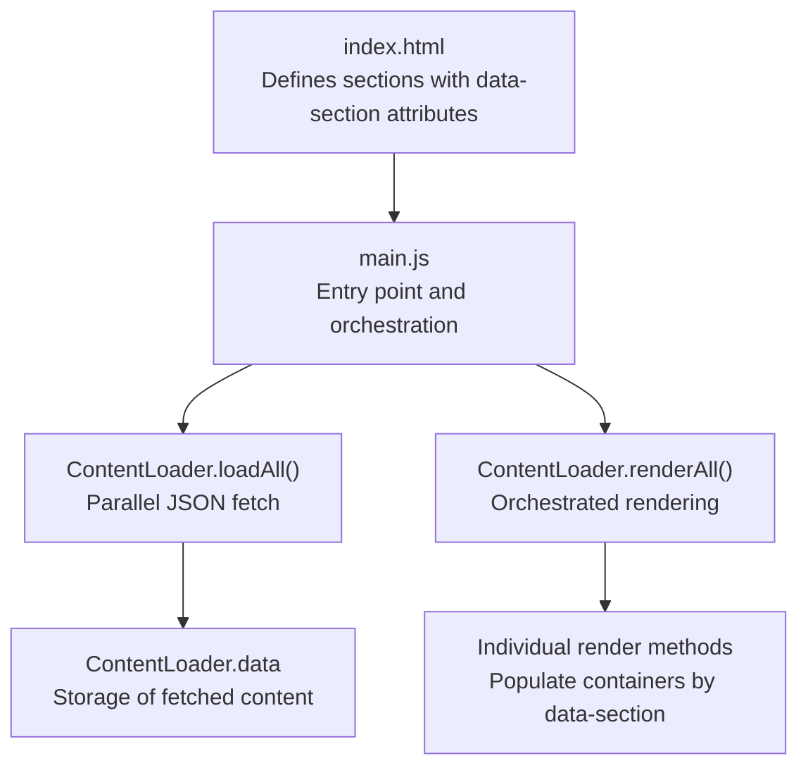
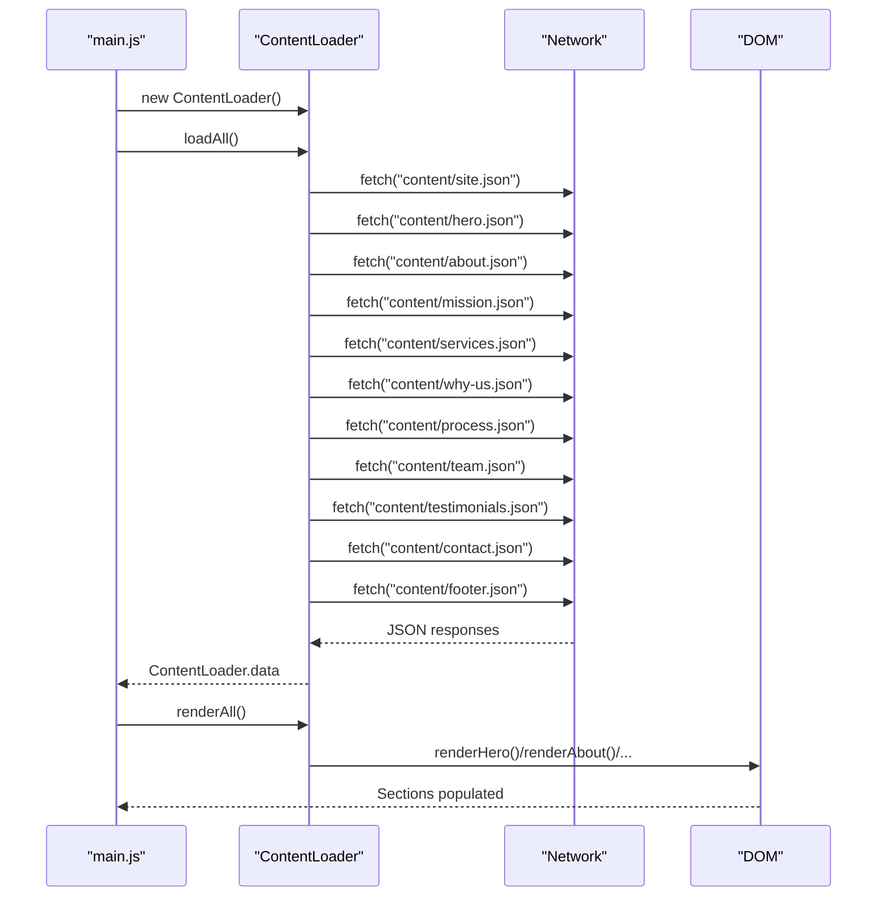
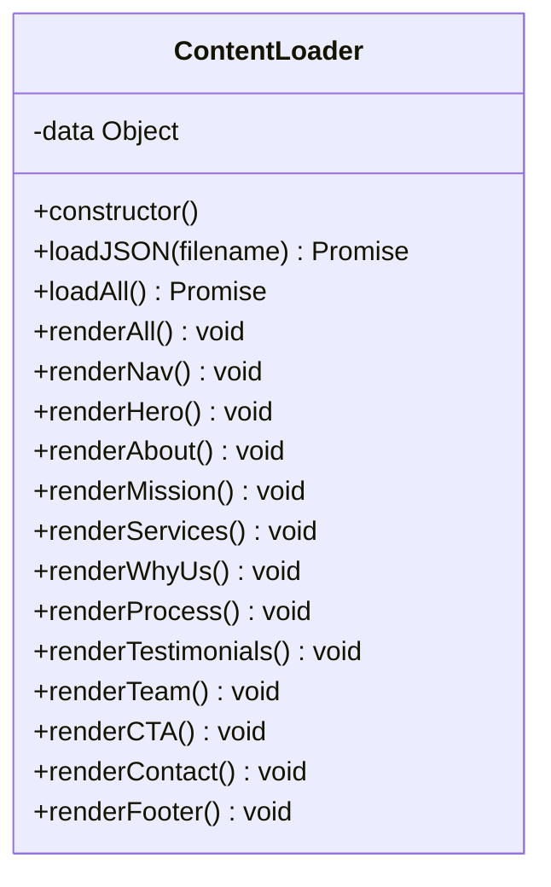
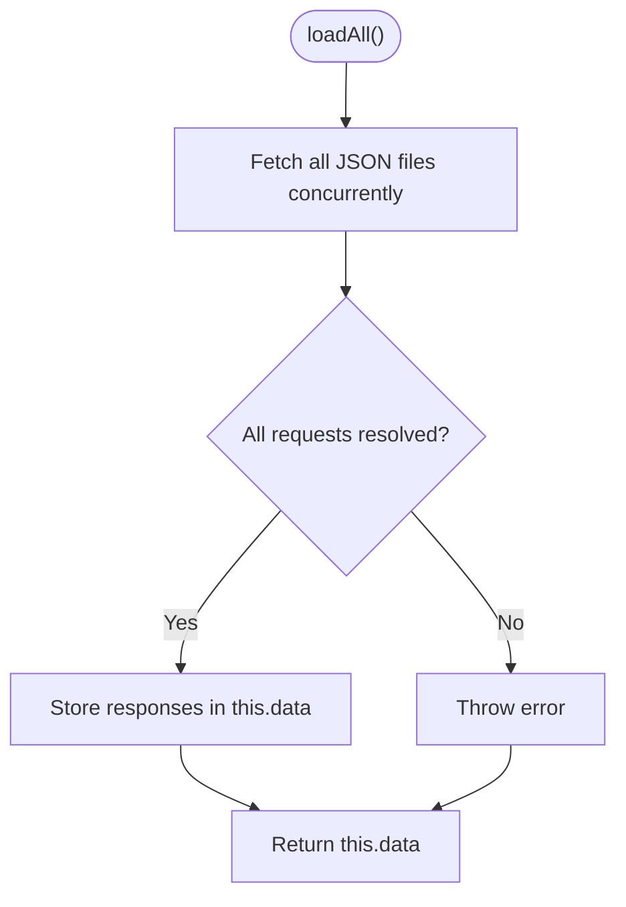
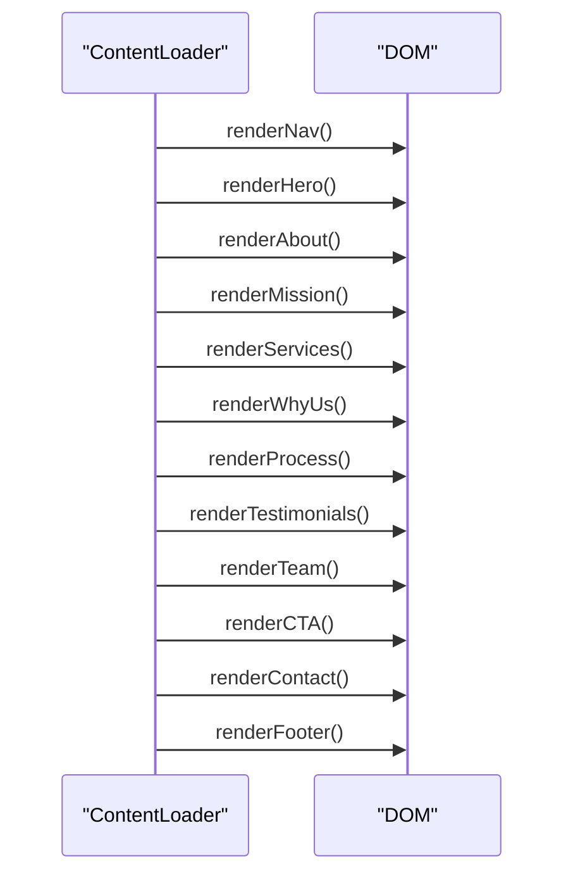
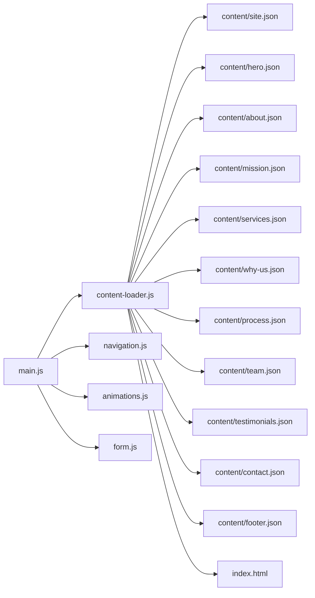

# Content Loading Mechanism

<cite>
**Referenced Files in This Document**
- [content-loader.js](file://js/content-loader.js)
- [main.js](file://js/main.js)
- [index.html](file://index.html)
- [site.json](file://content/site.json)
- [hero.json](file://content/hero.json)
- [about.json](file://content/about.json)
- [services.json](file://content/services.json)
- [form.js](file://js/form.js)
</cite>

## Table of Contents
1. [Introduction](#introduction)
2. [Project Structure](#project-structure)
3. [Core Components](#core-components)
4. [Architecture Overview](#architecture-overview)
5. [Detailed Component Analysis](#detailed-component-analysis)
6. [Dependency Analysis](#dependency-analysis)
7. [Performance Considerations](#performance-considerations)
8. [Troubleshooting Guide](#troubleshooting-guide)
9. [Conclusion](#conclusion)
10. [Appendices](#appendices)

## Introduction
This document explains the ContentLoader class and its parallel JSON fetching mechanism. It covers how the system asynchronously loads content from multiple JSON files concurrently, stores the data, orchestrates rendering across DOM sections, and applies template-based rendering with string interpolation, array mapping, and conditional rendering. It also documents how individual render methods populate specific DOM containers identified by data-section attributes, how new content sections can be added, and best practices for debugging and performance.

## Project Structure
The content loading pipeline centers around a single module that fetches JSON content and renders it into the DOM. The HTML defines placeholders for each section using data-section attributes, and the main entry script coordinates initialization.

**Diagram sources**
- [index.html:64-95](file://index.html#L64-L95)
- [main.js:11-37](file://js/main.js#L11-L37)
- [content-loader.js:18-53](file://js/content-loader.js#L18-L53)

**Section sources**
- [index.html:64-95](file://index.html#L64-L95)
- [main.js:11-37](file://js/main.js#L11-L37)

## Core Components
- ContentLoader: Central class responsible for fetching JSON content, storing it, and rendering sections into the DOM.
- main.js: Application entry point that instantiates ContentLoader, triggers loading and rendering, and initializes interactive features.
- index.html: Defines DOM sections with data-section attributes that render methods target.

Key responsibilities:
- Parallel fetching: Uses Promise.all to fetch all content files concurrently.
- Data storage: Stores all fetched content in a single data object keyed by content type.
- Rendering orchestration: Calls render methods in a fixed order to populate sections.
- Template rendering: Uses JavaScript template literals with string interpolation, array mapping, and conditional rendering.

**Section sources**
- [content-loader.js:6-53](file://js/content-loader.js#L6-L53)
- [main.js:11-37](file://js/main.js#L11-L37)
- [index.html:64-95](file://index.html#L64-L95)

## Architecture Overview
The system follows a modular architecture:
- Initialization: main.js creates a ContentLoader instance, awaits loadAll(), calls renderAll(), then initializes animations and forms.
- Data flow: loadAll() resolves all JSON promises and assigns them to ContentLoader.data. renderAll() iterates through render methods.
- DOM targeting: Each render method selects a container by its data-section attribute and injects HTML built from the stored data.

**Diagram sources**
- [main.js:11-37](file://js/main.js#L11-L37)
- [content-loader.js:18-53](file://js/content-loader.js#L18-L53)

## Detailed Component Analysis

### ContentLoader Class
The ContentLoader class encapsulates the entire content loading and rendering pipeline.

**Diagram sources**
- [content-loader.js:6-442](file://js/content-loader.js#L6-L442)

Key methods and behaviors:
- loadJSON(filename): Fetches a single JSON file and throws on non-OK responses.
- loadAll(): Concurrently fetches all content files using Promise.all and stores them in this.data.
- renderAll(): Calls each render method in a deterministic order to populate sections.
- Individual render methods: Select DOM containers by data-section, interpolate strings, map arrays, and conditionally render optional content.

Template rendering patterns used across render methods:
- String interpolation: Embedding values from this.data into HTML templates.
- Array mapping: Converting arrays (e.g., buttons, stats, testimonials) into repeated HTML blocks.
- Conditional rendering: Rendering optional links or icons only when present (e.g., social profiles).
- Dynamic content injection: Populating containers with generated HTML.

Relationship to DOM:
- Each render method targets a container whose data-section attribute matches the section identifier (e.g., "hero", "about").
- Containers are populated with innerHTML constructed from templates.

**Section sources**
- [content-loader.js:11-53](file://js/content-loader.js#L11-L53)
- [content-loader.js:69-107](file://js/content-loader.js#L69-L107)
- [content-loader.js:109-145](file://js/content-loader.js#L109-L145)
- [content-loader.js:147-169](file://js/content-loader.js#L147-L169)
- [content-loader.js:171-198](file://js/content-loader.js#L171-L198)
- [content-loader.js:200-222](file://js/content-loader.js#L200-L222)
- [content-loader.js:224-246](file://js/content-loader.js#L224-L246)
- [content-loader.js:248-286](file://js/content-loader.js#L248-L286)
- [content-loader.js:288-316](file://js/content-loader.js#L288-L316)
- [content-loader.js:318-335](file://js/content-loader.js#L318-L335)
- [content-loader.js:337-405](file://js/content-loader.js#L337-L405)
- [content-loader.js:407-441](file://js/content-loader.js#L407-L441)

### Parallel JSON Fetching Mechanism
The loadAll() method performs concurrent fetching using Promise.all. This ensures that all content is loaded in parallel, minimizing total load time compared to sequential fetching.

**Diagram sources**
- [content-loader.js:18-37](file://js/content-loader.js#L18-L37)

Error handling:
- loadJSON() throws an error when a response is not OK, causing Promise.all to reject and propagate to the caller.
- main.js catches errors during initialization and logs them, preventing partial rendering.

**Section sources**
- [content-loader.js:11-16](file://js/content-loader.js#L11-L16)
- [content-loader.js:18-37](file://js/content-loader.js#L18-L37)
- [main.js:28-30](file://js/main.js#L28-L30)

### Data Storage Architecture
ContentLoader.data is a single object containing all fetched content. Keys correspond to content filenames (with hyphens replaced by underscores in the assignment). This enables centralized access to all content within render methods.

Example keys observed:
- site
- hero
- about
- mission
- services
- whyUs
- process
- team
- testimonials
- contact
- footer

Render methods access data via destructuring (e.g., const { hero } = this.data;) to keep code readable and maintainable.

**Section sources**
- [content-loader.js:35](file://js/content-loader.js#L35)
- [content-loader.js:56-67](file://js/content-loader.js#L56-L67)

### renderAll() Orchestration
renderAll() calls each render method in a fixed order, ensuring sections are populated consistently. The order aligns with typical page flow: navigation branding, hero, about, mission/vision/objective, services, “why us”, process, testimonials, team, call-to-action banner, contact, and footer.

**Diagram sources**
- [content-loader.js:39-53](file://js/content-loader.js#L39-L53)

**Section sources**
- [content-loader.js:39-53](file://js/content-loader.js#L39-L53)

### Template-Based Rendering System
Each render method constructs HTML using template literals and injects it into the DOM. The system employs several rendering patterns:

- String interpolation: Values from this.data are embedded directly into HTML.
- Array mapping: Arrays (e.g., buttons, stats, testimonials, members) are mapped to repeated HTML blocks.
- Conditional rendering: Optional fields are conditionally included (e.g., social links only if present).
- Dynamic content injection: Containers are populated with generated HTML.

Examples of patterns across sections:
- Buttons and stats: Iterating over arrays to produce multiple elements.
- Social links: Conditional inclusion of platform-specific links.
- Testimonial duplication: Duplicating testimonial cards to enable infinite scrolling effects.

**Section sources**
- [content-loader.js:69-107](file://js/content-loader.js#L69-L107)
- [content-loader.js:109-145](file://js/content-loader.js#L109-L145)
- [content-loader.js:147-169](file://js/content-loader.js#L147-L169)
- [content-loader.js:171-198](file://js/content-loader.js#L171-L198)
- [content-loader.js:200-222](file://js/content-loader.js#L200-L222)
- [content-loader.js:224-246](file://js/content-loader.js#L224-L246)
- [content-loader.js:248-286](file://js/content-loader.js#L248-L286)
- [content-loader.js:288-316](file://js/content-loader.js#L288-L316)
- [content-loader.js:318-335](file://js/content-loader.js#L318-L335)
- [content-loader.js:337-405](file://js/content-loader.js#L337-L405)
- [content-loader.js:407-441](file://js/content-loader.js#L407-L441)

### Relationship Between Content Files and Render Methods
Each content file corresponds to a render method by name:
- site.json -> renderNav()
- hero.json -> renderHero()
- about.json -> renderAbout()
- mission.json -> renderMission()
- services.json -> renderServices()
- why-us.json -> renderWhyUs()
- process.json -> renderProcess()
- testimonials.json -> renderTestimonials()
- team.json -> renderTeam()
- contact.json -> renderContact()
- footer.json -> renderFooter()

Parameter passing and data transformation:
- loadAll() passes raw JSON responses to this.data.
- Render methods destructure this.data to access the relevant section’s data.
- Some methods transform data slightly (e.g., splitting headline parts, duplicating testimonials).

**Section sources**
- [content-loader.js:18-37](file://js/content-loader.js#L18-L37)
- [content-loader.js:56-67](file://js/content-loader.js#L56-L67)
- [content-loader.js:69-107](file://js/content-loader.js#L69-L107)
- [content-loader.js:109-145](file://js/content-loader.js#L109-L145)
- [content-loader.js:147-169](file://js/content-loader.js#L147-L169)
- [content-loader.js:171-198](file://js/content-loader.js#L171-L198)
- [content-loader.js:200-222](file://js/content-loader.js#L200-L222)
- [content-loader.js:224-246](file://js/content-loader.js#L224-L246)
- [content-loader.js:248-286](file://js/content-loader.js#L248-L286)
- [content-loader.js:288-316](file://js/content-loader.js#L288-L316)
- [content-loader.js:318-335](file://js/content-loader.js#L318-L335)
- [content-loader.js:337-405](file://js/content-loader.js#L337-L405)
- [content-loader.js:407-441](file://js/content-loader.js#L407-L441)

### Extending the System with New Content Sections
To add a new content section:
1. Create a new JSON file under content/, following the established structure (header, body content, arrays for repeated items).
2. Add a corresponding render method in ContentLoader that targets the appropriate data-section container.
3. Call the new render method from renderAll() in the desired order.
4. Ensure the HTML includes a section element with the matching data-section attribute.

Handling missing content gracefully:
- Render methods check for the presence of the target container before injecting content.
- Optional fields are conditionally rendered to avoid empty or broken UI elements.

Optimizing loading performance:
- Keep content files small and focused.
- Use lazy loading for images and heavy assets after content is rendered.
- Consider caching strategies for frequently accessed content.

**Section sources**
- [content-loader.js:39-53](file://js/content-loader.js#L39-L53)
- [index.html:64-95](file://index.html#L64-L95)

## Dependency Analysis
The system exhibits a clean dependency structure:
- main.js depends on ContentLoader and initialization modules.
- ContentLoader depends on the content directory and the DOM.
- HTML depends on data-section attributes to bind render methods to containers.

**Diagram sources**
- [main.js:6-9](file://js/main.js#L6-L9)
- [content-loader.js:18-37](file://js/content-loader.js#L18-L37)
- [index.html:64-95](file://index.html#L64-L95)

**Section sources**
- [main.js:6-9](file://js/main.js#L6-L9)
- [content-loader.js:18-37](file://js/content-loader.js#L18-L37)

## Performance Considerations
- Parallel fetching: Using Promise.all reduces total load time by fetching all content concurrently.
- Minimal DOM writes: Each render method writes once per section, reducing layout thrashing.
- Lazy initialization: Interactive features are initialized after content rendering to avoid blocking.
- Image optimization: Consider lazy-loading images and deferring heavy assets until after initial render.

[No sources needed since this section provides general guidance]

## Troubleshooting Guide
Common issues and debugging techniques:
- Network failures: loadJSON() throws on non-OK responses. Wrap initialization in try/catch and log errors to inspect network tab.
- Missing containers: Render methods return early if a data-section container is absent. Verify HTML markup and data-section attributes.
- JSON parsing errors: Ensure content files are valid JSON and match expected structures.
- Initialization timing: Ensure main.js runs after DOMContentLoaded and that the module is loaded correctly.

Debugging steps:
- Check browser console for thrown errors from loadAll().
- Inspect ContentLoader.data to confirm all content was fetched.
- Temporarily disable animations and forms to isolate rendering issues.
- Validate that each section’s data-section attribute matches the corresponding render method.

**Section sources**
- [content-loader.js:11-16](file://js/content-loader.js#L11-L16)
- [content-loader.js:69-72](file://js/content-loader.js#L69-L72)
- [main.js:28-30](file://js/main.js#L28-L30)

## Conclusion
The ContentLoader class provides a robust, parallelized content loading mechanism with a clear separation of concerns. By centralizing data fetching and rendering, it simplifies maintenance and enables easy extension. The template-based rendering system supports flexible content composition, while careful error handling and graceful degradation ensure reliability. Following the outlined best practices will help maintain a fast, scalable, and debuggable content pipeline.

[No sources needed since this section summarizes without analyzing specific files]

## Appendices

### Example Content File Structures
- site.json: Brand metadata, page title, copyright, and social links.
- hero.json: Badge, headline split into parts, description, buttons, and statistics.
- about.json: Header, image, card, heading, paragraphs, and features.
- services.json: Header and an array of service entries with icon, title, description, and items.

These files define the shape of data consumed by corresponding render methods.

**Section sources**
- [site.json:1-18](file://content/site.json#L1-L18)
- [hero.json:1-34](file://content/hero.json#L1-L34)
- [about.json:1-30](file://content/about.json#L1-L30)
- [services.json:1-82](file://content/services.json#L1-L82)