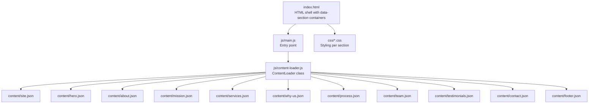
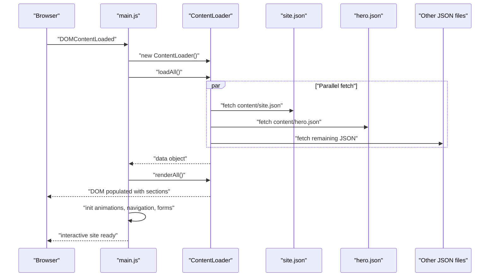
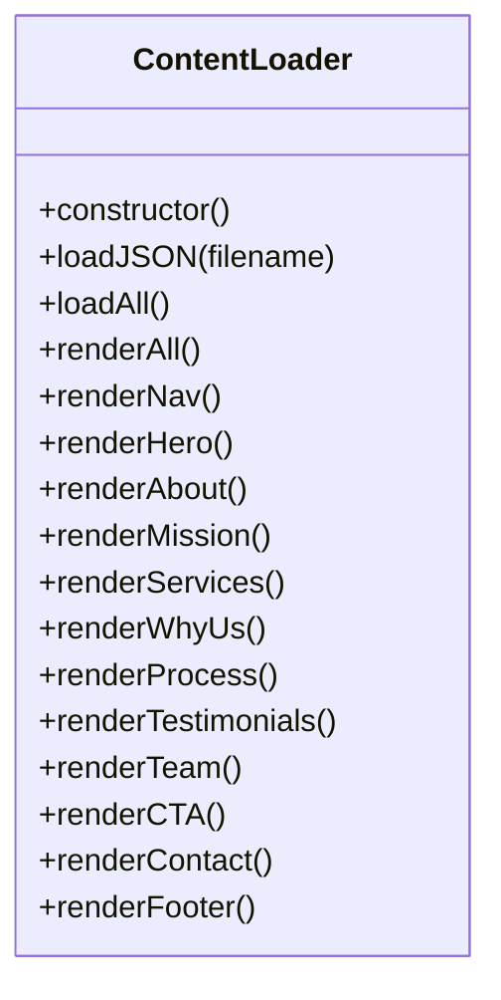
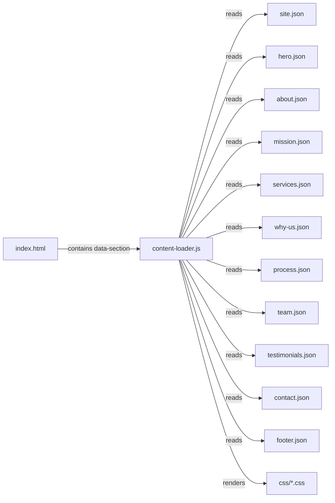

# Content Management System

<cite>
**Referenced Files in This Document**
- [index.html](file://index.html)
- [main.js](file://js/main.js)
- [content-loader.js](file://js/content-loader.js)
- [site.json](file://content/site.json)
- [hero.json](file://content/hero.json)
- [about.json](file://content/about.json)
- [mission.json](file://content/mission.json)
- [services.json](file://content/services.json)
- [why-us.json](file://content/why-us.json)
- [process.json](file://content/process.json)
- [team.json](file://content/team.json)
- [testimonials.json](file://content/testimonials.json)
- [contact.json](file://content/contact.json)
- [footer.json](file://content/footer.json)
- [hero.css](file://css/hero.css)
- [sections.css](file://css/sections.css)
</cite>

## Table of Contents
1. [Introduction](#introduction)
2. [Project Structure](#project-structure)
3. [Core Components](#core-components)
4. [Architecture Overview](#architecture-overview)
5. [Detailed Component Analysis](#detailed-component-analysis)
6. [Dependency Analysis](#dependency-analysis)
7. [Performance Considerations](#performance-considerations)
8. [Troubleshooting Guide](#troubleshooting-guide)
9. [Conclusion](#conclusion)
10. [Appendices](#appendices)

## Introduction
This document explains the JSON-based content management system used by the website. It covers how content is organized across multiple JSON files, how the ContentLoader module fetches and renders sections, and how templates are used to inject dynamic content into the DOM. It also provides content structure examples for each section, validation and formatting guidelines, and practical steps to modify or extend the system.

## Project Structure
The website is structured around a modular HTML shell and a set of JSON content files. The JavaScript module orchestrates loading and rendering via a single ContentLoader class. Styles are separated per section for maintainability.

**Diagram sources**
- [index.html:64-95](file://index.html#L64-L95)
- [main.js:11-37](file://js/main.js#L11-L37)
- [content-loader.js:18-37](file://js/content-loader.js#L18-L37)
- [site.json:1-18](file://content/site.json#L1-L18)
- [hero.json:1-34](file://content/hero.json#L1-L34)
- [about.json:1-30](file://content/about.json#L1-L30)
- [mission.json:1-25](file://content/mission.json#L1-L25)
- [services.json:1-82](file://content/services.json#L1-L82)
- [why-us.json:1-30](file://content/why-us.json#L1-L30)
- [process.json:1-30](file://content/process.json#L1-L30)
- [team.json:1-59](file://content/team.json#L1-L59)
- [testimonials.json:1-38](file://content/testimonials.json#L1-L38)
- [contact.json:1-48](file://content/contact.json#L1-L48)
- [footer.json:1-45](file://content/footer.json#L1-L45)

**Section sources**
- [index.html:1-106](file://index.html#L1-L106)
- [main.js:1-41](file://js/main.js#L1-L41)

## Core Components
- ContentLoader: Asynchronous JSON loader and renderer for all website sections. It fetches all content files in parallel, stores them, and renders each section into a DOM container identified by a data-section attribute.
- HTML Shell: Defines placeholders for each section using data-section attributes and includes static loader UI.
- Content Files: JSON documents under content/ that define the data for each section.
- Styles: CSS files under css/ that style each section independently.

Key responsibilities:
- Parallel fetching: loadAll uses Promise.all to fetch all JSON files concurrently.
- Template rendering: Each render* method builds innerHTML using template literals and iterates arrays (e.g., stats, services, testimonials).
- Dynamic injection: renderAll calls each render method in order to populate the DOM.

**Section sources**
- [content-loader.js:6-53](file://js/content-loader.js#L6-L53)
- [content-loader.js:18-37](file://js/content-loader.js#L18-L37)
- [content-loader.js:39-53](file://js/content-loader.js#L39-L53)
- [index.html:64-95](file://index.html#L64-L95)

## Architecture Overview
The initialization flow is straightforward: main.js constructs ContentLoader, loads all JSON, renders sections, and then initializes interactive features.

**Diagram sources**
- [main.js:11-37](file://js/main.js#L11-L37)
- [content-loader.js:18-53](file://js/content-loader.js#L18-L53)

## Detailed Component Analysis

### ContentLoader Class
The ContentLoader class encapsulates:
- loadJSON: Single-file fetch with error handling.
- loadAll: Concurrent fetch of all content files and storage in a data object.
- renderAll: Calls individual render methods in a fixed order.
- Individual render methods: renderNav, renderHero, renderAbout, renderMission, renderServices, renderWhyUs, renderProcess, renderTestimonials, renderTeam, renderCTA, renderContact, renderFooter.

**Diagram sources**
- [content-loader.js:6-443](file://js/content-loader.js#L6-L443)

**Section sources**
- [content-loader.js:6-443](file://js/content-loader.js#L6-L443)

### Content Sections and Templates

#### Site-wide metadata (site.json)
- Purpose: Brand identity, page title, copyright, and social links.
- Usage: renderNav reads brand logo and tagline; renderFooter reads brand description and social links; renderCTA reads CTA button.

Example structure highlights:
- brand.name, brand.nameAccent, brand.logo, brand.tagline
- pageTitle
- copyright
- social.{facebook, instagram, linkedin, tiktok, twitter}

**Section sources**
- [site.json:1-18](file://content/site.json#L1-L18)
- [content-loader.js:56-67](file://js/content-loader.js#L56-L67)
- [content-loader.js:408-441](file://js/content-loader.js#L408-L441)
- [content-loader.js:319-335](file://js/content-loader.js#L319-L335)

#### Hero (hero.json)
- Purpose: Hero headline with highlighted segments, badge, description, buttons, and statistics.
- Template fields: badge, headline, description, buttons[], stats[].

Rendering highlights:
- Headline split into before/highlight1/middle/highlight2 for styled spans.
- Buttons mapped to anchor elements with icons and styles.
- Stats mapped to counters with data attributes for animations.

**Section sources**
- [hero.json:1-34](file://content/hero.json#L1-L34)
- [content-loader.js:69-107](file://js/content-loader.js#L69-L107)
- [hero.css:1-128](file://css/hero.css#L1-L128)

#### About (about.json)
- Purpose: Header, image, feature card, heading, paragraphs, and feature list.
- Template fields: header, image, card, heading, paragraphs[], features[].

Rendering highlights:
- Responsive grid layout with image and complementary card.
- Feature items rendered as list entries.

**Section sources**
- [about.json:1-30](file://content/about.json#L1-L30)
- [content-loader.js:109-145](file://js/content-loader.js#L109-L145)
- [sections.css:1-100](file://css/sections.css#L1-L100)

#### Mission, Vision, Objective (mission.json)
- Purpose: Three cards with icon, title, and text.
- Template fields: header, cards[].

Rendering highlights:
- Grid layout for cards with hover effects.

**Section sources**
- [mission.json:1-25](file://content/mission.json#L1-L25)
- [content-loader.js:147-169](file://js/content-loader.js#L147-L169)
- [sections.css:101-171](file://css/sections.css#L101-L171)

#### Services (services.json)
- Purpose: Service cards with icon, title, description, and items list.
- Template fields: header, services[].

Rendering highlights:
- Grid layout for service cards with gradient overlays and hover animations.

**Section sources**
- [services.json:1-82](file://content/services.json#L1-L82)
- [content-loader.js:171-198](file://js/content-loader.js#L171-L198)
- [sections.css:172-261](file://css/sections.css#L172-L261)

#### Why Choose Us (why-us.json)
- Purpose: Reasons with icon, title, and text.
- Template fields: header, reasons[].

Rendering highlights:
- Four-column grid with animated hover effects.

**Section sources**
- [why-us.json:1-30](file://content/why-us.json#L1-L30)
- [content-loader.js:200-222](file://js/content-loader.js#L200-L222)
- [sections.css:262-318](file://css/sections.css#L262-L318)

#### Process (process.json)
- Purpose: Timeline steps with numbered circles and descriptions.
- Template fields: header, steps[].

Rendering highlights:
- Horizontal timeline with animated step number on hover.

**Section sources**
- [process.json:1-30](file://content/process.json#L1-L30)
- [content-loader.js:224-246](file://js/content-loader.js#L224-L246)
- [sections.css:319-394](file://css/sections.css#L319-L394)

#### Team (team.json)
- Purpose: Team members with initials, name, role, bio, and optional social links.
- Template fields: header, members[].

Rendering highlights:
- Grid of team cards with avatar initials and optional social links.

**Section sources**
- [team.json:1-59](file://content/team.json#L1-L59)
- [content-loader.js:288-316](file://js/content-loader.js#L288-L316)
- [sections.css:395-438](file://css/sections.css#L395-L438)

#### Testimonials (testimonials.json)
- Purpose: Customer testimonials with star ratings, quote, author, and initials.
- Template fields: header, testimonials[].

Rendering highlights:
- Slider effect achieved by duplicating testimonial cards.

**Section sources**
- [testimonials.json:1-38](file://content/testimonials.json#L1-L38)
- [content-loader.js:248-286](file://js/content-loader.js#L248-L286)

#### Contact (contact.json)
- Purpose: Contact info items, form fields, select, textarea, and submit button.
- Template fields: header, info, form.fields[], form.selectField, form.messageField, form.submitButton, form.successMessage.

Rendering highlights:
- Form groups split into half-width and full-width rows.
- Select dropdown and textarea included.
- Submit button carries a success message attribute.

**Section sources**
- [contact.json:1-48](file://content/contact.json#L1-L48)
- [content-loader.js:337-405](file://js/content-loader.js#L337-L405)

#### Footer (footer.json)
- Purpose: Call-to-action banner, brand description, and column links.
- Template fields: cta, brandDescription, columns[].

Rendering highlights:
- Footer grid with brand logo and multiple columns of links.

**Section sources**
- [footer.json:1-45](file://content/footer.json#L1-L45)
- [content-loader.js:407-441](file://js/content-loader.js#L407-L441)

### Template System and Dynamic Injection
- Template-based rendering: Each render method uses template literals to construct HTML and iterates arrays to produce repeated elements.
- Dynamic injection: renderAll populates containers whose selectors match data-section attributes in index.html.
- Icon and link consistency: Social icons and external links are driven by JSON fields to ensure uniformity.

**Section sources**
- [content-loader.js:39-53](file://js/content-loader.js#L39-L53)
- [index.html:64-95](file://index.html#L64-L95)

### Adding a New Content Section
Steps:
1. Define a new JSON file under content/ with a representative structure (e.g., header, body content).
2. Add a data-section container in index.html with a unique ID for the new section.
3. Extend ContentLoader with a new render method that targets the container and builds HTML from the JSON data.
4. Call the new render method inside renderAll in the appropriate order.
5. Add or reuse CSS under css/ to style the new section.

Example JSON outline (conceptual):
- header: { tag, title, description }
- body: [ ... ]

Then in ContentLoader:
- Add renderNewSection(): select container, iterate body[], and set innerHTML.
- Add loader.renderNewSection() to renderAll().

**Section sources**
- [index.html:64-95](file://index.html#L64-L95)
- [content-loader.js:39-53](file://js/content-loader.js#L39-L53)

## Dependency Analysis
The system exhibits a clean separation of concerns:
- HTML depends on data-section attributes to locate insertion points.
- ContentLoader depends on content/* JSON files and index.html containers.
- Styles depend on class names generated by ContentLoader’s templates.

**Diagram sources**
- [index.html:64-95](file://index.html#L64-L95)
- [content-loader.js:18-37](file://js/content-loader.js#L18-L37)
- [hero.css:1-128](file://css/hero.css#L1-L128)
- [sections.css:1-438](file://css/sections.css#L1-L438)

**Section sources**
- [index.html:64-95](file://index.html#L64-L95)
- [content-loader.js:18-37](file://js/content-loader.js#L18-L37)

## Performance Considerations
- Parallel fetching: loadAll uses Promise.all to minimize total load time.
- Minimal DOM writes: Each render method replaces container innerHTML once per section.
- Static loader: index.html includes a loader UI shown until initialization completes.
- CSS-driven animations: Animations and hover effects are handled via CSS to reduce JavaScript overhead.

Recommendations:
- Keep JSON files small and focused.
- Prefer lazy-loading heavy images in content/* where applicable.
- Monitor network requests during loadAll to avoid exceeding browser limits.

**Section sources**
- [content-loader.js:18-37](file://js/content-loader.js#L18-L37)
- [index.html:37-44](file://index.html#L37-L44)
- [main.js:28-36](file://js/main.js#L28-L36)

## Troubleshooting Guide
Common issues and resolutions:
- Section not appearing:
  - Verify the data-section attribute exists in index.html for the section.
  - Confirm the corresponding render method is called in renderAll.
- Missing images or icons:
  - Ensure image paths in JSON are correct and accessible.
  - Confirm Font Awesome is loaded in index.html.
- Form not submitting:
  - Check that form fields in contact.json match the expected labels and types.
  - Ensure the form handler script is initialized after renderContact.

Validation tips:
- Validate JSON syntax for all content/* files.
- Ensure required keys exist (e.g., header.tag/title/description, arrays like services[], testimonials[]).
- Keep icon classes consistent with Font Awesome CDN.

**Section sources**
- [index.html:16-20](file://index.html#L16-L20)
- [content-loader.js:337-405](file://js/content-loader.js#L337-L405)

## Conclusion
The JSON-based content management system cleanly separates content from presentation. ContentLoader centralizes fetching and rendering, enabling easy updates and extensibility. By following the outlined structure and guidelines, teams can confidently manage content, add new sections, and maintain consistency across the site.

## Appendices

### Content Structure Reference

- site.json
  - Keys: brand, pageTitle, copyright, social
  - Usage: Branding, navigation, footer, and CTA

- hero.json
  - Keys: badge, headline, description, buttons[], stats[]
  - Rendering: Headline split, buttons, stats counters

- about.json
  - Keys: header, image, card, heading, paragraphs[], features[]
  - Rendering: Image + text grid, feature list

- mission.json
  - Keys: header, cards[]
  - Rendering: Three-column card grid

- services.json
  - Keys: header, services[]
  - Rendering: Service cards with icon, items list

- why-us.json
  - Keys: header, reasons[]
  - Rendering: Four-column reasons grid

- process.json
  - Keys: header, steps[]
  - Rendering: Timeline with numbered steps

- team.json
  - Keys: header, members[]
  - Rendering: Team cards with social links

- testimonials.json
  - Keys: header, testimonials[]
  - Rendering: Slider with duplicated testimonials

- contact.json
  - Keys: header, info, form
  - Rendering: Contact info, form fields, select, textarea, submit

- footer.json
  - Keys: cta, brandDescription, columns[]
  - Rendering: Footer grid with columns and social links

**Section sources**
- [site.json:1-18](file://content/site.json#L1-L18)
- [hero.json:1-34](file://content/hero.json#L1-L34)
- [about.json:1-30](file://content/about.json#L1-L30)
- [mission.json:1-25](file://content/mission.json#L1-L25)
- [services.json:1-82](file://content/services.json#L1-L82)
- [why-us.json:1-30](file://content/why-us.json#L1-L30)
- [process.json:1-30](file://content/process.json#L1-L30)
- [team.json:1-59](file://content/team.json#L1-L59)
- [testimonials.json:1-38](file://content/testimonials.json#L1-L38)
- [contact.json:1-48](file://content/contact.json#L1-L48)
- [footer.json:1-45](file://content/footer.json#L1-L45)

### Practical Examples

- Modifying hero content
  - Change headline segments, add/remove buttons, adjust stats targets and labels.
  - Update hero.json and refresh the page to reflect changes.

- Updating services
  - Add or remove service items, change icons, update item lists.
  - Update services.json and confirm the grid layout remains intact.

- Editing testimonials
  - Add new testimonials with stars, text, author, title, and initials.
  - The slider duplicates cards automatically.

- Changing contact form
  - Add/remove form fields, update select options, adjust labels and placeholders.
  - Ensure required flags and field types remain valid.

- Extending with a new section
  - Create a new JSON file under content/.
  - Add a data-section container in index.html.
  - Implement a render method in ContentLoader and include it in renderAll.
  - Add CSS under css/ to style the new section.

**Section sources**
- [hero.json:1-34](file://content/hero.json#L1-L34)
- [services.json:1-82](file://content/services.json#L1-L82)
- [testimonials.json:1-38](file://content/testimonials.json#L1-L38)
- [contact.json:1-48](file://content/contact.json#L1-L48)
- [index.html:64-95](file://index.html#L64-L95)
- [content-loader.js:39-53](file://js/content-loader.js#L39-L53)