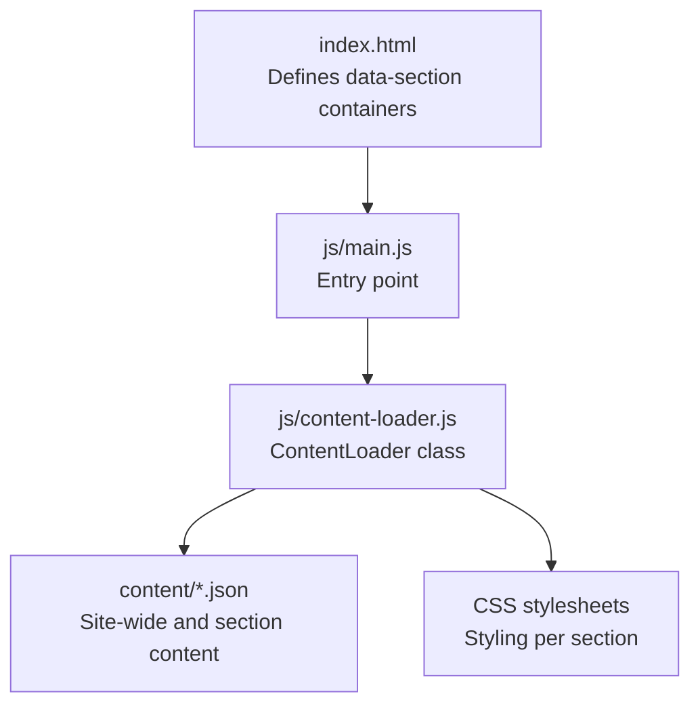
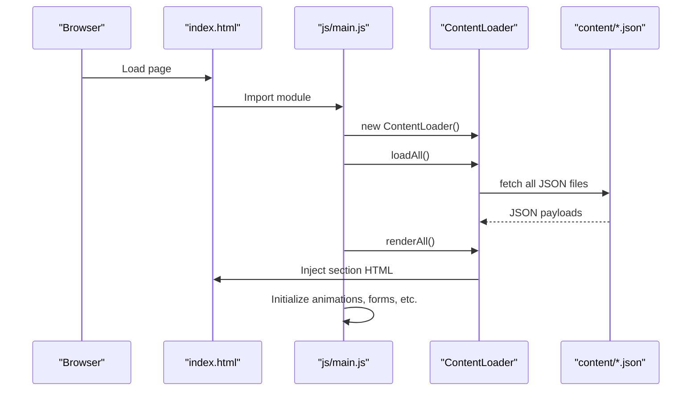
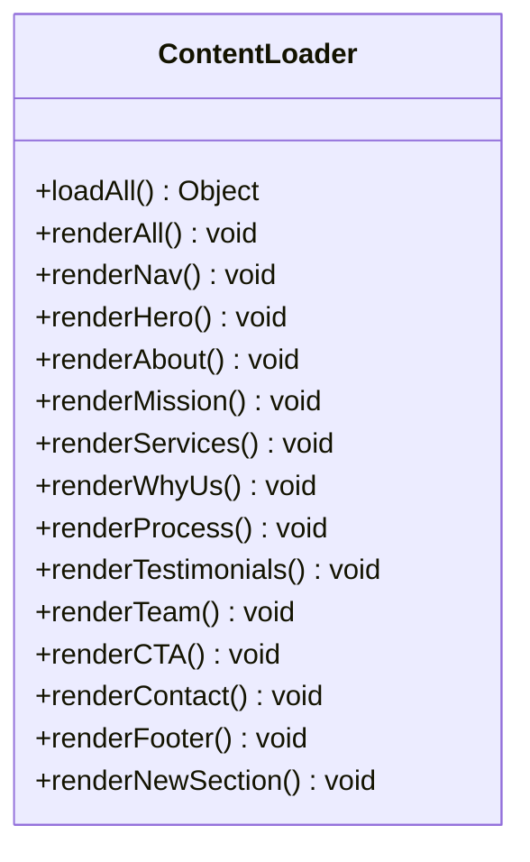
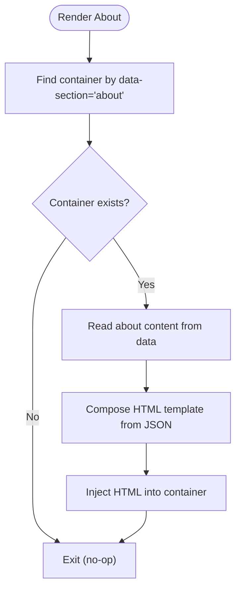
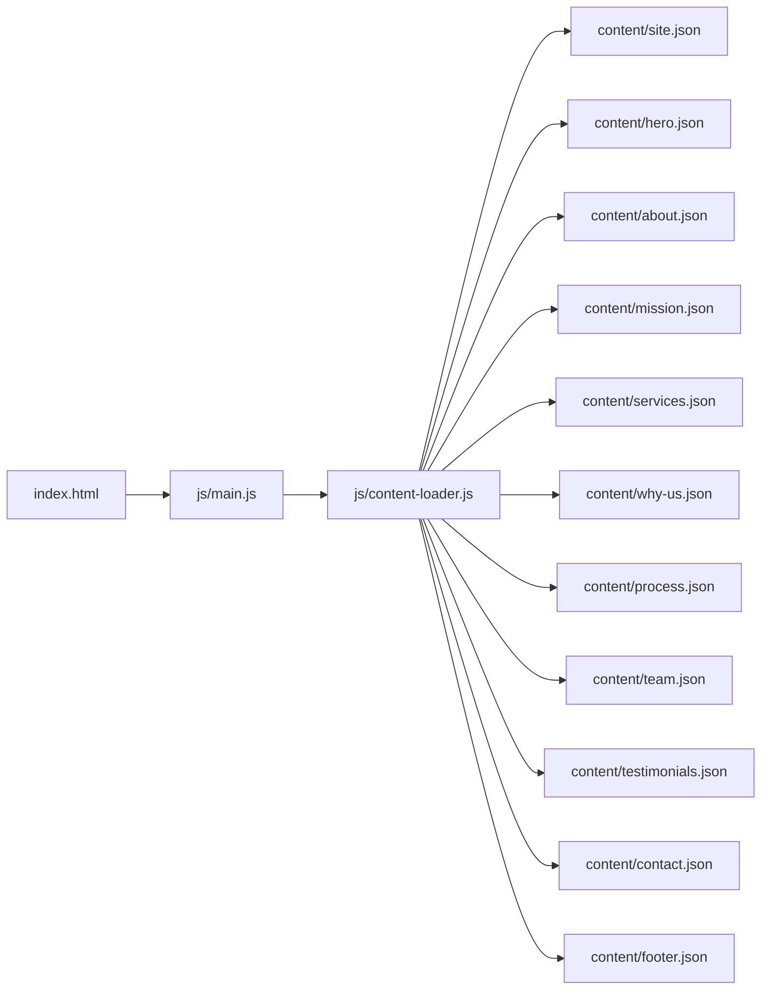

# Content Update Procedures

<cite>
**Referenced Files in This Document**
- [index.html](file://index.html)
- [main.js](file://js/main.js)
- [content-loader.js](file://js/content-loader.js)
- [site.json](file://content/site.json)
- [hero.json](file://content/hero.json)
- [about.json](file://content/about.json)
- [mission.json](file://content/mission.json)
- [services.json](file://content/services.json)
- [why-us.json](file://content/why-us.json)
- [process.json](file://content/process.json)
- [team.json](file://content/team.json)
- [testimonials.json](file://content/testimonials.json)
- [contact.json](file://content/contact.json)
- [footer.json](file://content/footer.json)
</cite>

## Table of Contents
1. [Introduction](#introduction)
2. [Project Structure](#project-structure)
3. [Core Components](#core-components)
4. [Architecture Overview](#architecture-overview)
5. [Detailed Component Analysis](#detailed-component-analysis)
6. [Dependency Analysis](#dependency-analysis)
7. [Performance Considerations](#performance-considerations)
8. [Troubleshooting Guide](#troubleshooting-guide)
9. [Conclusion](#conclusion)
10. [Appendices](#appendices)

## Introduction
This document provides end-to-end guidance for updating and managing content across the Victory Marketing website. It explains how to safely modify JSON content files, validate updates, preview changes locally, deploy to staging, and extend the system with new content sections. It also covers best practices for content authoring, versioning, rollback, and security considerations.

## Project Structure
The website is a static single-page application with modular JavaScript and centralized content stored in JSON files under the content directory. Sections are rendered via the ContentLoader class, which fetches all JSON files and injects HTML into containers identified by data attributes in the HTML.

**Diagram sources**
- [index.html:64-95](file://index.html#L64-L95)
- [main.js:11-37](file://js/main.js#L11-L37)
- [content-loader.js:6-53](file://js/content-loader.js#L6-L53)

**Section sources**
- [index.html:1-106](file://index.html#L1-L106)
- [main.js:1-41](file://js/main.js#L1-L41)
- [content-loader.js:1-443](file://js/content-loader.js#L1-L443)

## Core Components
- ContentLoader: Asynchronous JSON loader and renderer for all website sections. It defines render methods for each section and orchestrates parallel loading of content files.
- HTML Sections: Each section is a container with a data-section attribute that matches a render method name.
- JSON Content: Structured content files for site metadata, hero, about, mission, services, why-us, process, team, testimonials, contact, and footer.

Key responsibilities:
- Parallel loading of all JSON content for performance.
- Safe DOM insertion using innerHTML templating.
- Initialization of interactive features after content is rendered.

**Section sources**
- [content-loader.js:6-53](file://js/content-loader.js#L6-L53)
- [content-loader.js:109-145](file://js/content-loader.js#L109-L145)
- [content-loader.js:171-198](file://js/content-loader.js#L171-L198)
- [index.html:64-95](file://index.html#L64-L95)

## Architecture Overview
The runtime flow is straightforward: the browser loads index.html, which includes js/main.js. The main module instantiates ContentLoader, loads all JSON content in parallel, renders sections into the DOM, and initializes interactive features.

**Diagram sources**
- [main.js:11-37](file://js/main.js#L11-L37)
- [content-loader.js:18-53](file://js/content-loader.js#L18-L53)
- [index.html:64-95](file://index.html#L64-L95)

## Detailed Component Analysis

### Updating Existing Content in JSON Files
Step-by-step process:
1. Backup current JSON files
   - Make a copy of the modified file(s) before editing. Keep the original for rollback.
2. Edit the appropriate JSON file
   - Use a JSON-aware editor to avoid syntax errors.
3. Validate JSON syntax
   - Many editors highlight syntax errors immediately. Alternatively, paste the file into an online JSON validator.
4. Preview locally
   - Open index.html in a local server (e.g., Python’s http.server, Live Server extension, or a static server) to verify rendering.
5. Run validation checks
   - Confirm that all images and links resolve.
   - Ensure interactive elements (forms, buttons) appear and behave as expected.
6. Deploy to staging
   - Commit changes to a staging branch and deploy to a preview URL.
7. Review and approve
   - Have stakeholders review the staged changes.
8. Merge to production
   - Merge approved changes to the production branch and redeploy.

Validation checklist:
- Required keys present and correctly typed (strings, arrays, nested objects).
- Image URLs or local asset paths are valid.
- Social links and CTAs point to correct destinations.
- Buttons and form fields render properly.

**Section sources**
- [main.js:11-37](file://js/main.js#L11-L37)
- [content-loader.js:18-53](file://js/content-loader.js#L18-L53)

### Best Practices for Content Authoring
- Character limits
  - Headlines and section titles: keep concise for readability and responsiveness.
  - Paragraphs: aim for ~1–2 short paragraphs per section; avoid dense blocks.
  - Feature lists and service items: limit to 5–7 bullet points per card.
- Formatting guidelines
  - Use sentence-style capitalization for headings; lowercase minor words except proper nouns.
  - Keep paragraphs under 120 words for readability.
  - Use consistent spacing and punctuation.
- Image asset requirements
  - Prefer modern formats (webp/jpg) with optimized compression.
  - Ensure alt texts describe purpose and context.
  - Local assets: place under assets/images and reference with relative paths.
  - External images: verify HTTPS and fast CDN delivery.
- Accessibility
  - Ensure sufficient color contrast and readable font sizes.
  - Provide meaningful alt texts for images.
- Consistency
  - Maintain consistent icon usage and terminology across sections.
  - Align branding elements (colors, fonts) with site.json.

**Section sources**
- [site.json:1-18](file://content/site.json#L1-L18)
- [hero.json:1-34](file://content/hero.json#L1-L34)
- [about.json:1-30](file://content/about.json#L1-L30)
- [services.json:1-82](file://content/services.json#L1-L82)
- [team.json:1-59](file://content/team.json#L1-L59)
- [testimonials.json:1-38](file://content/testimonials.json#L1-L38)
- [contact.json:1-48](file://content/contact.json#L1-L48)
- [footer.json:1-45](file://content/footer.json#L1-L45)

### Content Preview and Testing Workflow
- Local development verification
  - Serve index.html via a local static server.
  - Verify each section appears with correct content and styling.
  - Test navigation, contact form submission, and interactive elements.
- Staging deployment
  - Push changes to a staging branch.
  - Deploy to a preview URL and share with stakeholders.
  - Validate on multiple devices and browsers.
- Post-deployment checks
  - Confirm images load and links are functional.
  - Verify analytics and tracking pixels if applicable.

**Section sources**
- [main.js:11-37](file://js/main.js#L11-L37)
- [index.html:35-104](file://index.html#L35-L104)

### Adding New Content Sections
To add a new section:
1. Extend the ContentLoader class
   - Add a new render method named after the new section (e.g., renderNewSection).
   - Implement DOM insertion using the data-section selector pattern.
2. Create a new JSON file
   - Place the file under content/new-section.json with a schema matching the render method’s expectations.
3. Add a container in index.html
   - Insert a section element with data-section="new-section".
4. Wire up rendering
   - Call the new render method in renderAll or add it to the initialization sequence.
5. Style the section
   - Add or reuse CSS under css/ for layout and typography.
6. Validate and test
   - Preview locally, test responsiveness, and verify interactivity.

**Diagram sources**
- [content-loader.js:6-53](file://js/content-loader.js#L6-L53)
- [content-loader.js:109-145](file://js/content-loader.js#L109-L145)
- [content-loader.js:171-198](file://js/content-loader.js#L171-L198)

**Section sources**
- [content-loader.js:6-53](file://js/content-loader.js#L6-L53)
- [index.html:64-95](file://index.html#L64-L95)

### Rendering Logic Flow (Example: About Section)

**Diagram sources**
- [content-loader.js:109-145](file://js/content-loader.js#L109-L145)
- [index.html:68](file://index.html#L68)

**Section sources**
- [content-loader.js:109-145](file://js/content-loader.js#L109-L145)
- [index.html:68](file://index.html#L68)

## Dependency Analysis
- HTML depends on ContentLoader for dynamic content injection.
- ContentLoader depends on:
  - index.html containers (data-section attributes).
  - content/*.json files for data.
  - CSS files for styling.
- main.js orchestrates initialization and error handling.

**Diagram sources**
- [index.html:64-95](file://index.html#L64-L95)
- [main.js:11-37](file://js/main.js#L11-L37)
- [content-loader.js:18-37](file://js/content-loader.js#L18-L37)

**Section sources**
- [index.html:64-95](file://index.html#L64-L95)
- [main.js:11-37](file://js/main.js#L11-L37)
- [content-loader.js:18-37](file://js/content-loader.js#L18-L37)

## Performance Considerations
- Parallel loading: ContentLoader fetches all JSON files concurrently to minimize load time.
- Lightweight templating: innerHTML templates are efficient for static content.
- Asset optimization: Compress images and leverage CDNs for external assets.
- Minimize DOM writes: Batch rendering by calling renderAll once after data load.

[No sources needed since this section provides general guidance]

## Troubleshooting Guide
Common issues and resolutions:
- JSON syntax errors
  - Symptom: Console error indicating invalid JSON.
  - Action: Validate JSON using a linter or online validator; fix syntax and retry.
- Missing assets (images, logos)
  - Symptom: Broken images or blank alt placeholders.
  - Action: Verify asset paths; ensure assets are uploaded and accessible; use HTTPS URLs.
- Rendering problems (empty sections)
  - Symptom: Blank or missing section content.
  - Action: Confirm data-section attribute matches the render method; ensure loadAll completes; check for thrown exceptions.
- Navigation or branding mismatch
  - Symptom: Incorrect logo or brand text.
  - Action: Verify site.json brand fields and confirm renderNav is called.
- Form not submitting
  - Symptom: No visible submission feedback.
  - Action: Ensure form fields match contact.json schema; verify form initialization script.

**Section sources**
- [main.js:28-36](file://js/main.js#L28-L36)
- [content-loader.js:56-67](file://js/content-loader.js#L56-L67)
- [content-loader.js:337-405](file://js/content-loader.js#L337-L405)

## Conclusion
Updating content on the Victory Marketing website is a straightforward, repeatable process centered around JSON files and the ContentLoader class. By following the backup, validation, preview, and deployment steps outlined here, you can confidently manage content while maintaining quality and consistency. Extending the system with new sections follows a clear pattern: add a render method, create a JSON file, insert a container, and wire up rendering.

[No sources needed since this section summarizes without analyzing specific files]

## Appendices

### Appendix A: Content Schema Reference
- site.json: brand metadata, page title, copyright, and social links.
- hero.json: headline fragments, badge, description, buttons, and stats.
- about.json: header, image, feature card, heading, paragraphs, and features.
- mission.json: header and mission/vision/objective cards.
- services.json: header and service cards with icons, titles, descriptions, and items.
- why-us.json: header and reasons with icons, titles, and descriptions.
- process.json: header and numbered steps.
- team.json: header and team member entries with initials, names, roles, bios, and social links.
- testimonials.json: header and testimonials with star ratings, quotes, authors, and initials.
- contact.json: header, contact info items, form fields, select options, message field, submit button, and success message.

**Section sources**
- [site.json:1-18](file://content/site.json#L1-L18)
- [hero.json:1-34](file://content/hero.json#L1-L34)
- [about.json:1-30](file://content/about.json#L1-L30)
- [mission.json:1-25](file://content/mission.json#L1-L25)
- [services.json:1-82](file://content/services.json#L1-L82)
- [why-us.json:1-30](file://content/why-us.json#L1-L30)
- [process.json:1-30](file://content/process.json#L1-L30)
- [team.json:1-59](file://content/team.json#L1-L59)
- [testimonials.json:1-38](file://content/testimonials.json#L1-L38)
- [contact.json:1-48](file://content/contact.json#L1-L48)
- [footer.json:1-45](file://content/footer.json#L1-L45)

### Appendix B: Versioning and Rollback Guidelines
- Versioning
  - Tag releases with semantic versioning (e.g., v1.2.3).
  - Group related content updates in commits with descriptive messages.
- Rollback procedure
  - Revert to the previous commit or tag.
  - Redeploy the prior working version.
  - Notify stakeholders and investigate root cause post-incident.
- Multi-editor coordination
  - Use a shared staging branch for reviews.
  - Assign ownership of sections to specific editors.
  - Maintain a changelog of recent updates.

[No sources needed since this section provides general guidance]

### Appendix C: Security and Access Control
- Limit write access to content files to trusted editors.
- Store sensitive data (e.g., analytics IDs) outside public content JSON when possible.
- Enforce HTTPS and secure asset hosting.
- Sanitize user-generated content in forms (handled by the contact form script).
- Monitor deployments and maintain audit logs of who made changes and when.

[No sources needed since this section provides general guidance]