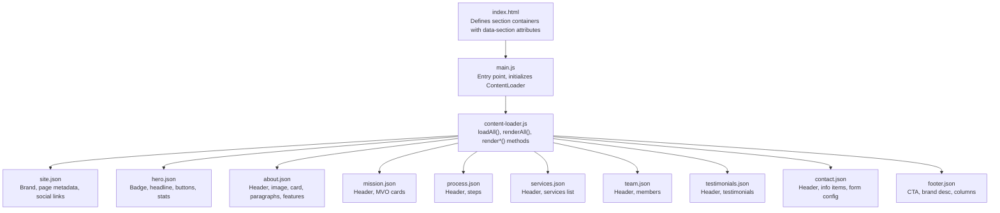
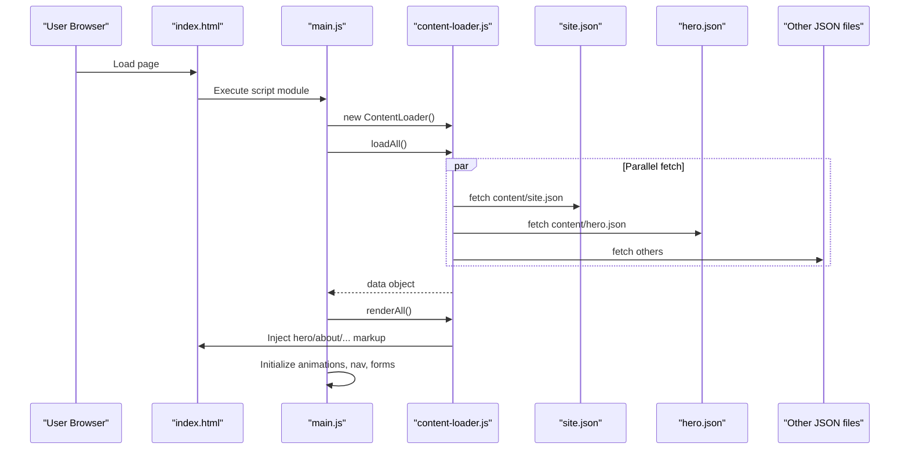
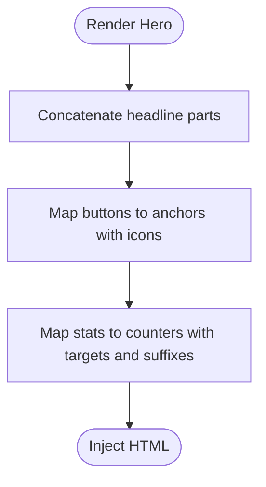
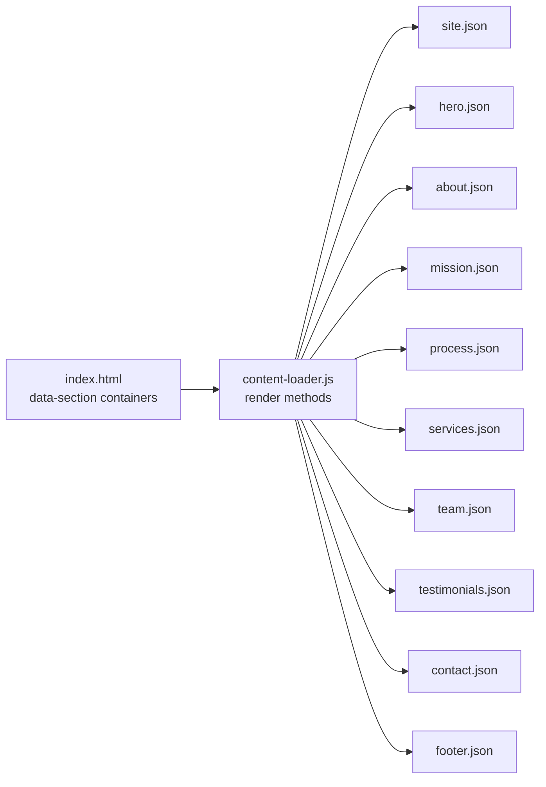

# JSON Content Structure

<cite>
**Referenced Files in This Document**
- [index.html](file://index.html)
- [main.js](file://js/main.js)
- [content-loader.js](file://js/content-loader.js)
- [site.json](file://content/site.json)
- [hero.json](file://content/hero.json)
- [about.json](file://content/about.json)
- [mission.json](file://content/mission.json)
- [process.json](file://content/process.json)
- [services.json](file://content/services.json)
- [team.json](file://content/team.json)
- [testimonials.json](file://content/testimonials.json)
- [contact.json](file://content/contact.json)
- [footer.json](file://content/footer.json)
</cite>

## Table of Contents
1. [Introduction](#introduction)
2. [Project Structure](#project-structure)
3. [Core Components](#core-components)
4. [Architecture Overview](#architecture-overview)
5. [Detailed Component Analysis](#detailed-component-analysis)
6. [Dependency Analysis](#dependency-analysis)
7. [Performance Considerations](#performance-considerations)
8. [Troubleshooting Guide](#troubleshooting-guide)
9. [Conclusion](#conclusion)
10. [Appendices](#appendices)

## Introduction
This document explains the JSON content structure used across the Victory Marketing website. It describes the organization and naming conventions of each content JSON file, documents the data models and field requirements for each section, and clarifies how each field maps to the rendered HTML via the content loader. It also provides guidelines for maintaining consistency and best practices for content authoring.

## Project Structure
The website is structured around static HTML pages and modular JavaScript. Content is authored in JSON files under the content directory and dynamically loaded and rendered by the content loader module. The main page defines placeholders for each section using a data-section attribute, and the content loader injects the appropriate HTML into each section container.

**Diagram sources**
- [index.html:64-95](file://index.html#L64-L95)
- [main.js:11-37](file://js/main.js#L11-L37)
- [content-loader.js:18-53](file://js/content-loader.js#L18-L53)
- [site.json:1-18](file://content/site.json#L1-L18)
- [hero.json:1-34](file://content/hero.json#L1-L34)
- [about.json:1-30](file://content/about.json#L1-L30)
- [mission.json:1-25](file://content/mission.json#L1-L25)
- [process.json:1-30](file://content/process.json#L1-L30)
- [services.json:1-82](file://content/services.json#L1-L82)
- [team.json:1-59](file://content/team.json#L1-L59)
- [testimonials.json:1-38](file://content/testimonials.json#L1-L38)
- [contact.json:1-48](file://content/contact.json#L1-L48)
- [footer.json:1-45](file://content/footer.json#L1-L45)

**Section sources**
- [index.html:1-106](file://index.html#L1-L106)
- [main.js:1-41](file://js/main.js#L1-L41)
- [content-loader.js:1-443](file://js/content-loader.js#L1-L443)

## Core Components
This section outlines the naming convention and purpose of each content JSON file, along with the primary data model shapes and field requirements.

- site.json
  - Purpose: Site-wide branding, page metadata, and social links.
  - Fields:
    - brand: name (string), nameAccent (string), logo (string), tagline (string)
    - pageTitle (string)
    - copyright (string)
    - social: facebook (string), instagram (string), linkedin (string), tiktok (string), twitter (string)
  - Notes: Used by navigation and footer rendering.

- hero.json
  - Purpose: Hero section headline, badge, description, buttons, and statistics.
  - Fields:
    - badge: icon (string), text (string)
    - headline: before (string), highlight1 (string), middle (string), highlight2 (string)
    - description (string)
    - buttons: array of objects with label (string), icon (string), link (string), style (string)
    - stats: array of objects with target (number), label (string), suffix (string)
  - Notes: Headline parts are concatenated to produce the formatted headline.

- about.json
  - Purpose: About section header, image, highlighted card, heading, paragraphs, and features list.
  - Fields:
    - header: tag (string), title (string), description (string)
    - image: src (string), alt (string)
    - card: icon (string), title (string), text (string)
    - heading (string)
    - paragraphs: array of strings
    - features: array of strings

- mission.json
  - Purpose: Mission, Vision, Objective cards.
  - Fields:
    - header: tag (string), title (string), description (string)
    - cards: array of objects with icon (string), title (string), text (string)

- process.json
  - Purpose: Four-step process timeline.
  - Fields:
    - header: tag (string), title (string), description (string)
    - steps: array of objects with number (string), title (string), text (string)

- services.json
  - Purpose: Services grid with icons, titles, descriptions, and feature lists.
  - Fields:
    - header: tag (string), title (string), description (string)
    - services: array of objects with icon (string), title (string), description (string), items (array of strings)

- team.json
  - Purpose: Team member profiles with social links.
  - Fields:
    - header: tag (string), title (string), description (string)
    - members: array of objects with initials (string), name (string), role (string), bio (string), social: linkedin (string), twitter (string), instagram (string)

- testimonials.json
  - Purpose: Client testimonials with star ratings.
  - Fields:
    - header: tag (string), title (string), description (string)
    - testimonials: array of objects with stars (integer), text (string), author (string), title (string), initials (string)

- contact.json
  - Purpose: Contact section header, contact info items, and form configuration.
  - Fields:
    - header: tag (string), title (string), description (string)
    - info: heading (string), description (string), items: array of objects with icon (string), label (string), value (string)
    - form: fields (array of objects with name (string), label (string), type (string), placeholder (string), required (boolean), half (boolean)); selectField: label (string), placeholder (string), options (array of strings); messageField: label (string), placeholder (string); submitButton: icon (string), label (string); successMessage (string)

- footer.json
  - Purpose: Footer call-to-action, brand description, and columnized links.
  - Fields:
    - cta: heading (string), description (string), button: icon (string), label (string), link (string)
    - brandDescription (string)
    - columns: array of objects with title (string), links: array of objects with label (string), href (string)

**Section sources**
- [site.json:1-18](file://content/site.json#L1-L18)
- [hero.json:1-34](file://content/hero.json#L1-L34)
- [about.json:1-30](file://content/about.json#L1-L30)
- [mission.json:1-25](file://content/mission.json#L1-L25)
- [process.json:1-30](file://content/process.json#L1-L30)
- [services.json:1-82](file://content/services.json#L1-L82)
- [team.json:1-59](file://content/team.json#L1-L59)
- [testimonials.json:1-38](file://content/testimonials.json#L1-L38)
- [contact.json:1-48](file://content/contact.json#L1-L48)
- [footer.json:1-45](file://content/footer.json#L1-L45)

## Architecture Overview
The runtime architecture ties the HTML template to the content loader and JSON data. The main entry point initializes the content loader, which fetches all JSON files in parallel, stores the data, and renders each section into its container. Rendering methods map JSON fields to HTML elements and attributes.

**Diagram sources**
- [index.html:64-95](file://index.html#L64-L95)
- [main.js:11-37](file://js/main.js#L11-L37)
- [content-loader.js:18-53](file://js/content-loader.js#L18-L53)
- [site.json:1-18](file://content/site.json#L1-L18)
- [hero.json:1-34](file://content/hero.json#L1-L34)

**Section sources**
- [index.html:1-106](file://index.html#L1-L106)
- [main.js:1-41](file://js/main.js#L1-L41)
- [content-loader.js:1-443](file://js/content-loader.js#L1-L443)

## Detailed Component Analysis

### Site Configuration (site.json)
- Data model
  - brand: name (string), nameAccent (string), logo (string), tagline (string)
  - pageTitle (string)
  - copyright (string)
  - social: facebook (string), instagram (string), linkedin (string), tiktok (string), twitter (string)
- Rendering mapping
  - Navigation logo image and text are set from brand fields.
  - Footer bottom copyright text and social links are populated from site data.
- Best practices
  - Keep logo path absolute or relative to the deployed base URL.
  - Use consistent social URLs; placeholders are acceptable during development.

**Section sources**
- [site.json:1-18](file://content/site.json#L1-L18)
- [content-loader.js:55-67](file://js/content-loader.js#L55-L67)
- [content-loader.js:407-441](file://js/content-loader.js#L407-L441)

### Hero Content (hero.json)
- Data model
  - badge: icon (string), text (string)
  - headline: before (string), highlight1 (string), middle (string), highlight2 (string)
  - description (string)
  - buttons: array of objects with label (string), icon (string), link (string), style (string)
  - stats: array of objects with target (number), label (string), suffix (string)
- Rendering mapping
  - Headline concatenates before + highlight1 + middle + highlight2 with highlight spans.
  - Buttons are rendered as anchor elements with icon and label.
  - Stats render numeric counters with optional suffix.
- Formatting guidelines
  - Use Font Awesome class names for icons.
  - Style values should match CSS classes (e.g., btn-primary, btn-outline).
  - Suffix supports empty string or "+" for display.

**Diagram sources**
- [content-loader.js:69-107](file://js/content-loader.js#L69-L107)
- [hero.json:1-34](file://content/hero.json#L1-L34)

**Section sources**
- [hero.json:1-34](file://content/hero.json#L1-L34)
- [content-loader.js:69-107](file://js/content-loader.js#L69-L107)

### Services (services.json)
- Data model
  - header: tag (string), title (string), description (string)
  - services: array of objects with icon (string), title (string), description (string), items (array of strings)
- Rendering mapping
  - Header is injected into the section header.
  - Each service becomes a card with icon, title, description, and bullet list of items.
- Best practices
  - Keep item lists concise and scannable.
  - Use consistent icon libraries and class names.

**Section sources**
- [services.json:1-82](file://content/services.json#L1-L82)
- [content-loader.js:171-198](file://js/content-loader.js#L171-L198)

### Team (team.json)
- Data model
  - header: tag (string), title (string), description (string)
  - members: array of objects with initials (string), name (string), role (string), bio (string), social: linkedin (string), twitter (string), instagram (string)
- Rendering mapping
  - Member cards show avatar initials, name, role, bio, and visible social links.
- Best practices
  - Provide initials when social links are missing to avoid broken links.

**Section sources**
- [team.json:1-59](file://content/team.json#L1-L59)
- [content-loader.js:288-316](file://js/content-loader.js#L288-L316)

### Testimonials (testimonials.json)
- Data model
  - header: tag (string), title (string), description (string)
  - testimonials: array of objects with stars (integer), text (string), author (string), title (string), initials (string)
- Rendering mapping
  - Stars are rendered as filled icons.
  - Testimonial text is quoted in the UI.
  - Avatar initials are shown alongside author info.
  - Cards are duplicated for continuous scrolling.
- Best practices
  - Use integer star counts within expected range.
  - Keep testimonials concise and impactful.

**Section sources**
- [testimonials.json:1-38](file://content/testimonials.json#L1-L38)
- [content-loader.js:248-286](file://js/content-loader.js#L248-L286)

### Contact (contact.json)
- Data model
  - header: tag (string), title (string), description (string)
  - info: heading (string), description (string), items: array of objects with icon (string), label (string), value (string)
  - form: fields (array of objects with name (string), label (string), type (string), placeholder (string), required (boolean), half (boolean)); selectField: label (string), placeholder (string), options (array of strings); messageField: label (string), placeholder (string); submitButton: icon (string), label (string); successMessage (string)
- Rendering mapping
  - Contact info items render as labeled rows with icons.
  - Form fields are split into half-width and full-width groups.
  - Select dropdown is populated from options.
  - Submit button displays success message on click.
- Best practices
  - Mark required fields explicitly.
  - Use consistent form field types (text, email, tel).
  - Keep success message short and encouraging.

**Section sources**
- [contact.json:1-48](file://content/contact.json#L1-L48)
- [content-loader.js:337-405](file://js/content-loader.js#L337-L405)

### Footer (footer.json)
- Data model
  - cta: heading (string), description (string), button: icon (string), label (string), link (string)
  - brandDescription (string)
  - columns: array of objects with title (string), links: array of objects with label (string), href (string)
- Rendering mapping
  - Footer brand area uses site brand logo and description.
  - Columns render as navigable lists.
  - Social links mirror site-level social entries.
- Best practices
  - Keep column titles descriptive and link labels clear.
  - Ensure all external links open appropriately.

**Section sources**
- [footer.json:1-45](file://content/footer.json#L1-L45)
- [content-loader.js:407-441](file://js/content-loader.js#L407-L441)

### About Section (about.json)
- Data model
  - header: tag (string), title (string), description (string)
  - image: src (string), alt (string)
  - card: icon (string), title (string), text (string)
  - heading (string)
  - paragraphs: array of strings
  - features: array of strings
- Rendering mapping
  - Grid layout shows image and highlighted card side-by-side.
  - Paragraphs and features render as blocks of text and checklist items.
- Best practices
  - Use descriptive alt text for accessibility.
  - Keep feature bullets short and actionable.

**Section sources**
- [about.json:1-30](file://content/about.json#L1-L30)
- [content-loader.js:109-145](file://js/content-loader.js#L109-L145)

### Mission, Vision, Objective (mission.json)
- Data model
  - header: tag (string), title (string), description (string)
  - cards: array of objects with icon (string), title (string), text (string)
- Rendering mapping
  - Three-column grid displays MVO cards with icons, titles, and descriptions.
- Best practices
  - Align card content with corporate messaging.

**Section sources**
- [mission.json:1-25](file://content/mission.json#L1-L25)
- [content-loader.js:147-169](file://js/content-loader.js#L147-L169)

### Process (process.json)
- Data model
  - header: tag (string), title (string), description (string)
  - steps: array of objects with number (string), title (string), text (string)
- Rendering mapping
  - Timeline layout shows numbered steps with titles and descriptions.
- Best practices
  - Keep step numbers consistent and sequential.

**Section sources**
- [process.json:1-30](file://content/process.json#L1-L30)
- [content-loader.js:224-246](file://js/content-loader.js#L224-L246)

## Dependency Analysis
The content loader orchestrates fetching and rendering. It depends on:
- index.html section containers with data-section attributes.
- Each JSON file’s schema for rendering the corresponding section.
- CSS stylesheets for visual presentation.

**Diagram sources**
- [index.html:64-95](file://index.html#L64-L95)
- [content-loader.js:39-53](file://js/content-loader.js#L39-L53)
- [site.json:1-18](file://content/site.json#L1-L18)
- [hero.json:1-34](file://content/hero.json#L1-L34)
- [about.json:1-30](file://content/about.json#L1-L30)
- [mission.json:1-25](file://content/mission.json#L1-L25)
- [process.json:1-30](file://content/process.json#L1-L30)
- [services.json:1-82](file://content/services.json#L1-L82)
- [team.json:1-59](file://content/team.json#L1-L59)
- [testimonials.json:1-38](file://content/testimonials.json#L1-L38)
- [contact.json:1-48](file://content/contact.json#L1-L48)
- [footer.json:1-45](file://content/footer.json#L1-L45)

**Section sources**
- [index.html:1-106](file://index.html#L1-L106)
- [content-loader.js:1-443](file://js/content-loader.js#L1-L443)

## Performance Considerations
- Parallel loading: The content loader fetches all JSON files concurrently, reducing initialization time.
- Minimal DOM updates: Rendering methods replace innerHTML for entire sections, avoiding incremental DOM manipulation.
- Static assets: Place images and logos under assets/images and ensure correct relative paths for deployment.

[No sources needed since this section provides general guidance]

## Troubleshooting Guide
- Missing section content
  - Verify the section container exists in the HTML with the correct data-section attribute.
  - Confirm the corresponding render method is invoked in renderAll().
- Broken images or links
  - Check image src and logo paths; ensure they are reachable from the deployed location.
  - Validate social and external links.
- Form not submitting
  - Ensure required fields are marked and placeholders are present.
  - Confirm the success message is set and the submit handler is initialized.
- Star ratings incorrect
  - Ensure star counts are integers and within the expected range.
- Stats not counting up
  - Verify target values are numeric and suffixes are either empty or a supported string.

**Section sources**
- [index.html:64-95](file://index.html#L64-L95)
- [content-loader.js:337-405](file://js/content-loader.js#L337-L405)

## Conclusion
The JSON content structure provides a clean separation between data and presentation. By adhering to the documented schemas and mapping rules, content authors can reliably update the site without modifying HTML or JavaScript. Consistent naming, data types, and formatting ensure predictable rendering and maintainability.

[No sources needed since this section summarizes without analyzing specific files]

## Appendices

### Field Reference Summary
- site.json
  - brand.name, brand.nameAccent, brand.logo, brand.tagline
  - pageTitle, copyright
  - social.facebook, social.instagram, social.linkedin, social.tiktok, social.twitter
- hero.json
  - badge.icon, badge.text
  - headline.before, headline.highlight1, headline.middle, headline.highlight2
  - description
  - buttons[].label, buttons[].icon, buttons[].link, buttons[].style
  - stats[].target, stats[].label, stats[].suffix
- about.json
  - header.tag, header.title, header.description
  - image.src, image.alt
  - card.icon, card.title, card.text
  - heading
  - paragraphs[]
  - features[]
- mission.json
  - header.tag, header.title, header.description
  - cards[].icon, cards[].title, cards[].text
- process.json
  - header.tag, header.title, header.description
  - steps[].number, steps[].title, steps[].text
- services.json
  - header.tag, header.title, header.description
  - services[].icon, services[].title, services[].description, services[].items[]
- team.json
  - header.tag, header.title, header.description
  - members[].initials, members[].name, members[].role, members[].bio, members[].social.linkedin, members[].social.twitter, members[].social.instagram
- testimonials.json
  - header.tag, header.title, header.description
  - testimonials[].stars, testimonials[].text, testimonials[].author, testimonials[].title, testimonials[].initials
- contact.json
  - header.tag, header.title, header.description
  - info.heading, info.description, info.items[].icon, info.items[].label, info.items[].value
  - form.fields[].name, form.fields[].label, form.fields[].type, form.fields[].placeholder, form.fields[].required, form.fields[].half
  - form.selectField.label, form.selectField.placeholder, form.selectField.options[]
  - form.messageField.label, form.messageField.placeholder
  - form.submitButton.icon, form.submitButton.label
  - form.successMessage
- footer.json
  - cta.heading, cta.description, cta.button.icon, cta.button.label, cta.button.link
  - brandDescription
  - columns[].title, columns[].links[].label, columns[].links[].href

**Section sources**
- [site.json:1-18](file://content/site.json#L1-L18)
- [hero.json:1-34](file://content/hero.json#L1-L34)
- [about.json:1-30](file://content/about.json#L1-L30)
- [mission.json:1-25](file://content/mission.json#L1-L25)
- [process.json:1-30](file://content/process.json#L1-L30)
- [services.json:1-82](file://content/services.json#L1-L82)
- [team.json:1-59](file://content/team.json#L1-L59)
- [testimonials.json:1-38](file://content/testimonials.json#L1-L38)
- [contact.json:1-48](file://content/contact.json#L1-L48)
- [footer.json:1-45](file://content/footer.json#L1-L45)