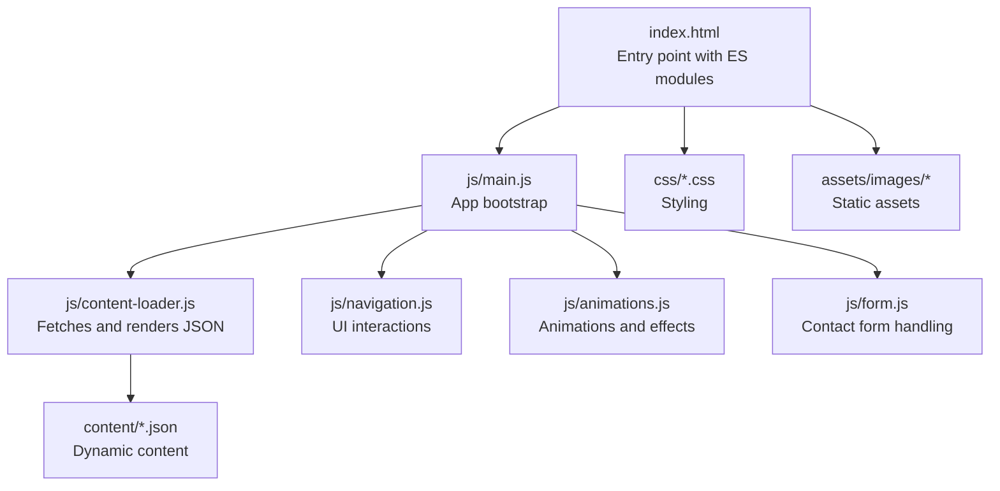
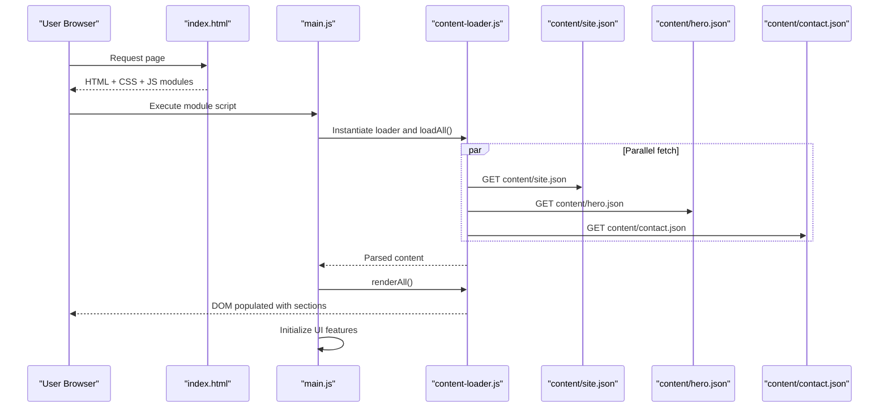
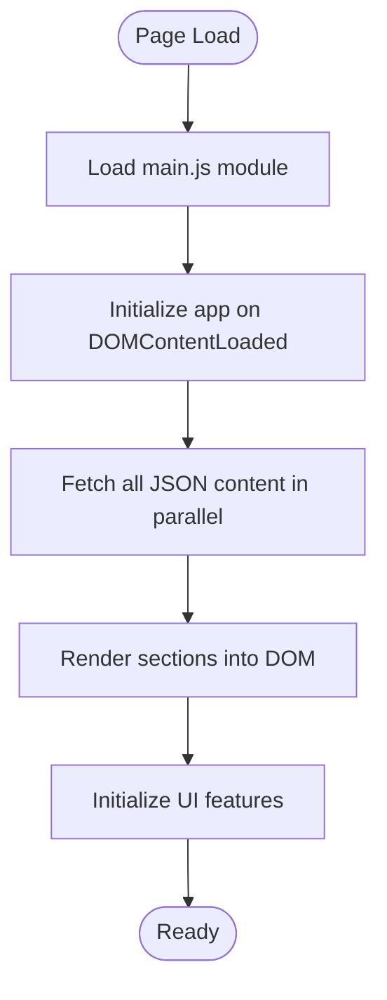
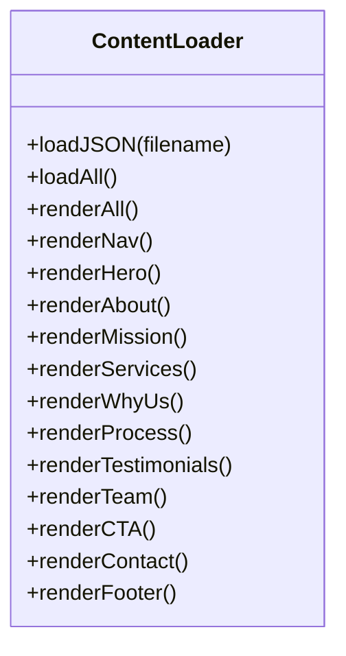
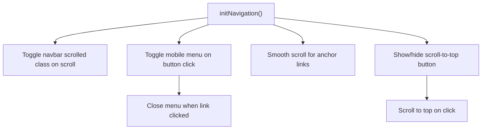
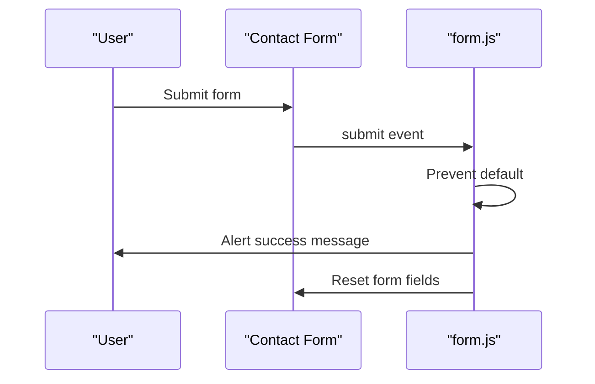
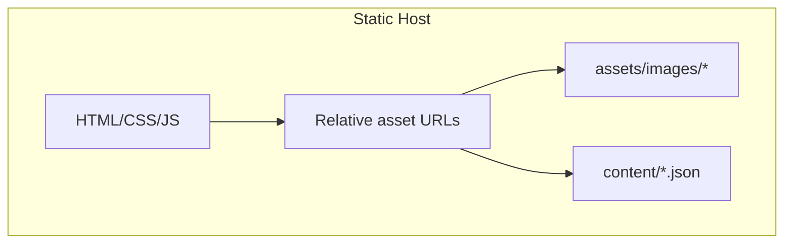
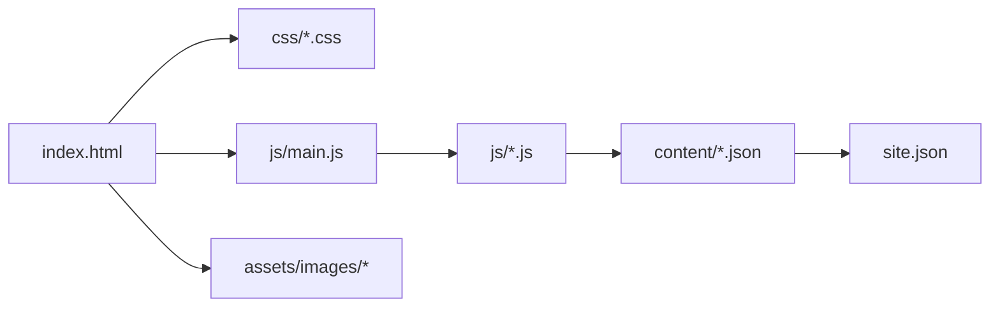

# Deployment Guide

<cite>
**Referenced Files in This Document**
- [index.html](file://index.html)
- [victory_marketing.html](file://victory_marketing.html)
- [main.js](file://js/main.js)
- [content-loader.js](file://js/content-loader.js)
- [navigation.js](file://js/navigation.js)
- [form.js](file://js/form.js)
- [base.css](file://css/base.css)
- [site.json](file://content/site.json)
- [hero.json](file://content/hero.json)
- [contact.json](file://content/contact.json)
</cite>

## Table of Contents
1. [Introduction](#introduction)
2. [Project Structure](#project-structure)
3. [Core Components](#core-components)
4. [Architecture Overview](#architecture-overview)
5. [Detailed Component Analysis](#detailed-component-analysis)
6. [Dependency Analysis](#dependency-analysis)
7. [Performance Considerations](#performance-considerations)
8. [Troubleshooting Guide](#troubleshooting-guide)
9. [Conclusion](#conclusion)
10. [Appendices](#appendices)

## Introduction
This guide provides production deployment strategies and hosting considerations for the Victory Marketing website. The site is a vanilla JavaScript application with no build tools required. It dynamically loads content from JSON files and renders sections at runtime. The guide covers build-free deployment, hosting platform recommendations, file structure requirements, domain and SSL configuration, redirects, performance optimization, monitoring and analytics integration, security hardening, and troubleshooting.

## Project Structure
The site comprises:
- Two HTML entry points: a modular entry using ES modules and a single-file embedded CSS/JS variant
- A content-driven architecture powered by JSON files
- Static assets under assets/images
- Modular JavaScript organized into feature-specific modules
- Cascading styles organized into modular CSS files

Key deployment artifacts:
- HTML pages (index.html and victory_marketing.html)
- CSS files under css/
- JavaScript modules under js/
- JSON content under content/
- Static images under assets/images/

**Diagram sources**
- [index.html:1-106](file://index.html#L1-L106)
- [main.js:1-41](file://js/main.js#L1-L41)
- [content-loader.js:1-443](file://js/content-loader.js#L1-L443)
- [navigation.js:1-55](file://js/navigation.js#L1-L55)
- [form.js:1-17](file://js/form.js#L1-L17)
- [base.css:1-165](file://css/base.css#L1-L165)

**Section sources**
- [index.html:1-106](file://index.html#L1-L106)
- [main.js:1-41](file://js/main.js#L1-L41)
- [content-loader.js:1-443](file://js/content-loader.js#L1-L443)
- [base.css:1-165](file://css/base.css#L1-L165)

## Core Components
- Entry point and module loading: The primary HTML page loads a main module script that orchestrates initialization and rendering.
- Content loader: Fetches multiple JSON files concurrently and renders sections into the DOM.
- Navigation and UI: Handles scroll effects, mobile menu, smooth scrolling, and scroll-to-top.
- Animations and interactions: Particles, counters, reveal effects, and card glows.
- Contact form: Submits via client-side alert and reset; suitable for static feedback or integration with backend services.

**Section sources**
- [index.html:102-104](file://index.html#L102-L104)
- [main.js:6-37](file://js/main.js#L6-L37)
- [content-loader.js:11-37](file://js/content-loader.js#L11-L37)
- [navigation.js:6-54](file://js/navigation.js#L6-L54)
- [form.js:5-16](file://js/form.js#L5-L16)

## Architecture Overview
The runtime architecture is client-rendered:
- On load, the main module initializes and creates a content loader instance.
- The loader fetches all JSON content in parallel.
- Sections are rendered into containers identified by data attributes.
- Interactive features are initialized after content is rendered.

**Diagram sources**
- [index.html:102-104](file://index.html#L102-L104)
- [main.js:11-37](file://js/main.js#L11-L37)
- [content-loader.js:18-53](file://js/content-loader.js#L18-L53)
- [site.json:1-18](file://content/site.json#L1-L18)
- [hero.json:1-34](file://content/hero.json#L1-L34)
- [contact.json:1-48](file://content/contact.json#L1-L48)

## Detailed Component Analysis

### Entry Point and Module Bootstrap
- The HTML page includes external fonts and icons via CDNs and links to modular CSS files.
- The main script is loaded as an ES module, enabling import statements for feature modules.
- Initialization waits for DOMContentLoaded and orchestrates loading and rendering.

**Diagram sources**
- [index.html:22-33](file://index.html#L22-L33)
- [index.html:102-104](file://index.html#L102-L104)
- [main.js:11-40](file://js/main.js#L11-L40)
- [content-loader.js:18-53](file://js/content-loader.js#L18-L53)

**Section sources**
- [index.html:1-106](file://index.html#L1-L106)
- [main.js:1-41](file://js/main.js#L1-L41)

### Content Loading and Rendering
- The loader fetches JSON files from the content directory and stores them in memory.
- It renders sections into containers marked with data-section attributes.
- The loader also updates branding assets from the site JSON.

**Diagram sources**
- [content-loader.js:6-442](file://js/content-loader.js#L6-L442)

**Section sources**
- [content-loader.js:11-37](file://js/content-loader.js#L11-L37)
- [content-loader.js:39-53](file://js/content-loader.js#L39-L53)
- [site.json:1-18](file://content/site.json#L1-L18)

### Navigation and UI Interactions
- Adds scroll effect to the navbar.
- Toggles mobile menu and closes it on link click.
- Implements smooth scrolling for anchor links.
- Shows/hides scroll-to-top button and scrolls smoothly to top.

**Diagram sources**
- [navigation.js:6-54](file://js/navigation.js#L6-L54)

**Section sources**
- [navigation.js:1-55](file://js/navigation.js#L1-L55)

### Contact Form Handling
- Prevents default form submission, displays a success message, and resets the form.

**Diagram sources**
- [form.js:5-16](file://js/form.js#L5-L16)
- [contact.json:41-46](file://content/contact.json#L41-L46)

**Section sources**
- [form.js:1-17](file://js/form.js#L1-L17)
- [contact.json:17-47](file://content/contact.json#L17-L47)

### Conceptual Overview
- The site is static-first with dynamic content driven by JSON files.
- Assets are referenced relatively, enabling straightforward deployment to static hosts.

[No sources needed since this diagram shows conceptual workflow, not actual code structure]

[No sources needed since this section doesn't analyze specific source files]

## Dependency Analysis
- HTML depends on CSS and JS modules.
- JS modules depend on shared content JSON files.
- Content JSON files define branding and page metadata.
- Assets are referenced by both HTML and JSON.

**Diagram sources**
- [index.html:22-33](file://index.html#L22-L33)
- [main.js:6-9](file://js/main.js#L6-L9)
- [content-loader.js:12-16](file://js/content-loader.js#L12-L16)
- [site.json:1-18](file://content/site.json#L1-L18)

**Section sources**
- [index.html:1-106](file://index.html#L1-L106)
- [main.js:1-41](file://js/main.js#L1-L41)
- [content-loader.js:1-443](file://js/content-loader.js#L1-L443)
- [site.json:1-18](file://content/site.json#L1-L18)

## Performance Considerations
- Build-free deployment: No bundling or transpilation required; deploy as-is.
- Asset delivery:
  - Prefer a static host or CDN with global edge locations.
  - Enable HTTP/2 or HTTP/3 for multiplexing.
  - Use far-future cache headers for static assets (CSS, JS, images).
- Compression:
  - Enable Gzip or Brotli compression on the server or CDN.
- Minimization:
  - Keep CSS and JS concatenated and minified for production deployments.
  - Remove unused CSS/JS and deduplicate imports.
- Caching:
  - Set Cache-Control headers for immutable assets (e.g., hashed filenames).
  - Use etag or last-modified for cache validation.
- Images:
  - Serve modern formats (AVIF/WebP) when supported.
  - Compress images losslessly or with low perceptual loss.
- Network:
  - Preconnect to external domains (fonts.googleapis.com, cdnjs.cloudflare.com).
  - Use resource hints (preload) for critical CSS/JS.
- Observability:
  - Add analytics and monitoring hooks during development; enable in production.

[No sources needed since this section provides general guidance]

## Troubleshooting Guide
- 404 errors for JSON content:
  - Verify content directory exists and JSON files are uploaded.
  - Confirm relative paths from HTML to content directory are correct.
- CORS errors for JSON:
  - Ensure the hosting platform serves JSON with appropriate CORS headers.
  - Consider hosting JSON alongside HTML or configuring origin policies.
- Missing assets:
  - Confirm assets/images directory is uploaded and image paths match site.json.
- Fonts/icons not loading:
  - Check network tab for blocked resources; ensure preconnect and CORS are allowed.
- Form not submitting:
  - The current implementation alerts and resets; integrate with a backend if required.
- Redirects and canonicalization:
  - Configure 301 redirects from www to non-www or vice versa.
  - Enforce HTTPS and redirect HTTP to HTTPS.
- Monitoring:
  - Integrate analytics and APM tools; monitor page load metrics and error rates.

**Section sources**
- [content-loader.js:12-16](file://js/content-loader.js#L12-L16)
- [site.json:5](file://content/site.json#L5)
- [index.html:9-20](file://index.html#L9-L20)
- [form.js:9-15](file://js/form.js#L9-L15)

## Conclusion
The Victory Marketing website is a lightweight, static-ready application that benefits from a build-free deployment model. By organizing files per the structure outlined, leveraging a static host or CDN, and applying the performance and security recommendations herein, you can deliver a fast, secure, and maintainable site.

## Appendices

### Hosting Platform Recommendations
- Static Site Hosts:
  - Netlify, Vercel, GitHub Pages, Cloudflare Pages
- CDN Options:
  - Cloudflare, AWS CloudFront, Google Cloud CDN
- Performance Settings:
  - Enable compression (Gzip/Brotli), HTTP/2/3, and caching headers
  - Preconnect to external domains
  - Optimize images and minify CSS/JS

[No sources needed since this section provides general guidance]

### File Upload Checklist
- Root HTML files: index.html, victory_marketing.html
- CSS: all files under css/
- JS: all files under js/
- Content: all JSON files under content/
- Assets: all images under assets/images/
- Ensure relative paths resolve correctly from the deployed root

[No sources needed since this section provides general guidance]

### Domain, SSL, and Redirects
- DNS: Point domain to chosen static host or CDN endpoint
- SSL: Enable automatic certificate provisioning via the platform
- Redirects: Configure www to non-www and HTTP to HTTPS

[No sources needed since this section provides general guidance]

### Security Hardening
- HTTPS enforcement: Force TLS 1.2+ and modern ciphers
- Content Security Policy: Restrict inline scripts and external sources
- Subresource Integrity: Consider SRI for third-party libraries
- Rate limiting and WAF: Enable at CDN or platform level

[No sources needed since this section provides general guidance]