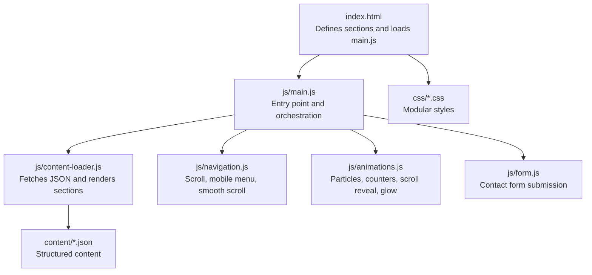
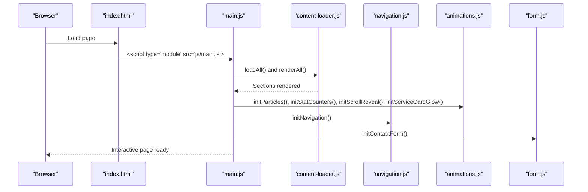
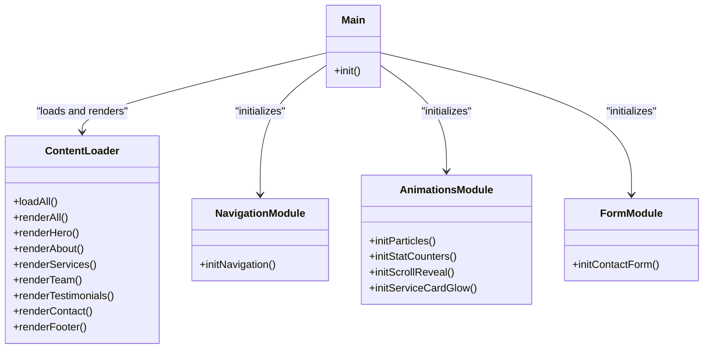
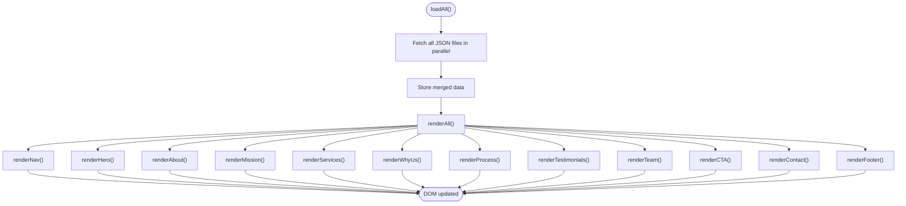
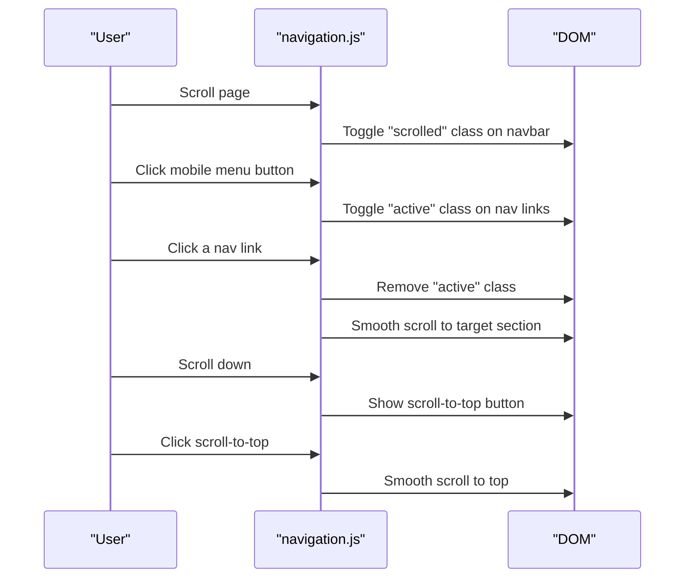
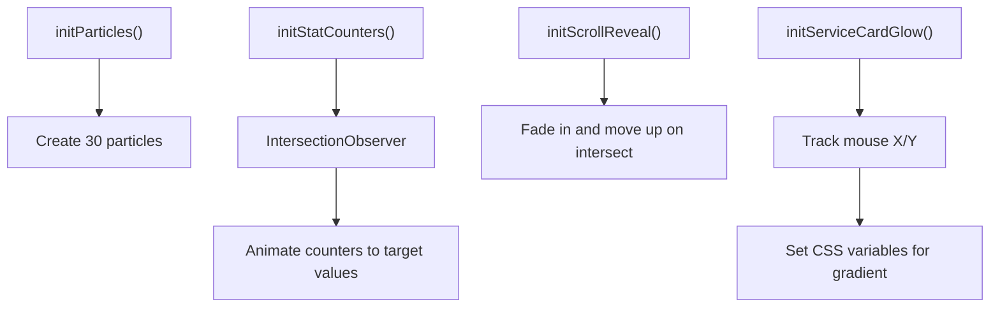
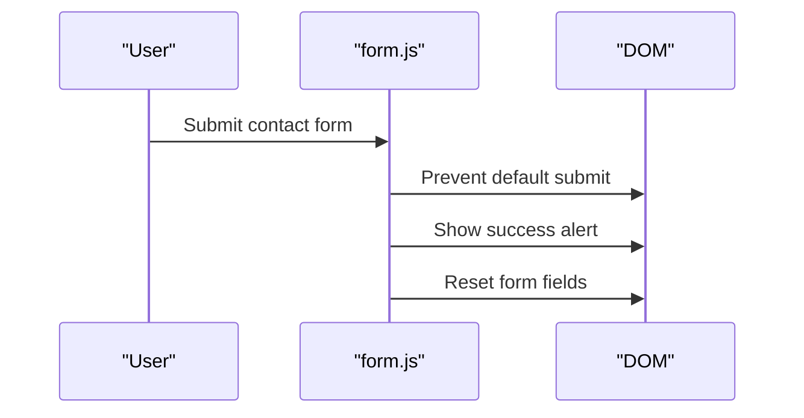
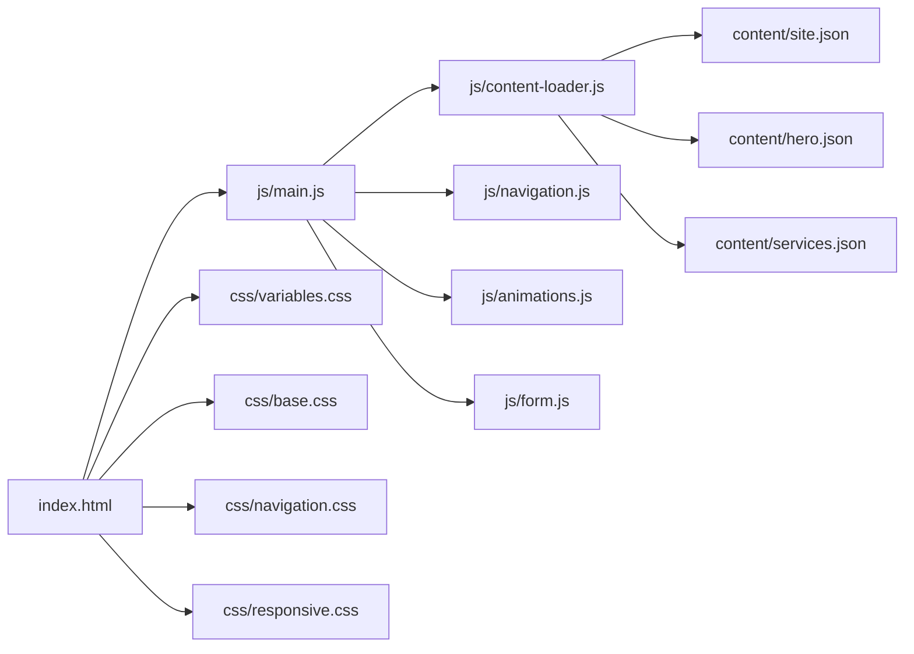

# Getting Started

<cite>
**Referenced Files in This Document**
- [index.html](file://index.html)
- [main.js](file://js/main.js)
- [content-loader.js](file://js/content-loader.js)
- [navigation.js](file://js/navigation.js)
- [animations.js](file://js/animations.js)
- [form.js](file://js/form.js)
- [site.json](file://content/site.json)
- [hero.json](file://content/hero.json)
- [services.json](file://content/services.json)
- [variables.css](file://css/variables.css)
- [base.css](file://css/base.css)
- [responsive.css](file://css/responsive.css)
- [navigation.css](file://css/navigation.css)
</cite>

## Table of Contents
1. [Introduction](#introduction)
2. [Prerequisites](#prerequisites)
3. [Local Development Setup](#local-development-setup)
4. [Project Structure](#project-structure)
5. [How It Works](#how-it-works)
6. [Making Your First Changes](#making-your-first-changes)
7. [Architecture Overview](#architecture-overview)
8. [Detailed Component Analysis](#detailed-component-analysis)
9. [Dependency Analysis](#dependency-analysis)
10. [Performance Considerations](#performance-considerations)
11. [Troubleshooting Guide](#troubleshooting-guide)
12. [Conclusion](#conclusion)

## Introduction
Victory Marketing is a modern, modular static website built with vanilla JavaScript ES6 modules, JSON-driven content, and CSS custom properties. It loads content from structured JSON files, renders sections dynamically, and initializes interactive features like navigation, animations, and forms. This guide helps you set up the project locally, understand the architecture, and make your first content and style changes.

## Prerequisites
- Basic HTML/CSS knowledge: understanding of elements, attributes, classes, and CSS selectors.
- Basic JavaScript knowledge: variables, arrays, objects, event listeners, and asynchronous operations.
- ES6 modules: familiarity with import/export syntax and module loading via script type="module".
- Local server: a simple HTTP server is required because browsers restrict fetching JSON files from the file:// protocol due to CORS policies.

## Local Development Setup
Follow these steps to run the project locally:

1. Clone the repository to your machine.
2. Open a terminal in the project root directory.
3. Start a local HTTP server:
   - Python 3.x: python -m http.server 8000
   - Node.js (with http-server): npx http-server
   - Any other static file server of your choice.
4. Visit http://localhost:8000 in your browser.

Notes:
- The project uses ES6 modules and requires a local server to load modules and JSON files.
- If you open index.html directly in the browser, JSON loading and module imports may fail due to CORS restrictions.

**Section sources**
- [index.html:102-104](file://index.html#L102-L104)
- [main.js:6-9](file://js/main.js#L6-L9)

## Project Structure
The project follows a clean separation of concerns:
- HTML: Defines the page skeleton and section containers with data attributes.
- CSS: Modular styles organized by feature and theme.
- JS: ES6 modules for initialization, content loading, navigation, animations, and form handling.
- Content: JSON files that drive dynamic rendering of each section.

**Diagram sources**
- [index.html:35-104](file://index.html#L35-L104)
- [main.js:11-40](file://js/main.js#L11-L40)
- [content-loader.js:18-53](file://js/content-loader.js#L18-L53)

**Section sources**
- [index.html:35-104](file://index.html#L35-L104)
- [main.js:6-9](file://js/main.js#L6-L9)

## How It Works
At runtime:
- The HTML page defines section containers with a data-section attribute.
- main.js imports modules and initializes them after DOMContentLoaded.
- content-loader.js fetches all JSON files in parallel, stores them, and renders each section into its container.
- navigation.js adds scroll effects, mobile menu toggling, and smooth scrolling.
- animations.js creates floating particles, animates stats, reveals cards on scroll, and adds a mouse-tracking glow to service cards.
- form.js handles the contact form submission with a friendly alert and reset.

**Diagram sources**
- [index.html:102-104](file://index.html#L102-L104)
- [main.js:11-40](file://js/main.js#L11-L40)
- [content-loader.js:18-53](file://js/content-loader.js#L18-L53)
- [navigation.js:6-54](file://js/navigation.js#L6-L54)
- [animations.js:6-97](file://js/animations.js#L6-L97)
- [form.js:5-16](file://js/form.js#L5-L16)

## Making Your First Changes
There are two primary ways to customize the site:

### Change Content (JSON)
- Edit content/*.json files to update text, images, buttons, lists, and form fields.
- Example: Modify hero headline, stats, or services items.
- After saving, refresh the browser to see changes reflected immediately.

Examples of files to edit:
- [site.json](file://content/site.json): Brand name, logo, tagline, and social links.
- [hero.json](file://content/hero.json): Hero headline, badge, buttons, and statistics.
- [services.json](file://content/services.json): Services header and list of offerings.

**Section sources**
- [site.json:1-18](file://content/site.json#L1-L18)
- [hero.json:1-34](file://content/hero.json#L1-L34)
- [services.json:1-82](file://content/services.json#L1-L82)

### Customize Visual Appearance (CSS)
- Adjust theme variables in [variables.css](file://css/variables.css) to change colors globally.
- Override section-specific styles in the corresponding CSS files (e.g., [navigation.css](file://css/navigation.css), [base.css](file://css/base.css)).
- Responsive adjustments are centralized in [responsive.css](file://css/responsive.css).

Tips:
- Use CSS custom properties for consistent theming.
- Keep global resets and typography in [base.css](file://css/base.css).
- Add or adjust media queries in [responsive.css](file://css/responsive.css) for device-specific layouts.

**Section sources**
- [variables.css:1-12](file://css/variables.css#L1-L12)
- [base.css:1-165](file://css/base.css#L1-L165)
- [responsive.css:1-104](file://css/responsive.css#L1-L104)
- [navigation.css:1-113](file://css/navigation.css#L1-L113)

## Architecture Overview
The site is modular and decoupled:
- HTML provides containers and data attributes.
- JS modules encapsulate responsibilities (loading, rendering, interactivity).
- CSS is split into variables, base styles, feature-specific styles, and responsive rules.

**Diagram sources**
- [content-loader.js:6-442](file://js/content-loader.js#L6-L442)
- [navigation.js:6-54](file://js/navigation.js#L6-L54)
- [animations.js:6-97](file://js/animations.js#L6-L97)
- [form.js:5-16](file://js/form.js#L5-L16)
- [main.js:11-40](file://js/main.js#L11-L40)

## Detailed Component Analysis

### Content Loading and Rendering
- ContentLoader fetches all JSON files concurrently and stores them.
- It renders each section into a container identified by data-section.
- It handles dynamic content like hero headlines, service cards, testimonials, and contact forms.

**Diagram sources**
- [content-loader.js:18-53](file://js/content-loader.js#L18-L53)
- [content-loader.js:69-107](file://js/content-loader.js#L69-L107)
- [content-loader.js:171-198](file://js/content-loader.js#L171-L198)

**Section sources**
- [content-loader.js:11-37](file://js/content-loader.js#L11-L37)
- [content-loader.js:39-53](file://js/content-loader.js#L39-L53)

### Navigation Interactions
- Adds a scroll effect to the navbar.
- Toggles a mobile menu and closes it on link click.
- Implements smooth scrolling for anchor links.
- Shows a scroll-to-top button when scrolled down.

**Diagram sources**
- [navigation.js:12-54](file://js/navigation.js#L12-L54)

**Section sources**
- [navigation.js:6-54](file://js/navigation.js#L6-L54)

### Animations and Effects
- Generates floating particles in the hero section.
- Animates statistics counters when they come into view.
- Reveals cards and process steps on scroll.
- Adds a mouse-tracking glow effect to service cards.

**Diagram sources**
- [animations.js:6-97](file://js/animations.js#L6-L97)

**Section sources**
- [animations.js:6-97](file://js/animations.js#L6-L97)

### Contact Form Handling
- Prevents default submission, shows a success message, and resets the form.

**Diagram sources**
- [form.js:5-16](file://js/form.js#L5-L16)

**Section sources**
- [form.js:5-16](file://js/form.js#L5-L16)

## Dependency Analysis
- main.js depends on content-loader.js, navigation.js, animations.js, and form.js.
- content-loader.js depends on content/*.json files.
- index.html depends on CSS files and loads main.js as an ES module.

**Diagram sources**
- [index.html:22-33](file://index.html#L22-L33)
- [main.js:6-9](file://js/main.js#L6-L9)
- [content-loader.js:12-36](file://js/content-loader.js#L12-L36)

**Section sources**
- [index.html:22-33](file://index.html#L22-L33)
- [main.js:6-9](file://js/main.js#L6-L9)
- [content-loader.js:12-36](file://js/content-loader.js#L12-L36)

## Performance Considerations
- Parallel JSON loading reduces initialization time.
- IntersectionObserver is efficient for animations and reveals.
- CSS custom properties enable fast theme switching without heavy reflows.
- Keep images optimized and lazy-load where appropriate for larger projects.

## Troubleshooting Guide
Common issues and fixes:
- JSON files not loading:
  - Ensure you are serving the site via a local HTTP server (not opening index.html directly).
  - Verify network tab shows successful GET requests to content/*.json.
- Modules not loading:
  - Confirm the script type="module" is present and the browser supports ES6 modules.
  - Check the browser console for import errors.
- Animations not triggering:
  - Ensure IntersectionObserver is supported by the browser.
  - Verify elements have the expected classes and appear in the viewport.
- Styling not updating:
  - Clear browser cache or hard reload.
  - Confirm CSS files are linked in the correct order in index.html.
- Form not submitting:
  - Check that the form element exists and the submit handler runs.

**Section sources**
- [index.html:102-104](file://index.html#L102-L104)
- [main.js:28-36](file://js/main.js#L28-L36)
- [animations.js:45-58](file://js/animations.js#L45-L58)

## Conclusion
You now have everything needed to run the project locally, understand the modular architecture, and make your first content and style changes. Start by editing JSON files for quick content updates, and tweak CSS variables and sections for visual customization. For deeper customization, explore the JS modules and their responsibilities.