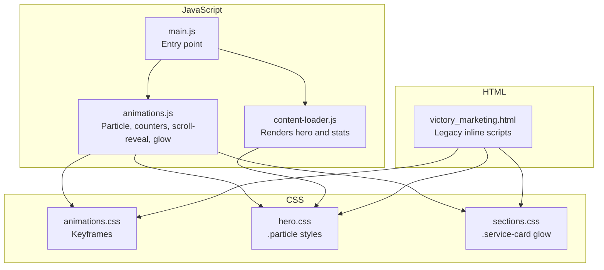
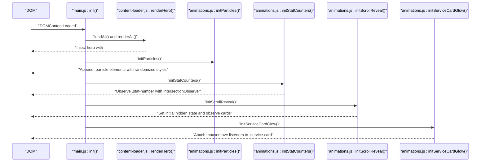
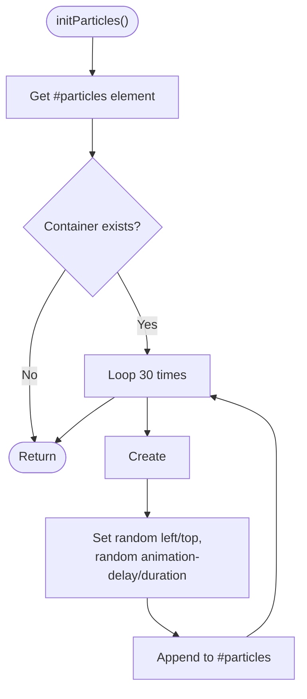
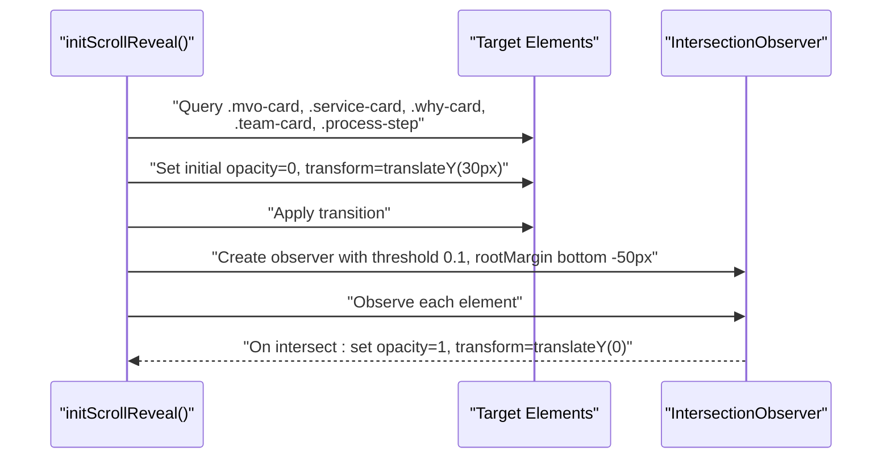
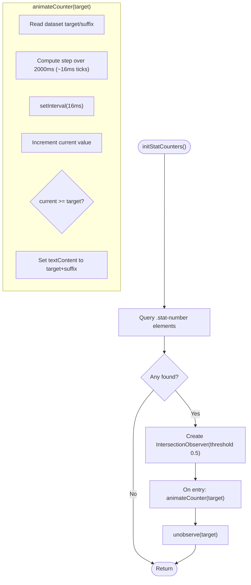
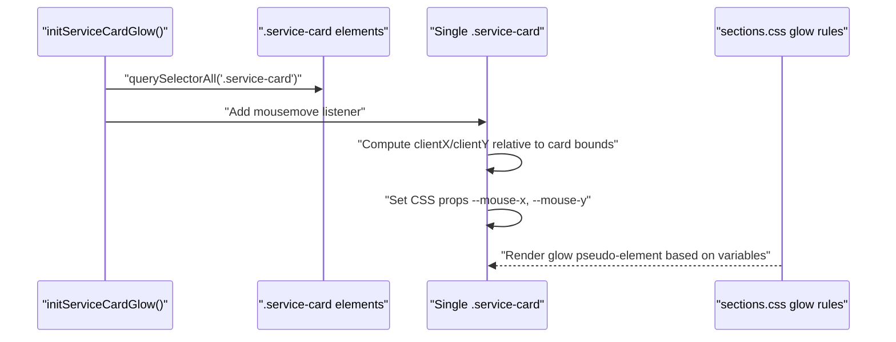
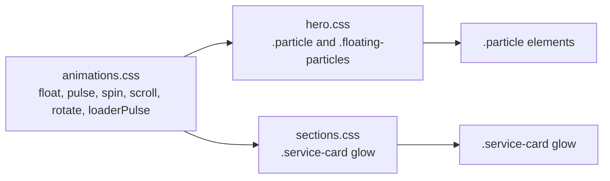
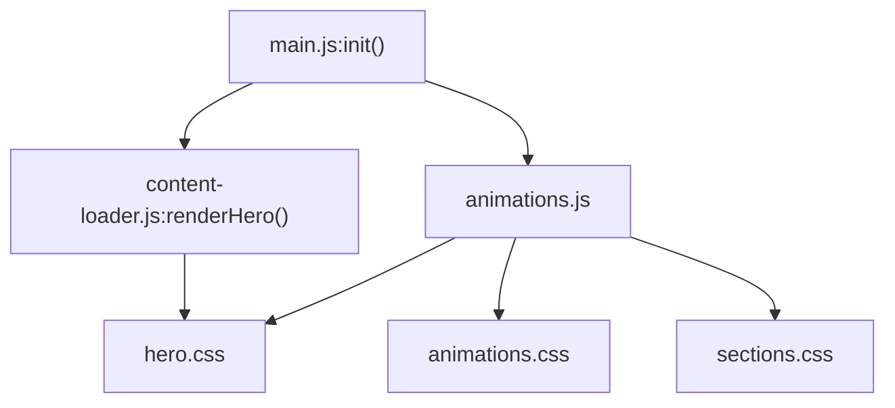

# Animation Module

<cite>
**Referenced Files in This Document**
- [js/animations.js](file://js/animations.js)
- [js/main.js](file://js/main.js)
- [js/content-loader.js](file://js/content-loader.js)
- [css/animations.css](file://css/animations.css)
- [css/hero.css](file://css/hero.css)
- [css/sections.css](file://css/sections.css)
- [victory_marketing.html](file://victory_marketing.html)
</cite>

## Table of Contents
1. [Introduction](#introduction)
2. [Project Structure](#project-structure)
3. [Core Components](#core-components)
4. [Architecture Overview](#architecture-overview)
5. [Detailed Component Analysis](#detailed-component-analysis)
6. [Dependency Analysis](#dependency-analysis)
7. [Performance Considerations](#performance-considerations)
8. [Troubleshooting Guide](#troubleshooting-guide)
9. [Conclusion](#conclusion)
10. [Appendices](#appendices)

## Introduction
This document describes the Animation module for the Victory Marketing website. It covers the particle animation engine built with CSS keyframes and lightweight DOM manipulation, scroll-triggered animations powered by the Intersection Observer API, and complementary mouse-interaction effects. It also documents configuration options, performance optimizations, browser compatibility, and guidance for extending the animation framework.

## Project Structure
The animation system spans three primary areas:
- JavaScript initialization and animation logic
- CSS keyframe definitions and component-specific styles
- HTML rendering via a content loader that places animated elements into the DOM

**Diagram sources**
- [js/main.js:11-40](file://js/main.js#L11-L40)
- [js/animations.js:6-97](file://js/animations.js#L6-L97)
- [js/content-loader.js:70-107](file://js/content-loader.js#L70-L107)
- [css/animations.css:1-62](file://css/animations.css#L1-L62)
- [css/hero.css:32-47](file://css/hero.css#L32-L47)
- [css/sections.css:184-212](file://css/sections.css#L184-L212)
- [victory_marketing.html:1354](file://victory_marketing.html#L1354)

**Section sources**
- [js/main.js:11-40](file://js/main.js#L11-L40)
- [js/animations.js:6-97](file://js/animations.js#L6-L97)
- [js/content-loader.js:70-107](file://js/content-loader.js#L70-L107)
- [css/animations.css:1-62](file://css/animations.css#L1-L62)
- [css/hero.css:32-47](file://css/hero.css#L32-L47)
- [css/sections.css:184-212](file://css/sections.css#L184-L212)
- [victory_marketing.html:1354](file://victory_marketing.html#L1354)

## Core Components
- Particle system: Creates floating particles in the hero section using CSS keyframes and minimal DOM manipulation.
- Stat counter animation: Counts up when elements enter the viewport using Intersection Observer.
- Scroll-reveal animations: Fades and lifts cards/process steps into view on scroll.
- Mouse glow effect: Updates CSS custom properties to create a dynamic glow on service cards.

**Section sources**
- [js/animations.js:6-97](file://js/animations.js#L6-L97)
- [js/content-loader.js:70-107](file://js/content-loader.js#L70-L107)
- [css/hero.css:32-47](file://css/hero.css#L32-L47)
- [css/sections.css:184-212](file://css/sections.css#L184-L212)

## Architecture Overview
The initialization flow ensures content is rendered before enabling interactive animations. The hero section is responsible for hosting the particle container and stats targets.

**Diagram sources**
- [js/main.js:11-40](file://js/main.js#L11-L40)
- [js/content-loader.js:70-107](file://js/content-loader.js#L70-L107)
- [js/animations.js:6-97](file://js/animations.js#L6-L97)

## Detailed Component Analysis

### Particle Animation Engine
- Purpose: Lightweight floating particles in the hero section using CSS keyframes.
- Implementation highlights:
  - Container injection via content loader.
  - Randomized animation delay and duration per particle.
  - CSS keyframe defines vertical/horizontal movement and opacity changes.
  - Particles are non-interactive and pointer-events disabled.

**Diagram sources**
- [js/animations.js:6-20](file://js/animations.js#L6-L20)
- [js/content-loader.js:78-79](file://js/content-loader.js#L78-L79)
- [css/hero.css:32-47](file://css/hero.css#L32-L47)
- [css/animations.css:3-20](file://css/animations.css#L3-L20)

**Section sources**
- [js/animations.js:6-20](file://js/animations.js#L6-L20)
- [js/content-loader.js:78-79](file://js/content-loader.js#L78-L79)
- [css/hero.css:32-47](file://css/hero.css#L32-L47)
- [css/animations.css:3-20](file://css/animations.css#L3-L20)

### Scroll-Revealed Elements
- Purpose: Fade and lift cards/process steps into view as they enter the viewport.
- Implementation highlights:
  - Targets selector includes multiple card types.
  - Initial hidden state set via opacity/transform and transition.
  - Intersection Observer configured with threshold and root margin to trigger near viewport top.

**Diagram sources**
- [js/animations.js:60-84](file://js/animations.js#L60-L84)

**Section sources**
- [js/animations.js:60-84](file://js/animations.js#L60-L84)

### Stat Counter Animation
- Purpose: Smoothly count up numeric values when they scroll into view.
- Implementation highlights:
  - Uses Intersection Observer with a moderate threshold.
  - Counts up at ~60fps using a fixed interval and updates text content.
  - Unobserves the element after animating to avoid repeated triggers.

**Diagram sources**
- [js/animations.js:22-58](file://js/animations.js#L22-L58)

**Section sources**
- [js/animations.js:22-58](file://js/animations.js#L22-L58)
- [js/content-loader.js:97-104](file://js/content-loader.js#L97-L104)

### Mouse Tracking Glow Effect
- Purpose: Dynamic glow under cursor on service cards using CSS custom properties.
- Implementation highlights:
  - Listens to mousemove on each service card.
  - Computes normalized X/Y percentages and sets CSS variables.
  - CSS composes a pseudo-element glow driven by these variables.

**Diagram sources**
- [js/animations.js:86-97](file://js/animations.js#L86-L97)
- [css/sections.css:184-212](file://css/sections.css#L184-L212)

**Section sources**
- [js/animations.js:86-97](file://js/animations.js#L86-L97)
- [css/sections.css:184-212](file://css/sections.css#L184-L212)

### Integration with CSS Animations
- Keyframes: Centralized in animations.css for reusable motion primitives.
- Hero particles: Defined in hero.css with a dedicated class and keyframe reference.
- Service card glow: Implemented via pseudo-element and CSS variables in sections.css.
- Legacy page: Inline scripts in victory_marketing.html duplicate some initialization logic for backward compatibility.

**Diagram sources**
- [css/animations.css:1-62](file://css/animations.css#L1-L62)
- [css/hero.css:32-47](file://css/hero.css#L32-L47)
- [css/sections.css:184-212](file://css/sections.css#L184-L212)

**Section sources**
- [css/animations.css:1-62](file://css/animations.css#L1-L62)
- [css/hero.css:32-47](file://css/hero.css#L32-L47)
- [css/sections.css:184-212](file://css/sections.css#L184-L212)
- [victory_marketing.html:2172-2182](file://victory_marketing.html#L2172-L2182)
- [victory_marketing.html:2240-2263](file://victory_marketing.html#L2240-L2263)

## Dependency Analysis
- Initialization order: main.js orchestrates loading content, then enables animations.
- Particles depend on hero rendering and CSS keyframes.
- Stat counters depend on content loader injecting .stat-number elements.
- Scroll-reveal depends on multiple card selectors being present.
- Glow depends on .service-card presence and CSS variable-driven pseudo-element.

**Diagram sources**
- [js/main.js:11-40](file://js/main.js#L11-L40)
- [js/content-loader.js:70-107](file://js/content-loader.js#L70-L107)
- [js/animations.js:6-97](file://js/animations.js#L6-L97)
- [css/animations.css:1-62](file://css/animations.css#L1-L62)
- [css/hero.css:32-47](file://css/hero.css#L32-L47)
- [css/sections.css:184-212](file://css/sections.css#L184-L212)

**Section sources**
- [js/main.js:11-40](file://js/main.js#L11-L40)
- [js/content-loader.js:70-107](file://js/content-loader.js#L70-L107)
- [js/animations.js:6-97](file://js/animations.js#L6-L97)
- [css/animations.css:1-62](file://css/animations.css#L1-L62)
- [css/hero.css:32-47](file://css/hero.css#L32-L47)
- [css/sections.css:184-212](file://css/sections.css#L184-L212)

## Performance Considerations
- Use CSS animations and transforms for smooth motion:
  - Particles rely on transform/opacity keyframes; keep expensive properties off-layout.
- Minimize DOM writes during animation:
  - Particles are pre-styled and appended once; avoid frequent reflows.
- Efficient scroll observers:
  - Threshold and rootMargin reduce unnecessary callbacks; unobserve after use to prevent redundant work.
- Frame budget:
  - Stat counter tick interval is tuned (~16ms) to approximate 60fps without blocking the main thread.
- Pointer events:
  - Particles disable pointer interactions to avoid hit-testing overhead.
- Hardware acceleration:
  - Prefer transform/opacity for GPU-accelerated animations.

[No sources needed since this section provides general guidance]

## Troubleshooting Guide
- Particles not visible:
  - Verify the hero section is rendered and the #particles container exists.
  - Confirm .particle styles and @keyframes are loaded.
- Stat counters not animating:
  - Ensure .stat-number elements exist and have data-target/data-suffix attributes.
  - Check Intersection Observer support and thresholds.
- Scroll-reveal not triggering:
  - Confirm target selectors match rendered elements.
  - Adjust rootMargin/threshold if elements appear too early/late.
- Glow not updating:
  - Ensure .service-card elements exist and mousemove listeners are attached.
  - Verify CSS variables are defined and referenced in pseudo-elements.

**Section sources**
- [js/animations.js:6-20](file://js/animations.js#L6-L20)
- [js/animations.js:22-58](file://js/animations.js#L22-L58)
- [js/animations.js:60-84](file://js/animations.js#L60-L84)
- [js/animations.js:86-97](file://js/animations.js#L86-L97)
- [css/hero.css:32-47](file://css/hero.css#L32-L47)
- [css/sections.css:184-212](file://css/sections.css#L184-L212)

## Conclusion
The Animation module combines lightweight DOM manipulation with robust CSS animations and Intersection Observer to deliver performant, accessible motion. Particles, counters, scroll reveals, and mouse-driven glows are modular and easy to extend. Following the outlined best practices ensures smooth experiences across devices and browsers.

[No sources needed since this section summarizes without analyzing specific files]

## Appendices

### Animation Configuration Options
- Particles
  - Count: 30 per hero.
  - Randomization: left/top positions, animation-delay, animation-duration.
  - Styles: radius, color via CSS variable, pointer-events disabled.
- Stat Counter
  - Duration: ~2000ms.
  - Tick interval: ~16ms.
  - Suffix: optional via data-suffix.
- Scroll Reveal
  - Threshold: 0.1.
  - Root margin: bottom adjusted by -50px to trigger near viewport top.
  - Transition: opacity and transform easing.
- Glow Effect
  - CSS variables: --mouse-x, --mouse-y.
  - Pseudo-element composition in sections.css.

**Section sources**
- [js/animations.js:6-20](file://js/animations.js#L6-L20)
- [js/animations.js:22-58](file://js/animations.js#L22-L58)
- [js/animations.js:60-84](file://js/animations.js#L60-L84)
- [js/animations.js:86-97](file://js/animations.js#L86-L97)
- [css/hero.css:32-47](file://css/hero.css#L32-L47)
- [css/sections.css:184-212](file://css/sections.css#L184-L212)

### Browser Compatibility Notes
- Intersection Observer: Widely supported; ensure polyfills if targeting older environments.
- CSS Variables: Supported in modern browsers; consider fallbacks for legacy support.
- CSS Animations: Well-supported; use appropriate vendor prefixes if needed.
- Pointer Events: Disabled on particles to avoid unnecessary hit testing.

**Section sources**
- [js/animations.js:45-57](file://js/animations.js#L45-L57)
- [css/sections.css:184-212](file://css/sections.css#L184-L212)

### Creating Custom Effects
- Add a new keyframe in animations.css.
- Define a class in hero.css or sections.css with transform/opacity transitions.
- Initialize in animations.js with Intersection Observer or event listeners.
- Integrate with content-loader.js if the effect belongs to a rendered section.

**Section sources**
- [css/animations.css:1-62](file://css/animations.css#L1-L62)
- [css/hero.css:32-47](file://css/hero.css#L32-L47)
- [js/animations.js:6-97](file://js/animations.js#L6-L97)
- [js/content-loader.js:70-107](file://js/content-loader.js#L70-L107)