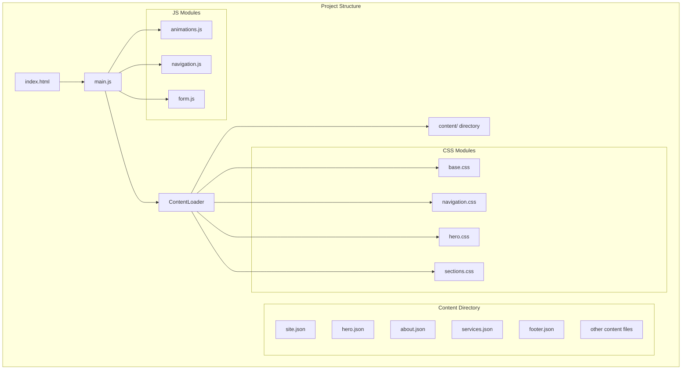
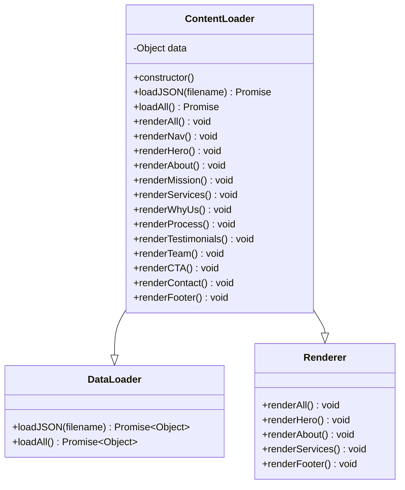
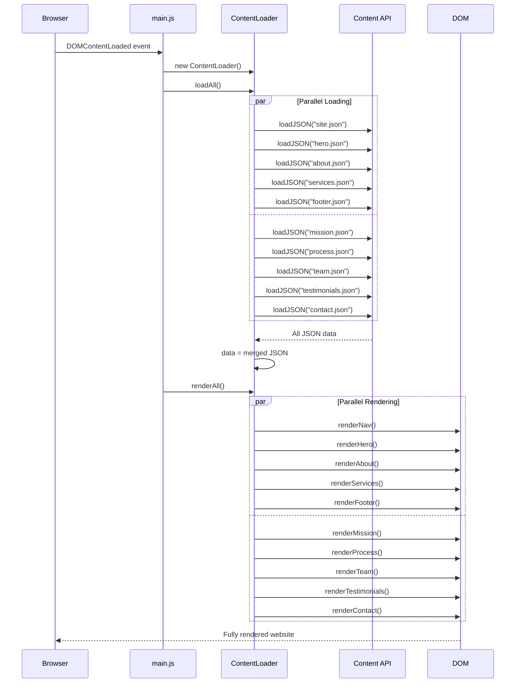
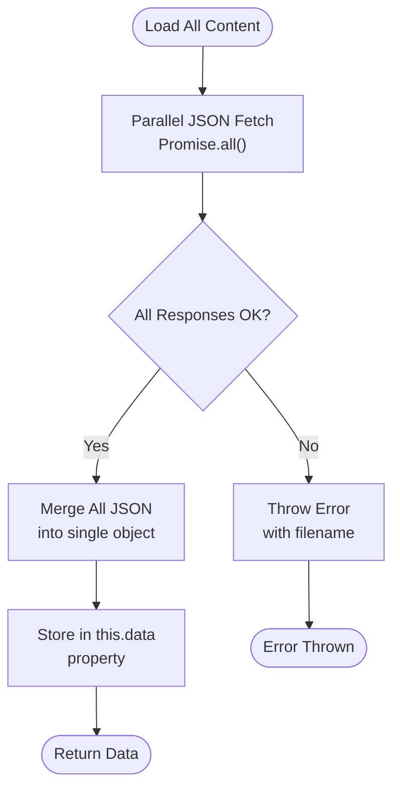
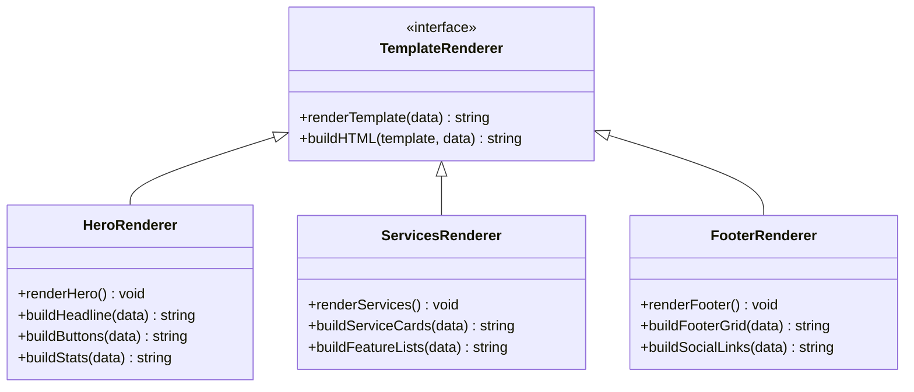
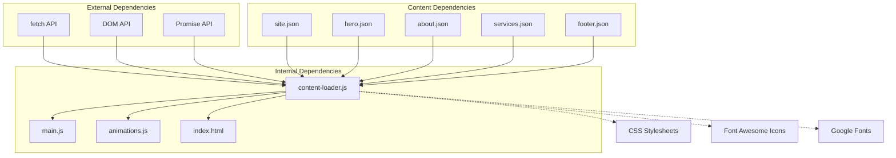
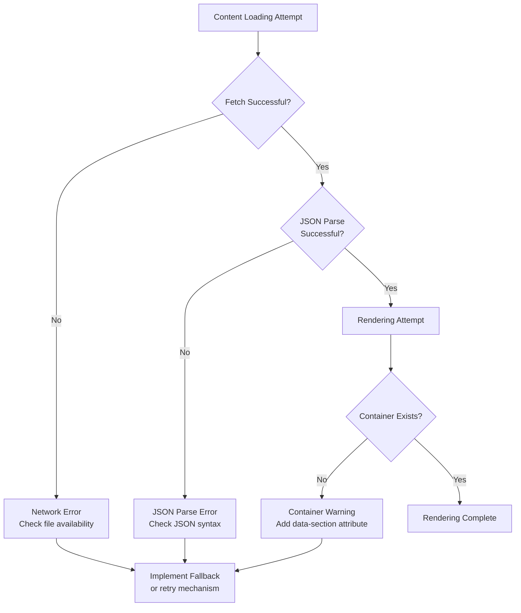

# Content Loader Module

<cite>
**Referenced Files in This Document**
- [content-loader.js](file://js/content-loader.js)
- [main.js](file://js/main.js)
- [index.html](file://index.html)
- [site.json](file://content/site.json)
- [hero.json](file://content/hero.json)
- [about.json](file://content/about.json)
- [services.json](file://content/services.json)
- [footer.json](file://content/footer.json)
- [animations.js](file://js/animations.js)
</cite>

## Table of Contents
1. [Introduction](#introduction)
2. [Project Structure](#project-structure)
3. [Core Components](#core-components)
4. [Architecture Overview](#architecture-overview)
5. [Detailed Component Analysis](#detailed-component-analysis)
6. [Dependency Analysis](#dependency-analysis)
7. [Performance Considerations](#performance-considerations)
8. [Troubleshooting Guide](#troubleshooting-guide)
9. [Conclusion](#conclusion)

## Introduction

The ContentLoader module is the central orchestrator for dynamic content management in the Victory Marketing website. It serves as a comprehensive content management system that fetches structured JSON data from the content directory and renders it into HTML markup across multiple website sections. The module implements a sophisticated parallel loading strategy using Promise.all() to optimize performance and provides a template-based rendering system that transforms structured data into visually appealing web content.

The module operates as a singleton-like class that manages the entire content lifecycle, from data fetching to DOM manipulation, ensuring seamless updates to different sections of the website without requiring page reloads. Its design follows modern JavaScript patterns with asynchronous operations, error handling, and modular architecture.

## Project Structure

The ContentLoader module is strategically positioned within the project's JavaScript architecture, working in conjunction with other modules to create a cohesive web application experience.



**Diagram sources**
- [index.html:65-95](file://index.html#L65-L95)
- [main.js:11-41](file://js/main.js#L11-L41)

The module integrates seamlessly with the existing HTML structure through data attributes and follows a clean separation of concerns between content data, presentation logic, and interactive features.

**Section sources**
- [index.html:1-106](file://index.html#L1-L106)
- [main.js:1-41](file://js/main.js#L1-L41)

## Core Components

The ContentLoader module consists of several key components that work together to manage content loading and rendering:

### ContentLoader Class Architecture



**Diagram sources**
- [content-loader.js:6-443](file://js/content-loader.js#L6-L443)

### Parallel Loading Strategy

The module implements an efficient parallel loading mechanism using Promise.all() to fetch all content files simultaneously, significantly reducing total loading time compared to sequential loading approaches.

**Section sources**
- [content-loader.js:18-37](file://js/content-loader.js#L18-L37)

## Architecture Overview

The ContentLoader module follows a modular architecture that separates concerns between data management, content rendering, and DOM manipulation:



**Diagram sources**
- [main.js:11-41](file://js/main.js#L11-L41)
- [content-loader.js:18-53](file://js/content-loader.js#L18-L53)

The architecture ensures that content loading and rendering occur asynchronously, providing immediate feedback to users while the system processes multiple content sources in parallel.

**Section sources**
- [main.js:11-41](file://js/main.js#L11-L41)
- [content-loader.js:18-53](file://js/content-loader.js#L18-L53)

## Detailed Component Analysis

### Content Loading Pipeline

The content loading pipeline demonstrates sophisticated error handling and data validation mechanisms:



**Diagram sources**
- [content-loader.js:18-37](file://js/content-loader.js#L18-L37)

The parallel loading implementation fetches all 11 content files simultaneously, leveraging browser capabilities to minimize total loading time. Each individual fetch operation includes comprehensive error handling with specific error messages indicating which content file failed to load.

### Template-Based Rendering System

The module employs a template-based rendering system that transforms structured JSON data into HTML markup:



**Diagram sources**
- [content-loader.js:69-107](file://js/content-loader.js#L69-L107)
- [content-loader.js:171-198](file://js/content-loader.js#L171-L198)
- [content-loader.js:407-441](file://js/content-loader.js#L407-L441)

Each renderer method follows a consistent pattern: locate the target container using data attributes, extract relevant data from the loaded content, and generate HTML markup using template literals with embedded data binding.

### DOM Manipulation Strategy

The module implements a strategic DOM manipulation approach that targets specific containers identified by data attributes:

```mermaid
flowchart TD
ContainerLookup["querySelector('[data-section=\"section-name\"]')"] --> CheckExists{"Container Exists?"}
CheckExists --> |No| SkipRender["Skip Rendering<br/>for this section"]
CheckExists --> |Yes| ExtractData["Extract Data<br/>from this.data"]
ExtractData --> BuildHTML["Build HTML Template<br/>with Template Literals"]
BuildHTML --> InjectHTML["container.innerHTML = HTML"]
InjectHTML --> Success(["Content Updated"])
SkipRender --> End([End])
Success --> End
```

**Diagram sources**
- [content-loader.js:69-107](file://js/content-loader.js#L69-L107)

This approach ensures that sections without corresponding HTML containers are gracefully skipped, preventing runtime errors and allowing for flexible content management.

**Section sources**
- [content-loader.js:69-107](file://js/content-loader.js#L69-L107)

### Content Data Integration

The module seamlessly integrates with the content JSON files through a well-defined data structure:

| Content Type | JSON File | Data Properties | Rendering Method |
|--------------|-----------|----------------|------------------|
| Site Configuration | site.json | brand, pageTitle, copyright, social | renderNav() |
| Hero Section | hero.json | badge, headline, description, buttons, stats | renderHero() |
| About Section | about.json | header, image, card, paragraphs, features | renderAbout() |
| Services | services.json | header, services array | renderServices() |
| Footer | footer.json | cta, brandDescription, columns | renderFooter() |

**Section sources**
- [site.json:1-18](file://content/site.json#L1-L18)
- [hero.json:1-34](file://content/hero.json#L1-L34)
- [about.json:1-30](file://content/about.json#L1-L30)
- [services.json:1-82](file://content/services.json#L1-L82)
- [footer.json:1-45](file://content/footer.json#L1-L45)

## Dependency Analysis

The ContentLoader module maintains minimal external dependencies while integrating with the broader application ecosystem:



**Diagram sources**
- [content-loader.js:12-16](file://js/content-loader.js#L12-L16)
- [main.js:6](file://js/main.js#L6)

The module relies primarily on native browser APIs (fetch, DOM manipulation) and maintains loose coupling with other modules through the main.js initialization pattern.

**Section sources**
- [content-loader.js:12-16](file://js/content-loader.js#L12-L16)
- [main.js:6](file://js/main.js#L6)

## Performance Considerations

The ContentLoader module implements several performance optimizations to ensure efficient content loading and rendering:

### Parallel Loading Benefits

The Promise.all() implementation provides significant performance improvements over sequential loading:

- **Reduced Total Load Time**: All 11 content files load simultaneously instead of sequentially
- **Network Efficiency**: Leverages browser connection pooling for concurrent requests
- **Memory Optimization**: Single data object reduces memory overhead compared to multiple partial loads

### DOM Manipulation Optimizations

The rendering system minimizes DOM operations through strategic batching:

- **Single InnerHTML Assignment**: Each section performs one major DOM update
- **Template Literal Concatenation**: Efficient string building before DOM injection
- **Conditional Rendering**: Graceful skipping of missing containers prevents unnecessary operations

### Memory Management

The module follows best practices for memory management:

- **Data Object Lifecycle**: Single data object shared across all renderers
- **Event Listener Cleanup**: No persistent event listeners attached by the loader
- **Resource Cleanup**: Minimal resource allocation during content processing

**Section sources**
- [content-loader.js:18-37](file://js/content-loader.js#L18-L37)
- [content-loader.js:39-53](file://js/content-loader.js#L39-L53)

## Troubleshooting Guide

The ContentLoader module includes comprehensive error handling mechanisms to address common content loading issues:

### Error Scenarios and Resolution



**Diagram sources**
- [content-loader.js:12-16](file://js/content-loader.js#L12-L16)

### Common Issues and Solutions

| Issue | Symptoms | Solution |
|-------|----------|----------|
| Content not loading | Blank sections or console errors | Verify JSON file paths and syntax |
| Partial content rendering | Some sections missing | Check data-section attributes in HTML |
| Slow loading times | Delayed content appearance | Monitor network requests and optimize images |
| Error messages | Console errors with filenames | Validate JSON structure and required fields |

### Debugging Strategies

The module provides several debugging hooks for development and maintenance:

- **Console Logging**: Error messages include specific filename information
- **Graceful Degradation**: Missing containers are handled without crashing
- **Data Validation**: Early detection of malformed JSON content
- **Progressive Enhancement**: Animation and interactive features load after content

**Section sources**
- [content-loader.js:12-16](file://js/content-loader.js#L12-L16)
- [main.js:28-36](file://js/main.js#L28-L36)

## Conclusion

The ContentLoader module represents a sophisticated solution for dynamic content management in modern web applications. Its implementation of parallel loading using Promise.all(), combined with a template-based rendering system and robust error handling, creates a reliable foundation for content-driven websites.

The module's architecture demonstrates excellent separation of concerns, with clear boundaries between data management, content rendering, and DOM manipulation. The use of data attributes for container identification provides flexibility while maintaining clean HTML structure.

Key strengths of the implementation include:

- **Performance Optimization**: Parallel loading reduces total content delivery time
- **Maintainability**: Clear separation of concerns and modular design
- **Reliability**: Comprehensive error handling and graceful degradation
- **Extensibility**: Easy addition of new content sections and data sources

The module successfully enables dynamic content updates without page reloads, providing a modern web application experience while maintaining simplicity and reliability. Its design serves as an excellent example of how structured data can be transformed into engaging user interfaces through thoughtful templating and DOM manipulation strategies.

Future enhancements could include content caching mechanisms, lazy loading for large content sets, and more sophisticated error recovery strategies, but the current implementation provides a solid foundation for content-driven web applications.