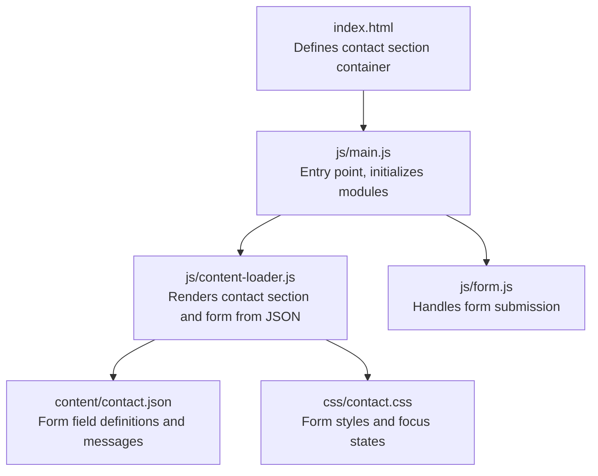
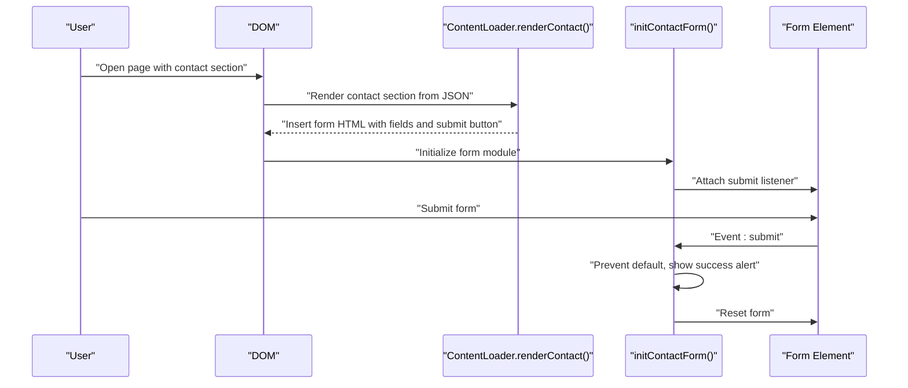
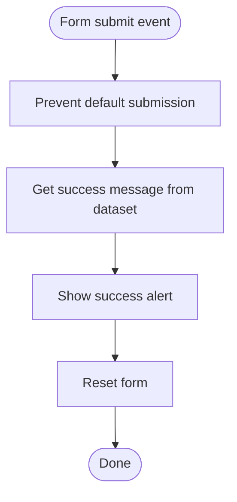
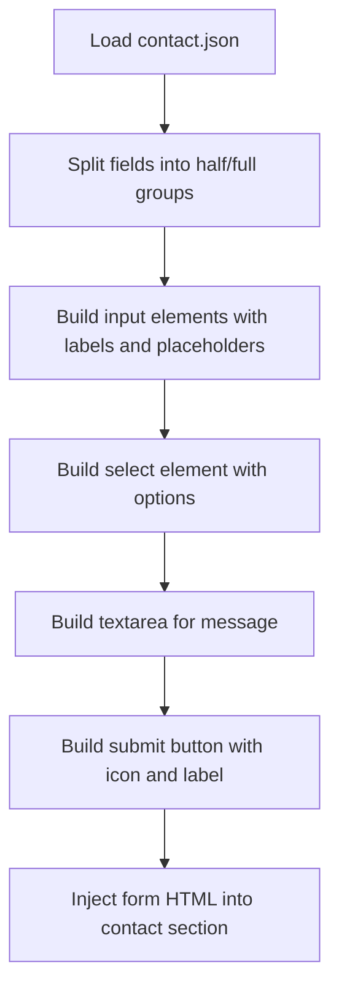
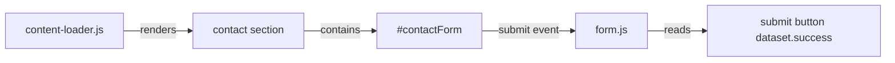

# Form Module

<cite>
**Referenced Files in This Document**
- [index.html](file://index.html)
- [js/main.js](file://js/main.js)
- [js/form.js](file://js/form.js)
- [js/content-loader.js](file://js/content-loader.js)
- [css/contact.css](file://css/contact.css)
- [content/contact.json](file://content/contact.json)
</cite>

## Table of Contents
1. [Introduction](#introduction)
2. [Project Structure](#project-structure)
3. [Core Components](#core-components)
4. [Architecture Overview](#architecture-overview)
5. [Detailed Component Analysis](#detailed-component-analysis)
6. [Dependency Analysis](#dependency-analysis)
7. [Performance Considerations](#performance-considerations)
8. [Troubleshooting Guide](#troubleshooting-guide)
9. [Conclusion](#conclusion)
10. [Appendices](#appendices)

## Introduction
This document describes the Form module responsible for the contact form functionality on the Victory Marketing website. It covers how the form is generated from structured content, how submission is handled, and how the user is notified upon successful submission. It also outlines areas for enhancement, including client-side validation, accessibility, security, and integration with external services.

## Project Structure
The form module spans several files:
- The HTML page defines the contact section container and loads the JavaScript module.
- The main entry point initializes the content loader and form module.
- The content loader builds the contact section and form from JSON content.
- The form module handles submission events and displays a success notification.

**Diagram sources**
- [index.html:91-92](file://index.html#L91-L92)
- [js/main.js:11-27](file://js/main.js#L11-L27)
- [js/content-loader.js:337-405](file://js/content-loader.js#L337-L405)
- [content/contact.json:17-46](file://content/contact.json#L17-L46)
- [js/form.js:5-16](file://js/form.js#L5-L16)
- [css/contact.css:57-137](file://css/contact.css#L57-L137)

**Section sources**
- [index.html:91-92](file://index.html#L91-L92)
- [js/main.js:11-27](file://js/main.js#L11-L27)
- [js/content-loader.js:337-405](file://js/content-loader.js#L337-L405)
- [content/contact.json:17-46](file://content/contact.json#L17-L46)
- [css/contact.css:57-137](file://css/contact.css#L57-L137)

## Core Components
- Contact section renderer: Builds the contact layout and form from JSON.
- Form module: Subscribes to form submission and shows a success message.
- Content configuration: Defines form fields, labels, placeholders, and success message.
- Styling: Provides focus states and button hover effects for form controls.

Key responsibilities:
- Generate form markup dynamically from content configuration.
- Prevent default submission and reset the form after a simulated success.
- Provide a configurable success message via dataset attributes.

**Section sources**
- [js/content-loader.js:337-405](file://js/content-loader.js#L337-L405)
- [js/form.js:5-16](file://js/form.js#L5-L16)
- [content/contact.json:17-46](file://content/contact.json#L17-L46)
- [css/contact.css:57-137](file://css/contact.css#L57-L137)

## Architecture Overview
The form lifecycle integrates content rendering and user interaction:

**Diagram sources**
- [js/content-loader.js:337-405](file://js/content-loader.js#L337-L405)
- [js/form.js:5-16](file://js/form.js#L5-L16)

## Detailed Component Analysis

### Form Submission Handler
The form submission handler performs:
- Preventing the default browser submission behavior.
- Retrieving a success message from the submit button’s dataset attribute.
- Showing a user-friendly alert with the success message.
- Resetting the form to clear input values.

**Diagram sources**
- [js/form.js:9-15](file://js/form.js#L9-L15)

**Section sources**
- [js/form.js:5-16](file://js/form.js#L5-L16)

### Form Rendering from Content
The contact renderer:
- Filters fields into half-width and full-width groups.
- Generates input fields with labels, placeholders, and required attributes.
- Creates a select dropdown with options from configuration.
- Adds a textarea for messages.
- Renders the submit button with icon, label, and success message stored in a dataset attribute.

**Diagram sources**
- [js/content-loader.js:344-399](file://js/content-loader.js#L344-L399)
- [content/contact.json:17-46](file://content/contact.json#L17-L46)

**Section sources**
- [js/content-loader.js:337-405](file://js/content-loader.js#L337-L405)
- [content/contact.json:17-46](file://content/contact.json#L17-L46)

### Accessibility Considerations
Current state:
- Labels are present for each form group.
- Focus states are styled for inputs and buttons.
- Keyboard focus order follows tab order within the form.

Recommended enhancements:
- Associate labels with inputs using for/id attributes for improved screen reader support.
- Add aria-describedby for inputs requiring extra context.
- Ensure sufficient color contrast for focus indicators and placeholders.
- Provide visible error indicators and ARIA live regions for dynamic feedback.
- Add role attributes where helpful (e.g., aria-invalid on invalid inputs).

[No sources needed since this section provides general guidance]

### Validation and Real-Time Feedback
Current state:
- Basic HTML5 validation via required attributes on inputs.
- No client-side validation logic is implemented in the form module.

Recommended enhancements:
- Add JavaScript validation for email format, phone number, and message length.
- Provide inline error messages near each field.
- Implement real-time validation on blur or input events.
- Use aria-invalid and aria-describedby to communicate errors to assistive technologies.

[No sources needed since this section provides general guidance]

### Security and Privacy
Current state:
- Submission is handled locally with an alert and reset.
- No server-side processing is implemented.

Recommended enhancements:
- Integrate with a server endpoint or third-party form processor.
- Add CSRF protection and rate limiting.
- Sanitize and validate all inputs on the server.
- Comply with data privacy regulations (e.g., GDPR) by providing a privacy notice and obtaining consent where required.

[No sources needed since this section provides general guidance]

### Integration with External Services
Current state:
- The form does not submit to any backend service.

Recommended integration points:
- Backend APIs: Submit form data to a server endpoint.
- Third-party services: Use services like Formspree, Netlify Forms, or Google Apps Script.
- Webhook integrations: Forward submissions to CRM or marketing automation platforms.

Implementation approach:
- Replace the alert with an asynchronous fetch to a configured endpoint.
- Handle network errors and display user-friendly messages.
- Respect the success message configuration for user feedback.

[No sources needed since this section provides general guidance]

## Dependency Analysis
The form module depends on:
- The contact section being rendered by the content loader.
- The presence of a submit button with a success message dataset attribute.
- The form element having a specific ID for selection.

**Diagram sources**
- [js/content-loader.js:371-399](file://js/content-loader.js#L371-L399)
- [js/form.js:5-16](file://js/form.js#L5-L16)

**Section sources**
- [js/content-loader.js:337-405](file://js/content-loader.js#L337-L405)
- [js/form.js:5-16](file://js/form.js#L5-L16)

## Performance Considerations
- Keep the form lightweight; avoid heavy client-side libraries.
- Debounce real-time validation to prevent excessive reflows.
- Minimize DOM updates during validation by batching changes.
- Use efficient selectors and avoid deep traversal in event handlers.

[No sources needed since this section provides general guidance]

## Troubleshooting Guide
Common issues and resolutions:
- Form not found: Ensure the contact section container exists and the form ID matches the selector.
- Success message not shown: Verify the submit button has the success message stored in its dataset attribute.
- Form not resetting: Confirm the form reset is executed after the alert.
- Styling inconsistencies: Check that focus and hover states are applied to inputs and the submit button.

**Section sources**
- [js/form.js:5-16](file://js/form.js#L5-L16)
- [js/content-loader.js:371-399](file://js/content-loader.js#L371-L399)
- [css/contact.css:57-137](file://css/contact.css#L57-L137)

## Conclusion
The current Form module provides a minimal but functional contact form experience. It generates the form from structured content and offers a simple success notification. To meet modern standards, the module should incorporate client-side validation, accessibility improvements, robust error handling, and secure integration with backend services or third-party processors.

[No sources needed since this section summarizes without analyzing specific files]

## Appendices

### Customization Guide
- Modify fields and labels: Edit the contact JSON configuration to add, remove, or change fields.
- Change success message: Update the success message in the contact JSON and ensure the submit button dataset reflects it.
- Extend validation: Add JavaScript validation functions and integrate them with the form submission handler.
- Integrate backend: Replace the alert with a fetch call to your endpoint and handle responses accordingly.

**Section sources**
- [content/contact.json:17-46](file://content/contact.json#L17-L46)
- [js/form.js:5-16](file://js/form.js#L5-L16)
- [js/content-loader.js:337-405](file://js/content-loader.js#L337-L405)