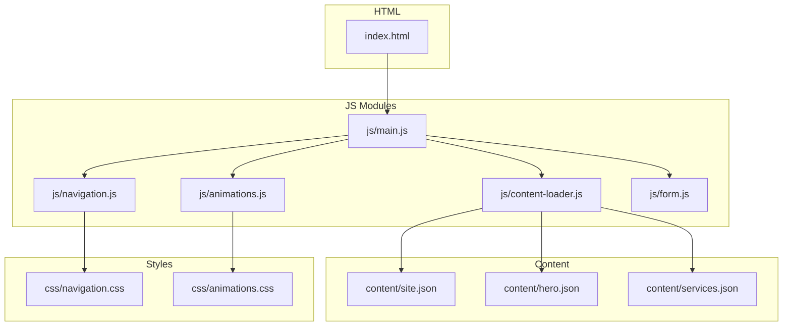
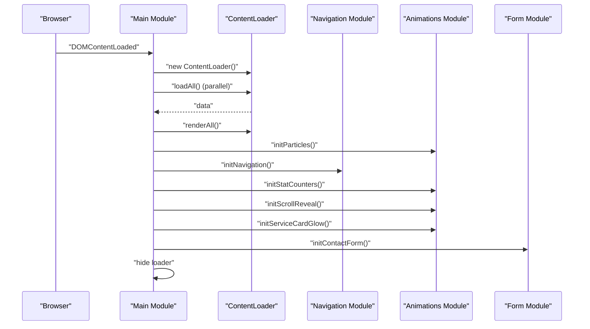
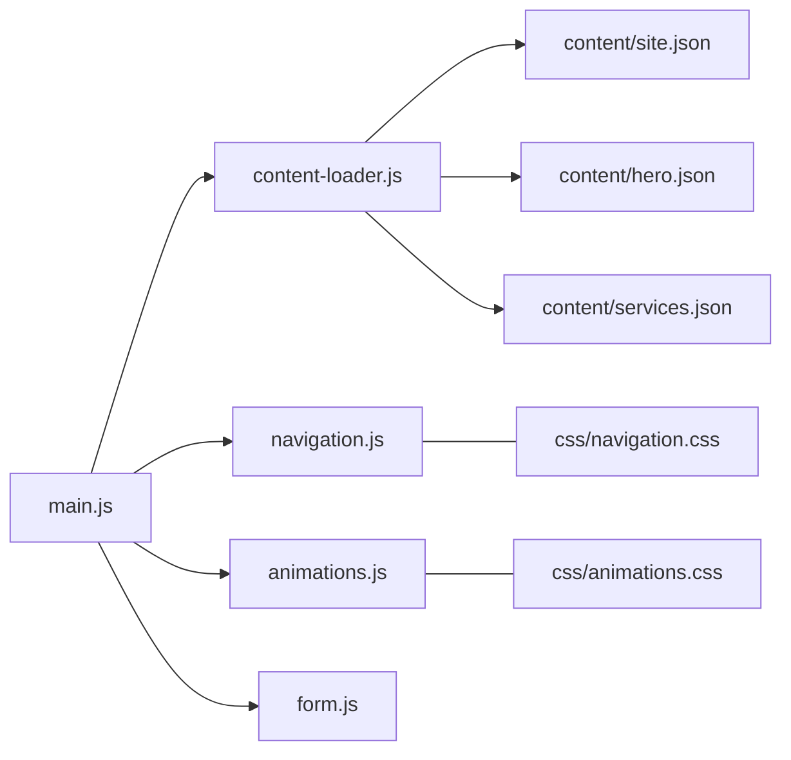

# JavaScript Modules

<cite>
**Referenced Files in This Document**
- [main.js](file://js/main.js)
- [content-loader.js](file://js/content-loader.js)
- [navigation.js](file://js/navigation.js)
- [animations.js](file://js/animations.js)
- [form.js](file://js/form.js)
- [index.html](file://index.html)
- [site.json](file://content/site.json)
- [hero.json](file://content/hero.json)
- [services.json](file://content/services.json)
- [animations.css](file://css/animations.css)
- [navigation.css](file://css/navigation.css)
</cite>

## Table of Contents
1. [Introduction](#introduction)
2. [Project Structure](#project-structure)
3. [Core Components](#core-components)
4. [Architecture Overview](#architecture-overview)
5. [Detailed Component Analysis](#detailed-component-analysis)
6. [Dependency Analysis](#dependency-analysis)
7. [Performance Considerations](#performance-considerations)
8. [Troubleshooting Guide](#troubleshooting-guide)
9. [Conclusion](#conclusion)
10. [Appendices](#appendices)

## Introduction
This document explains the JavaScript module system powering the Victory Marketing website. It focuses on the main application module as the central orchestrator and details how the ContentLoader module coordinates parallel JSON fetching, content rendering, and template management. It also covers the Navigation module’s responsive navigation, smooth scrolling, mobile menu, and scroll-to-top features; the Animation module’s particle systems, scroll-triggered animations, and interactive effects; and the Form module’s contact form validation, submission processing, and user feedback. The document outlines import/export patterns, initialization sequences, event-driven architecture, and practical guidance for extending the modular system.

## Project Structure
The website is structured around a modular JavaScript architecture with a single entry point that imports and initializes specialized modules. The HTML defines containers for each content section and provides hooks for navigation, loading, and interactive elements. Stylesheets define responsive layouts and animations, while the content directory supplies JSON data that drives dynamic rendering.

**Diagram sources**
- [index.html](file://index.html)
- [main.js](file://js/main.js)
- [content-loader.js](file://js/content-loader.js)
- [navigation.js](file://js/navigation.js)
- [animations.js](file://js/animations.js)
- [form.js](file://js/form.js)
- [site.json](file://content/site.json)
- [hero.json](file://content/hero.json)
- [services.json](file://content/services.json)
- [navigation.css](file://css/navigation.css)
- [animations.css](file://css/animations.css)

**Section sources**
- [index.html](file://index.html)
- [main.js](file://js/main.js)

## Core Components
- Main application module: Orchestrates initialization order, content loading, rendering, and interactive feature activation.
- ContentLoader module: Loads all JSON content in parallel, stores it, and renders each section into the DOM using dedicated render methods.
- Navigation module: Implements scroll-aware navbar, mobile menu toggle, smooth scrolling to anchors, and scroll-to-top behavior.
- Animation module: Creates floating particles, animates stat counters on scroll, reveals cards and steps on scroll, and adds interactive glow on service cards.
- Form module: Handles contact form submission, prevents default behavior, shows user feedback, and resets the form.

Key import/export patterns:
- ES modules are used throughout. The main module imports named exports from other modules and invokes them during initialization.
- Each module exposes a single initialization function or class constructor suitable for orchestration by the main module.

Initialization sequence:
- The main module waits for DOMContentLoaded, creates a ContentLoader instance, loads all JSON content in parallel, renders all sections, and then initializes animations, navigation, and form.

**Section sources**
- [main.js](file://js/main.js)
- [content-loader.js](file://js/content-loader.js)
- [navigation.js](file://js/navigation.js)
- [animations.js](file://js/animations.js)
- [form.js](file://js/form.js)

## Architecture Overview
The system follows an event-driven, modular architecture:
- The main module listens for DOM readiness and coordinates lifecycle events.
- ContentLoader encapsulates data fetching and DOM updates.
- Navigation, Animations, and Form modules register event listeners and apply styles.
- Stylesheets provide responsive behavior and animations.

**Diagram sources**
- [main.js](file://js/main.js)
- [content-loader.js](file://js/content-loader.js)
- [navigation.js](file://js/navigation.js)
- [animations.js](file://js/animations.js)
- [form.js](file://js/form.js)

## Detailed Component Analysis

### Main Application Module
Responsibilities:
- Imports and initializes all other modules.
- Coordinates asynchronous content loading and DOM rendering.
- Ensures interactive features are initialized after content is rendered.
- Hides the pre-JS loader after initialization completes.

Initialization flow:
- On DOMContentLoaded, the main module creates a ContentLoader instance, awaits loadAll(), calls renderAll(), and then invokes each module’s initialization function in sequence.

Error handling:
- Wraps initialization in a try/catch block and logs errors to the console.
- Ensures the loader element is hidden after a short delay regardless of success or failure.

Extensibility:
- New modules can be imported and invoked by adding their initialization call in the main module after renderAll().

**Section sources**
- [main.js](file://js/main.js)

### ContentLoader Module
Responsibilities:
- Fetches JSON content from the content directory in parallel.
- Stores merged data for rendering.
- Renders each section into the DOM using dedicated render methods.

Parallel fetching:
- Uses Promise.all to fetch site, hero, about, mission, services, why-us, process, team, testimonials, contact, and footer content concurrently.

Rendering pipeline:
- renderAll() calls renderNav(), renderHero(), renderAbout(), renderMission(), renderServices(), renderWhyUs(), renderProcess(), renderTestimonials(), renderTeam(), renderCTA(), renderContact(), and renderFooter().
- Each render method targets a container identified by a data-section attribute in the HTML.

Template management:
- Each render method builds HTML strings using data from the loaded JSON and inserts them into the corresponding container.
- Some renderings include dynamic lists and repeated blocks (e.g., testimonials slider, service cards, team members).

Example data sources:
- Site branding and social links are used for navigation and footer branding.
- Hero headline segments and stats are used to build the hero section.
- Services data drives the services grid.

**Section sources**
- [content-loader.js](file://js/content-loader.js)
- [site.json](file://content/site.json)
- [hero.json](file://content/hero.json)
- [services.json](file://content/services.json)

### Navigation Module
Responsibilities:
- Applies a scroll-aware style change to the navbar.
- Toggles a mobile menu and closes it when a link is clicked.
- Provides a scroll-to-top button that appears when scrolling down and smoothly scrolls to the top when clicked.
- Adds smooth scrolling to anchor links.

Event-driven behavior:
- Listeners are attached for scroll, click, and click events on navigation elements.

Responsive behavior:
- The mobile menu button and navigation links are styled via CSS to adapt to smaller screens.

**Section sources**
- [navigation.js](file://js/navigation.js)
- [navigation.css](file://css/navigation.css)
- [index.html](file://index.html)

### Animation Module
Responsibilities:
- Generates floating particles inside the hero section.
- Animates stat counters when they come into view.
- Reveals cards and steps on scroll with fade and translate transitions.
- Adds a mouse-tracking glow effect on service cards.

Particle system:
- Creates 30 particle elements with randomized positions and animation delays/durations and appends them to the hero particles container.

Stat counters:
- Observes stat-number elements with IntersectionObserver.
- Animates numeric values toward targets with a fixed interval loop.

Scroll reveal:
- Observes multiple card and step elements.
- Sets initial opacity/transform and transitions them into view when intersecting.

Mouse glow:
- Computes mouse position relative to each service card and sets CSS custom properties for gradient positioning.

**Section sources**
- [animations.js](file://js/animations.js)
- [animations.css](file://css/animations.css)
- [index.html](file://index.html)

### Form Module
Responsibilities:
- Attaches a submit handler to the contact form.
- Prevents default submission behavior.
- Displays a success message and resets the form.

User feedback:
- Reads a success message from a data attribute on the submit button if present; otherwise falls back to a default message.

**Section sources**
- [form.js](file://js/form.js)
- [content-loader.js](file://js/content-loader.js)

## Dependency Analysis
Module dependencies and relationships:
- Main depends on ContentLoader, Navigation, Animations, and Form.
- ContentLoader depends on the content directory JSON files.
- Navigation depends on DOM elements defined in index.html and navigation.css.
- Animations depends on DOM elements defined in index.html and animations.css.
- Form depends on the contact form element defined in index.html.

**Diagram sources**
- [main.js](file://js/main.js)
- [content-loader.js](file://js/content-loader.js)
- [navigation.js](file://js/navigation.js)
- [animations.js](file://js/animations.js)
- [form.js](file://js/form.js)
- [site.json](file://content/site.json)
- [hero.json](file://content/hero.json)
- [services.json](file://content/services.json)
- [navigation.css](file://css/navigation.css)
- [animations.css](file://css/animations.css)

**Section sources**
- [main.js](file://js/main.js)
- [content-loader.js](file://js/content-loader.js)
- [navigation.js](file://js/navigation.js)
- [animations.js](file://js/animations.js)
- [form.js](file://js/form.js)

## Performance Considerations
- Parallel content loading: ContentLoader uses Promise.all to fetch all JSON files concurrently, minimizing total load time.
- IntersectionObserver usage: Animations rely on IntersectionObserver for efficient scroll-triggered effects without continuous scroll handlers.
- Minimal DOM manipulation: Rendering is batched via renderAll() to reduce reflows.
- CSS animations: Particle and loader animations are handled via CSS keyframes to leverage GPU acceleration.
- Event delegation: Navigation toggles and smooth scrolling are attached once per module initialization.

[No sources needed since this section provides general guidance]

## Troubleshooting Guide
Common issues and resolutions:
- Content not rendering:
  - Verify that each section container has the correct data-section attribute.
  - Confirm that loadAll() resolves successfully and renderAll() is called after loading.
- Particles not appearing:
  - Ensure the hero particles container exists and the animations stylesheet is loaded.
- Stats not animating:
  - Confirm that stat-number elements exist and are observed by IntersectionObserver.
- Navigation not responding:
  - Check that the navbar, mobile menu button, and scroll-to-top button IDs match the HTML.
- Form not submitting:
  - Ensure the contact form element exists and the submit handler is attached.

**Section sources**
- [content-loader.js](file://js/content-loader.js)
- [animations.js](file://js/animations.js)
- [navigation.js](file://js/navigation.js)
- [form.js](file://js/form.js)
- [index.html](file://index.html)

## Conclusion
The Victory Marketing website employs a clean, modular JavaScript architecture centered on the main application module. ContentLoader efficiently orchestrates parallel content fetching and DOM rendering, while Navigation, Animations, and Form modules provide responsive behavior, engaging visuals, and user interaction. The system’s event-driven design and explicit initialization sequence enable straightforward extensibility. Adding new functionality involves creating a new module with a clear initialization function, importing it in main.js, and invoking it after content rendering.

[No sources needed since this section summarizes without analyzing specific files]

## Appendices

### Initialization Sequence Details
- DOMContentLoaded triggers main.init().
- ContentLoader.loadAll() performs parallel fetches and stores merged data.
- ContentLoader.renderAll() populates all section containers.
- Animations: initParticles(), initStatCounters(), initScrollReveal(), initServiceCardGlow().
- Navigation: initNavigation().
- Form: initContactForm().
- Loader hiding occurs after a short delay.

**Section sources**
- [main.js](file://js/main.js)
- [content-loader.js](file://js/content-loader.js)
- [animations.js](file://js/animations.js)
- [navigation.js](file://js/navigation.js)
- [form.js](file://js/form.js)

### Extending the Modular System
- Create a new module file exporting an initialization function.
- Import the module in main.js and invoke it after renderAll().
- Add any required DOM elements or styles in the HTML/CSS.
- Use IntersectionObserver and CSS animations for performance-sensitive features.
- Keep modules focused and single-responsibility for maintainability.

[No sources needed since this section provides general guidance]