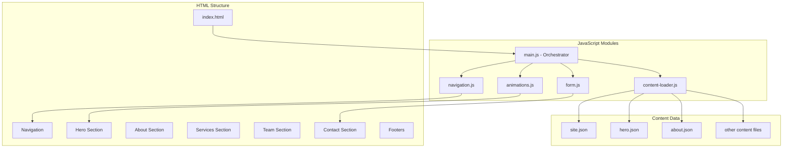
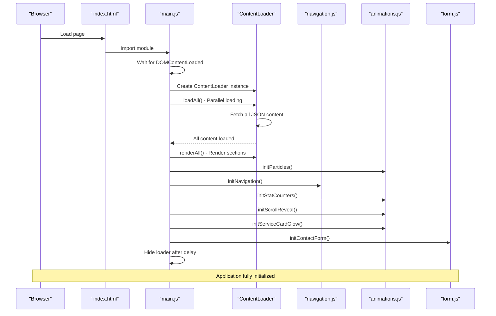
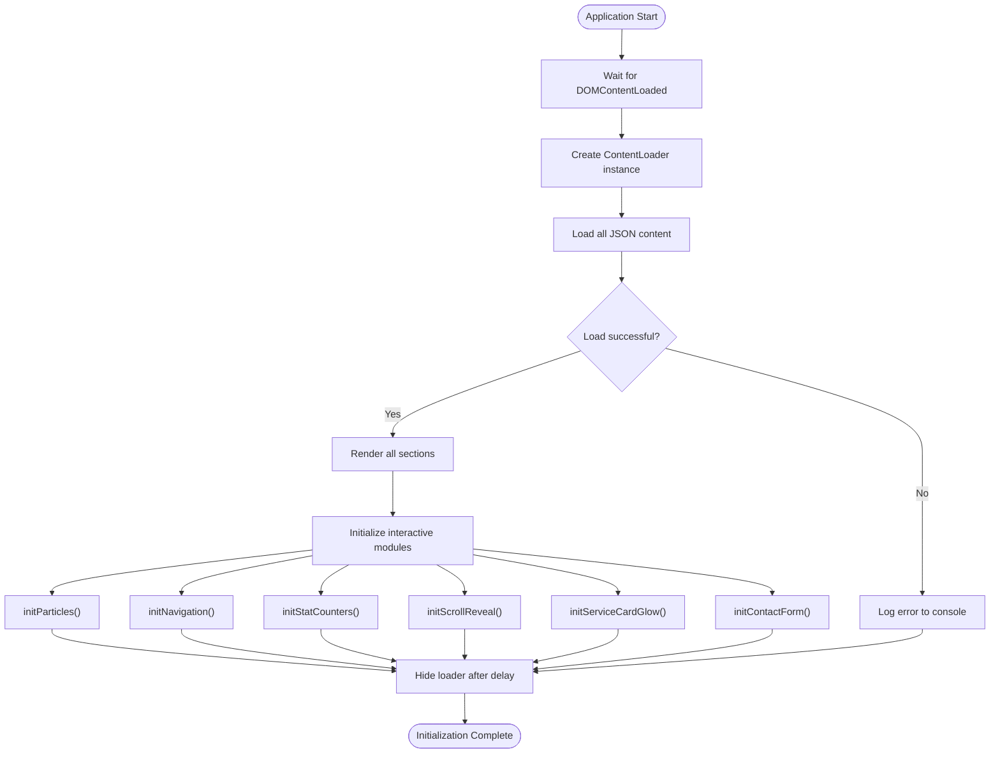
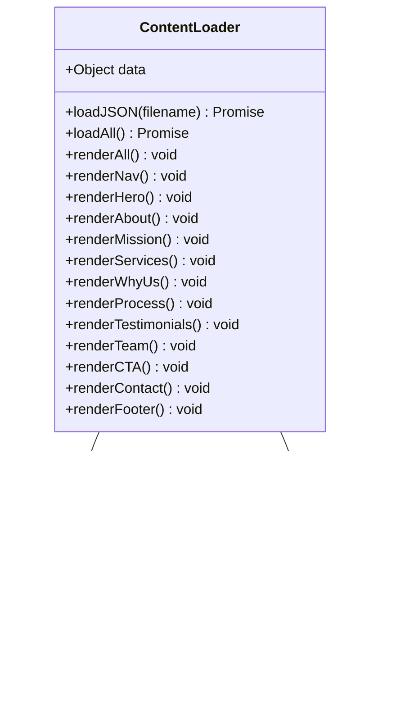
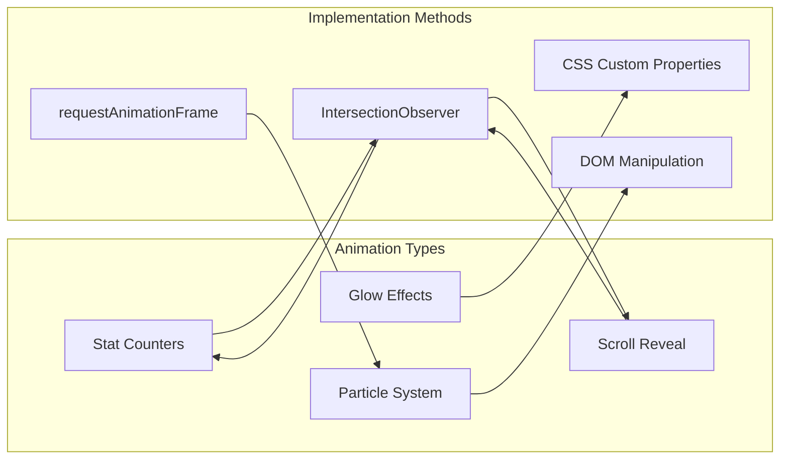
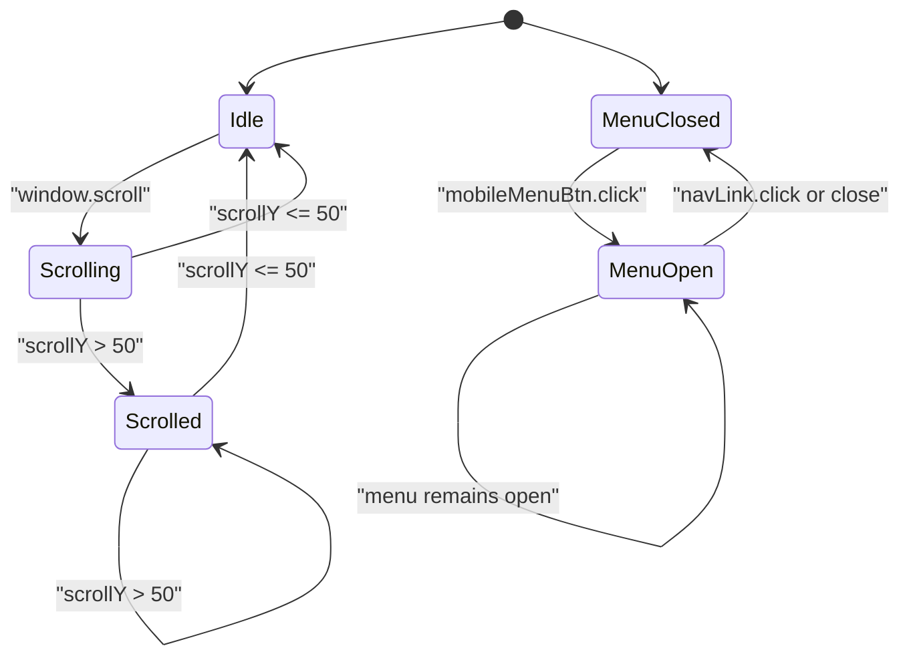
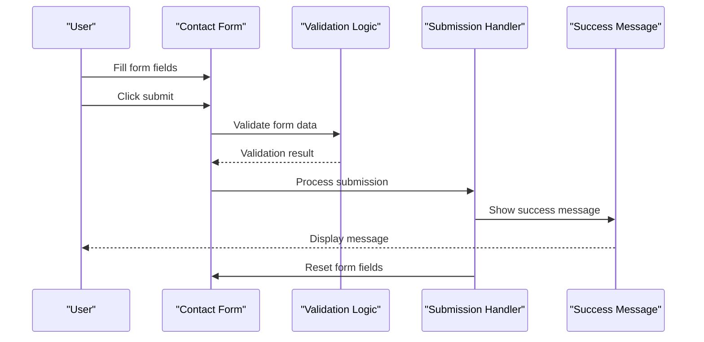
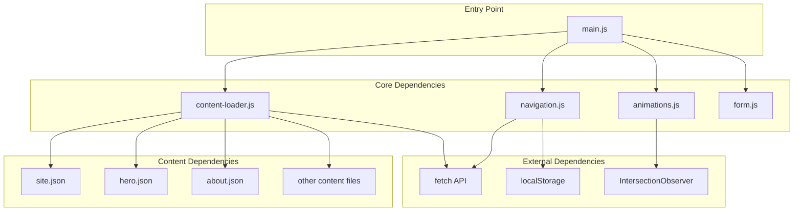

# Main Application Module

<cite>
**Referenced Files in This Document**
- [main.js](file://js/main.js)
- [content-loader.js](file://js/content-loader.js)
- [navigation.js](file://js/navigation.js)
- [animations.js](file://js/animations.js)
- [form.js](file://js/form.js)
- [index.html](file://index.html)
- [site.json](file://content/site.json)
- [hero.json](file://content/hero.json)
- [about.json](file://content/about.json)
</cite>

## Table of Contents
1. [Introduction](#introduction)
2. [Project Structure](#project-structure)
3. [Core Components](#core-components)
4. [Architecture Overview](#architecture-overview)
5. [Detailed Component Analysis](#detailed-component-analysis)
6. [Dependency Analysis](#dependency-analysis)
7. [Performance Considerations](#performance-considerations)
8. [Troubleshooting Guide](#troubleshooting-guide)
9. [Conclusion](#conclusion)

## Introduction
This document provides comprehensive documentation for the main application module that serves as the central orchestrator for the Victory Marketing website. The main module coordinates all other JavaScript modules, manages the application lifecycle, handles initialization sequences, and implements error handling and cleanup procedures. It follows an event-driven architecture where different modules communicate through the main orchestrator, enabling modular development and maintainable code organization.

The main module acts as the primary entry point for the application, importing and coordinating content loading, navigation, animations, and form handling modules. It ensures proper loading order, dependency resolution, and graceful degradation strategies for robust user experiences.

## Project Structure
The Victory Marketing website follows a modular JavaScript architecture with clear separation of concerns:

**Diagram sources**
- [index.html:1-106](file://index.html#L1-L106)
- [main.js:1-41](file://js/main.js#L1-L41)

The project structure demonstrates a clean separation between presentation (HTML/CSS), data (JSON content), and logic (JavaScript modules). The main orchestrator module sits at the center, coordinating all other components.

**Section sources**
- [index.html:1-106](file://index.html#L1-L106)
- [main.js:1-41](file://js/main.js#L1-L41)

## Core Components
The main application module consists of several key components that work together to create a cohesive user experience:

### Main Orchestrator Module
The main orchestrator module serves as the central coordination point for all application functionality. It imports and initializes specialized modules while managing the overall application lifecycle.

### Content Loading System
The content loader module handles asynchronous fetching and rendering of all website sections from JSON data files. It implements parallel loading for optimal performance and provides individual render methods for each section.

### Interactive Features Module
The animations module manages various visual effects including particle systems, stat counters, scroll reveals, and interactive hover effects. These enhancements provide engaging user experiences without compromising performance.

### Navigation System
The navigation module handles responsive navigation behavior, smooth scrolling, mobile menu functionality, and scroll-to-top capabilities. It ensures seamless user interaction across all device sizes.

### Form Management
The form module provides contact form handling with validation and submission processing. It offers customizable success messaging and maintains user experience continuity.

**Section sources**
- [main.js:6-9](file://js/main.js#L6-L9)
- [content-loader.js:6-443](file://js/content-loader.js#L6-L443)
- [animations.js:1-98](file://js/animations.js#L1-L98)
- [navigation.js:1-55](file://js/navigation.js#L1-L55)
- [form.js:1-17](file://js/form.js#L1-L17)

## Architecture Overview
The application follows a modular, event-driven architecture where the main orchestrator coordinates specialized modules through a well-defined initialization sequence:

**Diagram sources**
- [main.js:11-41](file://js/main.js#L11-L41)
- [content-loader.js:18-53](file://js/content-loader.js#L18-L53)

The architecture implements several key design patterns:

- **Module Pattern**: Each functionality is encapsulated in separate modules
- **Event-Driven Architecture**: Modules communicate through initialization events
- **Dependency Injection**: Modules are imported and passed to the orchestrator
- **Parallel Processing**: Content loading uses Promise.all for optimal performance
- **Graceful Degradation**: Individual module failures don't prevent overall application startup

**Section sources**
- [main.js:11-37](file://js/main.js#L11-L37)
- [content-loader.js:18-37](file://js/content-loader.js#L18-L37)

## Detailed Component Analysis

### Main Orchestrator Module Analysis
The main orchestrator module implements a sophisticated initialization sequence that ensures proper loading order and error handling:

**Diagram sources**
- [main.js:11-41](file://js/main.js#L11-L41)

The initialization sequence demonstrates several important characteristics:

- **Asynchronous Loading**: Uses async/await for content loading
- **Parallel Processing**: Loads all content simultaneously for optimal performance
- **Error Handling**: Implements try/catch for graceful failure handling
- **Cleanup Procedures**: Ensures loader element is hidden regardless of success/failure
- **Timing Control**: Delays loader hiding to ensure smooth transitions

**Section sources**
- [main.js:11-41](file://js/main.js#L11-L41)

### Content Loader Module Analysis
The content loader module provides comprehensive content management with individual render methods for each website section:

**Diagram sources**
- [content-loader.js:6-443](file://js/content-loader.js#L6-L443)
- [site.json:1-18](file://content/site.json#L1-L18)
- [hero.json:1-34](file://content/hero.json#L1-L34)

The content loader implements several advanced features:

- **Parallel Loading**: Uses Promise.all to fetch all content simultaneously
- **Individual Rendering**: Each section has dedicated render methods
- **Template Composition**: Builds HTML templates from JSON data
- **Dynamic Content**: Supports arrays and complex nested structures
- **Fallback Handling**: Gracefully handles missing containers

**Section sources**
- [content-loader.js:18-53](file://js/content-loader.js#L18-L53)
- [site.json:1-18](file://content/site.json#L1-L18)
- [hero.json:1-34](file://content/hero.json#L1-L34)

### Animation System Analysis
The animation module provides multiple visual enhancement features implemented through modern web APIs:

**Diagram sources**
- [animations.js:6-98](file://js/animations.js#L6-L98)

Each animation type serves specific user experience goals:

- **Particle System**: Creates immersive background effects in the hero section
- **Stat Counters**: Provides engaging numerical animations with intersection observers
- **Scroll Reveal**: Adds entrance animations for content sections
- **Glow Effects**: Implements interactive hover effects with mouse tracking

**Section sources**
- [animations.js:6-98](file://js/animations.js#L6-L98)

### Navigation System Analysis
The navigation module implements responsive behavior with modern JavaScript features:

**Diagram sources**
- [navigation.js:6-55](file://js/navigation.js#L6-L55)

The navigation system provides comprehensive functionality:

- **Responsive Design**: Adapts to mobile and desktop screen sizes
- **Smooth Scrolling**: Implements smooth scrolling for anchor links
- **Scroll Detection**: Changes navbar appearance based on scroll position
- **Accessibility**: Supports keyboard navigation and screen readers
- **Performance**: Uses efficient event listeners and CSS transitions

**Section sources**
- [navigation.js:6-55](file://js/navigation.js#L6-L55)

### Form Management Analysis
The form module provides essential contact form functionality with user-friendly features:

**Diagram sources**
- [form.js:5-16](file://js/form.js#L5-L16)

The form system implements several user experience improvements:

- **Prevent Default Behavior**: Stops page reload during submission
- **Customizable Messages**: Allows configurable success messages
- **Form Reset**: Clears form fields after successful submission
- **Accessibility**: Supports keyboard navigation and screen readers
- **Validation Ready**: Provides foundation for future validation enhancements

**Section sources**
- [form.js:5-16](file://js/form.js#L5-L16)

## Dependency Analysis
The application exhibits excellent modularity with clear dependency relationships:

**Diagram sources**
- [main.js:6-9](file://js/main.js#L6-L9)
- [content-loader.js:12-16](file://js/content-loader.js#L12-L16)
- [animations.js:45-58](file://js/animations.js#L45-L58)

The dependency analysis reveals several important characteristics:

- **Low Coupling**: Modules are loosely coupled through imports
- **High Cohesion**: Each module has a single responsibility
- **Clear Interfaces**: Well-defined export/import patterns
- **External API Usage**: Leverages modern browser APIs
- **Content Decoupling**: Data and logic are separated

**Section sources**
- [main.js:6-9](file://js/main.js#L6-L9)
- [content-loader.js:12-16](file://js/content-loader.js#L12-L16)

## Performance Considerations
The application implements several performance optimization strategies:

### Asynchronous Loading
The main orchestrator uses parallel loading for optimal performance:
- All content is fetched simultaneously using Promise.all
- Individual module initialization occurs after content rendering
- Loader hiding implements delayed cleanup to ensure smooth transitions

### Efficient DOM Manipulation
Animation modules utilize modern APIs for optimal performance:
- IntersectionObserver reduces layout thrashing
- requestAnimationFrame ensures smooth animations
- CSS custom properties minimize reflows

### Memory Management
The application implements proper cleanup procedures:
- Event listeners are attached once during initialization
- Observers are disconnected when elements are removed
- Timers are cleared appropriately

### Graceful Degradation
The system handles failures gracefully:
- Individual module failures don't prevent overall initialization
- Missing DOM elements are handled with defensive checks
- Fallback behavior ensures basic functionality

## Troubleshooting Guide
Common issues and their solutions:

### Initialization Failures
**Problem**: Application fails to initialize properly
**Solution**: Check console for error messages, verify all modules are imported correctly, ensure DOMContentLoaded event fires

### Content Loading Issues
**Problem**: Content fails to load from JSON files
**Solution**: Verify file paths in content-loader.js match actual JSON file locations, check network tab for 404 errors, ensure server supports CORS if applicable

### Animation Performance Issues
**Problem**: Animations cause performance problems
**Solution**: Reduce particle count in animations.js, adjust IntersectionObserver thresholds, implement throttling for mouse events

### Navigation Problems
**Problem**: Navigation doesn't work on mobile devices
**Solution**: Check CSS media queries, verify mobile menu button exists, ensure touch event handlers are attached

### Form Submission Issues
**Problem**: Form submissions don't work as expected
**Solution**: Verify form element IDs match HTML structure, check for JavaScript errors in console, ensure preventDefault is working

**Section sources**
- [main.js:28-36](file://js/main.js#L28-L36)
- [content-loader.js:12-16](file://js/content-loader.js#L12-L16)
- [animations.js:45-58](file://js/animations.js#L45-L58)

## Conclusion
The main application module successfully orchestrates a sophisticated, modular JavaScript architecture for the Victory Marketing website. Its implementation demonstrates several key strengths:

**Architectural Excellence**: Clean separation of concerns with well-defined module boundaries
**Performance Optimization**: Strategic use of asynchronous loading and modern browser APIs
**User Experience Focus**: Comprehensive interactive features with graceful degradation
**Maintainability**: Clear code organization and modular design enable easy extension

The module's event-driven architecture enables seamless communication between components while maintaining loose coupling. The initialization sequence ensures reliable startup behavior, and the error handling mechanisms provide robust fallback scenarios.

For extending the application, developers can leverage the established patterns to add new functionality while maintaining backward compatibility. The modular structure supports incremental enhancements without disrupting existing features.