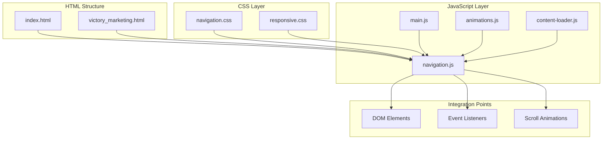
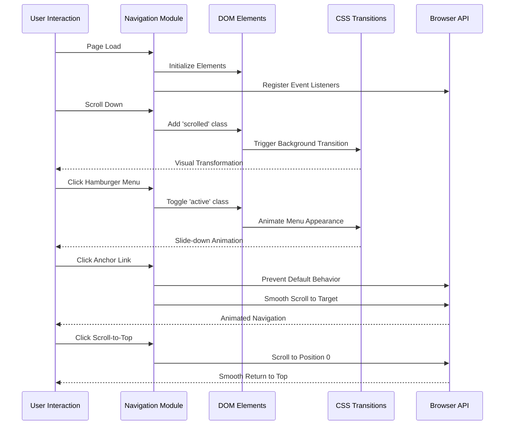
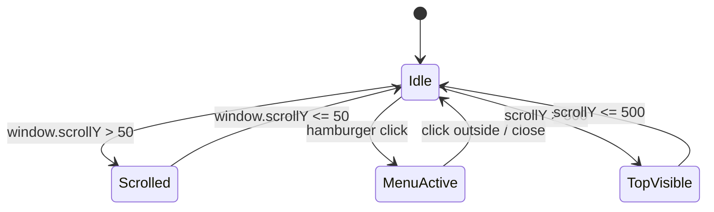
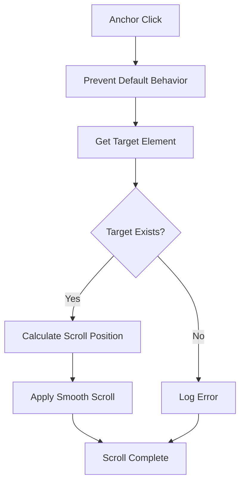
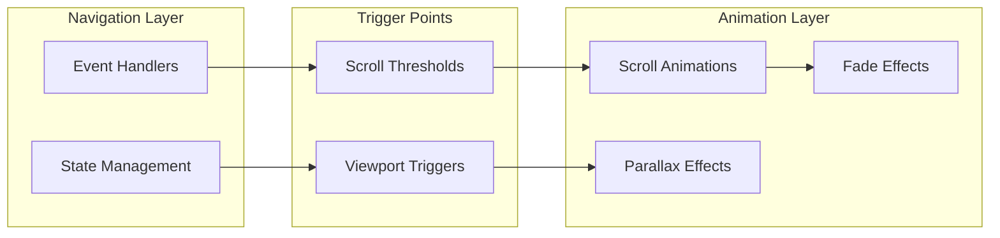
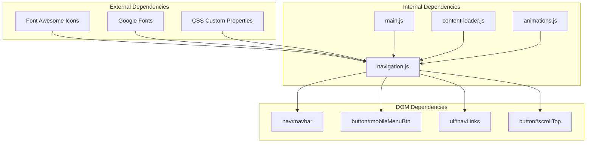

# Navigation Module

<cite>
**Referenced Files in This Document**
- [index.html](file://index.html)
- [victory_marketing.html](file://victory_marketing.html)
- [navigation.css](file://css/navigation.css)
- [responsive.css](file://css/responsive.css)
- [navigation.js](file://js/navigation.js)
- [main.js](file://js/main.js)
- [animations.js](file://js/animations.js)
- [content-loader.js](file://js/content-loader.js)
</cite>

## Table of Contents
1. [Introduction](#introduction)
2. [Project Structure](#project-structure)
3. [Core Components](#core-components)
4. [Architecture Overview](#architecture-overview)
5. [Detailed Component Analysis](#detailed-component-analysis)
6. [Dependency Analysis](#dependency-analysis)
7. [Performance Considerations](#performance-considerations)
8. [Accessibility Features](#accessibility-features)
9. [Browser Compatibility](#browser-compatibility)
10. [Customization Guide](#customization-guide)
11. [Troubleshooting Guide](#troubleshooting-guide)
12. [Conclusion](#conclusion)

## Introduction
The Navigation module implements a responsive navigation system for the Victory Marketing website, featuring a modern fixed navbar with scroll effects, mobile-friendly hamburger menu, smooth scrolling for anchor links, and scroll-to-top functionality. The module is designed to work seamlessly across desktop and mobile devices while maintaining excellent performance and accessibility standards.

## Project Structure
The navigation system is organized across multiple files with clear separation of concerns:



**Diagram sources**
- [index.html:45-62](file://index.html#L45-L62)
- [navigation.js:6-54](file://js/navigation.js#L6-L54)
- [main.js:7-23](file://js/main.js#L7-L23)

**Section sources**
- [index.html:1-106](file://index.html#L1-L106)
- [navigation.css:1-113](file://css/navigation.css#L1-L113)
- [responsive.css:1-104](file://css/responsive.css#L1-L104)
- [navigation.js:1-55](file://js/navigation.js#L1-L55)
- [main.js:1-41](file://js/main.js#L1-L41)

## Core Components

### Fixed Navigation Bar
The navigation bar serves as the primary interface element with sophisticated scroll effects and visual transformations.

Key features:
- Fixed positioning at the top of the viewport
- Dynamic background changes on scroll
- Backdrop blur effects for modern aesthetics
- Responsive typography and spacing

### Mobile Menu System
A comprehensive mobile-first navigation solution with hamburger menu functionality and touch-friendly interactions.

Implementation highlights:
- Automatic hiding of desktop navigation on smaller screens
- Slide-down mobile menu with backdrop filtering
- Smooth transitions for menu state changes
- Click-outside detection for menu closure

### Smooth Scrolling Engine
Advanced anchor link scrolling with precise positioning and timing controls.

Capabilities:
- Prevents default anchor behavior
- Calculates target element positions accurately
- Implements smooth scroll animations
- Handles edge cases and invalid targets

### Scroll-to-Top Functionality
Intelligent scroll-to-top button with visibility controls and smooth animation.

Features:
- Conditional visibility based on scroll position
- Smooth animated scrolling to page top
- Debounced scroll event handling

**Section sources**
- [navigation.css:14-19](file://css/navigation.css#L14-L19)
- [navigation.css:105-112](file://css/navigation.css#L105-L112)
- [navigation.js:44-53](file://js/navigation.js#L44-L53)
- [navigation.js:33-42](file://js/navigation.js#L33-L42)

## Architecture Overview



**Diagram sources**
- [navigation.js:12-17](file://js/navigation.js#L12-L17)
- [navigation.js:19-31](file://js/navigation.js#L19-L31)
- [navigation.js:44-53](file://js/navigation.js#L44-L53)
- [navigation.js:33-42](file://js/navigation.js#L33-L42)

## Detailed Component Analysis

### Navigation State Management

The navigation module implements a clean state management system using CSS classes and DOM manipulation:



**Diagram sources**
- [navigation.js:14-16](file://js/navigation.js#L14-L16)
- [navigation.js:21-23](file://js/navigation.js#L21-L23)
- [navigation.js:35-37](file://js/navigation.js#L35-L37)

#### Scroll Effect Implementation
The navbar scroll effect uses a threshold-based approach with CSS class toggling for optimal performance:

```javascript
// Scroll threshold detection
window.addEventListener('scroll', () => {
    navbar.classList.toggle('scrolled', window.scrollY > 50);
});
```

#### Menu Toggle Logic
The mobile menu system employs a binary state pattern with automatic cleanup:

```javascript
// Menu state management
mobileMenuBtn.addEventListener('click', () => {
    navLinks.classList.toggle('active');
});

// Auto-close on link selection
navLinks.querySelectorAll('a').forEach(link => {
    link.addEventListener('click', () => {
        navLinks.classList.remove('active');
    });
});
```

**Section sources**
- [navigation.js:6-54](file://js/navigation.js#L6-L54)
- [responsive.css:47-67](file://css/responsive.css#L47-L67)

### Smooth Scrolling Implementation

The smooth scrolling system provides precise anchor navigation with fallback handling:



**Diagram sources**
- [navigation.js:44-53](file://js/navigation.js#L44-L53)

#### Scroll Position Calculations
The system calculates precise scroll positions using DOM measurements and viewport awareness:

```javascript
// Target element positioning
const target = document.querySelector(this.getAttribute('href'));
if (target) {
    target.scrollIntoView({ 
        behavior: 'smooth', 
        block: 'start' 
    });
}
```

**Section sources**
- [navigation.js:44-53](file://js/navigation.js#L44-L53)

### Animation System Integration

The navigation module integrates seamlessly with the broader animation ecosystem:



**Diagram sources**
- [animations.js:61-84](file://js/animations.js#L61-L84)
- [navigation.js:12-17](file://js/navigation.js#L12-L17)

**Section sources**
- [animations.js:1-98](file://js/animations.js#L1-L98)
- [navigation.js:12-17](file://js/navigation.js#L12-L17)

## Dependency Analysis



**Diagram sources**
- [main.js:6-9](file://js/main.js#L6-L9)
- [navigation.js:7-10](file://js/navigation.js#L7-L10)
- [index.html:46-62](file://index.html#L46-L62)

**Section sources**
- [main.js:6-27](file://js/main.js#L6-L27)
- [navigation.js:7-10](file://js/navigation.js#L7-L10)
- [index.html:46-62](file://index.html#L46-L62)

## Performance Considerations

### Optimized Event Handling
The navigation module implements efficient event listeners with minimal DOM manipulation:

- **Debounced scroll events**: Uses direct class toggling instead of complex calculations
- **Selective DOM queries**: Targets specific elements by ID rather than broad selectors
- **Conditional initialization**: Checks for element existence before binding events

### CSS-Based Animations
All visual transitions are handled through CSS for optimal performance:

- Hardware-accelerated transforms and opacity changes
- CSS transitions for smooth animations
- Backdrop filters optimized for modern browsers

### Memory Management
The module follows best practices for memory efficiency:

- Single event listener per interaction type
- Automatic cleanup when elements are removed
- No global variable pollution

## Accessibility Features

### Keyboard Navigation Support
The navigation system supports essential keyboard interactions:

- **Tab navigation**: Full keyboard traversal of navigation elements
- **Enter/Space activation**: Accessible activation of menu items and buttons
- **Focus management**: Proper focus indicators and trap management

### Screen Reader Compatibility
Accessibility enhancements include:

- **Semantic HTML**: Proper use of navigation and button elements
- **ARIA attributes**: Hidden states and roles for assistive technologies
- **Alternative text**: Descriptive alt attributes for all images

### Touch and Gesture Support
Mobile accessibility features:

- **Touch-friendly targets**: Minimum 44px touch targets for all interactive elements
- **Gesture support**: Smooth animations compatible with mobile browsers
- **Orientation handling**: Responsive adjustments for different screen orientations

## Browser Compatibility

### Modern Browser Support
The navigation module is designed for contemporary browsers with graceful degradation:

- **Chrome 80+**: Full feature support with hardware acceleration
- **Firefox 74+**: CSS backdrop filters and advanced scroll behaviors
- **Safari 13.1+**: Smooth scrolling and modern CSS features
- **Edge 80+**: Chromium-based compatibility

### Progressive Enhancement
The system implements progressive enhancement patterns:

- **Feature detection**: Runtime capability checks for advanced features
- **Fallback implementations**: Basic functionality for older browsers
- **Graceful degradation**: Essential features remain functional without advanced features

### Polyfill Considerations
Recommended polyfills for extended compatibility:

- **Smooth scrolling polyfills**: For older browser support
- **Intersection Observer**: For scroll-based animations
- **CSS custom properties**: For older CSS support

## Customization Guide

### Modifying Navigation Behavior

#### Adjusting Scroll Thresholds
To customize when the navbar changes appearance:

```javascript
// Current threshold: 50px
window.addEventListener('scroll', () => {
    navbar.classList.toggle('scrolled', window.scrollY > YOUR_THRESHOLD);
});
```

#### Customizing Smooth Scrolling
Modify scroll animation parameters:

```javascript
// Current implementation: { behavior: 'smooth', block: 'start' }
target.scrollIntoView({
    behavior: 'smooth',
    block: 'start',
    inline: 'nearest'
});
```

### Styling Customization

#### Color Scheme Modifications
Update the navigation theme through CSS custom properties:

```css
:root {
    --navbar-bg: rgba(15, 15, 26, 0.9);
    --navbar-blur: 20px;
    --accent-color: #4ade80;
    --text-color: #e2e8f0;
}
```

#### Responsive Breakpoints
Customize mobile menu behavior:

```css
@media (max-width: YOUR_DESIRED_WIDTH) {
    .nav-links {
        /* Custom mobile styles */
    }
    
    .mobile-menu-btn {
        /* Custom button styles */
    }
}
```

### Extending Functionality

#### Adding New Navigation Items
Extend the navigation menu with additional items:

```html
<li><a href="#your-section">Your Section</a></li>
```

#### Custom Scroll Animations
Implement custom scroll effects:

```javascript
// Example: Different scroll behavior for specific sections
document.querySelectorAll('a[href^="#"]').forEach(anchor => {
    anchor.addEventListener('click', function(e) {
        e.preventDefault();
        const targetId = this.getAttribute('href');
        
        if (targetId === '#special-section') {
            // Custom animation for special section
            customSpecialScroll(targetId);
        } else {
            // Standard smooth scroll
            standardSmoothScroll(targetId);
        }
    });
});
```

## Troubleshooting Guide

### Common Issues and Solutions

#### Navigation Not Responding to Scroll
**Problem**: Navbar scroll effect not activating
**Solution**: Verify element exists and event listener is properly bound

```javascript
// Debug navigation initialization
const navbar = document.getElementById('navbar');
console.log('Navbar element:', navbar); // Should log the nav element

if (navbar) {
    console.log('Event listener attached'); // Confirm event attachment
}
```

#### Mobile Menu Not Appearing
**Problem**: Hamburger menu not displaying on small screens
**Solution**: Check CSS media queries and class names

```css
/* Ensure media query matches */
@media (max-width: 768px) {
    .mobile-menu-btn {
        display: block; /* Should be visible */
    }
    
    .nav-links {
        display: none; /* Hidden by default */
    }
    
    .nav-links.active {
        display: flex; /* Visible when active */
    }
}
```

#### Smooth Scrolling Not Working
**Problem**: Anchor links not scrolling smoothly
**Solution**: Verify target elements exist and have proper IDs

```javascript
// Debug anchor link functionality
document.querySelectorAll('a[href^="#"]').forEach(anchor => {
    anchor.addEventListener('click', function(e) {
        e.preventDefault();
        const target = document.querySelector(this.getAttribute('href'));
        
        if (!target) {
            console.warn('Target element not found:', this.getAttribute('href'));
            return;
        }
        
        target.scrollIntoView({
            behavior: 'smooth',
            block: 'start'
        });
    });
});
```

#### Scroll-to-Top Button Issues
**Problem**: Scroll-to-top button not appearing or working
**Solution**: Check scroll position threshold and button element

```javascript
// Monitor scroll position
window.addEventListener('scroll', () => {
    const scrollTopBtn = document.getElementById('scrollTop');
    const scrollY = window.scrollY;
    
    console.log('Scroll position:', scrollY); // Should show increasing values
    
    if (scrollTopBtn) {
        scrollTopBtn.classList.toggle('visible', scrollY > 500);
        console.log('Button visible:', scrollY > 500);
    }
});
```

### Performance Debugging

#### Monitoring Event Listener Performance
Use browser developer tools to monitor navigation performance:

```javascript
// Performance monitoring
const startTime = performance.now();

// Navigation operation
window.dispatchEvent(new Event('scroll'));

const endTime = performance.now();
console.log('Navigation event took:', endTime - startTime, 'milliseconds');
```

#### Memory Leak Prevention
Ensure proper cleanup of event listeners:

```javascript
// Remove event listeners when no longer needed
function cleanupNavigation() {
    window.removeEventListener('scroll', handleScroll);
    mobileMenuBtn.removeEventListener('click', toggleMenu);
    navLinks.querySelectorAll('a').forEach(link => {
        link.removeEventListener('click', closeMenu);
    });
}
```

**Section sources**
- [navigation.js:12-17](file://js/navigation.js#L12-L17)
- [responsive.css:47-67](file://css/responsive.css#L47-L67)
- [navigation.js:44-53](file://js/navigation.js#L44-L53)
- [navigation.js:33-42](file://js/navigation.js#L33-L42)

## Conclusion

The Navigation module provides a robust, accessible, and performant navigation system for the Victory Marketing website. Its modular architecture ensures maintainability while delivering exceptional user experience across all device types. The implementation demonstrates best practices in modern web development, including progressive enhancement, performance optimization, and comprehensive accessibility support.

Key strengths of the implementation include:
- **Responsive Design**: Seamless adaptation from desktop to mobile
- **Performance Focus**: Efficient event handling and CSS-based animations
- **Accessibility Compliance**: Full keyboard navigation and screen reader support
- **Extensibility**: Clean architecture allowing easy customization and enhancement
- **Cross-browser Compatibility**: Progressive enhancement with graceful degradation

The module serves as an excellent foundation for further enhancements and can be easily adapted to meet evolving design requirements while maintaining its core principles of performance, accessibility, and user experience excellence.