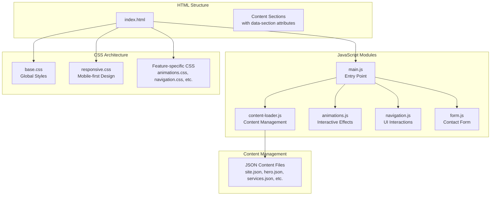
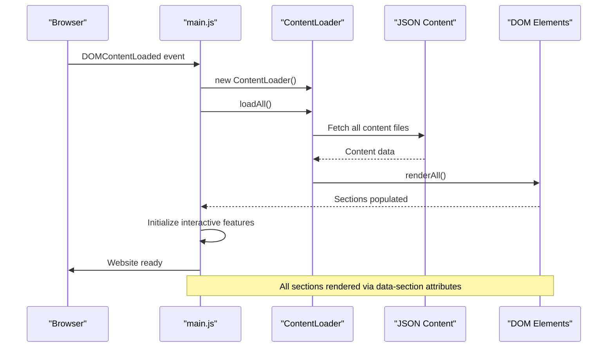
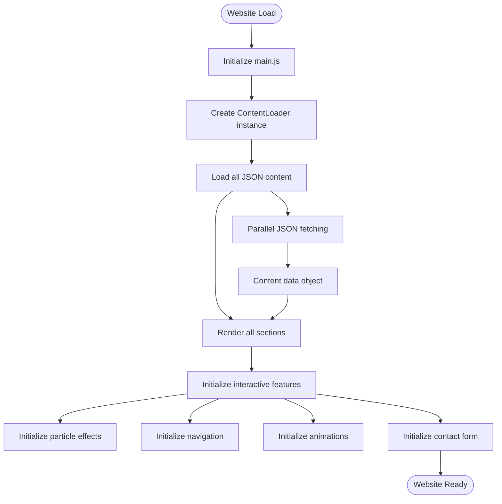
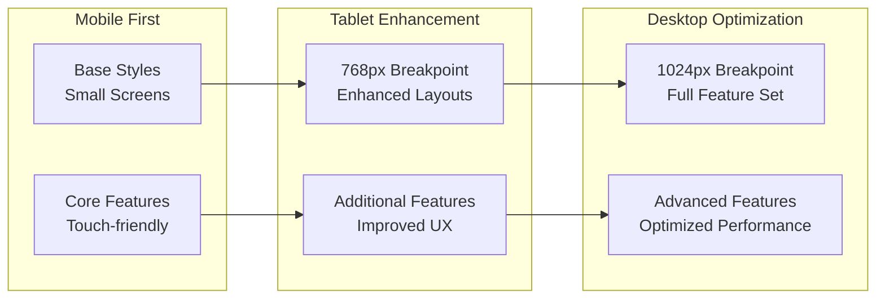
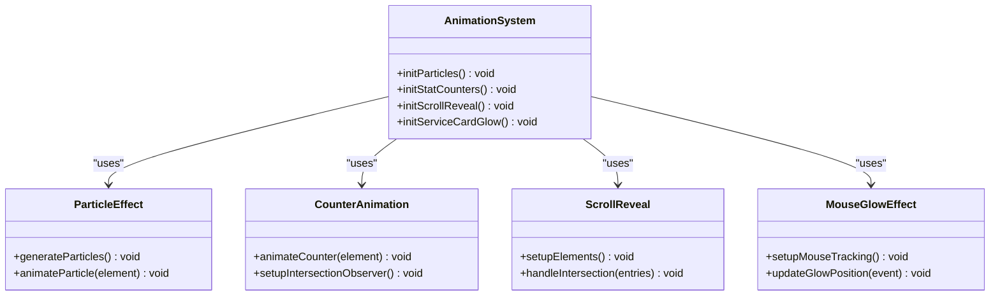
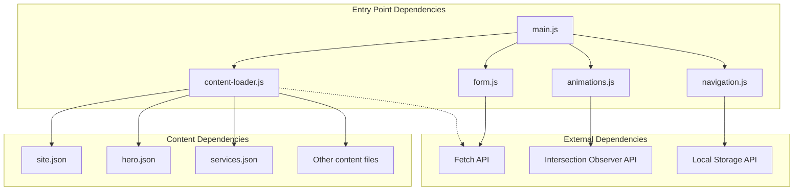

# Project Overview

<cite>
**Referenced Files in This Document**
- [index.html](file://index.html)
- [main.js](file://js/main.js)
- [content-loader.js](file://js/content-loader.js)
- [animations.js](file://js/animations.js)
- [navigation.js](file://js/navigation.js)
- [form.js](file://js/form.js)
- [base.css](file://css/base.css)
- [responsive.css](file://css/responsive.css)
- [site.json](file://content/site.json)
- [hero.json](file://content/hero.json)
- [services.json](file://content/services.json)
- [about.json](file://content/about.json)
- [contact.json](file://content/contact.json)
</cite>

## Table of Contents
1. [Introduction](#introduction)
2. [Project Structure](#project-structure)
3. [Core Components](#core-components)
4. [Architecture Overview](#architecture-overview)
5. [Detailed Component Analysis](#detailed-component-analysis)
6. [Dependency Analysis](#dependency-analysis)
7. [Performance Considerations](#performance-considerations)
8. [Troubleshooting Guide](#troubleshooting-guide)
9. [Conclusion](#conclusion)

## Introduction
Victory Marketing is a professional marketing agency website designed as a digital showcase for marketing services, lead generation, and brand presentation. The project serves as a comprehensive online presence that introduces the agency's capabilities, values, and offerings to potential clients and business owners seeking growth solutions. It emphasizes modern frontend development practices through a vanilla JavaScript architecture with modular CSS and JSON-based content management, delivering an engaging user experience across devices.

The website targets two primary audiences:
- Potential clients seeking marketing services such as content creation, social media management, paid advertising, branding, website development, and SEO/analytics.
- Business owners and entrepreneurs looking for scalable growth solutions and measurable results in the competitive digital landscape.

## Project Structure
The project follows a clean, modular structure optimized for maintainability and scalability:
- HTML5 markup with semantic sections and data attributes for dynamic content rendering
- Modular CSS architecture with separate stylesheets for distinct UI concerns
- JSON-based content management system enabling easy updates without code changes
- ES6 module-based JavaScript architecture with dedicated modules for initialization, content loading, animations, navigation, and form handling

**Diagram sources**
- [index.html:1-106](file://index.html#L1-L106)
- [main.js:1-41](file://js/main.js#L1-L41)
- [content-loader.js:1-443](file://js/content-loader.js#L1-L443)

**Section sources**
- [index.html:1-106](file://index.html#L1-L106)
- [main.js:1-41](file://js/main.js#L1-L41)

## Core Components
The website comprises several core components working together to deliver a cohesive user experience:

### Content Management System
The JSON-based content management system provides centralized control over all website content. Each content file corresponds to a specific section of the website, enabling independent updates without modifying HTML templates. The system supports dynamic content rendering, allowing for easy maintenance and content updates.

### Interactive Navigation
The navigation system features responsive design, smooth scrolling, mobile menu functionality, and scroll-to-top capabilities. It adapts seamlessly across device sizes while maintaining consistent branding and user experience.

### Dynamic Animations
The animation system includes floating particle effects, animated statistics counters, scroll-reveal transitions, and interactive hover effects. These animations enhance user engagement while maintaining performance standards.

### Contact Form Integration
The contact form module provides a complete lead capture solution with validation, submission handling, and user feedback mechanisms. It integrates with the content management system to customize form fields and messaging.

**Section sources**
- [content-loader.js:1-443](file://js/content-loader.js#L1-L443)
- [navigation.js:1-55](file://js/navigation.js#L1-L55)
- [animations.js:1-98](file://js/animations.js#L1-L98)
- [form.js:1-17](file://js/form.js#L1-L17)

## Architecture Overview
The website employs a modular architecture that separates concerns and enables maintainable development:

**Diagram sources**
- [main.js:11-41](file://js/main.js#L11-L41)
- [content-loader.js:18-53](file://js/content-loader.js#L18-L53)

The architecture leverages modern web APIs and ES6 modules to create a robust, maintainable foundation. The separation of concerns ensures that content, presentation, and behavior remain decoupled, facilitating easier updates and modifications.

**Section sources**
- [main.js:1-41](file://js/main.js#L1-L41)
- [content-loader.js:1-443](file://js/content-loader.js#L1-L443)

## Detailed Component Analysis

### Content Loading and Rendering Pipeline
The content loading system operates through a sophisticated pipeline that fetches JSON data and renders it into the appropriate DOM sections:

**Diagram sources**
- [main.js:11-37](file://js/main.js#L11-L37)
- [content-loader.js:18-53](file://js/content-loader.js#L18-L53)

### Responsive Design Implementation
The responsive architecture follows mobile-first principles with progressive enhancement for larger screens:

**Diagram sources**
- [responsive.css:1-104](file://css/responsive.css#L1-L104)

**Section sources**
- [responsive.css:1-104](file://css/responsive.css#L1-L104)

### Animation System Architecture
The animation system combines multiple techniques for optimal performance and user engagement:

**Diagram sources**
- [animations.js:6-98](file://js/animations.js#L6-L98)

**Section sources**
- [animations.js:1-98](file://js/animations.js#L1-L98)

## Dependency Analysis
The project maintains clean dependency relationships through ES6 modules and structured imports:

**Diagram sources**
- [main.js:6-9](file://js/main.js#L6-L9)
- [content-loader.js:12-16](file://js/content-loader.js#L12-L16)

**Section sources**
- [main.js:1-41](file://js/main.js#L1-L41)
- [content-loader.js:1-443](file://js/content-loader.js#L1-L443)

## Performance Considerations
The website implements several performance optimization strategies:

- **Lazy Loading**: Content is loaded asynchronously after initial page render
- **Efficient Animations**: CSS transforms and opacity changes for GPU acceleration
- **Minimal Dependencies**: Pure vanilla JavaScript with no external frameworks
- **Optimized Images**: Placeholder images with proper sizing attributes
- **Modular CSS**: Separate stylesheets for better caching and loading
- **Responsive Images**: Adaptive layouts that reduce bandwidth usage

## Troubleshooting Guide
Common issues and their resolutions:

### Content Loading Issues
- **Problem**: Content fails to load or displays as empty sections
- **Solution**: Verify JSON file paths and check browser console for fetch errors
- **Prevention**: Ensure all JSON files are properly formatted and accessible

### Animation Performance Problems
- **Problem**: Animations appear choppy or slow
- **Solution**: Check browser compatibility for Intersection Observer API
- **Prevention**: Monitor frame rates and adjust animation complexity

### Mobile Navigation Issues
- **Problem**: Mobile menu does not respond or navigation breaks on small screens
- **Solution**: Verify CSS media queries and JavaScript event listeners
- **Prevention**: Test across various device sizes and orientations

**Section sources**
- [content-loader.js:12-16](file://js/content-loader.js#L12-L16)
- [animations.js:45-58](file://js/animations.js#L45-L58)
- [navigation.js:20-31](file://js/navigation.js#L20-L31)

## Conclusion
Victory Marketing represents a modern, professional approach to digital marketing agency websites. Through its vanilla JavaScript architecture, modular CSS design, and JSON-based content management system, it delivers a scalable, maintainable, and performant solution that effectively showcases marketing services and generates leads.

The project demonstrates key modern frontend development practices including:
- Clean separation of concerns through ES6 modules
- Progressive enhancement with mobile-first design
- Performance-conscious animation implementation
- Accessible navigation and user interface patterns
- Maintainable content management through JSON data files

This foundation provides an excellent template for similar marketing agency websites, offering both technical excellence and practical business value through its focus on lead generation and brand presentation.