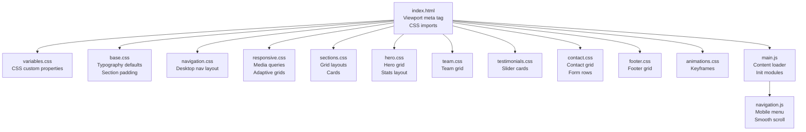
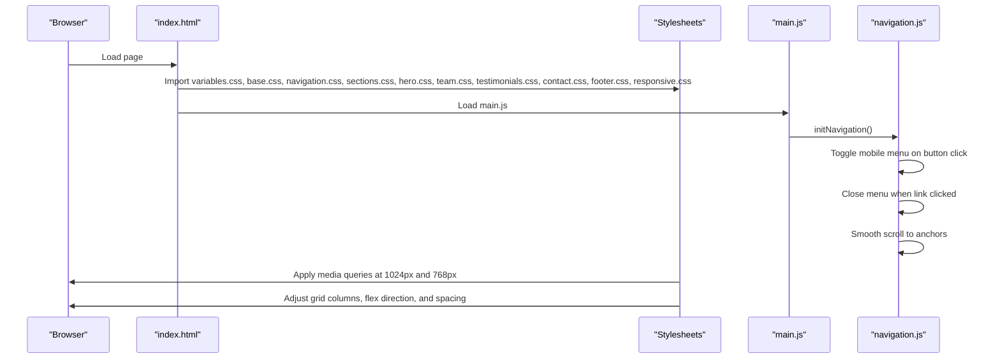
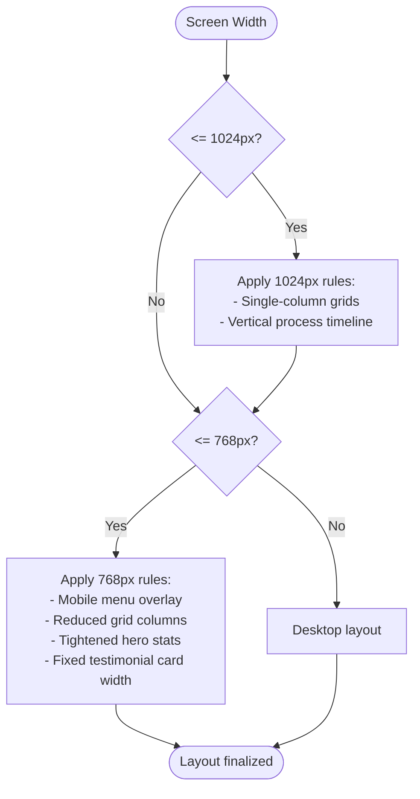
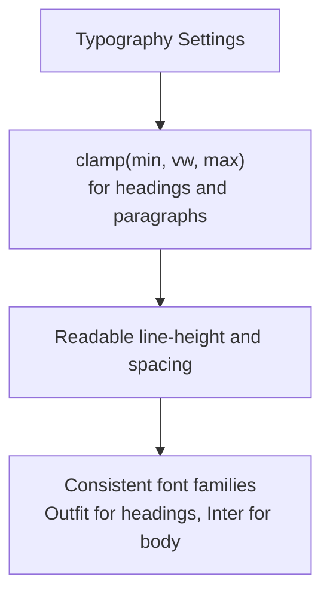
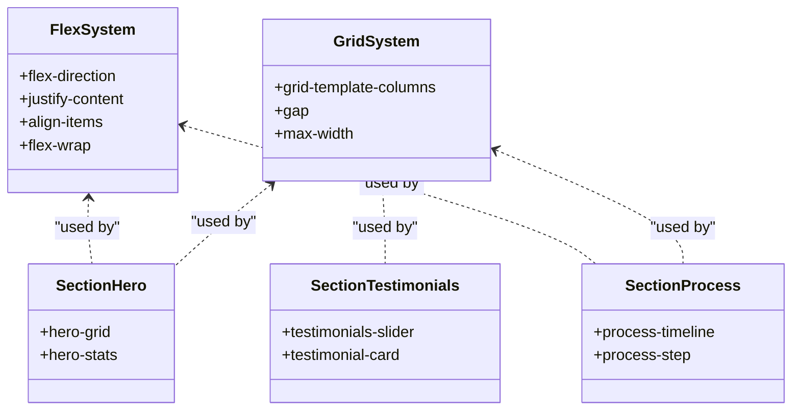
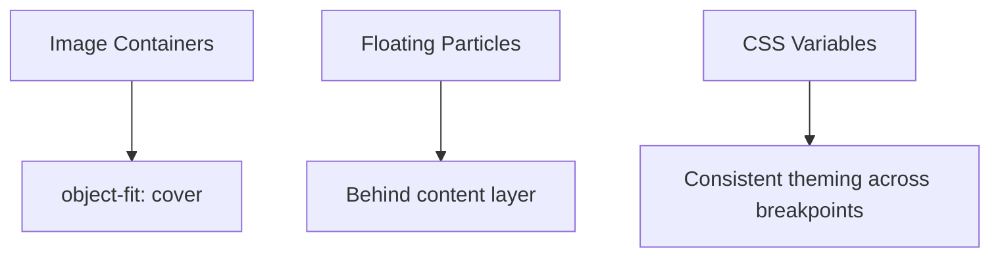
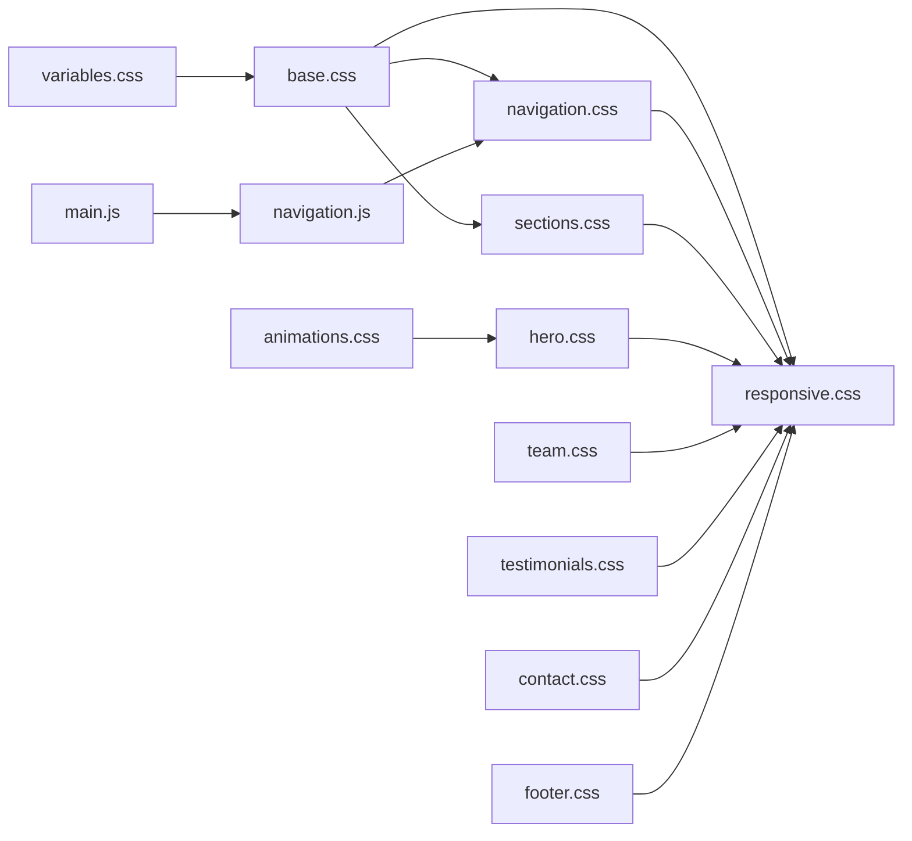

# Responsive Design

<cite>
**Referenced Files in This Document**
- [responsive.css](file://css/responsive.css)
- [navigation.css](file://css/navigation.css)
- [variables.css](file://css/variables.css)
- [base.css](file://css/base.css)
- [sections.css](file://css/sections.css)
- [hero.css](file://css/hero.css)
- [team.css](file://css/team.css)
- [testimonials.css](file://css/testimonials.css)
- [contact.css](file://css/contact.css)
- [footer.css](file://css/footer.css)
- [animations.css](file://css/animations.css)
- [index.html](file://index.html)
- [navigation.js](file://js/navigation.js)
- [main.js](file://js/main.js)
</cite>

## Table of Contents
1. [Introduction](#introduction)
2. [Project Structure](#project-structure)
3. [Core Components](#core-components)
4. [Architecture Overview](#architecture-overview)
5. [Detailed Component Analysis](#detailed-component-analysis)
6. [Dependency Analysis](#dependency-analysis)
7. [Performance Considerations](#performance-considerations)
8. [Troubleshooting Guide](#troubleshooting-guide)
9. [Conclusion](#conclusion)
10. [Appendices](#appendices)

## Introduction
This document explains the responsive design implementation for the Victory Marketing website. It covers the mobile-first approach, adaptive layout strategies, breakpoint management, navigation responsiveness, typography scaling, grid and flex layouts, responsive images, and testing guidelines. It also documents how the project adapts to different screen sizes and addresses common responsive design challenges.

## Project Structure
The responsive design is implemented across modular CSS files and a small set of JavaScript utilities. The HTML page includes a viewport meta tag and loads styles in a specific order to support responsive behavior. The navigation module toggles a mobile menu and applies scroll effects, while JavaScript initializes animations and content rendering after the DOM is ready.



**Diagram sources**
- [index.html:1-34](file://index.html#L1-L34)
- [variables.css:1-12](file://css/variables.css#L1-L12)
- [base.css:1-165](file://css/base.css#L1-L165)
- [navigation.css:1-113](file://css/navigation.css#L1-L113)
- [responsive.css:1-104](file://css/responsive.css#L1-L104)
- [sections.css:1-438](file://css/sections.css#L1-L438)
- [hero.css:1-128](file://css/hero.css#L1-L128)
- [team.css:1-109](file://css/team.css#L1-L109)
- [testimonials.css:1-66](file://css/testimonials.css#L1-L66)
- [contact.css:1-137](file://css/contact.css#L1-L137)
- [footer.css:1-97](file://css/footer.css#L1-L97)
- [animations.css:1-62](file://css/animations.css#L1-L62)
- [main.js:1-41](file://js/main.js#L1-L41)
- [navigation.js:1-55](file://js/navigation.js#L1-L55)

**Section sources**
- [index.html:1-34](file://index.html#L1-L34)
- [main.js:1-41](file://js/main.js#L1-L41)

## Core Components
- Breakpoint management: Two primary breakpoints are used in media queries:
  - 1024px: Adapts major grid layouts and timeline orientation.
  - 768px: Activates mobile navigation behavior and reduces grid columns.
- Navigation responsiveness: Desktop nav transforms into a mobile menu with a hamburger icon. JavaScript toggles visibility and closes the menu on link click.
- Adaptive typography: Uses clamp() for fluid headings and body text, with reduced font sizes at smaller screens.
- Flexible grid layouts: CSS Grid and Flexbox are used extensively for sections, with responsive grid-template-columns and flex-direction changes.
- Responsive images: Images use object-fit and responsive widths; hero particles animate without breaking layout.
- Asset optimization: CSS custom properties centralize theme tokens; JavaScript initializes animations and content after load.

**Section sources**
- [responsive.css:3-103](file://css/responsive.css#L3-L103)
- [navigation.css:105-112](file://css/navigation.css#L105-L112)
- [navigation.js:19-31](file://js/navigation.js#L19-L31)
- [base.css:46-55](file://css/base.css#L46-L55)
- [hero.css:74-94](file://css/hero.css#L74-L94)
- [sections.css:6-13, 177-183, 267-273, 106-112:6-13](file://css/sections.css#L6-L13)
- [contact.css:6-13, 103-107:6-13](file://css/contact.css#L6-L13)

## Architecture Overview
The responsive architecture follows a mobile-first strategy:
- Base styles define global typography and spacing.
- Desktop-first grid layouts are progressively adapted for smaller screens.
- Media queries trigger layout shifts at 1024px and 768px.
- JavaScript enhances navigation and smooth scrolling.



**Diagram sources**
- [index.html:22-33](file://index.html#L22-L33)
- [main.js:6-27](file://js/main.js#L6-L27)
- [navigation.js:6-54](file://js/navigation.js#L6-L54)
- [responsive.css:3-103](file://css/responsive.css#L3-L103)

## Detailed Component Analysis

### Breakpoint Management and Media Queries
- 1024px breakpoint:
  - Converts multi-column grids to single-column layouts for about, contact, mvo, services, why-us, team, and footer grids.
  - Changes process timeline from horizontal to vertical stacking with centered steps.
- 768px breakpoint:
  - Hides desktop nav links and reveals a mobile menu overlay with backdrop blur.
  - Switches services, why-us, and team grids to single column.
  - Reduces footer grid to two columns.
  - Tightens hero stats spacing and limits testimonial card width.
  - Sets a minimum width for testimonial cards to prevent squishing on small screens.



**Diagram sources**
- [responsive.css:3-103](file://css/responsive.css#L3-L103)

**Section sources**
- [responsive.css:3-45](file://css/responsive.css#L3-L45)
- [responsive.css:47-103](file://css/responsive.css#L47-L103)

### Navigation Responsiveness
- Desktop navigation:
  - Fixed position with backdrop blur on scroll.
  - Links aligned horizontally with hover effects.
- Mobile menu:
  - Hamburger button appears at 768px and toggles the nav-links overlay.
  - Overlay displays vertically with padding and gap, using backdrop-filter blur.
  - Clicking any link removes the active state to close the menu.
- Smooth scrolling:
  - Anchor links scroll smoothly to targets with block alignment.

```mermaid
sequenceDiagram
participant User as "User"
participant Button as "mobileMenuBtn"
participant Nav as "nav-links"
participant Link as "nav-link"
User->>Button : Click hamburger
Button->>Nav : Add/remove "active" class
User->>Link : Click any link
Link->>Nav : Remove "active" class
User->>Link : Click anchor
Link->>Link : Prevent default and scroll to target
```

**Diagram sources**
- [navigation.css:105-112](file://css/navigation.css#L105-L112)
- [navigation.js:19-31](file://js/navigation.js#L19-L31)
- [navigation.js:44-53](file://js/navigation.js#L44-L53)

**Section sources**
- [navigation.css:1-19](file://css/navigation.css#L1-L19)
- [navigation.css:47-112](file://css/navigation.css#L47-L112)
- [navigation.js:6-54](file://js/navigation.js#L6-L54)

### Adaptive Typography System
- Fluid typography:
  - Section headers use clamp() to scale between min and max sizes based on viewport width.
  - Body copy and hero paragraphs use clamp() for readable sizing across devices.
- Font families:
  - Headings use Outfit; body uses Inter.
- Line heights and spacing:
  - Consistent line-height across components; spacing scales with rem units and responsive gaps.



**Diagram sources**
- [base.css:19-55](file://css/base.css#L19-L55)
- [hero.css:74-94](file://css/hero.css#L74-L94)

**Section sources**
- [base.css:11-17](file://css/base.css#L11-L17)
- [base.css:19-55](file://css/base.css#L19-L55)
- [hero.css:74-94](file://css/hero.css#L74-L94)

### Flexible Grid Layouts (CSS Grid and Flexbox)
- Grid layouts:
  - Sections use CSS Grid with repeat() and fr units for equal-width columns.
  - Responsive grids switch to single-column at 1024px and 768px.
- Flexbox:
  - Hero stats use flex with wrapping to stack items on small screens.
  - Process timeline uses flex-direction column at 1024px to stack steps.
- Cards and components:
  - Service, team, and testimonials cards adapt widths and spacing via grid and flex.



**Diagram sources**
- [sections.css:6-13, 177-183, 267-273, 106-112:6-13](file://css/sections.css#L6-L13)
- [hero.css:21-109](file://css/hero.css#L21-L109)
- [sections.css:324-393](file://css/sections.css#L324-L393)
- [testimonials.css:7-22](file://css/testimonials.css#L7-L22)

**Section sources**
- [sections.css:6-13, 177-183, 267-273, 106-112:6-13](file://css/sections.css#L6-L13)
- [hero.css:21-109](file://css/hero.css#L21-L109)
- [sections.css:324-393](file://css/sections.css#L324-L393)
- [testimonials.css:7-22](file://css/testimonials.css#L7-L22)

### Responsive Image Handling and Asset Optimization
- Image containers:
  - Images inside cards and hero use object-fit to cover and maintain aspect ratios.
- Particles and backgrounds:
  - Animated floating particles and gradient backgrounds are layered behind content and do not constrain layout.
- Theme tokens:
  - CSS custom properties centralize colors and borders, enabling consistent styling across breakpoints.



**Diagram sources**
- [sections.css:36-41](file://css/sections.css#L36-L41)
- [hero.css:12-47](file://css/hero.css#L12-L47)
- [variables.css:1-12](file://css/variables.css#L1-L12)

**Section sources**
- [sections.css:36-41](file://css/sections.css#L36-L41)
- [hero.css:12-47](file://css/hero.css#L12-L47)
- [variables.css:1-12](file://css/variables.css#L1-L12)

### Testing Guidelines Across Devices and Browsers
- Device testing:
  - Verify navigation overlay at 768px and below.
  - Confirm grid columns collapse to single column at 1024px and 768px.
  - Test hero stats wrapping and testimonial card min-width behavior.
- Browser compatibility:
  - Ensure clamp() fallbacks are acceptable or provide polyfills if needed.
  - Validate backdrop-filter support or provide degraded styles.
- Interaction checks:
  - Confirm mobile menu toggles and closes on link click.
  - Validate smooth scrolling to anchors.

[No sources needed since this section provides general guidance]

### Common Responsive Challenges and Solutions
- Overlapping content on small screens:
  - Solved by reducing grid columns and switching timelines to vertical stacks.
- Mobile navigation occlusion:
  - Resolved by positioning the overlay below content and using backdrop blur.
- Squished cards:
  - Handled by setting min-width and max-width on testimonial cards.
- Inconsistent typography scaling:
  - Achieved using clamp() for scalable headings and paragraphs.

**Section sources**
- [responsive.css:29-44, 47-103:29-103](file://css/responsive.css#L29-L103)
- [navigation.css:48-63](file://css/navigation.css#L48-L63)
- [testimonials.css:15-22](file://css/testimonials.css#L15-L22)
- [base.css:46-55](file://css/base.css#L46-L55)

### Customizing Breakpoints and Adapting Layouts
- How to customize breakpoints:
  - Modify max-width thresholds in media queries to shift layout changes earlier or later.
  - Adjust grid-template-columns and flex-direction at each breakpoint.
- Adapting layouts for specific content:
  - Hero stats: Use flex-wrap to stack items on small screens.
  - Testimonials: Fix card width with min/max constraints to preserve readability.
  - Forms: Convert two-column rows to single-column at smaller widths.

**Section sources**
- [responsive.css:3-103](file://css/responsive.css#L3-L103)
- [hero.css:103-109](file://css/hero.css#L103-L109)
- [testimonials.css:15-22](file://css/testimonials.css#L15-L22)
- [contact.css:103-107](file://css/contact.css#L103-L107)

## Dependency Analysis
The responsive behavior depends on:
- CSS imports order: variables.css and base.css must load before others to establish tokens and defaults.
- Media query precedence: 1024px rules override 768px rules for overlapping selectors.
- JavaScript initialization: navigation.js runs after DOMContentLoaded to enable mobile menu and smooth scrolling.



**Diagram sources**
- [index.html:22-33](file://index.html#L22-L33)
- [main.js:6-27](file://js/main.js#L6-L27)
- [navigation.js:6-54](file://js/navigation.js#L6-L54)

**Section sources**
- [index.html:22-33](file://index.html#L22-L33)
- [main.js:6-27](file://js/main.js#L6-L27)

## Performance Considerations
- Minimize reflows by avoiding frequent layout changes during animations.
- Prefer transform and opacity for animations to leverage GPU acceleration.
- Use CSS clamp() for scalable typography to reduce the need for multiple media queries.
- Keep media queries focused and avoid excessive specificity to improve maintainability.

[No sources needed since this section provides general guidance]

## Troubleshooting Guide
- Mobile menu does not open:
  - Ensure the mobile menu button and nav-links have correct IDs and the active class toggling occurs.
- Links do not close the mobile menu:
  - Verify event listeners on nav-links children remove the active class on click.
- Smooth scrolling not working:
  - Confirm anchor click handlers prevent default and use scrollIntoView with block alignment.
- Typography not scaling:
  - Check clamp() usage and ensure viewport units are supported in target browsers.

**Section sources**
- [navigation.js:19-31](file://js/navigation.js#L19-L31)
- [navigation.js:44-53](file://js/navigation.js#L44-L53)

## Conclusion
The project implements a robust mobile-first responsive design using CSS Grid, Flexbox, and media queries. The navigation adapts seamlessly to mobile with a hamburger menu and smooth scrolling. Typography scales fluidly with clamp(), and grid layouts collapse gracefully at key breakpoints. JavaScript enhances interactivity without compromising responsiveness. Following the guidelines and examples here ensures consistent cross-device experiences.

## Appendices
- Viewport meta tag is included in the HTML head to enable responsive scaling.
- CSS custom properties centralize theme tokens for consistent styling across breakpoints.

**Section sources**
- [index.html:4-5](file://index.html#L4-L5)
- [variables.css:1-12](file://css/variables.css#L1-L12)