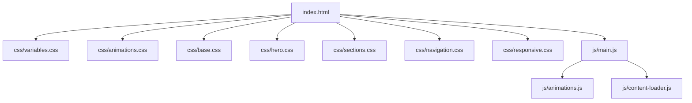
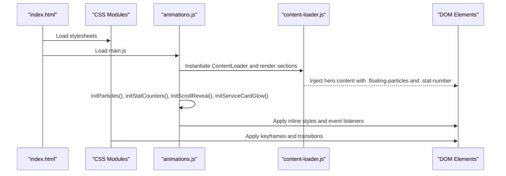
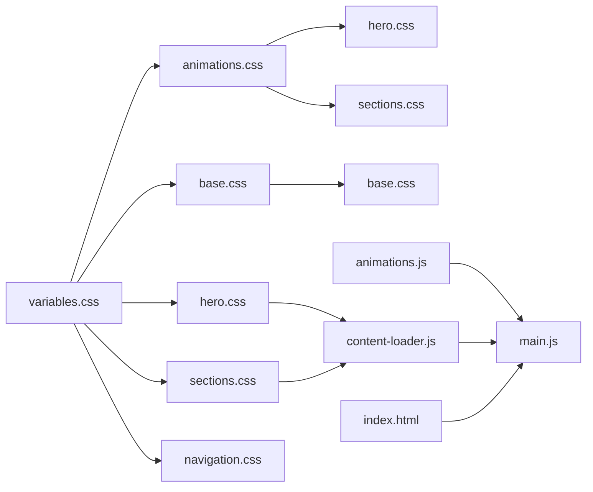

# Animation Styling and Effects

<cite>
**Referenced Files in This Document**
- [index.html](file://index.html)
- [variables.css](file://css/variables.css)
- [animations.css](file://css/animations.css)
- [base.css](file://css/base.css)
- [hero.css](file://css/hero.css)
- [sections.css](file://css/sections.css)
- [navigation.css](file://css/navigation.css)
- [responsive.css](file://css/responsive.css)
- [animations.js](file://js/animations.js)
- [main.js](file://js/main.js)
- [content-loader.js](file://js/content-loader.js)
</cite>

## Table of Contents
1. [Introduction](#introduction)
2. [Project Structure](#project-structure)
3. [Core Components](#core-components)
4. [Architecture Overview](#architecture-overview)
5. [Detailed Component Analysis](#detailed-component-analysis)
6. [Dependency Analysis](#dependency-analysis)
7. [Performance Considerations](#performance-considerations)
8. [Troubleshooting Guide](#troubleshooting-guide)
9. [Conclusion](#conclusion)
10. [Appendices](#appendices)

## Introduction
This document explains the animation styling and visual effects system implemented across the project. It covers CSS keyframe animations, transitions, timing functions, and how JavaScript integrates with DOM elements to deliver interactive and scroll-triggered animations. It also documents hover effects, transform animations, interactive state styling, scroll-reveal animations, entrance animations, and the loading spinner and progress indicators. Finally, it provides guidelines for creating custom animations, optimizing performance for smooth 60fps experiences, and addressing browser compatibility.

## Project Structure
The animation system spans CSS and JavaScript modules:
- CSS defines keyframes, transitions, and component-specific animation classes.
- JavaScript initializes dynamic animations (particles, counters, scroll reveals) and interacts with the DOM.
- HTML includes the loader and sections that host animated elements.

**Diagram sources**
- [index.html:22-33](file://index.html#L22-L33)
- [main.js:8](file://js/main.js#L8)
- [animations.js:1-98](file://js/animations.js#L1-L98)
- [content-loader.js:69-107](file://js/content-loader.js#L69-L107)

**Section sources**
- [index.html:22-33](file://index.html#L22-L33)
- [main.js:8](file://js/main.js#L8)

## Core Components
- CSS keyframes: Floating particles, pulsing icons, rotating decorative elements, loader pulse, and horizontal scrolling backgrounds.
- Transitions and transforms: Hover states, button interactions, navigation effects, and scroll-reveal animations.
- JavaScript-driven animations: Particle generation, scroll-triggered reveals, stat counters, and mouse-tracking glow.
- Loader and progress indicators: Static loader with animated logo and text; animated stats counters.

Key implementation highlights:
- Keyframes are defined centrally and reused across components.
- Transitions use easing functions for smooth motion.
- JavaScript initializes animations after content rendering and uses Intersection Observer for scroll triggers.

**Section sources**
- [animations.css:1-62](file://css/animations.css#L1-L62)
- [base.css:131-165](file://css/base.css#L131-L165)
- [hero.css:32-47](file://css/hero.css#L32-L47)
- [sections.css:114-145](file://css/sections.css#L114-L145)
- [sections.css:185-217](file://css/sections.css#L185-L217)
- [sections.css:343-383](file://css/sections.css#L343-L383)
- [sections.css:408-417](file://css/sections.css#L408-L417)
- [animations.js:6-20](file://js/animations.js#L6-L20)
- [animations.js:22-58](file://js/animations.js#L22-L58)
- [animations.js:60-84](file://js/animations.js#L60-L84)
- [animations.js:86-97](file://js/animations.js#L86-L97)

## Architecture Overview
The animation pipeline combines static CSS animations with dynamic JavaScript initialization:

**Diagram sources**
- [index.html:22-33](file://index.html#L22-L33)
- [main.js:11-37](file://js/main.js#L11-L37)
- [content-loader.js:69-107](file://js/content-loader.js#L69-L107)
- [animations.js:6-20](file://js/animations.js#L6-L20)
- [animations.js:22-58](file://js/animations.js#L22-L58)
- [animations.js:60-84](file://js/animations.js#L60-L84)
- [animations.js:86-97](file://js/animations.js#L86-L97)

## Detailed Component Analysis

### CSS Keyframe Animations
- float: Smooth, organic movement with periodic opacity changes for floating particles.
- pulse: Subtle breathing effect for icons and badges.
- spin: Continuous rotation for decorative elements.
- scroll: Horizontal translation for background grids.
- rotate: Full rotation for banner backgrounds.
- loaderPulse: Pulsing scale and opacity for the loader logo.

These keyframes are applied to elements via animation declarations and used across hero, process steps, CTAs, and loaders.

**Section sources**
- [animations.css:3-20](file://css/animations.css#L3-L20)
- [animations.css:22-29](file://css/animations.css#L22-L29)
- [animations.css:31-35](file://css/animations.css#L31-L35)
- [animations.css:37-44](file://css/animations.css#L37-L44)
- [animations.css:46-50](file://css/animations.css#L46-L50)
- [animations.css:52-61](file://css/animations.css#L52-L61)
- [hero.css:39-47](file://css/hero.css#L39-L47)
- [hero.css:70-72](file://css/hero.css#L70-L72)
- [sections.css:376-383](file://css/sections.css#L376-L383)
- [sections.css:415-417](file://css/sections.css#L415-L417)
- [base.css:152-157](file://css/base.css#L152-L157)

### Hover Effects and Transform Animations
Hover states leverage transitions and transforms:
- Buttons: Background shift, elevation shadow, and subtle lift.
- Navigation links: Underline width animation and color change.
- Cards (MVO, Services, Why Us, Team): Lift, border glow, and shadow enhancements.
- Step numbers: Scale and border accent on hover.
- Social icons: Color fill, border change, and slight lift.

Transitions consistently use easing for smoothness.

**Section sources**
- [base.css:58-96](file://css/base.css#L58-L96)
- [navigation.css:51-83](file://css/navigation.css#L51-L83)
- [sections.css:114-145](file://css/sections.css#L114-L145)
- [sections.css:185-217](file://css/sections.css#L185-L217)
- [sections.css:275-287](file://css/sections.css#L275-L287)
- [sections.css:343-383](file://css/sections.css#L343-L383)
- [sections.css:408-417](file://css/sections.css#L408-L417)

### Interactive State Styling and Mouse Tracking Glow
Service cards implement a mouse-tracking glow using CSS custom properties and JavaScript:
- CSS defines a radial gradient overlay and opacity transition.
- JavaScript computes mouse coordinates and updates custom properties for the gradient center.
- On hover, the overlay fades in for a subtle highlight.

This creates a responsive, interactive glow that follows the cursor.

**Section sources**
- [sections.css:195-211](file://css/sections.css#L195-L211)
- [animations.js:86-97](file://js/animations.js#L86-L97)

### Scroll-Revealed Animations
Elements are pre-styled off-screen and revealed when scrolled into view:
- Elements are set to initial hidden state with opacity and transform.
- Intersection Observer triggers a transition to visible state.
- Root margin and threshold tune the reveal timing.

This enables fade-in and slide-in entrance effects for cards and process steps.

**Section sources**
- [animations.js:60-84](file://js/animations.js#L60-L84)
- [sections.css:343-383](file://css/sections.css#L343-L383)

### Stat Counter Animation
Counters animate numeric values when they intersect with the viewport:
- Uses Intersection Observer with a threshold to trigger animation.
- Emulates animation with a 60fps interval loop and a fixed duration.
- Updates inner text with rounded values until reaching the target.

This provides a lightweight, custom animation without external libraries.

**Section sources**
- [animations.js:22-58](file://js/animations.js#L22-L58)
- [hero.css:115-121](file://css/hero.css#L115-L121)

### Particle Animation Styling
Floating particles are generated dynamically:
- JavaScript creates 30 particles with randomized positions and animation durations/delays.
- Particles inherit a shared floating animation class.
- Container is placed in the hero section for background-like motion.

This creates a subtle, immersive background effect synchronized with CSS keyframes.

**Section sources**
- [animations.js:6-20](file://js/animations.js#L6-L20)
- [hero.css:32-47](file://css/hero.css#L32-L47)
- [content-loader.js:79](file://js/content-loader.js#L79)

### Loader and Progress Indicators
- Loader: Fixed overlay with centered content and a transition for fade-out.
- Loader logo: Pulsing animation using a keyframe with ease-in-out timing.
- Progress indicators: Stats counters animate toward targets during scroll reveal.

**Section sources**
- [base.css:131-165](file://css/base.css#L131-L165)
- [animations.css:52-61](file://css/animations.css#L52-L61)
- [animations.js:22-58](file://js/animations.js#L22-L58)

### Entrance Animations: Fade-In and Slide-In
Entrance effects are achieved by:
- Pre-hiding elements with opacity and transform.
- Transitioning to visible state on intersection.
- Using easing for smoothness.

Selectors targeted include cards and process steps.

**Section sources**
- [animations.js:60-84](file://js/animations.js#L60-L84)
- [sections.css:343-383](file://css/sections.css#L343-L383)

### Scroll-Triggered Animation Classes and Intersection Observer Integration
- Elements are prepared with initial hidden styles and transitions.
- Intersection Observer thresholds and margins control when animations trigger.
- Observers are attached after DOM rendering.

This ensures efficient, resource-friendly scroll-triggered animations.

**Section sources**
- [animations.js:60-84](file://js/animations.js#L60-L84)

## Dependency Analysis
The animation system exhibits clear separation of concerns:
- CSS defines reusable animations and transitions.
- JavaScript initializes and orchestrates dynamic behaviors.
- Content loader injects DOM elements that consume CSS animations.

**Diagram sources**
- [variables.css:1-12](file://css/variables.css#L1-L12)
- [animations.css:1-62](file://css/animations.css#L1-L62)
- [base.css:131-165](file://css/base.css#L131-L165)
- [hero.css:32-47](file://css/hero.css#L32-L47)
- [sections.css:114-145](file://css/sections.css#L114-L145)
- [navigation.css:51-83](file://css/navigation.css#L51-L83)
- [content-loader.js:69-107](file://js/content-loader.js#L69-L107)
- [animations.js:6-20](file://js/animations.js#L6-L20)
- [main.js:11-37](file://js/main.js#L11-L37)
- [index.html:22-33](file://index.html#L22-L33)

**Section sources**
- [variables.css:1-12](file://css/variables.css#L1-L12)
- [animations.css:1-62](file://css/animations.css#L1-L62)
- [base.css:131-165](file://css/base.css#L131-L165)
- [hero.css:32-47](file://css/hero.css#L32-L47)
- [sections.css:114-145](file://css/sections.css#L114-L145)
- [navigation.css:51-83](file://css/navigation.css#L51-L83)
- [content-loader.js:69-107](file://js/content-loader.js#L69-L107)
- [animations.js:6-20](file://js/animations.js#L6-L20)
- [main.js:11-37](file://js/main.js#L11-L37)
- [index.html:22-33](file://index.html#L22-L33)

## Performance Considerations
To maintain smooth 60fps animations:
- Prefer transform and opacity for animations; they are hardware-accelerated.
- Use CSS transitions with easing functions for predictable motion curves.
- Limit expensive layout recalculations by animating properties that do not trigger layout.
- Optimize Intersection Observer thresholds and root margins to reduce unnecessary triggers.
- Keep keyframes simple and avoid heavy computations in JavaScript loops.
- Use requestAnimationFrame for smoother JavaScript-driven animations when needed.
- Minimize DOM thrashing by batching style reads/writes.

[No sources needed since this section provides general guidance]

## Troubleshooting Guide
Common issues and resolutions:
- Animations not triggering:
  - Verify Intersection Observer is supported and polyfilled if needed.
  - Confirm elements are present in the DOM before observing.
  - Check thresholds and root margins for visibility.
- Particles not appearing:
  - Ensure the hero container exists and the particles container is injected.
  - Confirm CSS animation classes are applied to generated elements.
- Counters not animating:
  - Ensure data attributes are present and numeric.
  - Verify Intersection Observer is firing and the element is intersecting.
- Hover effects not smooth:
  - Confirm transitions are applied to the correct properties.
  - Avoid animating layout-affecting properties in hot paths.
- Loader not hiding:
  - Ensure the loader element exists and the hidden class is toggled after content load.

**Section sources**
- [animations.js:22-58](file://js/animations.js#L22-L58)
- [animations.js:60-84](file://js/animations.js#L60-L84)
- [animations.js:6-20](file://js/animations.js#L6-L20)
- [content-loader.js:69-107](file://js/content-loader.js#L69-L107)
- [base.css:131-165](file://css/base.css#L131-L165)

## Conclusion
The project’s animation system blends reusable CSS keyframes and transitions with targeted JavaScript orchestration. It delivers smooth, performant interactions including floating particles, scroll-revealed entrances, interactive hover states, and a polished loader. By following the guidelines and leveraging the existing patterns, developers can extend the system with confidence while maintaining 60fps performance.

[No sources needed since this section summarizes without analyzing specific files]

## Appendices

### Creating Custom Animations
- Define keyframes in the central animations stylesheet.
- Apply animations to elements via animation declarations.
- Use transitions for hover and state changes.
- For scroll-triggered effects, prepare initial hidden styles and attach Intersection Observer.
- For dynamic effects, generate DOM nodes and apply randomized animation properties.

**Section sources**
- [animations.css:1-62](file://css/animations.css#L1-L62)
- [animations.js:60-84](file://js/animations.js#L60-L84)

### Browser Compatibility and Fallback Strategies
- Modern browsers support CSS animations and transitions out-of-the-box.
- Intersection Observer is widely supported; consider a polyfill for legacy environments.
- For older browsers, degrade gracefully by disabling animations or providing static states.
- Use vendor prefixes sparingly; modern toolchains often handle this automatically.

[No sources needed since this section provides general guidance]