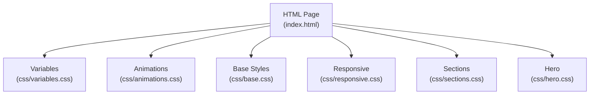
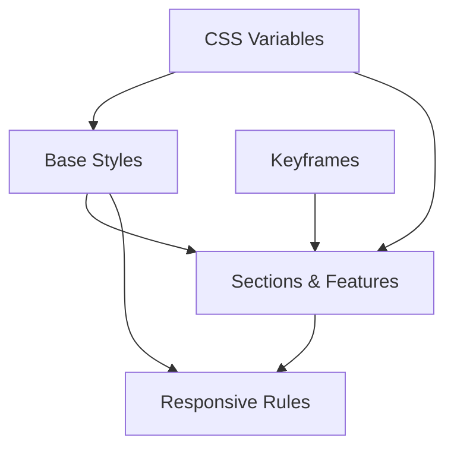
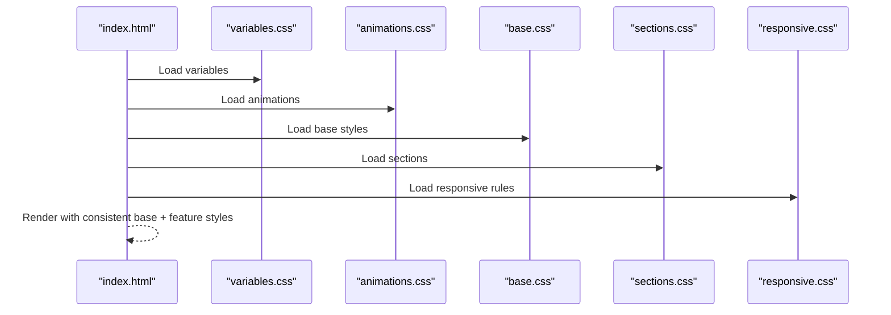
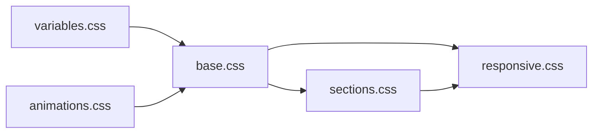

# Base Styles and Foundation

<cite>
**Referenced Files in This Document**
- [index.html](file://index.html)
- [base.css](file://css/base.css)
- [variables.css](file://css/variables.css)
- [animations.css](file://css/animations.css)
- [responsive.css](file://css/responsive.css)
- [sections.css](file://css/sections.css)
- [hero.css](file://css/hero.css)
</cite>

## Table of Contents
1. [Introduction](#introduction)
2. [Project Structure](#project-structure)
3. [Core Components](#core-components)
4. [Architecture Overview](#architecture-overview)
5. [Detailed Component Analysis](#detailed-component-analysis)
6. [Dependency Analysis](#dependency-analysis)
7. [Performance Considerations](#performance-considerations)
8. [Troubleshooting Guide](#troubleshooting-guide)
9. [Conclusion](#conclusion)

## Introduction
This document describes the base CSS styles and foundational styling system that establishes consistent, accessible, and maintainable design across the website. It covers global resets and normalization, typography foundations, utility and helper patterns, layout defaults, color and background systems, animation and transition defaults, and guidelines for extending the base styles while preserving design consistency.

## Project Structure
The foundational styles are organized into focused CSS modules that progressively enhance the page:
- Global variables define theme tokens consumed throughout the design system.
- Base styles normalize defaults and set up typography, spacing, and interactive elements.
- Animations define reusable keyframe animations used across components.
- Responsive rules adapt layouts for mobile and tablet experiences.
- Sections and feature-specific styles build upon the base foundation.

**Diagram sources**
- [index.html:22-33](file://index.html#L22-L33)
- [variables.css:1-12](file://css/variables.css#L1-L12)
- [animations.css:1-62](file://css/animations.css#L1-L62)
- [base.css:1-165](file://css/base.css#L1-L165)
- [responsive.css:1-104](file://css/responsive.css#L1-L104)
- [sections.css:1-438](file://css/sections.css#L1-L438)
- [hero.css:1-54](file://css/hero.css#L1-L54)

**Section sources**
- [index.html:22-33](file://index.html#L22-L33)

## Core Components
This section outlines the foundational building blocks that underpin the entire design system.

- Global Reset and Normalization
  - Removes default margins and paddings and sets a consistent box model across browsers.
  - Ensures smooth scrolling at the root level.
  - Provides a baseline body style with font family, background, text color, overflow handling, and line height.

- Typography Foundations
  - Headings use a dedicated font family and bold weights for hierarchy.
  - Body text leverages a readable line height and consistent color tokens.

- Section Utilities
  - Standardized section padding and header styles for consistent vertical rhythm.
  - Tagline and header components for prominent section introductions.

- Button System
  - Base button class with shared spacing, shape, typography, transitions, and alignment.
  - Primary and outline variants with hover states, shadows, and transforms for feedback.

- Scroll-to-Top and Loader Utilities
  - Fixed-position scroll-to-top button with visibility and transform transitions.
  - Loader overlay with centered content and animated logo using a keyframe animation.

- Color and Background System
  - CSS custom properties define primary, accent, text, background, card backgrounds, and borders.
  - Components consume these tokens for consistent theming.

- Animation Defaults
  - Reusable keyframes for floating particles, pulsing effects, spinning, horizontal scrolling, and rotating.
  - Loader-specific pulse animation applied to branding during load.

- Layout and Flex/Grid Defaults
  - Extensive use of flexbox and CSS Grid across sections for responsive composition.
  - Responsive breakpoints adjust grids and timelines for smaller screens.

**Section sources**
- [base.css:1-165](file://css/base.css#L1-L165)
- [variables.css:1-12](file://css/variables.css#L1-L12)
- [animations.css:1-62](file://css/animations.css#L1-L62)
- [responsive.css:1-104](file://css/responsive.css#L1-L104)

## Architecture Overview
The base styling system follows a layered approach:
- Variables define the palette and tokens.
- Base styles apply global resets and typography.
- Animations provide motion primitives.
- Sections and features layer on top of the base for specific contexts.
- Responsive rules adapt the layout at key breakpoints.

**Diagram sources**
- [variables.css:1-12](file://css/variables.css#L1-L12)
- [base.css:1-165](file://css/base.css#L1-L165)
- [animations.css:1-62](file://css/animations.css#L1-L62)
- [sections.css:1-438](file://css/sections.css#L1-L438)
- [responsive.css:1-104](file://css/responsive.css#L1-L104)

## Detailed Component Analysis

### Global Reset and Normalization
- Applies a universal border-box sizing model for predictable element sizing.
- Sets smooth scrolling behavior at the root.
- Establishes body font stack, background, text color, overflow handling, and line height.

Implementation references:
- [base.css:1-17](file://css/base.css#L1-L17)

**Section sources**
- [base.css:1-17](file://css/base.css#L1-L17)

### Typography Foundations
- Headings use a distinct font family and bold weight to establish hierarchy.
- Section header styles include clamp-based responsive sizing, centered alignment, and muted paragraph text.

Implementation references:
- [base.css:19-55](file://css/base.css#L19-L55)

**Section sources**
- [base.css:19-55](file://css/base.css#L19-L55)

### Section Utilities
- Standardized section padding and relative positioning for background elements.
- Section header wrapper with centered text, max-width, and spacing.
- Tagline utility for highlighted, uppercase labels with tracking and color tokens.

Implementation references:
- [base.css:24-55](file://css/base.css#L24-L55)

**Section sources**
- [base.css:24-55](file://css/base.css#L24-L55)

### Button System
- Base button class defines padding, border radius, font stack, weight, size, cursor, transitions, text decoration, inline-flex layout, alignment, and gap.
- Primary variant with accent background, primary text, and shadow effects; hover state adjusts background, adds lift, and increases shadow.
- Outline variant with transparent fill, text color, bordered border, and hover behavior that toggles border and background tint.

Implementation references:
- [base.css:57-96](file://css/base.css#L57-L96)

**Section sources**
- [base.css:57-96](file://css/base.css#L57-L96)

### Scroll-to-Top Utility
- Fixed-position circular button with accent background and primary text.
- Hidden by default via opacity and visibility; becomes visible when a specific class is applied.
- Hover state applies transform and increased shadow for feedback.

Implementation references:
- [base.css:98-129](file://css/base.css#L98-L129)

**Section sources**
- [base.css:98-129](file://css/base.css#L98-L129)

### Loader Overlay
- Full-screen overlay with centered content and z-index for pre-JavaScript loading state.
- Hidden state transitions opacity and visibility smoothly.
- Loader content includes a logo and text styled with the brand font and accent color.

Implementation references:
- [base.css:131-165](file://css/base.css#L131-L165)

**Section sources**
- [base.css:131-165](file://css/base.css#L131-L165)

### Color and Background System
- CSS custom properties define primary, secondary, accent, text, background, card background, and border tokens.
- Components consume these tokens for consistent theming across light/dark palettes.

Implementation references:
- [variables.css:1-12](file://css/variables.css#L1-L12)

**Section sources**
- [variables.css:1-12](file://css/variables.css#L1-L12)

### Animation and Transition Defaults
- Floating particle animation with positional and opacity variations.
- Pulsing effect for subtle emphasis.
- Spinning and rotating animations for interactive elements.
- Horizontal scrolling pattern for parallax-like backgrounds.
- Loader pulse animation for branding during load.

Implementation references:
- [animations.css:1-62](file://css/animations.css#L1-L62)

**Section sources**
- [animations.css:1-62](file://css/animations.css#L1-L62)

### Layout and Flex/Grid Defaults
- Sections extensively use flexbox for centering and alignment, and CSS Grid for responsive layouts.
- Responsive rules adjust grid columns, timeline orientation, and spacing for tablets and phones.

Implementation references:
- [sections.css:6-13, 78-83, 106-112, 177-183, 267-273, 324-341, 396-406:6-13](file://css/sections.css#L6-L13)
- [responsive.css:3-45, 47-103:3-45](file://css/responsive.css#L3-L45)

**Section sources**
- [sections.css:6-13, 78-83, 106-112, 177-183, 267-273, 324-341, 396-406:6-13](file://css/sections.css#L6-L13)
- [responsive.css:3-45, 47-103:3-45](file://css/responsive.css#L3-L45)

## Architecture Overview
The base styles integrate with feature modules to deliver a cohesive design system. Variables drive theming; base styles normalize and define defaults; animations provide motion primitives; sections and features layer on top; and responsive rules adapt the layout.

**Diagram sources**
- [index.html:22-33](file://index.html#L22-L33)
- [variables.css:1-12](file://css/variables.css#L1-L12)
- [animations.css:1-62](file://css/animations.css#L1-L62)
- [base.css:1-165](file://css/base.css#L1-L165)
- [sections.css:1-438](file://css/sections.css#L1-L438)
- [responsive.css:1-104](file://css/responsive.css#L1-L104)

## Detailed Component Analysis

### Hero Background and Particles
- Hero container uses flexbox to center content and establishes relative positioning for background layers.
- Background gradients and grid overlays create depth and texture.
- Floating particles utilize the floating animation to animate small elements across the screen.

Implementation references:
- [hero.css:1-54](file://css/hero.css#L1-L54)

**Section sources**
- [hero.css:1-54](file://css/hero.css#L1-L54)

### Section Composition Patterns
- Grid-based compositions for feature cards, service listings, and testimonials.
- Flex-based layouts for content alignment and responsive adjustments.
- Consistent use of tokens for backgrounds, borders, and accents.

Implementation references:
- [sections.css:6-13, 78-83, 106-112, 177-183, 267-273, 324-341, 396-406:6-13](file://css/sections.css#L6-L13)

**Section sources**
- [sections.css:6-13, 78-83, 106-112, 177-183, 267-273, 324-341, 396-406:6-13](file://css/sections.css#L6-L13)

### Responsive Adaptations
- Breakpoints adjust grid columns, re-order content, and switch timelines to stacked layouts.
- Mobile navigation toggles via a class-driven visibility state.
- Content spacing and typography scale appropriately for smaller screens.

Implementation references:
- [responsive.css:3-45, 47-103:3-45](file://css/responsive.css#L3-L45)

**Section sources**
- [responsive.css:3-45, 47-103:3-45](file://css/responsive.css#L3-L45)

## Dependency Analysis
The base system relies on a strict load order to ensure tokens and defaults are available before components use them.

**Diagram sources**
- [index.html:22-33](file://index.html#L22-L33)
- [variables.css:1-12](file://css/variables.css#L1-L12)
- [animations.css:1-62](file://css/animations.css#L1-L62)
- [base.css:1-165](file://css/base.css#L1-L165)
- [sections.css:1-438](file://css/sections.css#L1-L438)
- [responsive.css:1-104](file://css/responsive.css#L1-L104)

**Section sources**
- [index.html:22-33](file://index.html#L22-L33)

## Performance Considerations
- Prefer CSS custom properties for theming to minimize cascade and enable efficient updates.
- Use transform and opacity for animations to leverage GPU acceleration.
- Keep base styles minimal and avoid heavy selectors; rely on utility classes for common patterns.
- Consolidate animations and reuse keyframes across components.

## Troubleshooting Guide
- If buttons appear misaligned, verify the base button class and ensure flex utilities are applied consistently.
- If colors look inconsistent, confirm variable usage and check for overrides in feature-specific styles.
- If animations stutter, ensure transforms and opacity are used and avoid animating layout-affecting properties.
- On mobile, confirm responsive classes are applied and breakpoints are respected.

## Conclusion
The base CSS and foundational system provide a robust, theme-consistent, and responsive foundation. By adhering to the documented patterns—using variables, base styles, utility classes, and animation primitives—you can extend the design system reliably while maintaining visual coherence and performance.