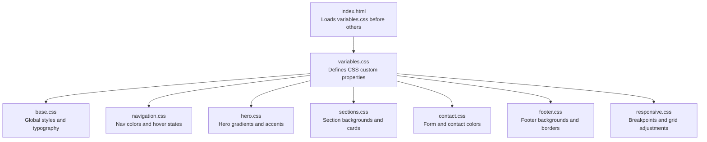
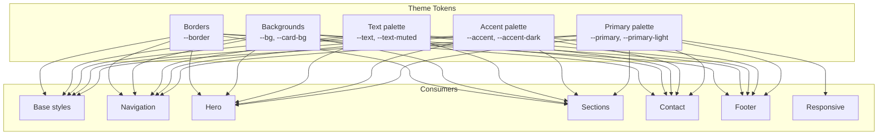
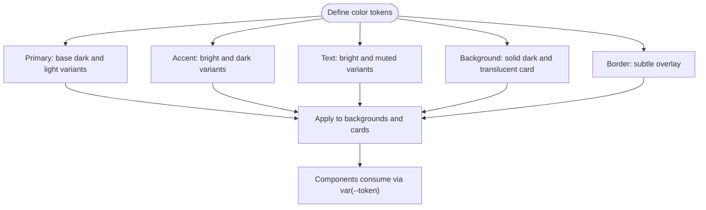
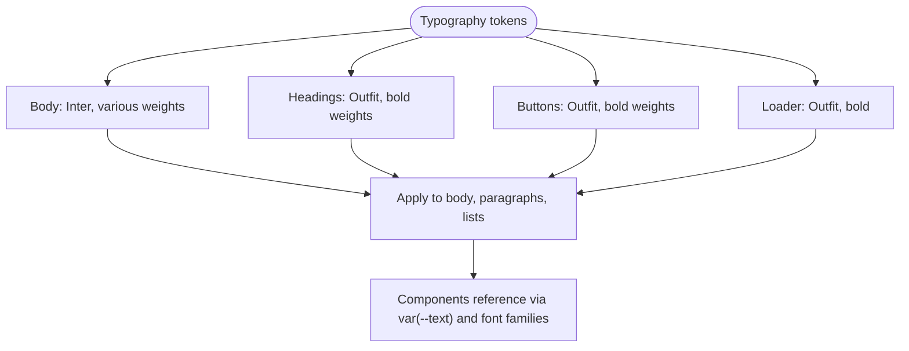
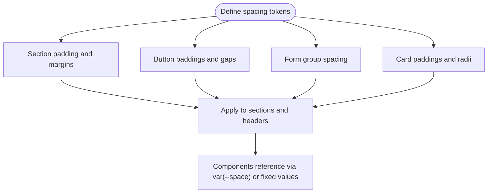
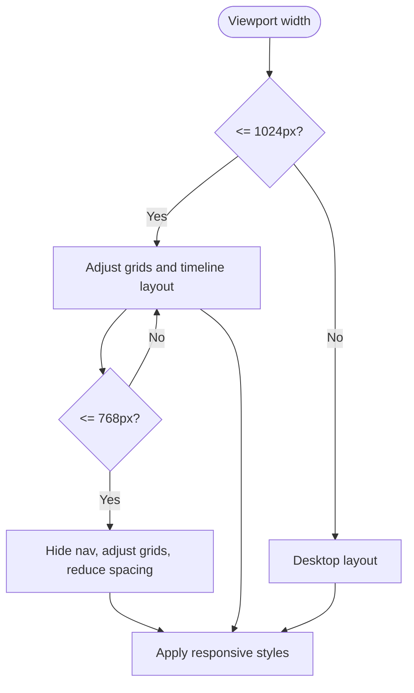
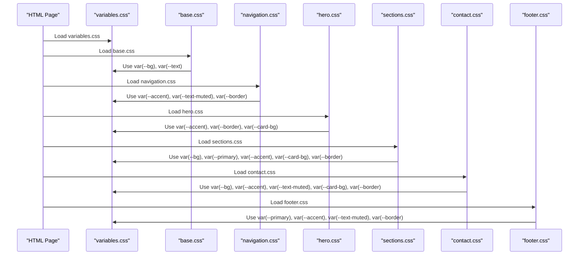
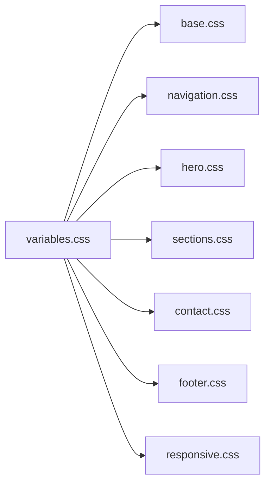

# CSS Variables and Theming

<cite>
**Referenced Files in This Document**
- [variables.css](file://css/variables.css)
- [base.css](file://css/base.css)
- [navigation.css](file://css/navigation.css)
- [hero.css](file://css/hero.css)
- [sections.css](file://css/sections.css)
- [contact.css](file://css/contact.css)
- [footer.css](file://css/footer.css)
- [responsive.css](file://css/responsive.css)
- [index.html](file://index.html)
</cite>

## Table of Contents
1. [Introduction](#introduction)
2. [Project Structure](#project-structure)
3. [Core Components](#core-components)
4. [Architecture Overview](#architecture-overview)
5. [Detailed Component Analysis](#detailed-component-analysis)
6. [Dependency Analysis](#dependency-analysis)
7. [Performance Considerations](#performance-considerations)
8. [Troubleshooting Guide](#troubleshooting-guide)
9. [Conclusion](#conclusion)

## Introduction
This document explains the CSS variables and theming system used across the Victory Marketing website. It documents the centralized color palette, typography system, spacing conventions, and responsive breakpoints, and demonstrates how variables.css acts as the single source of truth for all styled components. It also provides guidelines for extending the theme, adding new color variants, and maintaining consistency across the styling architecture.

## Project Structure
The theming system is organized around a single central configuration file (variables.css) that defines CSS custom properties. Other CSS modules consume these variables to ensure consistent visuals across the site. The HTML page links to variables.css first, ensuring all components inherit the theme variables.

**Diagram sources**
- [variables.css](file://css/variables.css)
- [base.css](file://css/base.css)
- [navigation.css](file://css/navigation.css)
- [hero.css](file://css/hero.css)
- [sections.css](file://css/sections.css)
- [contact.css](file://css/contact.css)
- [footer.css](file://css/footer.css)
- [responsive.css](file://css/responsive.css)
- [index.html](file://index.html)

**Section sources**
- [index.html](file://index.html)
- [variables.css](file://css/variables.css)

## Core Components
The theming system centers on a small set of CSS custom properties defined under the :root selector. These variables are consumed throughout the stylesheet modules to maintain a consistent look-and-feel.

- Color palette
  - Primary palette: base dark background and lightened variant
  - Accent palette: vibrant green and darker variant
  - Text palette: bright text and muted text
  - Background and card backgrounds
  - Border tokens

- Typography system
  - Body font family and text colors
  - Headings font family and weights
  - Button fonts and weights
  - Loader and logo typography

- Spacing system
  - Section padding and margins
  - Grid gaps and component spacing
  - Button paddings and icon gaps

- Breakpoint system
  - Tablet breakpoint at 1024px
  - Mobile breakpoint at 768px
  - Responsive grid adjustments and layout changes

How variables.css serves as the central theme configuration:
- All components import variables.css before other stylesheets
- Components reference variables via var(--name) for colors, backgrounds, and borders
- Changes to variables propagate automatically across all components

Guidelines for extending the theme:
- Add new variables to variables.css under :root
- Reference new variables consistently across components
- Keep naming consistent and semantic
- Prefer existing tokens when possible to reduce duplication

Examples of variable usage patterns:
- Backgrounds: var(--bg), var(--primary), var(--primary-light)
- Accents: var(--accent), var(--accent-dark)
- Text: var(--text), var(--text-muted)
- Borders: var(--border)
- Cards: var(--card-bg)

Best practices for consistency:
- Use var(--accent) for highlights and interactive states
- Use var(--text) for primary text and var(--text-muted) for secondary text
- Use var(--border) for subtle borders and overlays
- Use var(--card-bg) for translucent card backgrounds
- Maintain consistent paddings and gaps across components

**Section sources**
- [variables.css](file://css/variables.css)
- [base.css](file://css/base.css)
- [navigation.css](file://css/navigation.css)
- [hero.css](file://css/hero.css)
- [sections.css](file://css/sections.css)
- [contact.css](file://css/contact.css)
- [footer.css](file://css/footer.css)
- [responsive.css](file://css/responsive.css)

## Architecture Overview
The theming architecture follows a unidirectional data flow: variables.css defines tokens, and all other stylesheets consume them. This ensures that changing a single variable updates the entire design system instantly.

**Diagram sources**
- [variables.css](file://css/variables.css)
- [base.css](file://css/base.css)
- [navigation.css](file://css/navigation.css)
- [hero.css](file://css/hero.css)
- [sections.css](file://css/sections.css)
- [contact.css](file://css/contact.css)
- [footer.css](file://css/footer.css)
- [responsive.css](file://css/responsive.css)

## Detailed Component Analysis

### Color Palette
The color palette is intentionally minimalistic and cohesive, built around a dark theme with a vibrant accent color.

- Primary palette
  - Base dark background and a slightly lighter variant for contrast
  - Used for hero backgrounds, section backgrounds, and footer backgrounds

- Accent palette
  - Bright green for highlights and interactive elements
  - Darker green for hover states and stronger emphasis

- Text palette
  - Bright text for primary content
  - Muted text for secondary content and subtle elements

- Background and card backgrounds
  - Solid dark background for pages
  - Translucent card backgrounds for layered content

- Borders
  - Subtle borders for cards and form elements

**Diagram sources**
- [variables.css](file://css/variables.css)

**Section sources**
- [variables.css](file://css/variables.css)

### Typography System
Typography is consistent across the site with two primary font families and a hierarchy that emphasizes readability.

- Body and headings
  - Inter for body text and general UI
  - Outfit for headings and prominent UI elements
  - Consistent font weights for headings and buttons

- Buttons and interactive elements
  - Outfit for button text and interactive states
  - Consistent font sizes and weights for accessibility

- Loader and branding
  - Outfit for loader text and branding elements

**Diagram sources**
- [base.css](file://css/base.css)
- [navigation.css](file://css/navigation.css)
- [hero.css](file://css/hero.css)
- [sections.css](file://css/sections.css)
- [contact.css](file://css/contact.css)
- [footer.css](file://css/footer.css)

**Section sources**
- [base.css](file://css/base.css)
- [navigation.css](file://css/navigation.css)
- [hero.css](file://css/hero.css)
- [sections.css](file://css/sections.css)
- [contact.css](file://css/contact.css)
- [footer.css](file://css/footer.css)

### Spacing System
Spacing is managed through consistent padding, margins, and grid gaps across components.

- Sections
  - Uniform section padding and centered layouts
  - Consistent margins for headers and content blocks

- Buttons and interactive elements
  - Standardized button paddings and icon gaps
  - Hover effects with consistent transitions

- Forms and contact sections
  - Consistent form group spacing and input paddings
  - Grid-based form rows with controlled gaps

- Cards and content blocks
  - Card paddings and border radii
  - Consistent spacing between features and icons

**Diagram sources**
- [base.css](file://css/base.css)
- [sections.css](file://css/sections.css)
- [contact.css](file://css/contact.css)
- [navigation.css](file://css/navigation.css)

**Section sources**
- [base.css](file://css/base.css)
- [sections.css](file://css/sections.css)
- [contact.css](file://css/contact.css)
- [navigation.css](file://css/navigation.css)

### Breakpoint System
Responsive design is handled through media queries targeting tablet and mobile screens.

- Tablet breakpoint (1024px)
  - Adjusts grid layouts for about, contact, services, why-us, and team sections
  - Converts timelines to column layouts and removes decorative elements

- Mobile breakpoint (768px)
  - Hides desktop navigation and reveals mobile menu
  - Adjusts grid layouts for services, why-us, team, and footer sections
  - Reduces hero stats spacing and limits testimonial card widths

**Diagram sources**
- [responsive.css](file://css/responsive.css)

**Section sources**
- [responsive.css](file://css/responsive.css)

### Variable Consumption Patterns
Components consistently reference theme variables for colors, backgrounds, and borders. This ensures uniformity and simplifies maintenance.

- Global consumption
  - Body background and text colors
  - Section backgrounds and header styling

- Interactive elements
  - Button backgrounds and hover states
  - Navigation links and active states

- Content areas
  - Card backgrounds and borders
  - Feature icons and highlights

- Form elements
  - Input backgrounds and focus states
  - Submit button styling

**Diagram sources**
- [index.html](file://index.html)
- [variables.css](file://css/variables.css)
- [base.css](file://css/base.css)
- [navigation.css](file://css/navigation.css)
- [hero.css](file://css/hero.css)
- [sections.css](file://css/sections.css)
- [contact.css](file://css/contact.css)
- [footer.css](file://css/footer.css)

**Section sources**
- [index.html](file://index.html)
- [variables.css](file://css/variables.css)
- [base.css](file://css/base.css)
- [navigation.css](file://css/navigation.css)
- [hero.css](file://css/hero.css)
- [sections.css](file://css/sections.css)
- [contact.css](file://css/contact.css)
- [footer.css](file://css/footer.css)

## Dependency Analysis
The dependency chain is straightforward: variables.css is loaded first, and all other stylesheets depend on it. There are no circular dependencies, and the system scales predictably as new components are added.

**Diagram sources**
- [variables.css](file://css/variables.css)
- [base.css](file://css/base.css)
- [navigation.css](file://css/navigation.css)
- [hero.css](file://css/hero.css)
- [sections.css](file://css/sections.css)
- [contact.css](file://css/contact.css)
- [footer.css](file://css/footer.css)
- [responsive.css](file://css/responsive.css)

**Section sources**
- [index.html](file://index.html)
- [variables.css](file://css/variables.css)

## Performance Considerations
- Centralized variables reduce CSS duplication and improve maintainability
- Using CSS custom properties enables runtime theme switching without rebuilding stylesheets
- Minimal color palette reduces the number of distinct color computations
- Media queries are scoped to specific breakpoints, minimizing unnecessary recalculations

## Troubleshooting Guide
Common issues and resolutions when working with the theming system:

- Variable not updating across components
  - Ensure variables.css is loaded before other stylesheets
  - Verify that components reference variables via var(--name) rather than hardcoded values

- Inconsistent spacing or alignment
  - Check that section padding and grid gaps are consistent across components
  - Confirm that responsive breakpoints are applied in the correct order

- Color mismatches
  - Verify that the intended variable is used for each element
  - Check for overrides in component-specific styles

- Typography inconsistencies
  - Ensure font families and weights are applied consistently
  - Confirm that heading hierarchies use the correct font families

**Section sources**
- [variables.css](file://css/variables.css)
- [base.css](file://css/base.css)
- [responsive.css](file://css/responsive.css)

## Conclusion
The CSS variables and theming system provides a clean, maintainable foundation for the Victory Marketing website. By centralizing design tokens in variables.css and consuming them consistently across components, the system achieves visual coherence while remaining easy to extend and customize. Following the established patterns ensures that new features integrate seamlessly with the existing design language.