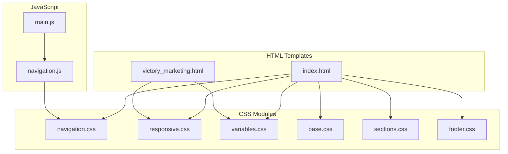
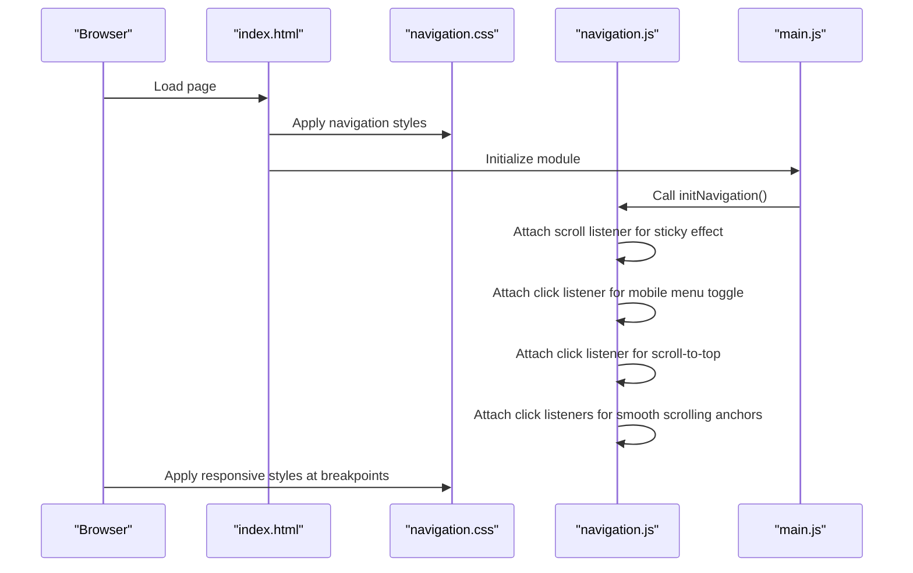
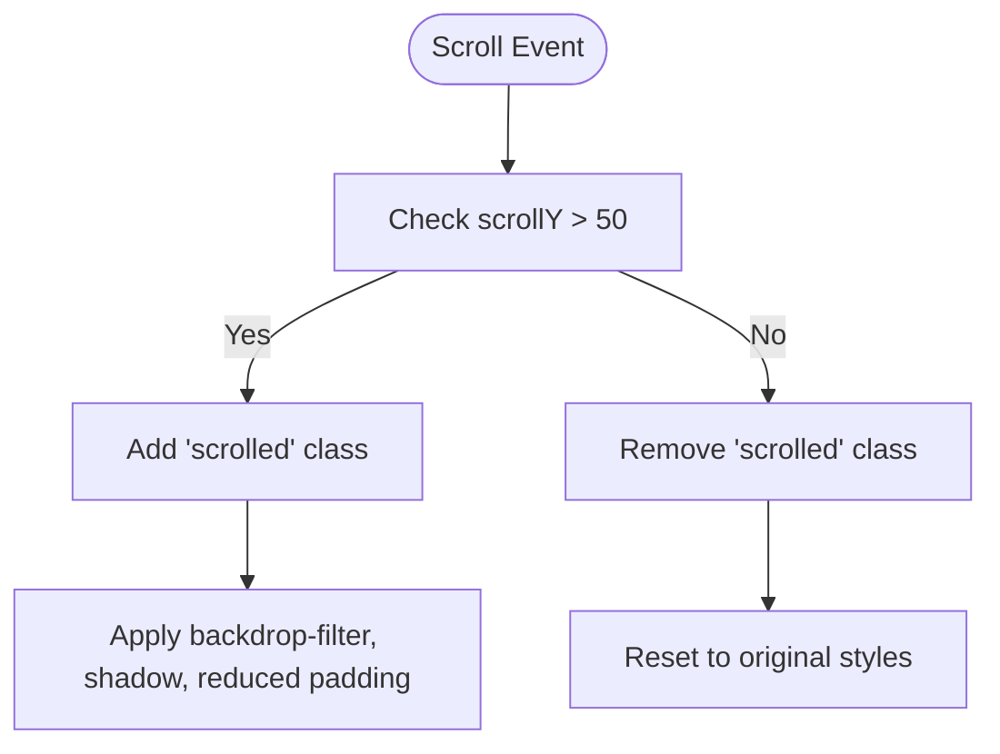
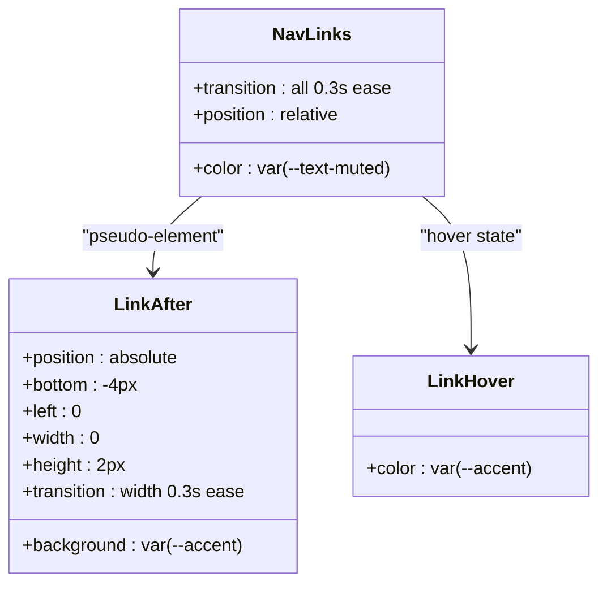
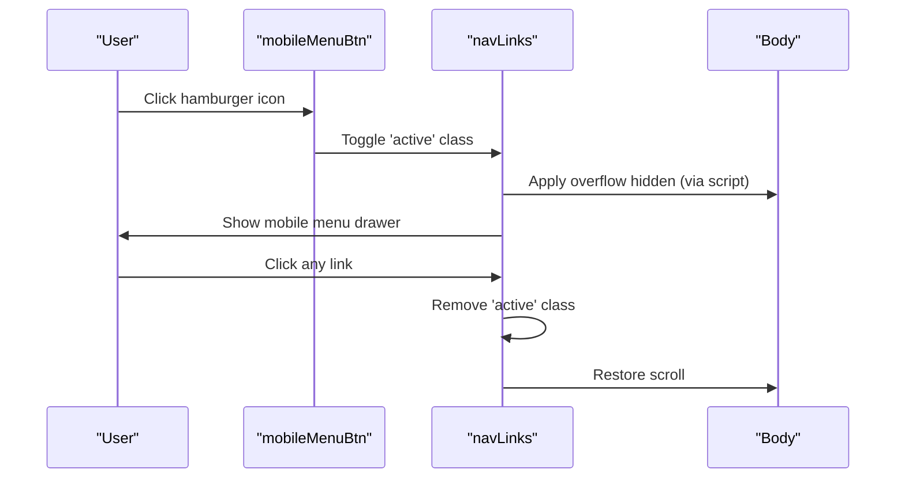
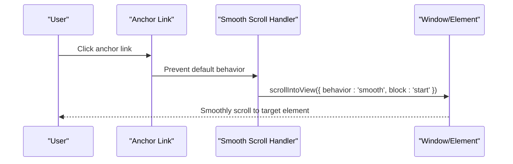
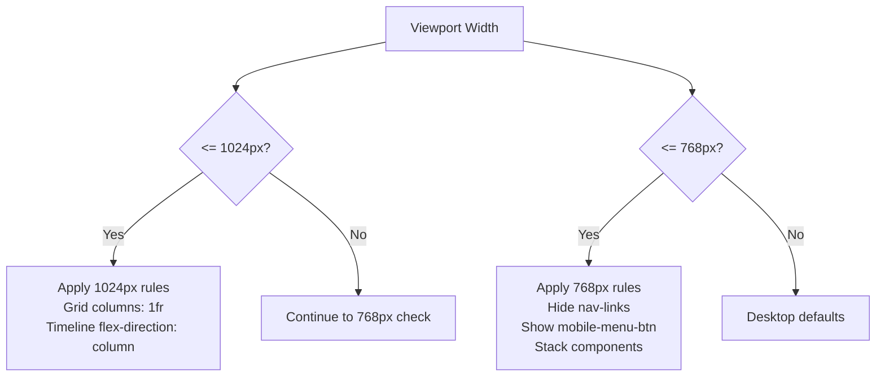
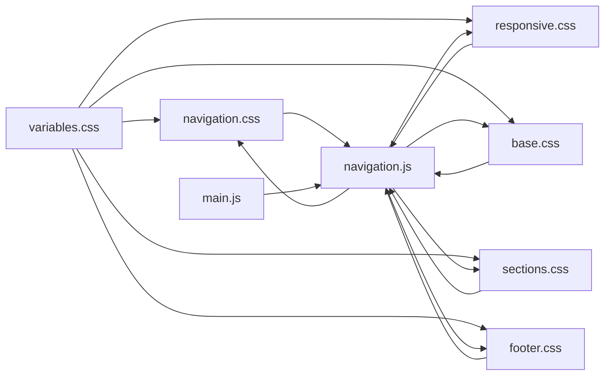

# Navigation and Responsive Design

<cite>
**Referenced Files in This Document**
- [index.html](file://index.html)
- [victory_marketing.html](file://victory_marketing.html)
- [navigation.css](file://css/navigation.css)
- [responsive.css](file://css/responsive.css)
- [variables.css](file://css/variables.css)
- [base.css](file://css/base.css)
- [sections.css](file://css/sections.css)
- [footer.css](file://css/footer.css)
- [navigation.js](file://js/navigation.js)
- [main.js](file://js/main.js)
</cite>

## Table of Contents
1. [Introduction](#introduction)
2. [Project Structure](#project-structure)
3. [Core Components](#core-components)
4. [Architecture Overview](#architecture-overview)
5. [Detailed Component Analysis](#detailed-component-analysis)
6. [Dependency Analysis](#dependency-analysis)
7. [Performance Considerations](#performance-considerations)
8. [Troubleshooting Guide](#troubleshooting-guide)
9. [Conclusion](#conclusion)

## Introduction
This document provides comprehensive guidance for navigation styling and responsive design implementation. It covers the desktop menu layout, mobile hamburger menu behavior, sticky navigation patterns, active state styling, smooth scrolling integration, and the responsive grid system using CSS Grid and Flexbox. It also documents the media query strategy, breakpoint-specific styling, mobile-first design principles, and performance considerations for responsive loading and rendering.

## Project Structure
The navigation and responsive design system spans HTML templates, modular CSS, and JavaScript initialization. The primary implementation is split between:
- A modular CSS architecture with separate concerns (navigation, responsive, variables, base, sections, footer)
- A JavaScript module that initializes navigation behaviors (sticky effect, mobile menu toggle, smooth scrolling, scroll-to-top)

**Diagram sources**
- [index.html:45-62](file://index.html#L45-L62)
- [victory_marketing.html:1329-1349](file://victory_marketing.html#L1329-L1349)
- [navigation.css:1-113](file://css/navigation.css#L1-L113)
- [responsive.css:1-104](file://css/responsive.css#L1-L104)
- [variables.css:1-12](file://css/variables.css#L1-L12)
- [base.css:1-165](file://css/base.css#L1-L165)
- [sections.css:1-438](file://css/sections.css#L1-L438)
- [footer.css:1-97](file://css/footer.css#L1-L97)
- [navigation.js:6-54](file://js/navigation.js#L6-L54)
- [main.js:11-37](file://js/main.js#L11-L37)

**Section sources**
- [index.html:22-33](file://index.html#L22-L33)
- [victory_marketing.html:17-1314](file://victory_marketing.html#L17-L1314)
- [navigation.css:1-113](file://css/navigation.css#L1-L113)
- [responsive.css:1-104](file://css/responsive.css#L1-L104)
- [variables.css:1-12](file://css/variables.css#L1-L12)
- [base.css:1-165](file://css/base.css#L1-L165)
- [sections.css:1-438](file://css/sections.css#L1-L438)
- [footer.css:1-97](file://css/footer.css#L1-L97)
- [navigation.js:6-54](file://js/navigation.js#L6-L54)
- [main.js:11-37](file://js/main.js#L11-L37)

## Core Components
- Sticky navigation bar with backdrop blur and shadow transitions
- Desktop horizontal navigation with hover effects and animated underline indicators
- Mobile hamburger menu with overlay drawer and backdrop blur
- Smooth scrolling for anchor links and scroll-to-top button
- Responsive grid system using CSS Grid and Flexbox with breakpoint-specific adjustments
- Mobile-first design with media queries targeting 1024px and 768px

Key implementation highlights:
- Navigation container uses fixed positioning and flex layout for desktop alignment
- Desktop menu links include animated underline indicators on hover
- Mobile menu toggles via a button that reveals a full-width drawer with column layout
- Smooth scrolling is enabled globally via CSS scroll-behavior and JavaScript event handlers
- Responsive breakpoints adjust grid layouts and component arrangements

**Section sources**
- [navigation.css:2-19](file://css/navigation.css#L2-L19)
- [navigation.css:51-83](file://css/navigation.css#L51-L83)
- [responsive.css:3-45](file://css/responsive.css#L3-L45)
- [responsive.css:47-103](file://css/responsive.css#L47-L103)
- [navigation.js:12-17](file://js/navigation.js#L12-L17)
- [navigation.js:19-31](file://js/navigation.js#L19-L31)
- [navigation.js:44-53](file://js/navigation.js#L44-L53)

## Architecture Overview
The navigation system integrates HTML markup, CSS styling, and JavaScript initialization. The HTML template defines the navigation structure and sections. CSS provides the visual styling and responsive behavior. JavaScript adds interactivity such as sticky effects, mobile menu toggling, and smooth scrolling.

**Diagram sources**
- [index.html:45-62](file://index.html#L45-L62)
- [navigation.css:1-113](file://css/navigation.css#L1-L113)
- [navigation.js:6-54](file://js/navigation.js#L6-L54)
- [main.js:11-37](file://js/main.js#L11-L37)

## Detailed Component Analysis

### Navigation Bar and Sticky Behavior
The navigation bar is fixed at the top of the viewport and applies a scrolled class on scroll to change background, blur, and padding. The desktop menu uses flex layout to distribute logo, links, and CTA button horizontally.

**Diagram sources**
- [navigation.js:12-17](file://js/navigation.js#L12-L17)
- [navigation.css:14-19](file://css/navigation.css#L14-L19)

**Section sources**
- [navigation.css:2-19](file://css/navigation.css#L2-L19)
- [navigation.js:12-17](file://js/navigation.js#L12-L17)

### Desktop Menu Layout and Hover Effects
Desktop navigation links are styled with color transitions and animated underline indicators. The underline expands on hover to indicate active navigation state.

**Diagram sources**
- [navigation.css:57-83](file://css/navigation.css#L57-L83)

**Section sources**
- [navigation.css:51-83](file://css/navigation.css#L51-L83)

### Mobile Hamburger Menu Drawer
On smaller screens, the desktop navigation becomes hidden and replaced by a hamburger button. Clicking the button toggles the mobile menu drawer, which overlays the viewport with a blurred background and column layout.

**Diagram sources**
- [navigation.js:19-31](file://js/navigation.js#L19-L31)
- [responsive.css:47-67](file://css/responsive.css#L47-L67)

**Section sources**
- [navigation.js:19-31](file://js/navigation.js#L19-L31)
- [responsive.css:47-67](file://css/responsive.css#L47-L67)

### Smooth Scrolling Integration
Smooth scrolling is enabled globally via CSS scroll-behavior and complemented by JavaScript event handlers for anchor links and scroll-to-top functionality.

**Diagram sources**
- [navigation.js:44-53](file://js/navigation.js#L44-L53)
- [base.css:7-9](file://css/base.css#L7-L9)

**Section sources**
- [navigation.js:44-53](file://js/navigation.js#L44-L53)
- [base.css:7-9](file://css/base.css#L7-L9)

### Responsive Grid System and Breakpoints
The responsive system uses CSS Grid and Flexbox to adapt layouts across breakpoints. Two primary breakpoints are defined:
- 1024px: Adjusts grid columns for about, contact, services, why-us, team, and footer grids
- 768px: Hides desktop navigation, shows mobile drawer, and adjusts various component layouts

**Diagram sources**
- [responsive.css:3-45](file://css/responsive.css#L3-L45)
- [responsive.css:47-103](file://css/responsive.css#L47-L103)

**Section sources**
- [responsive.css:3-45](file://css/responsive.css#L3-L45)
- [responsive.css:47-103](file://css/responsive.css#L47-L103)

### Mobile-First Design Principles
Mobile-first design is evident in:
- Base styles apply to small screens first
- Desktop styles override with media queries
- Mobile drawer appears only when viewport is below 768px
- Grid layouts stack vertically at smaller widths

**Section sources**
- [responsive.css:3-45](file://css/responsive.css#L3-L45)
- [responsive.css:47-103](file://css/responsive.css#L47-L103)

### Navigation Drawer Implementation Details
The mobile drawer is implemented as a full-width column layout positioned absolutely beneath the navigation bar. It uses backdrop-filter blur and a semi-transparent background to create an overlay effect.

**Section sources**
- [responsive.css:47-67](file://css/responsive.css#L47-L67)

### Active State Styling
Active states are managed through:
- Hover effects on desktop links with animated underline indicators
- Mobile menu toggle via the active class on nav-links
- Scroll-to-top button visibility controlled by scroll position

**Section sources**
- [navigation.css:57-83](file://css/navigation.css#L57-L83)
- [navigation.js:19-31](file://js/navigation.js#L19-L31)
- [navigation.js:33-42](file://js/navigation.js#L33-L42)

## Dependency Analysis
The navigation system depends on:
- CSS variables for theme colors and spacing
- Base styles for global typography and scroll behavior
- Section-specific styles for responsive grid layouts
- JavaScript module for interactive behaviors

**Diagram sources**
- [variables.css:1-12](file://css/variables.css#L1-L12)
- [navigation.css:1-113](file://css/navigation.css#L1-L113)
- [responsive.css:1-104](file://css/responsive.css#L1-L104)
- [base.css:1-165](file://css/base.css#L1-L165)
- [sections.css:1-438](file://css/sections.css#L1-L438)
- [footer.css:1-97](file://css/footer.css#L1-L97)
- [navigation.js:6-54](file://js/navigation.js#L6-L54)
- [main.js:11-37](file://js/main.js#L11-L37)

**Section sources**
- [variables.css:1-12](file://css/variables.css#L1-L12)
- [navigation.css:1-113](file://css/navigation.css#L1-L113)
- [responsive.css:1-104](file://css/responsive.css#L1-L104)
- [base.css:1-165](file://css/base.css#L1-L165)
- [sections.css:1-438](file://css/sections.css#L1-L438)
- [footer.css:1-97](file://css/footer.css#L1-L97)
- [navigation.js:6-54](file://js/navigation.js#L6-L54)
- [main.js:11-37](file://js/main.js#L11-L37)

## Performance Considerations
- CSS transitions and transforms are hardware-accelerated where possible, minimizing layout thrashing
- Backdrop-filter blur is applied selectively to reduce unnecessary GPU usage
- Smooth scrolling reduces jank by leveraging native browser APIs
- JavaScript event listeners are attached after content is loaded to avoid blocking render
- Media queries trigger only at defined breakpoints, avoiding frequent recalculations

Best practices:
- Prefer transform and opacity for animations
- Use contain: layout for components that frequently reflow
- Minimize heavy filters on frequently animated elements
- Defer non-critical JavaScript until after initial paint

[No sources needed since this section provides general guidance]

## Troubleshooting Guide
Common issues and resolutions:
- Navigation does not stick on scroll: Verify the scrolled class is toggled on scroll events and CSS rules are present
- Mobile menu does not open: Confirm the mobileMenuBtn exists and the navLinks element has the active class toggled
- Smooth scrolling not working: Ensure anchor links use proper href attributes and preventDefault is called
- Drawer overlaps content: Check that the drawer is positioned absolutely and z-index is sufficient
- Responsive styles not applying: Verify media query breakpoints match viewport sizes and CSS ordering

**Section sources**
- [navigation.js:12-17](file://js/navigation.js#L12-L17)
- [navigation.js:19-31](file://js/navigation.js#L19-L31)
- [navigation.js:44-53](file://js/navigation.js#L44-L53)
- [responsive.css:3-45](file://css/responsive.css#L3-L45)
- [responsive.css:47-103](file://css/responsive.css#L47-L103)

## Conclusion
The navigation and responsive design system combines modern CSS techniques with lightweight JavaScript to deliver a performant, accessible, and visually appealing experience across devices. The modular architecture allows easy customization of colors, layouts, and interactions while maintaining consistency through shared variables and responsive patterns.