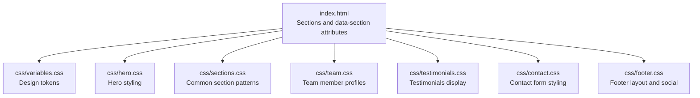
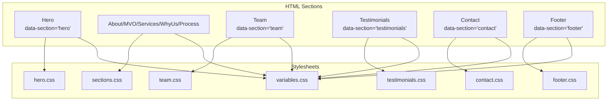
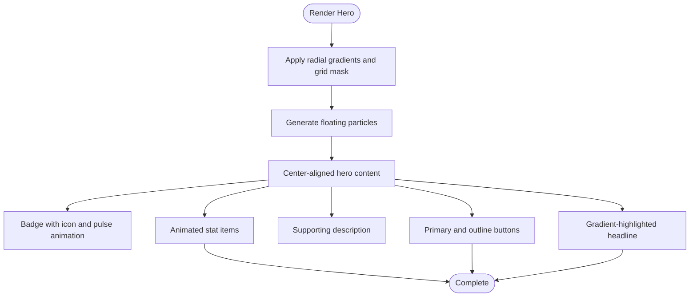
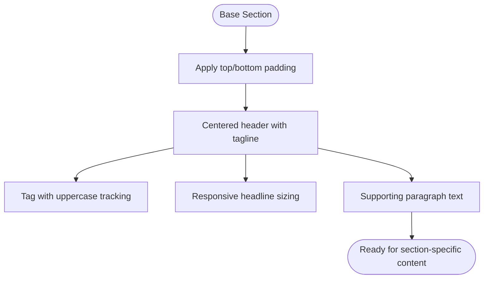
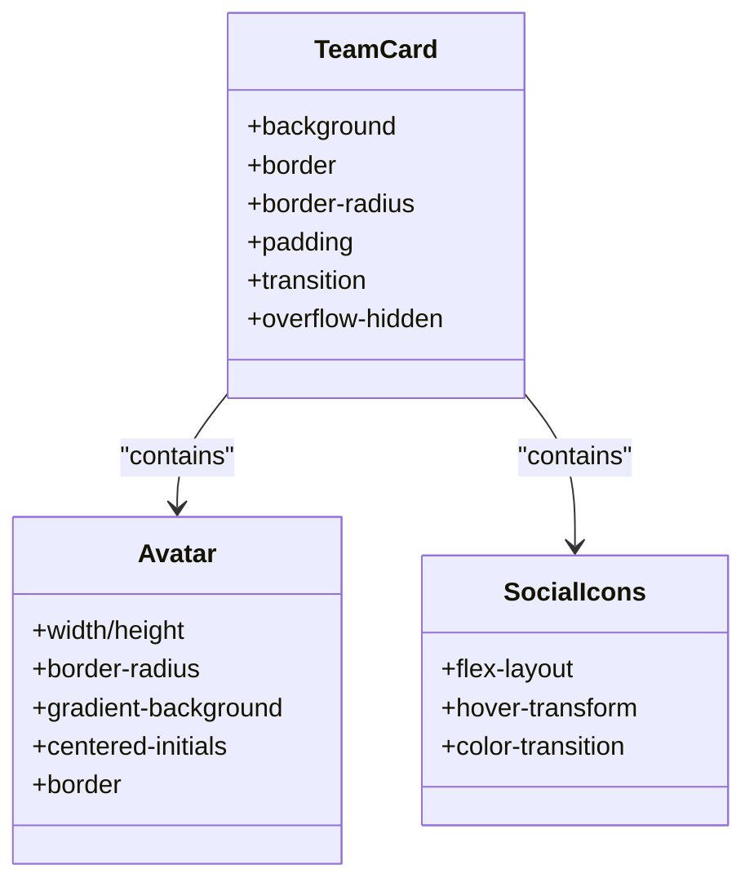
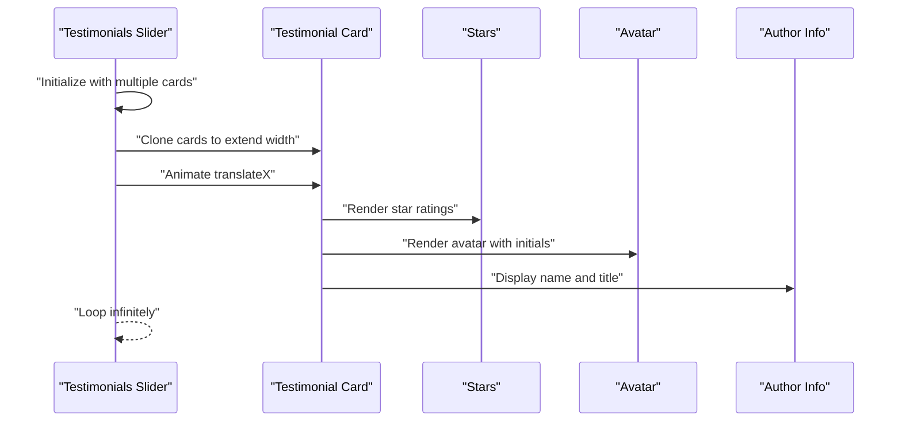
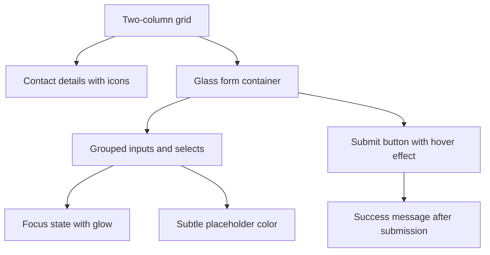
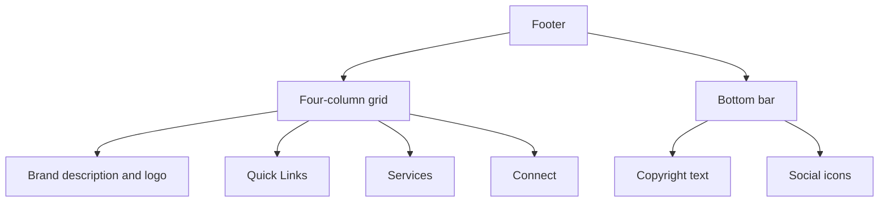
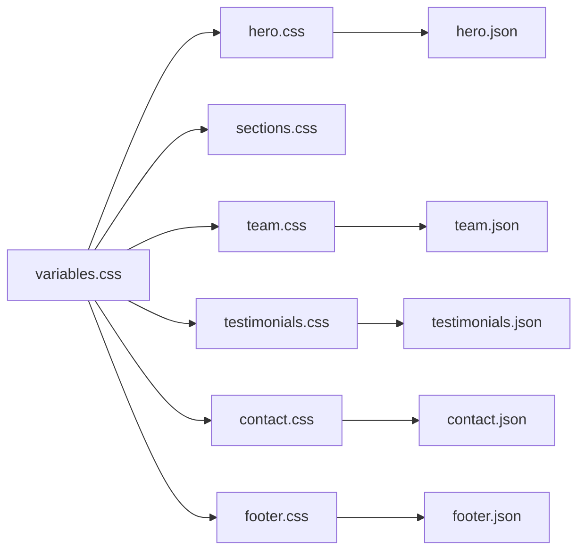

# Section-Specific Styles

<cite>
**Referenced Files in This Document**
- [index.html](file://index.html)
- [variables.css](file://css/variables.css)
- [hero.css](file://css/hero.css)
- [sections.css](file://css/sections.css)
- [team.css](file://css/team.css)
- [testimonials.css](file://css/testimonials.css)
- [contact.css](file://css/contact.css)
- [footer.css](file://css/footer.css)
- [hero.json](file://content/hero.json)
- [team.json](file://content/team.json)
- [testimonials.json](file://content/testimonials.json)
- [contact.json](file://content/contact.json)
- [footer.json](file://content/footer.json)
</cite>

## Table of Contents
1. [Introduction](#introduction)
2. [Project Structure](#project-structure)
3. [Core Components](#core-components)
4. [Architecture Overview](#architecture-overview)
5. [Detailed Component Analysis](#detailed-component-analysis)
6. [Dependency Analysis](#dependency-analysis)
7. [Performance Considerations](#performance-considerations)
8. [Troubleshooting Guide](#troubleshooting-guide)
9. [Conclusion](#conclusion)
10. [Appendices](#appendices)

## Introduction
This document explains the section-specific styling implementations across the Victory Marketing website. It covers hero section backgrounds and typography, foundational section layout patterns, team member cards and avatars, testimonials carousel/grid presentation, contact form controls and feedback, and footer multi-column layout with social links. It also provides customization guidelines to maintain design consistency and adapt styles for different content types.

## Project Structure
The styling is organized by feature sections with shared variables and responsive behaviors. Sections are rendered via HTML with data attributes and hydrated by JavaScript. Each section’s CSS is modular and layered on top of global variables and base styles.

**Diagram sources**
- [index.html:64-95](file://index.html#L64-L95)
- [variables.css:1-12](file://css/variables.css#L1-L12)
- [hero.css:1-128](file://css/hero.css#L1-L128)
- [sections.css:1-438](file://css/sections.css#L1-L438)
- [team.css:1-109](file://css/team.css#L1-L109)
- [testimonials.css:1-66](file://css/testimonials.css#L1-L66)
- [contact.css:1-137](file://css/contact.css#L1-L137)
- [footer.css:1-97](file://css/footer.css#L1-L97)

**Section sources**
- [index.html:22-33](file://index.html#L22-L33)
- [variables.css:1-12](file://css/variables.css#L1-L12)

## Core Components
- Hero section: Background gradients, animated grid overlay, floating particles, headline with gradient text highlight, statistics badges, and dual-button call-to-action.
- Common section foundation: Shared section padding, header alignment, tagline, and typography scales used across multiple sections.
- Team section: Grid-based cards with avatar placeholders, role badges, and social icons with hover effects.
- Testimonials: Horizontal slider animation with star ratings, author avatars, and structured author info.
- Contact section: Two-column layout with contact details and a glass-morphism form, including grouped inputs, focus states, and submit button.
- Footer: Multi-column grid with brand description, navigational links, and social media icons with hover transforms.

**Section sources**
- [hero.css:1-128](file://css/hero.css#L1-L128)
- [sections.css:348-376](file://css/sections.css#L348-L376)
- [team.css:1-109](file://css/team.css#L1-L109)
- [testimonials.css:1-66](file://css/testimonials.css#L1-L66)
- [contact.css:1-137](file://css/contact.css#L1-L137)
- [footer.css:1-97](file://css/footer.css#L1-L97)

## Architecture Overview
The page composes multiple sections, each with its own stylesheet. Variables define the theme tokens. Content JSON feeds dynamic rendering for hero, team, testimonials, contact, and footer sections.

**Diagram sources**
- [index.html:64-95](file://index.html#L64-L95)
- [variables.css:1-12](file://css/variables.css#L1-L12)
- [hero.css:1-128](file://css/hero.css#L1-L128)
- [sections.css:1-438](file://css/sections.css#L1-L438)
- [team.css:1-109](file://css/team.css#L1-L109)
- [testimonials.css:1-66](file://css/testimonials.css#L1-L66)
- [contact.css:1-137](file://css/contact.css#L1-L137)
- [footer.css:1-97](file://css/footer.css#L1-L97)

## Detailed Component Analysis

### Hero Section Styling
Hero styling emphasizes immersive background treatments, animated overlays, and a clear typographic hierarchy. Key aspects:
- Background gradients and radial overlays for depth.
- Animated grid mask and floating particle system.
- Headline with gradient text highlight for emphasis.
- Statistic badges with animated pulses.
- Dual buttons with primary and outline variants.

**Diagram sources**
- [hero.css:12-94](file://css/hero.css#L12-L94)
- [hero.css:32-47](file://css/hero.css#L32-L47)
- [hero.css:56-68](file://css/hero.css#L56-L68)
- [hero.css:74-94](file://css/hero.css#L74-L94)
- [hero.css:96-101](file://css/hero.css#L96-L101)
- [hero.css:103-127](file://css/hero.css#L103-L127)

**Section sources**
- [hero.css:1-128](file://css/hero.css#L1-L128)
- [hero.json:1-34](file://content/hero.json#L1-L34)

### Sections Foundation (Common Layouts, Spacing, Typography)
The common section foundation defines:
- Vertical padding per section.
- Centered section headers with tagline, headline, and description.
- Consistent typography scales and spacing patterns used across sections.

**Diagram sources**
- [sections.css:348-376](file://css/sections.css#L348-L376)

**Section sources**
- [sections.css:348-376](file://css/sections.css#L348-L376)

### Team Member Profile Styling
Team styling focuses on card-based layouts, avatar treatments, and interactive hover states:
- Card with animated accent bar and elevation on hover.
- Circular avatar placeholder with gradient background and initials.
- Role badge and bio text.
- Social icons with hover transforms and color shifts.

**Diagram sources**
- [team.css:14-45](file://css/team.css#L14-L45)
- [team.css:47-61](file://css/team.css#L47-L61)
- [team.css:81-109](file://css/team.css#L81-L109)

**Section sources**
- [team.css:1-109](file://css/team.css#L1-L109)
- [team.json:1-59](file://content/team.json#L1-L59)

### Testimonials Display System
Testimonials are presented in a horizontally scrolling slider with:
- Card layout with glass-like background and borders.
- Star rating display.
- Author avatar and info.
- Continuous horizontal animation loop.

**Diagram sources**
- [testimonials.css:7-13](file://css/testimonials.css#L7-L13)
- [testimonials.css:15-22](file://css/testimonials.css#L15-L22)
- [testimonials.css:24-36](file://css/testimonials.css#L24-L36)
- [testimonials.css:44-55](file://css/testimonials.css#L44-L55)
- [testimonials.css:57-65](file://css/testimonials.css#L57-L65)

**Section sources**
- [testimonials.css:1-66](file://css/testimonials.css#L1-L66)
- [testimonials.json:1-38](file://content/testimonials.json#L1-L38)

### Contact Form Styling
Contact form styling includes:
- Two-column layout with contact details and form.
- Glass-morphism form container with subtle borders.
- Grouped inputs with focus states and placeholder styling.
- Submit button with hover elevation and shadow.

**Diagram sources**
- [contact.css:6-13](file://css/contact.css#L6-L13)
- [contact.css:57-62](file://css/contact.css#L57-L62)
- [contact.css:64-96](file://css/contact.css#L64-L96)
- [contact.css:103-112](file://css/contact.css#L103-L112)
- [contact.css:114-130](file://css/contact.css#L114-L130)

**Section sources**
- [contact.css:1-137](file://css/contact.css#L1-L137)
- [contact.json:1-48](file://content/contact.json#L1-L48)

### Footer Styling
Footer styling implements a multi-column grid with:
- Brand description and CTA.
- Three navigational columns with links.
- Social media icons with hover transforms.
- Bottom bar with copyright and social links.

**Diagram sources**
- [footer.css:8-14](file://css/footer.css#L8-L14)
- [footer.css:16-27](file://css/footer.css#L16-L27)
- [footer.css:29-53](file://css/footer.css#L29-L53)
- [footer.css:55-70](file://css/footer.css#L55-L70)
- [footer.css:72-96](file://css/footer.css#L72-L96)

**Section sources**
- [footer.css:1-97](file://css/footer.css#L1-L97)
- [footer.json:1-45](file://content/footer.json#L1-L45)

## Dependency Analysis
- Theme tokens: All sections depend on variables for consistent colors and backgrounds.
- Section composition: Each section stylesheet is independent but shares common patterns.
- Content integration: JSON content files supply dynamic data for hero, team, testimonials, contact, and footer.

**Diagram sources**
- [variables.css:1-12](file://css/variables.css#L1-L12)
- [hero.css:1-128](file://css/hero.css#L1-L128)
- [sections.css:1-438](file://css/sections.css#L1-L438)
- [team.css:1-109](file://css/team.css#L1-L109)
- [testimonials.css:1-66](file://css/testimonials.css#L1-L66)
- [contact.css:1-137](file://css/contact.css#L1-L137)
- [footer.css:1-97](file://css/footer.css#L1-L97)
- [hero.json:1-34](file://content/hero.json#L1-L34)
- [team.json:1-59](file://content/team.json#L1-L59)
- [testimonials.json:1-38](file://content/testimonials.json#L1-L38)
- [contact.json:1-48](file://content/contact.json#L1-L48)
- [footer.json:1-45](file://content/footer.json#L1-L45)

**Section sources**
- [variables.css:1-12](file://css/variables.css#L1-L12)
- [index.html:22-33](file://index.html#L22-L33)

## Performance Considerations
- CSS animations: Floating particles and slider loops rely on transforms and opacity; keep durations reasonable to avoid jank on lower-end devices.
- Gradients and masks: Radial gradients and grid masks are GPU-friendly; avoid excessive reflows by limiting DOM changes during scroll.
- Hover effects: Use transform and opacity for smooth GPU-accelerated transitions.
- Images: Ensure hero and team images use appropriate sizes and modern formats to reduce bandwidth.

## Troubleshooting Guide
- Button styles not applying: Verify button classes match the defined button variants and that the button styles are loaded after the hero stylesheet.
- Form focus states missing: Confirm focus pseudo-selectors are not overridden by browser defaults and that the form group styles are included.
- Slider not animating: Ensure the slider container has sufficient width and that the animation property is supported; check for overflow hidden affecting visibility.
- Footer column misalignment: Adjust grid template columns or use media queries to stack columns on small screens.
- Color mismatches: Verify variables are loaded before section styles and that overrides are not unintentionally applied.

**Section sources**
- [hero.css:290-324](file://css/hero.css#L290-L324)
- [contact.css:90-96](file://css/contact.css#L90-L96)
- [testimonials.css:10-13](file://css/testimonials.css#L10-L13)
- [footer.css:10-14](file://css/footer.css#L10-L14)

## Conclusion
The section-specific styles are modular, theme-consistent, and optimized for readability and interactivity. By leveraging shared variables and common layout patterns, teams can customize individual sections while preserving visual coherence. The provided JSON content files enable dynamic updates without altering stylesheets.

## Appendices
- Customization guidelines:
  - Modify variables to change the palette globally.
  - Override section-specific classes for targeted changes.
  - Extend grid templates for responsive adjustments.
  - Add new button variants by mirroring existing patterns.
  - Introduce new testimonial layouts by copying the card structure and adjusting slider behavior.