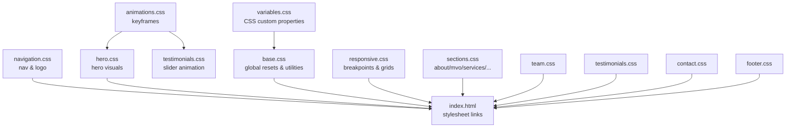
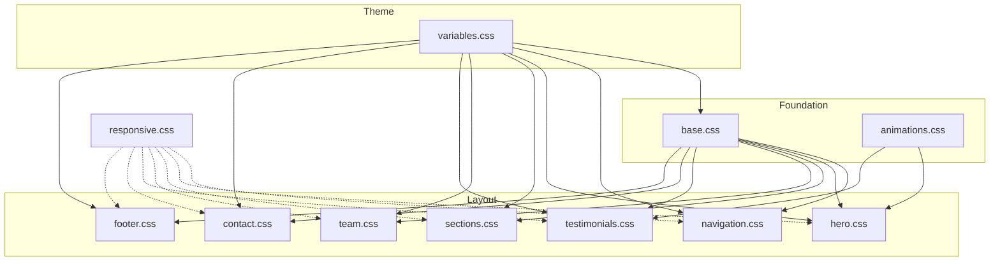
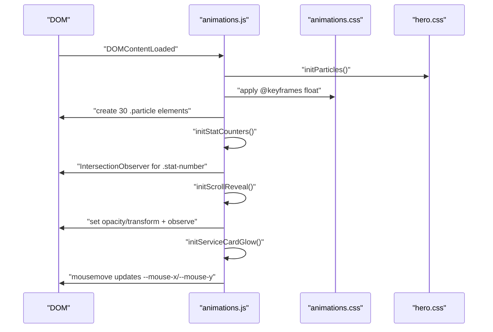
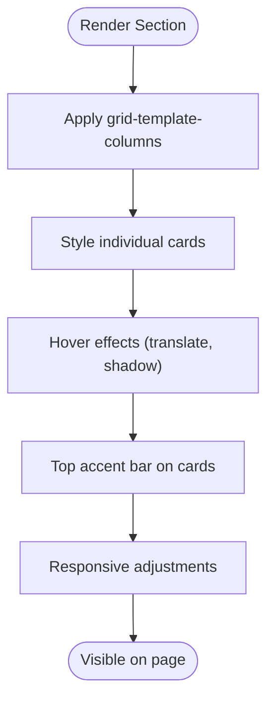
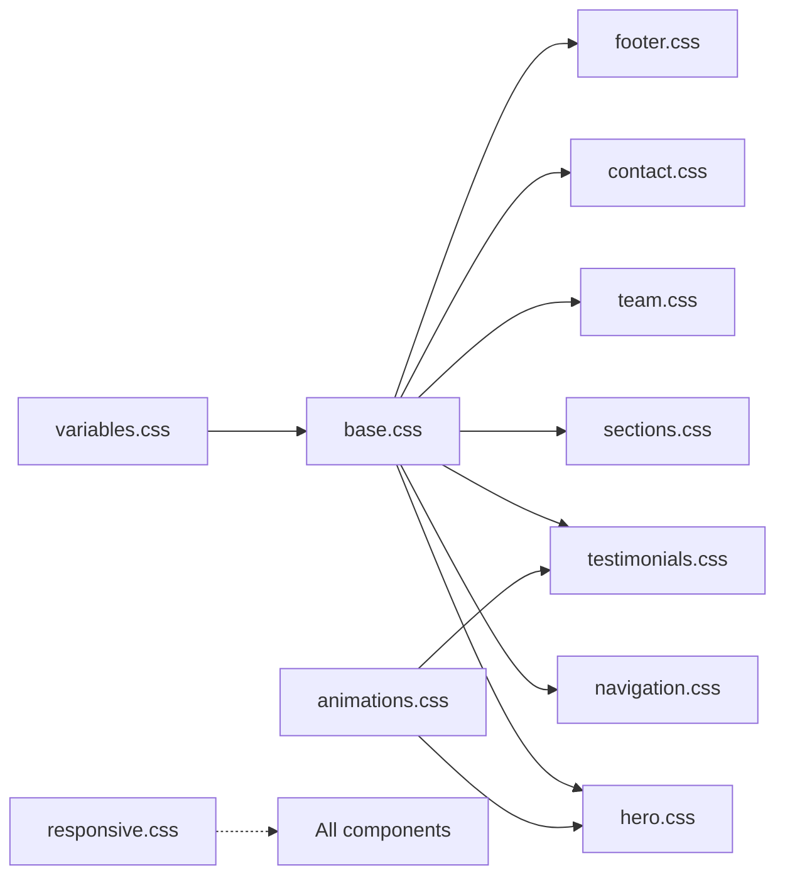

# Styling Architecture

<cite>
**Referenced Files in This Document**
- [index.html](file://index.html)
- [variables.css](file://css/variables.css)
- [base.css](file://css/base.css)
- [animations.css](file://css/animations.css)
- [responsive.css](file://css/responsive.css)
- [navigation.css](file://css/navigation.css)
- [hero.css](file://css/hero.css)
- [sections.css](file://css/sections.css)
- [team.css](file://css/team.css)
- [testimonials.css](file://css/testimonials.css)
- [contact.css](file://css/contact.css)
- [footer.css](file://css/footer.css)
- [animations.js](file://js/animations.js)
- [main.js](file://js/main.js)
- [site.json](file://content/site.json)
- [services.json](file://content/services.json)
</cite>

## Table of Contents
1. [Introduction](#introduction)
2. [Project Structure](#project-structure)
3. [Core Components](#core-components)
4. [Architecture Overview](#architecture-overview)
5. [Detailed Component Analysis](#detailed-component-analysis)
6. [Dependency Analysis](#dependency-analysis)
7. [Performance Considerations](#performance-considerations)
8. [Troubleshooting Guide](#troubleshooting-guide)
9. [Conclusion](#conclusion)
10. [Appendices](#appendices)

## Introduction
This document describes the CSS architecture and styling system used by the Victory Marketing website. The project follows a modular CSS approach, separating concerns into distinct files for variables, base styles, animations, navigation, hero, sections, team, testimonials, contact, footer, and responsive overrides. The system leverages CSS custom properties for theme management, a robust base layer for global resets and utilities, and a set of section-specific styles that compose into a cohesive design. Responsive behavior is implemented via CSS Grid, Flexbox, and media queries. Animations integrate with JavaScript for dynamic effects such as floating particles, scroll-reveal transitions, and interactive hover states.

## Project Structure
The stylesheet organization is intentionally modular to improve maintainability and scalability:
- variables.css defines CSS custom properties for theme tokens (colors, backgrounds, borders).
- base.css establishes global resets, typography, common utilities (buttons, scroll-to-top, loader), and shared section scaffolding.
- animations.css provides reusable keyframe animations used across components.
- navigation.css, hero.css, sections.css, team.css, testimonials.css, contact.css, footer.css encapsulate styling per major UI area.
- responsive.css centralizes breakpoints and layout adjustments for mobile/tablet/desktop.

The HTML links all stylesheets in a logical order so that later files can override earlier ones as needed, while keeping specificity low and predictable.

**Diagram sources**
- [index.html:22-33](file://index.html#L22-L33)
- [variables.css:1-12](file://css/variables.css#L1-L12)
- [base.css:1-165](file://css/base.css#L1-L165)
- [animations.css:1-62](file://css/animations.css#L1-L62)
- [navigation.css:1-113](file://css/navigation.css#L1-L113)
- [hero.css:1-128](file://css/hero.css#L1-L128)
- [sections.css:1-438](file://css/sections.css#L1-L438)
- [team.css:1-109](file://css/team.css#L1-L109)
- [testimonials.css:1-66](file://css/testimonials.css#L1-L66)
- [contact.css:1-137](file://css/contact.css#L1-L137)
- [footer.css:1-97](file://css/footer.css#L1-L97)
- [responsive.css:1-104](file://css/responsive.css#L1-L104)

**Section sources**
- [index.html:22-33](file://index.html#L22-L33)
- [variables.css:1-12](file://css/variables.css#L1-L12)
- [base.css:1-165](file://css/base.css#L1-L165)
- [animations.css:1-62](file://css/animations.css#L1-L62)
- [responsive.css:1-104](file://css/responsive.css#L1-L104)
- [navigation.css:1-113](file://css/navigation.css#L1-L113)
- [hero.css:1-128](file://css/hero.css#L1-L128)
- [sections.css:1-438](file://css/sections.css#L1-L438)
- [team.css:1-109](file://css/team.css#L1-L109)
- [testimonials.css:1-66](file://css/testimonials.css#L1-L66)
- [contact.css:1-137](file://css/contact.css#L1-L137)
- [footer.css:1-97](file://css/footer.css#L1-L97)

## Core Components
- Theme Variables: Centralized color tokens and semantic values enable consistent theming across components. See [variables.css:1-12](file://css/variables.css#L1-L12).
- Base Layer: Global resets, typography families, section scaffolding, buttons, scroll-to-top, and loader are defined in [base.css:1-165](file://css/base.css#L1-L165).
- Animations: Reusable keyframes for floating, pulsing, spinning, scrolling, and loader effects are defined in [animations.css:1-62](file://css/animations.css#L1-L62).
- Navigation: Sticky navigation with hover effects, backdrop blur, and CTA button styling in [navigation.css:1-113](file://css/navigation.css#L1-L113).
- Hero: Fullscreen hero with gradient overlays, floating particles, stats, and call-to-action buttons in [hero.css:1-128](file://css/hero.css#L1-L128).
- Sections: Modular layouts for About, MVO, Services, Why Us, Process, and CTA Banner in [sections.css:1-438](file://css/sections.css#L1-L438).
- Team: Profile cards with avatar placeholders, role badges, and hover animations in [team.css:1-109](file://css/team.css#L1-L109).
- Testimonials: Horizontal slider animation and card styling in [testimonials.css:1-66](file://css/testimonials.css#L1-L66).
- Contact: Two-column layout with info list items, form groups, and submit button in [contact.css:1-137](file://css/contact.css#L1-L137).
- Footer: Multi-column grid with branding, links, and social icons in [footer.css:1-97](file://css/footer.css#L1-L97).
- Responsive Overrides: Breakpoint-driven adjustments for grids, navigation, and content in [responsive.css:1-104](file://css/responsive.css#L1-L104).

**Section sources**
- [variables.css:1-12](file://css/variables.css#L1-L12)
- [base.css:1-165](file://css/base.css#L1-L165)
- [animations.css:1-62](file://css/animations.css#L1-L62)
- [navigation.css:1-113](file://css/navigation.css#L1-L113)
- [hero.css:1-128](file://css/hero.css#L1-L128)
- [sections.css:1-438](file://css/sections.css#L1-L438)
- [team.css:1-109](file://css/team.css#L1-L109)
- [testimonials.css:1-66](file://css/testimonials.css#L1-L66)
- [contact.css:1-137](file://css/contact.css#L1-L137)
- [footer.css:1-97](file://css/footer.css#L1-L97)
- [responsive.css:1-104](file://css/responsive.css#L1-L104)

## Architecture Overview
The styling architecture is layered and modular:
- Variables define theme tokens consumed by all components.
- Base provides global defaults and utilities.
- Section-specific styles build upon base with minimal overrides.
- Animations are decoupled and referenced by both CSS and JavaScript.
- Responsive rules adapt layouts without duplicating styles.

**Diagram sources**
- [variables.css:1-12](file://css/variables.css#L1-L12)
- [base.css:1-165](file://css/base.css#L1-L165)
- [animations.css:1-62](file://css/animations.css#L1-L62)
- [navigation.css:1-113](file://css/navigation.css#L1-L113)
- [hero.css:1-128](file://css/hero.css#L1-L128)
- [sections.css:1-438](file://css/sections.css#L1-L438)
- [team.css:1-109](file://css/team.css#L1-L109)
- [testimonials.css:1-66](file://css/testimonials.css#L1-L66)
- [contact.css:1-137](file://css/contact.css#L1-L137)
- [footer.css:1-97](file://css/footer.css#L1-L97)
- [responsive.css:1-104](file://css/responsive.css#L1-L104)

## Detailed Component Analysis

### Variables and Theme System
- Purpose: Provide a single source of truth for colors, backgrounds, borders, and semantic tokens.
- Usage: All components consume variables via var(--token) to ensure consistent theming.
- Extensibility: Add or modify tokens here to update the entire design system globally.

**Section sources**
- [variables.css:1-12](file://css/variables.css#L1-L12)

### Base Layer and Utilities
- Resets and box sizing are applied globally.
- Typography families and sizes are centralized for headings and body text.
- Shared utilities include:
  - Section scaffolding with padding and header styles.
  - Buttons with primary and outline variants and hover states.
  - Scroll-to-top control with visibility toggles.
  - Loader overlay with animated logo and text.

**Section sources**
- [base.css:1-165](file://css/base.css#L1-L165)

### Animations and JavaScript Integration
- CSS keyframes define floating, pulsing, spinning, horizontal scrolling, and loader pulse.
- JavaScript triggers dynamic effects:
  - Particle generation inside the hero container.
  - Stat counters animate when scrolled into view.
  - Cards fade in and lift on scroll reveal.
  - Service cards emit a radial glow under mouse movement.

**Diagram sources**
- [main.js:11-37](file://js/main.js#L11-L37)
- [animations.js:6-98](file://js/animations.js#L6-L98)
- [animations.css:3-61](file://css/animations.css#L3-L61)
- [hero.css:32-47](file://css/hero.css#L32-L47)

**Section sources**
- [animations.css:1-62](file://css/animations.css#L1-L62)
- [animations.js:6-98](file://js/animations.js#L6-L98)
- [main.js:11-37](file://js/main.js#L11-L37)

### Navigation
- Fixed sticky navigation with backdrop blur and shadow on scroll.
- Hover effects on links and CTA button with animated underline.
- Mobile menu toggle reveals a blurred, full-width navigation list.

**Section sources**
- [navigation.css:1-113](file://css/navigation.css#L1-L113)

### Hero Section
- Full viewport hero with radial gradients and a subtle grid mask.
- Floating particles powered by CSS animations and dynamically generated by JavaScript.
- Hero badge with pulsing icon, headline with gradient text highlight, and statistics row.
- Buttons centered with wrapping support for responsiveness.

**Section sources**
- [hero.css:1-128](file://css/hero.css#L1-L128)

### Sections Layout (About, MVO, Services, Why Us, Process, CTA)
- About: Two-column grid with visual image and floating content card.
- MVO: Three-column card grid with animated accent bar and hover elevation.
- Services: Three-column card grid with interactive radial glow on hover.
- Why Us: Four-column feature cards with hover icon glow and elevation.
- Process: Horizontal timeline with animated step numbers and connecting gradient line.
- CTA Banner: Centered banner with animated radial background and call-to-action.

**Diagram sources**
- [sections.css:6-13](file://css/sections.css#L6-L13)
- [sections.css:106-145](file://css/sections.css#L106-L145)
- [sections.css:177-217](file://css/sections.css#L177-L217)
- [sections.css:267-317](file://css/sections.css#L267-L317)
- [sections.css:324-393](file://css/sections.css#L324-L393)
- [sections.css:396-437](file://css/sections.css#L396-L437)

**Section sources**
- [sections.css:1-438](file://css/sections.css#L1-L438)

### Team Member Profiles
- Three-column grid with translucent cards, animated accent bar, and hover elevation.
- Avatar placeholder with gradient background and role badge.
- Social links with hover transforms and color shifts.

**Section sources**
- [team.css:1-109](file://css/team.css#L1-L109)

### Testimonials Display
- Horizontal slider animation loops continuously to showcase customer feedback.
- Individual testimonial cards with star ratings, italicized text, and author info.

**Section sources**
- [testimonials.css:1-66](file://css/testimonials.css#L1-L66)

### Contact Form Styling
- Two-column grid layout with contact info list and form panel.
- Form groups with labels, inputs, textarea, and a dual-column row for split fields.
- Focus states with accent borders and soft glow; submit button with hover elevation.

**Section sources**
- [contact.css:1-137](file://css/contact.css#L1-L137)

### Footer
- Multi-column grid with branding, navigation columns, and social links.
- Bottom bar with copyright and social icons, all with hover transitions.

**Section sources**
- [footer.css:1-97](file://css/footer.css#L1-L97)

### Responsive Design
- Breakpoints adjust:
  - Grids to single column on smaller screens.
  - Navigation to a stacked, backdrop-filtered mobile menu.
  - Footer to a single column.
  - Testimonial card widths to fit the viewport.
  - CTA banner padding and typography scaling.

**Section sources**
- [responsive.css:1-104](file://css/responsive.css#L1-L104)

## Dependency Analysis
The stylesheet dependencies are explicit in the HTML head and ordered to allow controlled overrides:
- variables.css is linked first to establish tokens.
- animations.css precedes component styles that rely on keyframes.
- base.css provides foundational styles.
- navigation.css builds atop base for nav-specific overrides.
- component styles (hero, sections, team, testimonials, contact, footer) follow base.
- responsive.css is last to ensure media queries override earlier declarations.

**Diagram sources**
- [index.html:22-33](file://index.html#L22-L33)
- [variables.css:1-12](file://css/variables.css#L1-L12)
- [base.css:1-165](file://css/base.css#L1-L165)
- [animations.css:1-62](file://css/animations.css#L1-L62)
- [navigation.css:1-113](file://css/navigation.css#L1-L113)
- [hero.css:1-128](file://css/hero.css#L1-L128)
- [sections.css:1-438](file://css/sections.css#L1-L438)
- [team.css:1-109](file://css/team.css#L1-L109)
- [testimonials.css:1-66](file://css/testimonials.css#L1-L66)
- [contact.css:1-137](file://css/contact.css#L1-L137)
- [footer.css:1-97](file://css/footer.css#L1-L97)
- [responsive.css:1-104](file://css/responsive.css#L1-L104)

**Section sources**
- [index.html:22-33](file://index.html#L22-L33)

## Performance Considerations
- CSS custom properties reduce duplication and enable efficient theme switching.
- CSS Grid and Flexbox minimize JavaScript-driven layout calculations.
- Animations leverage GPU-friendly properties (transform, opacity) and are throttled by IntersectionObserver where applicable.
- Media queries avoid redundant styles by scoping overrides to specific breakpoints.
- Keep animations off for reduced motion preferences by relying on prefers-reduced-motion at the user level.

## Troubleshooting Guide
- Loader does not hide: Verify the loader element exists and the hidden class is applied after initialization.
- Particles not appearing: Confirm the hero container has the expected ID and the particle generation function runs.
- Scroll-reveal not triggering: Ensure elements have the correct classes and the IntersectionObserver threshold/rootMargin are appropriate.
- Form focus glow missing: Check that focus pseudo-selectors are not overridden by higher specificity elsewhere.
- Mobile menu not opening: Confirm the mobile menu button toggles the active class on the navigation links container.

**Section sources**
- [base.css:131-165](file://css/base.css#L131-L165)
- [animations.js:6-98](file://js/animations.js#L6-L98)
- [responsive.css:47-68](file://css/responsive.css#L47-L68)
- [contact.css:88-96](file://css/contact.css#L88-L96)

## Conclusion
The styling system employs a clean, modular architecture with CSS custom properties at its core, a strong base layer, and component-specific styles that compose cohesively. Animations are separated from logic and integrated via JavaScript for dynamic, performant interactions. Responsive behavior is handled centrally through media queries. This approach supports easy customization, maintenance, and extension across the site.

## Appendices

### Customization Guidelines
- Colors and Tokens
  - Modify tokens in [variables.css:1-12](file://css/variables.css#L1-L12) to change the palette globally.
  - Use tokens consistently across components to preserve harmony.
- Typography
  - Adjust font families and weights in [base.css:11-22](file://css/base.css#L11-L22) for global typography.
  - Override specific headings or paragraphs within component files as needed.
- Spacing and Layout
  - Tune paddings and margins in [base.css:24-55](file://css/base.css#L24-L55) for section spacing.
  - Adjust grid templates in [sections.css:6-13](file://css/sections.css#L6-L13) and [responsive.css:3-45](file://css/responsive.css#L3-L45) to change layout density.
- Animations and Interactions
  - Add or refine keyframes in [animations.css:1-62](file://css/animations.css#L1-L62).
  - Extend JavaScript in [animations.js:1-98](file://js/animations.js#L1-L98) to introduce new dynamic effects.
- Naming Conventions
  - Prefer kebab-case for class names (e.g., .section-header, .nav-links).
  - Scope component-specific styles to dedicated files to avoid cross-contamination.
  - Use semantic prefixes for utilities (e.g., .btn, .loader) to clarify intent.

### Best Practices for Maintaining the Modular System
- Keep overrides shallow: Prefer component-level styles over deep descendant selectors.
- Centralize responsive logic: Place breakpoint-specific changes in [responsive.css:1-104](file://css/responsive.css#L1-L104).
- Encapsulate animations: Define keyframes once and reuse across components.
- Test across devices: Validate grid and flex layouts on various screen sizes.
- Version content JSONs: Changes in [site.json](file://content/site.json) and [services.json](file://content/services.json) should be reflected in corresponding sections’ rendering and styling.