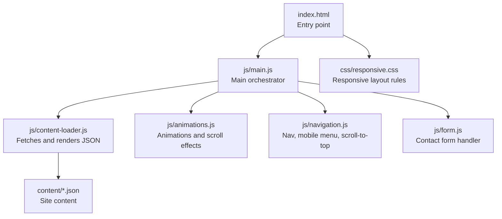
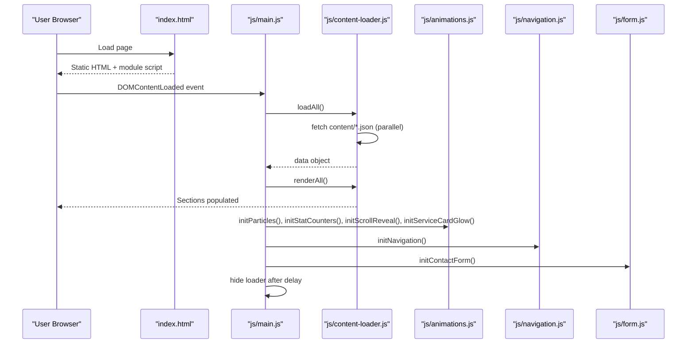
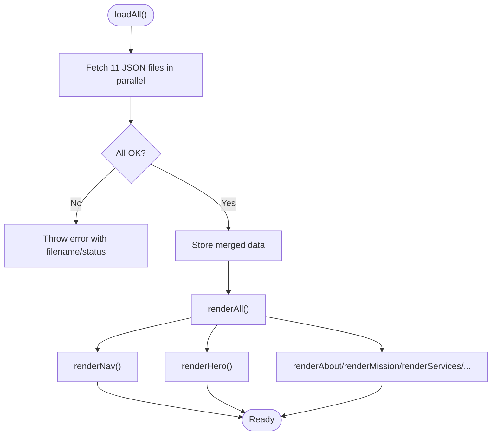
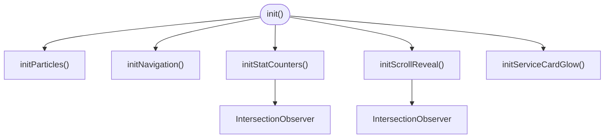
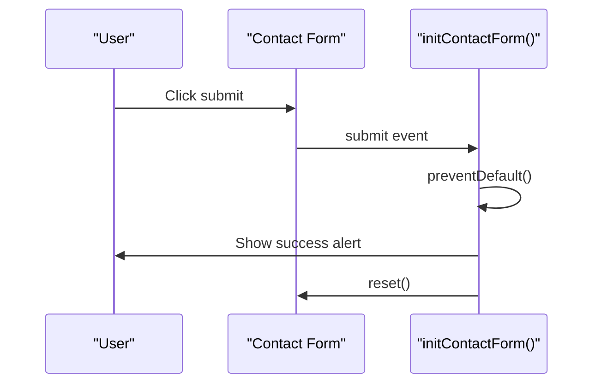
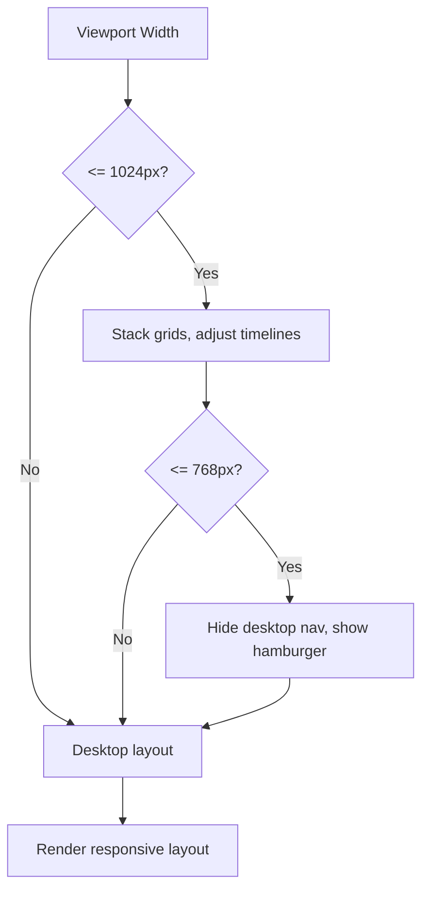
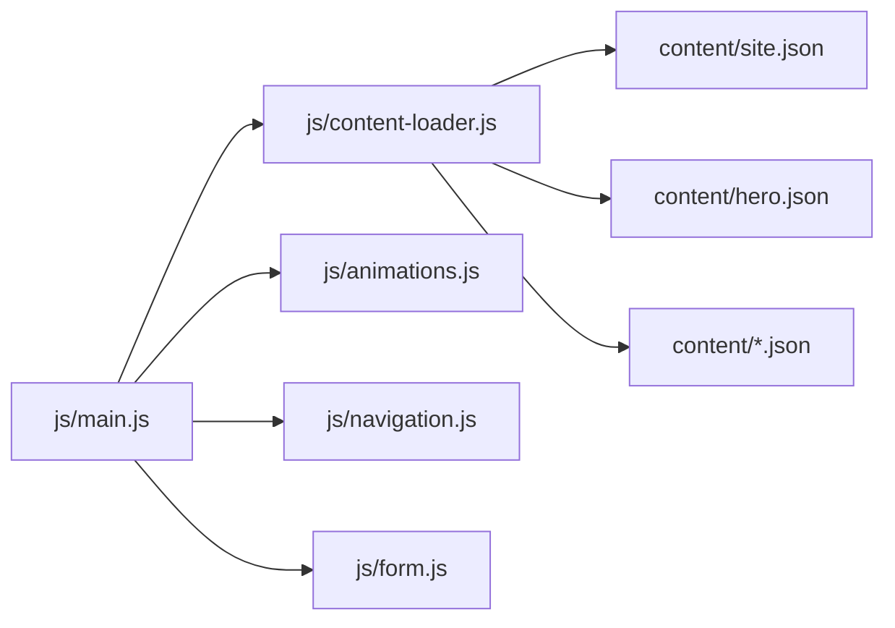

# Troubleshooting and FAQ

<cite>
**Referenced Files in This Document**
- [index.html](file://index.html)
- [victory_marketing.html](file://victory_marketing.html)
- [js/main.js](file://js/main.js)
- [js/content-loader.js](file://js/content-loader.js)
- [js/animations.js](file://js/animations.js)
- [js/navigation.js](file://js/navigation.js)
- [js/form.js](file://js/form.js)
- [css/responsive.css](file://css/responsive.css)
- [content/site.json](file://content/site.json)
- [content/hero.json](file://content/hero.json)
</cite>

## Table of Contents
1. [Introduction](#introduction)
2. [Project Structure](#project-structure)
3. [Core Components](#core-components)
4. [Architecture Overview](#architecture-overview)
5. [Detailed Component Analysis](#detailed-component-analysis)
6. [Dependency Analysis](#dependency-analysis)
7. [Performance Considerations](#performance-considerations)
8. [Troubleshooting Guide](#troubleshooting-guide)
9. [Conclusion](#conclusion)
10. [Appendices](#appendices)

## Introduction
This document provides comprehensive troubleshooting guidance and a focused FAQ for the Victory Marketing website. It covers browser compatibility, JavaScript errors, performance issues, content management problems, form submission issues, responsive design and mobile concerns, user experience pitfalls, and debugging techniques using browser developer tools. The goal is to help both technical and non-technical users diagnose and resolve common issues quickly.

## Project Structure
The website is a single-page application built with modular JavaScript and JSON-driven content. Key elements:
- HTML entry points define static markup and load stylesheets and a JavaScript module.
- A main module orchestrates loading and rendering of JSON content, initializing animations, navigation, forms, and scroll effects.
- Responsive CSS adapts layouts for tablets and phones.
- Content is stored in structured JSON files under a content directory.

**Diagram sources**
- [index.html:1-106](file://index.html#L1-L106)
- [js/main.js:1-41](file://js/main.js#L1-L41)
- [js/content-loader.js:1-443](file://js/content-loader.js#L1-L443)
- [js/animations.js:1-98](file://js/animations.js#L1-L98)
- [js/navigation.js:1-55](file://js/navigation.js#L1-L55)
- [js/form.js:1-17](file://js/form.js#L1-L17)
- [css/responsive.css:1-104](file://css/responsive.css#L1-L104)

**Section sources**
- [index.html:1-106](file://index.html#L1-L106)
- [js/main.js:1-41](file://js/main.js#L1-L41)
- [js/content-loader.js:1-443](file://js/content-loader.js#L1-L443)
- [css/responsive.css:1-104](file://css/responsive.css#L1-L104)

## Core Components
- Main orchestrator: Initializes the app, loads JSON, renders sections, and starts interactive features.
- Content loader: Parallelizes fetching of JSON files, stores data, and renders each section into the DOM.
- Animations: Particles, stat counters, scroll reveals, and mouse-tracking glow.
- Navigation: Scroll effect, mobile menu toggle, smooth scrolling, and scroll-to-top.
- Form: Validates locally via HTML attributes and shows a success message.
- Responsive: Media queries adjust grids, navigation, and spacing for smaller screens.

**Section sources**
- [js/main.js:11-41](file://js/main.js#L11-L41)
- [js/content-loader.js:18-53](file://js/content-loader.js#L18-L53)
- [js/animations.js:6-98](file://js/animations.js#L6-L98)
- [js/navigation.js:6-55](file://js/navigation.js#L6-L55)
- [js/form.js:5-17](file://js/form.js#L5-L17)
- [css/responsive.css:3-103](file://css/responsive.css#L3-L103)

## Architecture Overview
The runtime flow begins when the HTML page loads. The main module waits for DOMContentLoaded, then:
- Creates a ContentLoader instance.
- Loads all JSON content concurrently.
- Renders all sections into the DOM.
- Initializes animations, navigation, scroll effects, and form handling.
- Hides the loader after a short delay.

**Diagram sources**
- [index.html:103](file://index.html#L103)
- [js/main.js:11-41](file://js/main.js#L11-L41)
- [js/content-loader.js:18-53](file://js/content-loader.js#L18-L53)
- [js/animations.js:6-98](file://js/animations.js#L6-L98)
- [js/navigation.js:6-55](file://js/navigation.js#L6-L55)
- [js/form.js:5-17](file://js/form.js#L5-L17)

## Detailed Component Analysis

### Content Loading and Rendering
- The loader fetches JSON files concurrently and throws a clear error if any fetch fails.
- Each section’s render method targets a container with a matching data-section attribute.
- The hero section includes animated stats and buttons; testimonials are duplicated for a slider effect.

**Diagram sources**
- [js/content-loader.js:18-53](file://js/content-loader.js#L18-L53)
- [js/content-loader.js:55-441](file://js/content-loader.js#L55-L441)

**Section sources**
- [js/content-loader.js:11-16](file://js/content-loader.js#L11-L16)
- [js/content-loader.js:18-37](file://js/content-loader.js#L18-L37)
- [js/content-loader.js:55-107](file://js/content-loader.js#L55-L107)
- [js/content-loader.js:248-286](file://js/content-loader.js#L248-L286)

### Animations and Interactions
- Particles: Dynamically creates floating elements with randomized delays and durations.
- Stat counters: Uses IntersectionObserver to animate counts when elements come into view.
- Scroll reveal: Hides elements offscreen and fades/raises them when scrolled near.
- Mouse glow: Tracks mouse position to apply gradient highlights on service cards.
- Navigation: Adds a class on scroll, toggles mobile menu, smooth-scrolls anchors, and shows a scroll-to-top button.

**Diagram sources**
- [js/main.js:22-27](file://js/main.js#L22-L27)
- [js/animations.js:6-98](file://js/animations.js#L6-L98)
- [js/navigation.js:6-55](file://js/navigation.js#L6-L55)

**Section sources**
- [js/animations.js:6-20](file://js/animations.js#L6-L20)
- [js/animations.js:22-58](file://js/animations.js#L22-L58)
- [js/animations.js:60-84](file://js/animations.js#L60-L84)
- [js/animations.js:86-97](file://js/animations.js#L86-L97)
- [js/navigation.js:12-53](file://js/navigation.js#L12-L53)

### Forms and Validation
- The contact form uses HTML-required attributes for basic client-side validation.
- On submit, the form prevents default, shows a success message, and resets the form.

**Diagram sources**
- [js/form.js:5-17](file://js/form.js#L5-L17)
- [js/content-loader.js:337-405](file://js/content-loader.js#L337-L405)

**Section sources**
- [js/form.js:5-17](file://js/form.js#L5-L17)
- [js/content-loader.js:344-405](file://js/content-loader.js#L344-L405)

### Responsive Design and Mobile
- Media queries reconfigure grids, stack navigation, and adjust typography for tablets and phones.
- The hero stats and testimonials slider adapt to narrow screens.

**Diagram sources**
- [css/responsive.css:3-103](file://css/responsive.css#L3-L103)

**Section sources**
- [css/responsive.css:3-45](file://css/responsive.css#L3-L45)
- [css/responsive.css:47-103](file://css/responsive.css#L47-L103)

## Dependency Analysis
- The main module depends on the content loader and individual feature modules.
- The content loader depends on the content directory structure and JSON schema.
- Animations rely on DOM elements with specific IDs/classes.
- Navigation requires anchor links and a scroll-to-top element.
- Forms require a form element with specific attributes and dataset values.

**Diagram sources**
- [js/main.js:6-9](file://js/main.js#L6-L9)
- [js/content-loader.js:12-35](file://js/content-loader.js#L12-L35)
- [content/site.json:1-18](file://content/site.json#L1-L18)
- [content/hero.json:1-34](file://content/hero.json#L1-L34)

**Section sources**
- [js/main.js:6-9](file://js/main.js#L6-L9)
- [js/content-loader.js:12-35](file://js/content-loader.js#L12-L35)
- [content/site.json:1-18](file://content/site.json#L1-L18)
- [content/hero.json:1-34](file://content/hero.json#L1-L34)

## Performance Considerations
- Network and rendering
  - JSON loading occurs in parallel; ensure the server responds promptly to avoid initialization delays.
  - Large images or many particles can increase paint cost; consider reducing particle count or deferring heavy assets.
- Animations
  - IntersectionObserver is efficient, but avoid excessive observers. Keep thresholds reasonable.
  - Mousemove handlers can be expensive; throttle if needed.
- Memory
  - Avoid attaching listeners repeatedly; ensure initialization runs once.
  - Remove observers when sections are removed or pages change (not applicable here as this is a SPA).
- Bundle size
  - The app uses ES modules; keep modules cohesive to reduce overhead.

[No sources needed since this section provides general guidance]

## Troubleshooting Guide

### Browser Compatibility
- Modern browsers
  - The site uses ES modules, IntersectionObserver, and CSS variables. These features are supported in all modern browsers.
- Graceful degradation
  - If IntersectionObserver is unavailable, scroll-reveal and stat counters will not animate. Add a polyfill or a simple fallback to show content immediately.
  - If ES modules fail to load, the page will not initialize. Ensure the hosting server serves .mjs or configures MIME types properly for modules.

**Section sources**
- [index.html:103](file://index.html#L103)
- [js/animations.js:45-57](file://js/animations.js#L45-L57)

### JavaScript Errors

- Module loading failures
  - Symptoms: Nothing loads, console shows module errors.
  - Causes: Incorrect MIME type, wrong path, or CSP blocking modules.
  - Fixes: Verify the module script path and MIME type; test loading the script directly in the browser.

- Content loading issues
  - Symptoms: Sections empty, loader never hides.
  - Causes: 404 for JSON files, CORS errors, or malformed JSON.
  - Fixes: Confirm JSON filenames match the loader’s expectations; validate JSON syntax; check network tab for errors.

- Animation problems
  - Symptoms: Stats do not animate, cards do not fade in, particles not moving.
  - Causes: Missing DOM elements, unsupported APIs, or disabled scripts.
  - Fixes: Ensure containers exist; verify IntersectionObserver availability; confirm CSS animations are not blocked.

**Section sources**
- [js/main.js:28-36](file://js/main.js#L28-L36)
- [js/content-loader.js:11-16](file://js/content-loader.js#L11-L16)
- [js/animations.js:22-58](file://js/animations.js#L22-L58)
- [js/animations.js:60-84](file://js/animations.js#L60-L84)
- [js/animations.js:6-20](file://js/animations.js#L6-L20)

### Performance Issues

- Slow loading times
  - Check network tab for long-loading JSON or images.
  - Optimize image sizes and formats; defer non-critical assets.

- Animation stuttering
  - Reduce particle count; simplify animations; avoid layout thrashing.
  - Use transform/opacity where possible; avoid frequent reflows.

- Memory leaks
  - Ensure event listeners are not attached multiple times.
  - Avoid holding references to removed DOM nodes.

**Section sources**
- [js/animations.js:8-20](file://js/animations.js#L8-L20)
- [js/animations.js:45-57](file://js/animations.js#L45-L57)

### Content Management System Problems

- JSON parsing errors
  - Symptoms: Console error indicating invalid JSON.
  - Fixes: Validate JSON syntax; ensure no trailing commas; confirm encoding is UTF-8.

- Missing assets
  - Symptoms: Broken images, missing logos.
  - Fixes: Verify asset paths; confirm images exist and are publicly accessible.

- Rendering issues
  - Symptoms: Sections not appearing, incorrect markup.
  - Fixes: Ensure data-section attributes match the loader’s expectations; confirm the loader ran and completed.

**Section sources**
- [js/content-loader.js:11-16](file://js/content-loader.js#L11-L16)
- [js/content-loader.js:55-107](file://js/content-loader.js#L55-L107)
- [content/site.json:5](file://content/site.json#L5)
- [content/hero.json:12](file://content/hero.json#L12)

### Form Submission Problems

- Validation errors
  - Symptoms: Submitting empty required fields triggers browser validation.
  - Fixes: Ensure required attributes are present on inputs; review form field mapping.

- No feedback after submit
  - Symptoms: Form submits but nothing appears.
  - Fixes: Confirm the form element exists and the success message dataset is set.

**Section sources**
- [js/form.js:5-17](file://js/form.js#L5-L17)
- [js/content-loader.js:344-405](file://js/content-loader.js#L344-L405)

### Responsive Design and Mobile Issues

- Navigation not visible on small screens
  - Cause: Desktop nav hidden, hamburger not styled.
  - Fix: Ensure media queries apply and the mobile button toggles the nav.

- Grids overlap or compress
  - Cause: Insufficient media queries or missing responsive classes.
  - Fix: Review responsive breakpoints and grid templates.

**Section sources**
- [css/responsive.css:47-67](file://css/responsive.css#L47-L67)
- [css/responsive.css:69-90](file://css/responsive.css#L69-L90)

### User Experience Issues

- Loader never hides
  - Cause: Initialization error or delayed DOMContentLoaded.
  - Fix: Check console for errors; ensure the loader element exists.

- Buttons not smooth-scrolling
  - Cause: Missing anchors or click handlers.
  - Fix: Verify anchor IDs and that smooth scroll is attached.

**Section sources**
- [js/main.js:30-36](file://js/main.js#L30-L36)
- [js/navigation.js:44-53](file://js/navigation.js#L44-L53)

### Debugging Techniques

- Open Developer Tools
  - Console: Look for module errors, fetch errors, and uncaught exceptions.
  - Network: Confirm JSON and asset requests succeed; inspect response bodies.
  - Elements: Verify sections are populated and classes are applied.
  - Performance: Record a session to detect long tasks or layout thrashing.

- Step-by-step checks
  - Confirm the module script loads and main runs.
  - Verify all JSON files are reachable and valid.
  - Check that DOM elements for animations and navigation exist.

**Section sources**
- [index.html:103](file://index.html#L103)
- [js/main.js:28-36](file://js/main.js#L28-L36)

## Conclusion
By understanding the modular architecture and the roles of each component, most issues can be traced and resolved efficiently. Focus on validating JSON content, ensuring assets are accessible, confirming browser compatibility, and using the browser’s developer tools to isolate problems. Apply the responsive and performance recommendations to maintain a smooth user experience across devices and networks.

## Appendices

### Frequently Asked Questions

- Can I customize the hero headline?
  - Yes, edit the headline fields in the hero JSON file and ensure the keys match the loader’s expectations.

- How do I add a new section?
  - Add a new JSON file under content, update the loader to fetch it, and add a render method and a data-section container in the HTML.

- Why do my stats not animate?
  - Ensure the stat-number elements exist and are intersecting the viewport; verify IntersectionObserver is supported.

- How can I improve mobile performance?
  - Reduce particle count, optimize images, and simplify animations on smaller screens.

- What if I want to remove animations?
  - Comment out or remove the animation initialization calls in the main module.

**Section sources**
- [js/content-loader.js:18-53](file://js/content-loader.js#L18-L53)
- [js/animations.js:22-58](file://js/animations.js#L22-L58)
- [css/responsive.css:3-103](file://css/responsive.css#L3-L103)